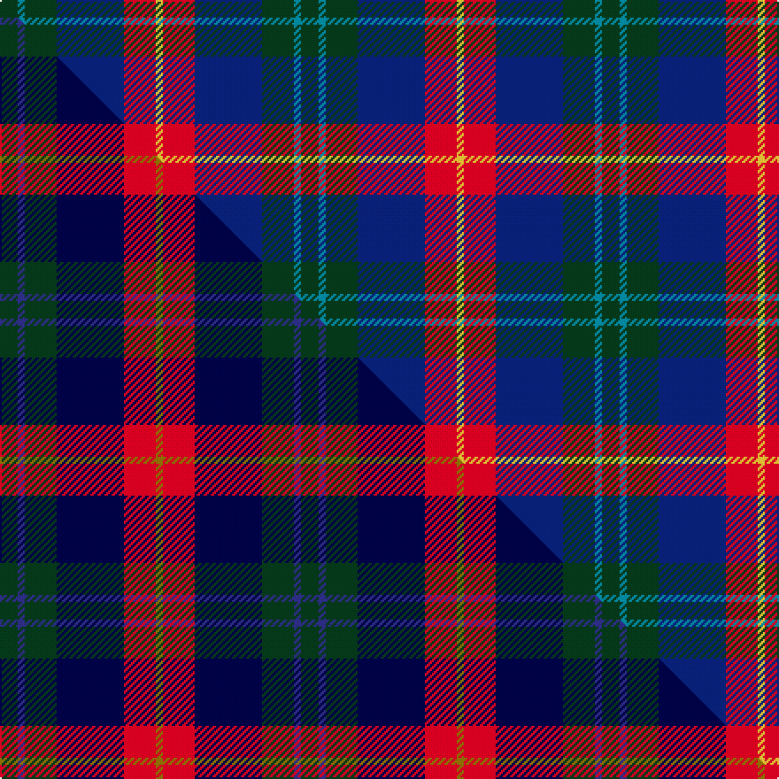

This page is one **sett** — a single exact thread-count. It belongs to the [tartan](/setts/dg5t2dg9db19r9ly2/)
(the same proportion at any scale), whose colour order is pattern [GBGBRY](/stripes/gbgbry/).

Part of the [Lyle and Scott](/tartans/lyle-and-scott/) tartan — the named design grouping this sett with its other cloths.

Sourced from tartans-authority.  It is a [6 stripe tartan](/stripes/stripes6/).

Original link [https://www.tartanregister.gov.uk/tartanDetails.aspx?ref=11139](https://www.tartanregister.gov.uk/tartanDetails.aspx?ref=11139)

Dataset <small>— provenance for this record, inherited from the source manifest</small>

<dl class="dataset-prov">
<dt>source</dt><dd><a href="/sources/tartans-authority/">Scottish Tartans Authority</a></dd>
<dt>data captured from</dt><dd><a href="https://github.com/thetartan/tartan-database/blob/master/data/tartans-authority/data.csv">https://github.com/thetartan/tartan-database/blob/master/data/tartans-authority/data.csv</a></dd>
<dt>data date</dt><dd>2014 <small>(this record)</small></dd>
<dt>licence</dt><dd><a href="https://creativecommons.org/licenses/by-nc-nd/4.0/">CC BY-NC-ND 4.0</a></dd>
</dl>

Capture chain <small>— the hands this data passed through, oldest first; each capture carries its own licence</small>

<ol class="capture-chain">
<li><a href="https://www.tartansauthority.com/">Scottish Tartans Authority</a> <small>the heritage body's archive — its tartan-ferret record browser is retired (links repaired to the SRT, above)</small></li>
<li><a href="https://github.com/thetartan/tartan-database">thetartan/tartan-database</a> <small>2016-2017</small> · <a href="https://creativecommons.org/licenses/by-nc-nd/4.0/">CC BY-NC-ND 4.0</a> <small>Levko Kravets's frozen compilation — the capture we vendored, and where its CC licence text came from</small></li>
<li>this dictionary <small>captured 2026-06-10 · commit 5bf86c7566</small> <small>each re-capture is a git commit to data/sources</small></li>
</ol>

## Register references

External register numbers recorded for this tartan.

- Scottish Register of Tartans: [11139](https://www.tartanregister.gov.uk/tartanDetails?ref=11139)
- Scottish Tartans Authority (ITI): 11139

## Thread count
DG/10 T4 DG18 DB38 R18 LY/4

One full sett is **170 threads**.

## Palette
<table><thead><tr><th>Colour</th><th>Shade</th><th>OKLCh</th></tr></thead><tbody><tr><td>T</td><td><code style="background-color:#00879F;">#00879F</code> <small style="color:#888">#00879F</small></td><td><small style="color:#888">oklch(57.4% 0.102 216.1)</small></td></tr><tr><td>DB</td><td><code style="background-color:#082077;">#082077</code> <small style="color:#888">#082077</small></td><td><small style="color:#888">oklch(30.0% 0.149 265.1)</small></td></tr><tr><td>DG</td><td><code style="background-color:#053819;">#053819</code> <small style="color:#888">#053819</small></td><td><small style="color:#888">oklch(30.0% 0.075 151.3)</small></td></tr><tr><td>R</td><td><code style="background-color:#D60020;">#D60020</code> <small style="color:#888">#D60020</small></td><td><small style="color:#888">oklch(55.2% 0.224 25.5)</small></td></tr><tr><td>LY</td><td><code style="background-color:#DCBC32;">#DCBC32</code> <small style="color:#888">#DCBC32</small></td><td><small style="color:#888">oklch(80.0% 0.150 95.2)</small></td></tr></tbody></table>

# Sample pattern

## Compared to the master

This cloth is one sett of its design; the master sett (the exemplar the design is anchored on) is below for comparison.

Its **ΔTartan distance** from the master is **0.13** — the same measure the nearest-tartans table ranks by (0 is identical; a re-scale of the same cloth is near 0, a recolour or a different proportion further).

<figure class="master-compare" style="margin:0">

this sett
master sett ★

<figcaption style="color:#888;font-size:smaller">One weave of this sett against the <a href="/setts/dg5dbi2dg9db19r9y2/">master sett ★</a>, split on the diagonal: a shared proportion runs seamlessly across it with only the shades shifting; a different proportion breaks on it.</figcaption>
</figure>

## Nearest tartan variants

The nearest existing variants by ΔTartan distance, with this cloth at the top so the swatches line up against it.

ΔTartan

Threads

Variant

Sett

—

170

<a href="/variants/s6/dg5t2dg9db19r9ly2~x2/">Lyle and Scott</a>

<a href="/ttd/edit/#slug=dg5db2dg9k19r9y2~x2~db1406275-k0705267&amp;base=dg5t2dg9db19r9ly2~x2" title="compare in the TTD">0.13</a>

170

<a href="/variants/s6/dg5dbi2dg9db19r9y2~x2~dbi1406275-db0705267/">Lyle and Scott</a>

<a href="/ttd/edit/#slug=g4dy7o9dy9db20w2db2~x2&amp;base=dg5t2dg9db19r9ly2~x2" title="compare in the TTD">1.09</a>

200

<a href="/variants/s7/g4dy7o9dy9db20w2db2~x2/">Tombow 140th Anniversary, The</a>

<a href="/ttd/edit/#slug=r10dbi6g24db24r6y3~dbi1406275-db1004274&amp;base=dg5t2dg9db19r9ly2~x2" title="compare in the TTD">1.54</a>

133

<a href="/variants/s6/r10dbi6g24db24r6y3~dbi1406275-db1004274/">Canine All Dogs (Fashion)</a>

<a href="/ttd/edit/#slug=r5t3g24db24r4y2~x2~t2405244-db1406275&amp;base=dg5t2dg9db19r9ly2~x2" title="compare in the TTD">1.60</a>

234

<a href="/variants/s6/r5t3g24db24r4y2~x2~t2405244-db1406275/">Canine All Dogs</a>

<a href="/ttd/edit/#slug=dg5g2db2dt15r2lg2dg5r2~x4~db1406275-dt1204274&amp;base=dg5t2dg9db19r9ly2~x2" title="compare in the TTD">1.65</a>

252

<a href="/variants/s8/dg5g2dbi2db15r2lg2dg5r2~x4~dbi1406275-db1204274/">Remember the Somme 1916</a>

<a href="/ttd/edit/#slug=n7w1r6db10dg10w1~x4&amp;base=dg5t2dg9db19r9ly2~x2" title="compare in the TTD">2.10</a>

248

<a href="/variants/s6/n7w1r6db10dg10w1~x4/">McEachern, Andrew</a>

<a href="/ttd/edit/#slug=n7w1r6db10g10w1~x4&amp;base=dg5t2dg9db19r9ly2~x2" title="compare in the TTD">2.11</a>

248

<a href="/variants/s6/n7w1r6db10g10w1~x4/">McEachem (Name)</a>

<a href="/ttd/edit/#slug=r7y3g28db28w3~x2&amp;base=dg5t2dg9db19r9ly2~x2" title="compare in the TTD">2.12</a>

256

<a href="/variants/s5/r7y3g28db28w3~x2/">Turnbull, hunting</a>

<a href="/ttd/edit/#slug=r3y2g12dp12db14w3~x2&amp;base=dg5t2dg9db19r9ly2~x2" title="compare in the TTD">2.15</a>

172

<a href="/variants/s6/r3y2g12dp12db14w3~x2/">Jamestown Parish Church (Corporate)</a>

<a href="/ttd/edit/#slug=r2y1g10db10w1~x6&amp;base=dg5t2dg9db19r9ly2~x2" title="compare in the TTD">2.16</a>

270

<a href="/variants/s5/r2y1g10db10w1~x6/">Turnbull Hunting (Name)</a>

## Neighbour map

Every grey dot is one of 13621 variants placed by the first two principal components of the ΔTartan feature space (42% of its variance). Red is this tartan; blue dots are its nearest — click one to open its page.

<svg viewBox="0 0 640 380" role="img" style="max-width:100%;height:auto;border:1px solid #e0e0e0;border-radius:4px;display:block" xmlns="http://www.w3.org/2000/svg"><image href="/nn/cloud.v1.png" width="640" height="380"/><a href="/variants/s6/dg5dbi2dg9db19r9y2~x2~dbi1406275-db0705267/"><circle cx="220.2" cy="215.1" r="4" fill="#3465a4"><title>Lyle and Scott</title></circle></a><a href="/variants/s7/g4dy7o9dy9db20w2db2~x2/"><circle cx="216.9" cy="210.0" r="4" fill="#3465a4"><title>Tombow 140th Anniversary, The</title></circle></a><a href="/variants/s6/r10dbi6g24db24r6y3~dbi1406275-db1004274/"><circle cx="163.2" cy="226.8" r="4" fill="#3465a4"><title>Canine All Dogs (Fashion)</title></circle></a><a href="/variants/s6/r5t3g24db24r4y2~x2~t2405244-db1406275/"><circle cx="236.4" cy="196.8" r="4" fill="#3465a4"><title>Canine All Dogs</title></circle></a><a href="/variants/s8/dg5g2dbi2db15r2lg2dg5r2~x4~dbi1406275-db1204274/"><circle cx="210.9" cy="188.1" r="4" fill="#3465a4"><title>Remember the Somme 1916</title></circle></a><a href="/variants/s6/n7w1r6db10dg10w1~x4/"><circle cx="144.5" cy="229.8" r="4" fill="#3465a4"><title>McEachern, Andrew</title></circle></a><a href="/variants/s6/n7w1r6db10g10w1~x4/"><circle cx="135.8" cy="229.8" r="4" fill="#3465a4"><title>McEachem (Name)</title></circle></a><a href="/variants/s5/r7y3g28db28w3~x2/"><circle cx="212.0" cy="213.6" r="4" fill="#3465a4"><title>Turnbull, hunting</title></circle></a><a href="/variants/s6/r3y2g12dp12db14w3~x2/"><circle cx="105.6" cy="220.1" r="4" fill="#3465a4"><title>Jamestown Parish Church (Corporate)</title></circle></a><a href="/variants/s5/r2y1g10db10w1~x6/"><circle cx="225.7" cy="208.2" r="4" fill="#3465a4"><title>Turnbull Hunting (Name)</title></circle></a><circle cx="219.5" cy="217.3" r="5" fill="#c00000"/><text x="320" y="376" text-anchor="middle" font-size="11" fill="#999">ground</text><text x="11" y="190" text-anchor="middle" font-size="11" fill="#999" transform="rotate(-90 11 190)">complexity</text></svg>

ID: /variants/s6/dg5t2dg9db19r9ly2~x2/
