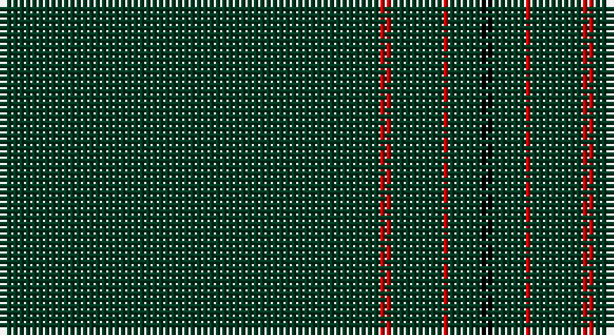

This page is one **sett** — a single exact thread-count. It belongs to the [tartan](/setts/dg60r2dg8r1dg5k2/)
(the same proportion at any scale), whose colour order is pattern [GRGRGK](/stripes/grgrgk/).

Part of the [St. David's](/tartans/st-david-s/) tartan — the named design grouping this sett with its other cloths.

Sourced from tartans-authority.  It is a [6 stripe tartan](/stripes/stripes6/).

Original link http://www.tartansauthority.com/tartan-ferret/display/5746/

## Register references

External register numbers recorded for this tartan.

- Scottish Tartans Authority (ITI): 5746

## Thread count
DG/60 R2 DG8 R1 DG5 K/2

One full sett is **94 threads**.

## Palette

Palette: <strong>Tartan Register</strong>
<table><thead><tr><th>Colour</th><th>Threads</th><th>Shade</th><th>Base</th><th>OKLCh</th></tr></thead><tbody><tr><td>DG/</td><td style="text-align:right;font-variant-numeric:tabular-nums">60</td><td><code style="background-color:#003820;">#003820</code> <small style="color:#888">#003820</small></td><td>G <code style="background-color:#006100;">#006100</code></td><td><small style="color:#888">oklch(30.0% 0.070 158.3)</small></td></tr><tr><td>R</td><td style="text-align:right;font-variant-numeric:tabular-nums">2</td><td><code style="background-color:#C80000;">#C80000</code> <small style="color:#888">#C80000</small></td><td>R <code style="background-color:#CC0000;">#CC0000</code></td><td><small style="color:#888">oklch(52.3% 0.215 29.2)</small></td></tr><tr><td>DG</td><td style="text-align:right;font-variant-numeric:tabular-nums">8</td><td><code style="background-color:#003820;">#003820</code> <small style="color:#888">#003820</small></td><td>G <code style="background-color:#006100;">#006100</code></td><td><small style="color:#888">oklch(30.0% 0.070 158.3)</small></td></tr><tr><td>R</td><td style="text-align:right;font-variant-numeric:tabular-nums">1</td><td><code style="background-color:#C80000;">#C80000</code> <small style="color:#888">#C80000</small></td><td>R <code style="background-color:#CC0000;">#CC0000</code></td><td><small style="color:#888">oklch(52.3% 0.215 29.2)</small></td></tr><tr><td>DG</td><td style="text-align:right;font-variant-numeric:tabular-nums">5</td><td><code style="background-color:#003820;">#003820</code> <small style="color:#888">#003820</small></td><td>G <code style="background-color:#006100;">#006100</code></td><td><small style="color:#888">oklch(30.0% 0.070 158.3)</small></td></tr><tr><td>K/</td><td style="text-align:right;font-variant-numeric:tabular-nums">2</td><td><code style="background-color:#000000;">#000000</code> <small style="color:#888">#000000</small></td><td>K <code style="background-color:#000000;">#000000</code></td><td><small style="color:#888">oklch(0.0% 0.000 0.0)</small></td></tr></tbody></table>

# Sample pattern

## Nearest tartans

The nearest existing variants by ΔTartan distance, with this tartan at the top so the swatches line up against it.

ΔTartan

Tartan

Sett

—

<a href="/ttd/edit/#slug=dg60r2dg8r1dg5k2">St. David's (District)</a> <a class="nn-out" href="/variants/s6/dg60r2dg8r1dg5k2/" title="open its dictionary page">↗</a>

1.79

<a href="/ttd/edit/#slug=k200dy3lo3dy3lo3&amp;base=dg60r2dg8r1dg5k2">SmartWool</a> <a class="nn-out" href="/variants/s5/k200dy3lo3dy3lo3/" title="open its dictionary page">↗</a>

1.82

<a href="/ttd/edit/#slug=k99r5k4r3k2y1~x2&amp;base=dg60r2dg8r1dg5k2">Allt Dubh (Black Burn)</a> <a class="nn-out" href="/variants/s6/k99r5k4r3k2y1~x2/" title="open its dictionary page">↗</a>

2.01

<a href="/ttd/edit/#slug=dg60r2dg8r1dg5w2&amp;base=dg60r2dg8r1dg5k2">St. David's Welsh District Tartan</a> <a class="nn-out" href="/variants/s6/dg60r2dg8r1dg5w2/" title="open its dictionary page">↗</a>

2.17

<a href="/ttd/edit/#slug=lr1r12dg2r1dg162r12ly1~x2&amp;base=dg60r2dg8r1dg5k2">MacFie</a> <a class="nn-out" href="/variants/s7/lr1r12dg2r1dg162r12ly1~x2/" title="open its dictionary page">↗</a>

2.26

<a href="/ttd/edit/#slug=r2k50n2r1~x2&amp;base=dg60r2dg8r1dg5k2">Galloway (Name)</a> <a class="nn-out" href="/variants/s4/r2k50n2r1~x2/" title="open its dictionary page">↗</a>

2.30

<a href="/ttd/edit/#slug=k50r1db3dp1~x4&amp;base=dg60r2dg8r1dg5k2">Alich (Personal)</a> <a class="nn-out" href="/variants/s4/k50r1db3dp1~x4/" title="open its dictionary page">↗</a>

2.33

<a href="/ttd/edit/#slug=k50r1dt3dp1~x4&amp;base=dg60r2dg8r1dg5k2">Alich (Personal)</a> <a class="nn-out" href="/variants/s4/k50r1dt3dp1~x4/" title="open its dictionary page">↗</a>

2.39

<a href="/ttd/edit/#slug=g2dp2g20g2g2dp1~x4&amp;base=dg60r2dg8r1dg5k2">Walters (Personal)</a> <a class="nn-out" href="/variants/s6/g2dp2g20g2g2dp1~x4/" title="open its dictionary page">↗</a>

2.40

<a href="/ttd/edit/#slug=do88o3ly2k2lr1~x2&amp;base=dg60r2dg8r1dg5k2">Eternity, Dedicated 2 Weddings</a> <a class="nn-out" href="/variants/s5/do88o3ly2k2lr1~x2/" title="open its dictionary page">↗</a>

2.40

<a href="/ttd/edit/#slug=dg100loi4dg2lo3ly6~x2&amp;base=dg60r2dg8r1dg5k2">Lagrande</a> <a class="nn-out" href="/variants/s5/dg100loi4dg2lo3ly6~x2/" title="open its dictionary page">↗</a>

## Neighbour map

Every grey dot is one of 14360 variants placed by the first two principal components of the ΔTartan feature space (44% of its variance). Red is this tartan; blue dots are its nearest — click one to open its page.

<svg viewBox="0 0 640 380" role="img" style="max-width:100%;height:auto;border:1px solid #e0e0e0;border-radius:4px;display:block" xmlns="http://www.w3.org/2000/svg"><image href="/nn/cloud.v1.png" width="640" height="380"/><a href="/variants/s5/k200dy3lo3dy3lo3/"><circle cx="626.0" cy="190.9" r="4" fill="#3465a4"><title>SmartWool</title></circle></a><a href="/variants/s6/k99r5k4r3k2y1~x2/"><circle cx="626.0" cy="193.3" r="4" fill="#3465a4"><title>Allt Dubh (Black Burn)</title></circle></a><a href="/variants/s6/dg60r2dg8r1dg5w2/"><circle cx="626.0" cy="171.0" r="4" fill="#3465a4"><title>St. David's Welsh District Tartan</title></circle></a><a href="/variants/s7/lr1r12dg2r1dg162r12ly1~x2/"><circle cx="626.0" cy="148.6" r="4" fill="#3465a4"><title>MacFie</title></circle></a><a href="/variants/s4/r2k50n2r1~x2/"><circle cx="626.0" cy="204.2" r="4" fill="#3465a4"><title>Galloway (Name)</title></circle></a><a href="/variants/s4/k50r1db3dp1~x4/"><circle cx="626.0" cy="213.2" r="4" fill="#3465a4"><title>Alich (Personal)</title></circle></a><a href="/variants/s4/k50r1dt3dp1~x4/"><circle cx="626.0" cy="216.9" r="4" fill="#3465a4"><title>Alich (Personal)</title></circle></a><a href="/variants/s6/g2dp2g20g2g2dp1~x4/"><circle cx="626.0" cy="226.0" r="4" fill="#3465a4"><title>Walters (Personal)</title></circle></a><a href="/variants/s5/do88o3ly2k2lr1~x2/"><circle cx="626.0" cy="154.9" r="4" fill="#3465a4"><title>Eternity, Dedicated 2 Weddings</title></circle></a><a href="/variants/s5/dg100loi4dg2lo3ly6~x2/"><circle cx="626.0" cy="170.3" r="4" fill="#3465a4"><title>Lagrande</title></circle></a><circle cx="626.0" cy="199.7" r="5" fill="#c00000"/></svg>

ID: /variants/s6/dg60r2dg8r1dg5k2/
