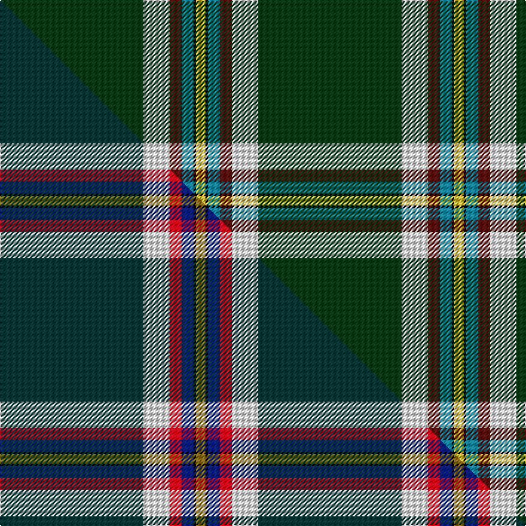

This page is one **sett** — a single exact thread-count. It belongs to the [tartan](/setts/dg60w11dr5t5k1ly4/)
(the same proportion at any scale), whose colour order is pattern [GWBBKY](/stripes/gwbbky/).

Part of the [Christie Hunting](/tartans/christie-hunting/) tartan — the named design grouping this sett with its other cloths.

Sourced from tartans-authority.  It is a [6 stripe tartan](/stripes/stripes6/).

Original link [https://www.tartanregister.gov.uk/tartanDetails.aspx?ref=10294](https://www.tartanregister.gov.uk/tartanDetails.aspx?ref=10294)

Dataset <small>— provenance for this record, inherited from the source manifest</small>

<dl class="dataset-prov">
<dt>source</dt><dd><a href="/sources/tartans-authority/">Scottish Tartans Authority</a></dd>
<dt>data captured from</dt><dd><a href="https://github.com/thetartan/tartan-database/blob/master/data/tartans-authority/data.csv">https://github.com/thetartan/tartan-database/blob/master/data/tartans-authority/data.csv</a></dd>
<dt>data date</dt><dd>16th Sept. 2010 <small>(this record)</small></dd>
<dt>licence</dt><dd><a href="https://creativecommons.org/licenses/by-nc-nd/4.0/">CC BY-NC-ND 4.0</a></dd>
</dl>

Capture chain <small>— the hands this data passed through, oldest first; each capture carries its own licence</small>

<ol class="capture-chain">
<li><a href="https://www.tartansauthority.com/">Scottish Tartans Authority</a> <small>the heritage body's archive — its tartan-ferret record browser is retired (links repaired to the SRT, above)</small></li>
<li><a href="https://github.com/thetartan/tartan-database">thetartan/tartan-database</a> <small>2016-2017</small> · <a href="https://creativecommons.org/licenses/by-nc-nd/4.0/">CC BY-NC-ND 4.0</a> <small>Levko Kravets's frozen compilation — the capture we vendored, and where its CC licence text came from</small></li>
<li>this dictionary <small>captured 2026-06-10 · commit 5bf86c7566</small> <small>each re-capture is a git commit to data/sources</small></li>
</ol>

## Register references

External register numbers recorded for this tartan.

- Scottish Register of Tartans: [10294](https://www.tartanregister.gov.uk/tartanDetails?ref=10294)
- Scottish Tartans Authority (ITI): 10294

## Thread count
DG/120 W22 DR10 T10 K2 LY/8

One full sett is **216 threads**.

## Palette
<table><thead><tr><th>Colour</th><th>Shade</th><th>OKLCh</th></tr></thead><tbody><tr><td>T</td><td><code style="background-color:#00879F;">#00879F</code> <small style="color:#888">#00879F</small></td><td><small style="color:#888">oklch(57.4% 0.102 216.1)</small></td></tr><tr><td>DG</td><td><code style="background-color:#053819;">#053819</code> <small style="color:#888">#053819</small></td><td><small style="color:#888">oklch(30.0% 0.075 151.3)</small></td></tr><tr><td>DR</td><td><code style="background-color:#55120C;">#55120C</code> <small style="color:#888">#55120C</small></td><td><small style="color:#888">oklch(30.0% 0.099 29.3)</small></td></tr><tr><td>LY</td><td><code style="background-color:#DCBC32;">#DCBC32</code> <small style="color:#888">#DCBC32</small></td><td><small style="color:#888">oklch(80.0% 0.150 95.2)</small></td></tr><tr><td>K</td><td><code style="background-color:#000000;">#000000</code> <small style="color:#888">#000000</small></td><td><small style="color:#888">oklch(0.0% 0.000 0.0)</small></td></tr><tr><td>W</td><td><code style="background-color:#F7F7F7;">#F7F7F7</code> <small style="color:#888">#F7F7F7</small></td><td><small style="color:#888">oklch(97.6% 0.000 89.9)</small></td></tr></tbody></table>

# Sample pattern

## Compared to the master

This cloth is one sett of its design; the master sett (the exemplar the design is anchored on) is below for comparison.

Its **ΔTartan distance** from the master is **0.14** — the same measure the nearest-tartans table ranks by (0 is identical; a re-scale of the same cloth is near 0, a recolour or a different proportion further).

<figure class="master-compare" style="margin:0">

this sett
master sett ★

<figcaption style="color:#888;font-size:smaller">One weave of this sett against the <a href="/setts/dt60w11r5db5k1y4/">master sett ★</a>, split on the diagonal: a shared proportion runs seamlessly across it with only the shades shifting; a different proportion breaks on it.</figcaption>
</figure>

## Nearest tartan variants

The nearest existing variants by ΔTartan distance, with this cloth at the top so the swatches line up against it.

ΔTartan

Threads

Variant

Sett

—

216

<a href="/variants/s6/dg60w11dr5t5k1ly4~x2/">Christie Hunting (London) (Personal)</a>

<a href="/ttd/edit/#slug=dt60w11r5db5k1y4~x2&amp;base=dg60w11dr5t5k1ly4~x2" title="compare in the TTD">0.14</a>

216

<a href="/variants/s6/dt60w11r5db5k1y4~x2/">Christie (London) Hunting</a>

<a href="/ttd/edit/#slug=db6w3r3g55k10r3~x4&amp;base=dg60w11dr5t5k1ly4~x2" title="compare in the TTD">1.47</a>

604

<a href="/variants/s6/db6w3r3g55k10r3~x4/">Military Medical Memorial (USA)</a>

<a href="/ttd/edit/#slug=g50r1dr20k2w1~x2&amp;base=dg60w11dr5t5k1ly4~x2" title="compare in the TTD">1.47</a>

194

<a href="/variants/s5/g50r1dr20k2w1~x2/">Kenspeckle (Corporate)</a>

<a href="/ttd/edit/#slug=dg62r5w1r4g5y4k4w2~x2&amp;base=dg60w11dr5t5k1ly4~x2" title="compare in the TTD">1.49</a>

220

<a href="/variants/s8/dg62r5w1r4g5y4k4w2~x2/">Greeven, Wolfgang H (Personal)</a>

<a href="/ttd/edit/#slug=k49dr1o4db5g5ly5~x2&amp;base=dg60w11dr5t5k1ly4~x2" title="compare in the TTD">1.50</a>

168

<a href="/variants/s6/k49dr1o4db5g5ly5~x2/">CREATeGlasgow</a>

<a href="/ttd/edit/#slug=r2y36k12w3g2~x2&amp;base=dg60w11dr5t5k1ly4~x2" title="compare in the TTD">1.57</a>

212

<a href="/variants/s5/r2y36k12w3g2~x2/">Port Moresby City Pipes &amp; Drums</a>

<a href="/ttd/edit/#slug=db6k17y4dg51dy3g4~x2~dg1806142-g2203152&amp;base=dg60w11dr5t5k1ly4~x2" title="compare in the TTD">1.68</a>

320

<a href="/variants/s6/db6k17y4dg51dy3g4~x2~dg1806142-g2203152/">U.S. Army (Military)</a>

<a href="/ttd/edit/#slug=r3k4lb2g64k6y3~x2&amp;base=dg60w11dr5t5k1ly4~x2" title="compare in the TTD">1.68</a>

316

<a href="/variants/s6/r3k4lb2g64k6y3~x2/">Braemar Royal Highland Gathering</a>

<a href="/ttd/edit/#slug=ly10k2g5k2dg46y2k2~x2~g1903133&amp;base=dg60w11dr5t5k1ly4~x2" title="compare in the TTD">1.74</a>

252

<a href="/variants/s7/ly10k2g5k2dg46y2k2~x2~g1903133/">Green Rover, The</a>

<a href="/ttd/edit/#slug=k54n11g13ly1t13w1~x2&amp;base=dg60w11dr5t5k1ly4~x2" title="compare in the TTD">1.79</a>

262

<a href="/variants/s6/k54n11g13ly1t13w1~x2/">Kilmaine Saints (Corporate)</a>

## Neighbour map

Every grey dot is one of 13621 variants placed by the first two principal components of the ΔTartan feature space (42% of its variance). Red is this tartan; blue dots are its nearest — click one to open its page.

<svg viewBox="0 0 640 380" role="img" style="max-width:100%;height:auto;border:1px solid #e0e0e0;border-radius:4px;display:block" xmlns="http://www.w3.org/2000/svg"><image href="/nn/cloud.v1.png" width="640" height="380"/><a href="/variants/s6/dt60w11r5db5k1y4~x2/"><circle cx="387.9" cy="66.7" r="4" fill="#3465a4"><title>Christie (London) Hunting</title></circle></a><a href="/variants/s6/db6w3r3g55k10r3~x4/"><circle cx="355.6" cy="121.8" r="4" fill="#3465a4"><title>Military Medical Memorial (USA)</title></circle></a><a href="/variants/s5/g50r1dr20k2w1~x2/"><circle cx="435.8" cy="112.9" r="4" fill="#3465a4"><title>Kenspeckle (Corporate)</title></circle></a><a href="/variants/s8/dg62r5w1r4g5y4k4w2~x2/"><circle cx="430.7" cy="49.9" r="4" fill="#3465a4"><title>Greeven, Wolfgang H (Personal)</title></circle></a><a href="/variants/s6/k49dr1o4db5g5ly5~x2/"><circle cx="387.9" cy="59.4" r="4" fill="#3465a4"><title>CREATeGlasgow</title></circle></a><a href="/variants/s5/r2y36k12w3g2~x2/"><circle cx="334.4" cy="133.5" r="4" fill="#3465a4"><title>Port Moresby City Pipes &amp; Drums</title></circle></a><a href="/variants/s6/db6k17y4dg51dy3g4~x2~dg1806142-g2203152/"><circle cx="303.1" cy="133.5" r="4" fill="#3465a4"><title>U.S. Army (Military)</title></circle></a><a href="/variants/s6/r3k4lb2g64k6y3~x2/"><circle cx="467.3" cy="94.9" r="4" fill="#3465a4"><title>Braemar Royal Highland Gathering</title></circle></a><a href="/variants/s7/ly10k2g5k2dg46y2k2~x2~g1903133/"><circle cx="371.1" cy="105.1" r="4" fill="#3465a4"><title>Green Rover, The</title></circle></a><a href="/variants/s6/k54n11g13ly1t13w1~x2/"><circle cx="285.6" cy="80.8" r="4" fill="#3465a4"><title>Kilmaine Saints (Corporate)</title></circle></a><circle cx="385.8" cy="70.1" r="5" fill="#c00000"/><text x="320" y="376" text-anchor="middle" font-size="11" fill="#999">ground</text><text x="11" y="190" text-anchor="middle" font-size="11" fill="#999" transform="rotate(-90 11 190)">complexity</text></svg>

ID: /variants/s6/dg60w11dr5t5k1ly4~x2/
