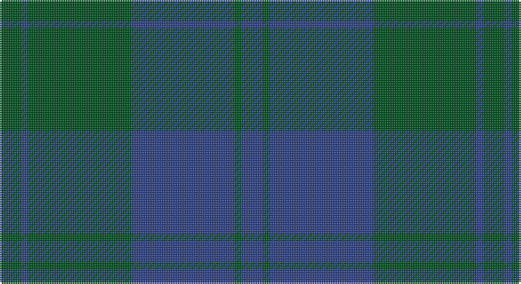

This page is one **sett** — a single exact thread-count. It belongs to the [tartan](/setts/dg6db2dg29db29dg2db6/)
(the same proportion at any scale), whose colour order is pattern [BGBGBG](/stripes/bgbgbg/).

Sourced from register-of-tartans.  It is a [6 stripe tartan](/stripes/stripes6/).

Original link https://www.tartanregister.gov.uk/tartanDetails.aspx?ref=1605

## Register references

External register numbers recorded for this tartan.

- Scottish Register of Tartans: [1605](https://www.tartanregister.gov.uk/tartanDetails.aspx?ref=1605)
- Scottish Tartans World Register: 113

## Thread count
G/12 B4 G58 B58 G4 B/12

One full sett is **272 threads**.

## Palette

Palette: <strong>Tartan Register</strong>
<table><thead><tr><th>Colour</th><th>Threads</th><th>Shade</th><th>Base</th><th>OKLCh</th></tr></thead><tbody><tr><td>G/</td><td style="text-align:right;font-variant-numeric:tabular-nums">12</td><td><code style="background-color:#005020;">#005020</code> <small style="color:#888">#005020</small></td><td>G <code style="background-color:#006100;">#006100</code></td><td><small style="color:#888">oklch(37.7% 0.105 149.6)</small></td></tr><tr><td>B</td><td style="text-align:right;font-variant-numeric:tabular-nums">4</td><td><code style="background-color:#2C4084;">#2C4084</code> <small style="color:#888">#2C4084</small></td><td>B <code style="background-color:#2A418A;">#2A418A</code></td><td><small style="color:#888">oklch(39.4% 0.117 268.3)</small></td></tr><tr><td>G</td><td style="text-align:right;font-variant-numeric:tabular-nums">58</td><td><code style="background-color:#005020;">#005020</code> <small style="color:#888">#005020</small></td><td>G <code style="background-color:#006100;">#006100</code></td><td><small style="color:#888">oklch(37.7% 0.105 149.6)</small></td></tr><tr><td>B</td><td style="text-align:right;font-variant-numeric:tabular-nums">58</td><td><code style="background-color:#2C4084;">#2C4084</code> <small style="color:#888">#2C4084</small></td><td>B <code style="background-color:#2A418A;">#2A418A</code></td><td><small style="color:#888">oklch(39.4% 0.117 268.3)</small></td></tr><tr><td>G</td><td style="text-align:right;font-variant-numeric:tabular-nums">4</td><td><code style="background-color:#005020;">#005020</code> <small style="color:#888">#005020</small></td><td>G <code style="background-color:#006100;">#006100</code></td><td><small style="color:#888">oklch(37.7% 0.105 149.6)</small></td></tr><tr><td>B/</td><td style="text-align:right;font-variant-numeric:tabular-nums">12</td><td><code style="background-color:#2C4084;">#2C4084</code> <small style="color:#888">#2C4084</small></td><td>B <code style="background-color:#2A418A;">#2A418A</code></td><td><small style="color:#888">oklch(39.4% 0.117 268.3)</small></td></tr></tbody></table>

# Sample pattern

## Nearest tartans

The nearest existing variants by ΔTartan distance, with this tartan at the top so the swatches line up against it.

ΔTartan

Tartan

Sett

—

<a href="/ttd/edit/#slug=dg6db2dg29db29dg2db6~x2">Harmony 12</a> <a class="nn-out" href="/variants/s6/dg6db2dg29db29dg2db6~x2/" title="open its dictionary page">↗</a>

1.76

<a href="/ttd/edit/#slug=k30dt6k6dt41t2~x2&amp;base=dg6db2dg29db29dg2db6~x2">Williams (New York) (Personal)</a> <a class="nn-out" href="/variants/s5/k30dt6k6dt41t2~x2/" title="open its dictionary page">↗</a>

1.99

<a href="/ttd/edit/#slug=dg4db1dg12db12w1db4~x2&amp;base=dg6db2dg29db29dg2db6~x2">Unidentified Tweed</a> <a class="nn-out" href="/variants/s6/dg4db1dg12db12w1db4~x2/" title="open its dictionary page">↗</a>

2.16

<a href="/ttd/edit/#slug=dg2dt26g2dt2g9r2g9dt2~x2&amp;base=dg6db2dg29db29dg2db6~x2">Land's End Blue</a> <a class="nn-out" href="/variants/s8/dg2dt26g2dt2g9r2g9dt2~x2/" title="open its dictionary page">↗</a>

2.19

<a href="/ttd/edit/#slug=y24r2y2dg40y25dg2y2r2y2dg20~x2&amp;base=dg6db2dg29db29dg2db6~x2">Donachie of Brockloch Htg (Clan)</a> <a class="nn-out" href="/variants/s10/y24r2y2dg40y25dg2y2r2y2dg20~x2/" title="open its dictionary page">↗</a>

2.20

<a href="/ttd/edit/#slug=db3r1db14dg14r1dg1r1dg1r2~x4&amp;base=dg6db2dg29db29dg2db6~x2">Breckon Hunting (Name)</a> <a class="nn-out" href="/variants/s9/db3r1db14dg14r1dg1r1dg1r2~x4/" title="open its dictionary page">↗</a>

2.20

<a href="/ttd/edit/#slug=y9db3y1db11y1~x6&amp;base=dg6db2dg29db29dg2db6~x2">MacCallum, High School</a> <a class="nn-out" href="/variants/s5/y9db3y1db11y1~x6/" title="open its dictionary page">↗</a>

2.26

<a href="/ttd/edit/#slug=dy3db3dy3db27dy40y3&amp;base=dg6db2dg29db29dg2db6~x2">Keeper of the Quaich</a> <a class="nn-out" href="/variants/s6/dy3db3dy3db27dy40y3/" title="open its dictionary page">↗</a>

2.27

<a href="/ttd/edit/#slug=k6dg3k3dg11k1dg2~x4&amp;base=dg6db2dg29db29dg2db6~x2">Carnet (Fashion)</a> <a class="nn-out" href="/variants/s6/k6dg3k3dg11k1dg2~x4/" title="open its dictionary page">↗</a>

2.35

<a href="/ttd/edit/#slug=dg2dt26dg2dt2dg9r2dg9dt2~x2&amp;base=dg6db2dg29db29dg2db6~x2">Land's End, Blue (Fashion)</a> <a class="nn-out" href="/variants/s8/dg2dt26dg2dt2dg9r2dg9dt2~x2/" title="open its dictionary page">↗</a>

2.36

<a href="/ttd/edit/#slug=dbi7db2dbi25db10g21db2~x2&amp;base=dg6db2dg29db29dg2db6~x2">Sugiyama</a> <a class="nn-out" href="/variants/s6/dbi7db2dbi25db10g21db2~x2/" title="open its dictionary page">↗</a>

## Neighbour map

Every grey dot is one of 14360 variants placed by the first two principal components of the ΔTartan feature space (44% of its variance). Red is this tartan; blue dots are its nearest — click one to open its page.

<svg viewBox="0 0 640 380" role="img" style="max-width:100%;height:auto;border:1px solid #e0e0e0;border-radius:4px;display:block" xmlns="http://www.w3.org/2000/svg"><image href="/nn/cloud.v1.png" width="640" height="380"/><a href="/variants/s5/k30dt6k6dt41t2~x2/"><circle cx="474.1" cy="271.1" r="4" fill="#3465a4"><title>Williams (New York) (Personal)</title></circle></a><a href="/variants/s6/dg4db1dg12db12w1db4~x2/"><circle cx="385.7" cy="270.2" r="4" fill="#3465a4"><title>Unidentified Tweed</title></circle></a><a href="/variants/s8/dg2dt26g2dt2g9r2g9dt2~x2/"><circle cx="425.6" cy="230.9" r="4" fill="#3465a4"><title>Land's End Blue</title></circle></a><a href="/variants/s10/y24r2y2dg40y25dg2y2r2y2dg20~x2/"><circle cx="445.9" cy="223.7" r="4" fill="#3465a4"><title>Donachie of Brockloch Htg (Clan)</title></circle></a><a href="/variants/s9/db3r1db14dg14r1dg1r1dg1r2~x4/"><circle cx="419.9" cy="240.9" r="4" fill="#3465a4"><title>Breckon Hunting (Name)</title></circle></a><a href="/variants/s5/y9db3y1db11y1~x6/"><circle cx="449.5" cy="290.1" r="4" fill="#3465a4"><title>MacCallum, High School</title></circle></a><a href="/variants/s6/dy3db3dy3db27dy40y3/"><circle cx="471.9" cy="248.1" r="4" fill="#3465a4"><title>Keeper of the Quaich</title></circle></a><a href="/variants/s6/k6dg3k3dg11k1dg2~x4/"><circle cx="505.1" cy="321.5" r="4" fill="#3465a4"><title>Carnet (Fashion)</title></circle></a><a href="/variants/s8/dg2dt26dg2dt2dg9r2dg9dt2~x2/"><circle cx="523.5" cy="286.8" r="4" fill="#3465a4"><title>Land's End, Blue (Fashion)</title></circle></a><a href="/variants/s6/dbi7db2dbi25db10g21db2~x2/"><circle cx="345.7" cy="268.0" r="4" fill="#3465a4"><title>Sugiyama</title></circle></a><circle cx="480.6" cy="294.8" r="5" fill="#c00000"/></svg>

ID: /variants/s6/dg6db2dg29db29dg2db6~x2/
