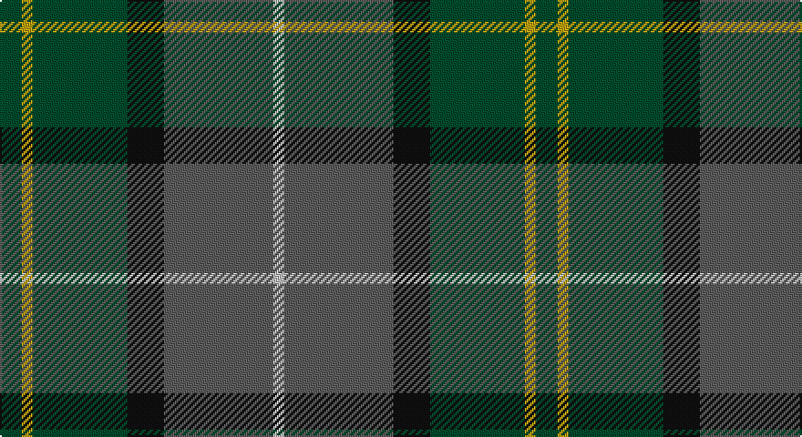

This page is one **sett** — a single exact thread-count. It belongs to the [tartan](/setts/dg6ly3dg26k10n30lb3/)
(the same proportion at any scale), whose colour order is pattern [GYGKBW](/stripes/gygkbw/).

Part of the [Montrose](/tartans/montrose/) tartan — the named design grouping this sett with its other cloths.

Sourced from register-of-tartans.  It is a [6 stripe tartan](/stripes/stripes6/).

Original link https://www.tartanregister.gov.uk/tartanDetails.aspx?ref=2997

## Register references

External register numbers recorded for this tartan.

- Scottish Register of Tartans: [2997](https://www.tartanregister.gov.uk/tartanDetails.aspx?ref=2997)
- Scottish Tartans Authority (ITI): 5666

## Thread count
G/12 DY6 G52 K20 Na60 N/6

One full sett is **294 threads**.

## Palette

Palette: <strong>Tartan Register</strong> <small style="color:#888">(2 of 5 colours)</small>
<table><thead><tr><th>Colour</th><th>Threads</th><th>Shade</th><th>Base</th><th>OKLCh</th></tr></thead><tbody><tr><td>G/</td><td style="text-align:right;font-variant-numeric:tabular-nums">12</td><td><code style="background-color:#004C2C;">#004C2C</code> <small style="color:#888">#004C2C</small></td><td>G <code style="background-color:#006100;">#006100</code></td><td><small style="color:#888">oklch(36.7% 0.087 157.4)</small></td></tr><tr><td>DY</td><td style="text-align:right;font-variant-numeric:tabular-nums">6</td><td><code style="background-color:#BCA010;">#BCA010</code> <small style="color:#888">#BCA010</small></td><td>Y <code style="background-color:#F2BF00;">#F2BF00</code></td><td><small style="color:#888">oklch(71.0% 0.143 96.1)</small></td></tr><tr><td>G</td><td style="text-align:right;font-variant-numeric:tabular-nums">52</td><td><code style="background-color:#004C2C;">#004C2C</code> <small style="color:#888">#004C2C</small></td><td>G <code style="background-color:#006100;">#006100</code></td><td><small style="color:#888">oklch(36.7% 0.087 157.4)</small></td></tr><tr><td>K</td><td style="text-align:right;font-variant-numeric:tabular-nums">20</td><td><code style="background-color:#101010;">#101010</code> <small style="color:#888">#101010</small></td><td>K <code style="background-color:#000000;">#000000</code></td><td><small style="color:#888">oklch(17.3% 0.000 89.9)</small></td></tr><tr><td>Na</td><td style="text-align:right;font-variant-numeric:tabular-nums">60</td><td><code style="background-color:#5C5C5C;">#5C5C5C</code> <small style="color:#888">#5C5C5C</small></td><td>B <code style="background-color:#2A418A;">#2A418A</code></td><td><small style="color:#888">oklch(47.5% 0.000 89.9)</small></td></tr><tr><td>N/</td><td style="text-align:right;font-variant-numeric:tabular-nums">6</td><td><code style="background-color:#C0C0C0;">#C0C0C0</code> <small style="color:#888">#C0C0C0</small></td><td>W <code style="background-color:#F7F7F7;">#F7F7F7</code></td><td><small style="color:#888">oklch(80.8% 0.000 89.9)</small></td></tr></tbody></table>

# Sample pattern

## Compared to the master

This cloth is one sett of its design; the master sett (the exemplar the design is anchored on) is below for comparison.

<figure style="margin:0"><figcaption style="color:#888;font-size:smaller">this sett</figcaption></figure>
<figure style="margin:0"><figcaption style="color:#888;font-size:smaller"><a href="/setts/db1k1r12g12k6db5r12k1db1/">master sett →</a></figcaption></figure>

## Nearest tartans

The nearest existing variants by ΔTartan distance, with this tartan at the top so the swatches line up against it.

ΔTartan

Tartan

Sett

—

<a href="/ttd/edit/#slug=dg6ly3dg26k10n30lb3~x2">Montrose (1983)</a> <a class="nn-out" href="/variants/s6/dg6ly3dg26k10n30lb3~x2/" title="open its dictionary page">↗</a>

0.82

<a href="/ttd/edit/#slug=g31dg7lo3dg14g8db18dp5~x2&amp;base=dg6ly3dg26k10n30lb3~x2">Reidy Wedding</a> <a class="nn-out" href="/variants/s7/g31dg7lo3dg14g8db18dp5~x2/" title="open its dictionary page">↗</a>

0.90

<a href="/ttd/edit/#slug=dt37dg37o8k3dp5~x2&amp;base=dg6ly3dg26k10n30lb3~x2">Dallard Personal Tartan</a> <a class="nn-out" href="/variants/s5/dt37dg37o8k3dp5~x2/" title="open its dictionary page">↗</a>

0.92

<a href="/ttd/edit/#slug=y27dr2y4o15db26k2db6~x2&amp;base=dg6ly3dg26k10n30lb3~x2">Bailies of Bennachie Corporate Tartan</a> <a class="nn-out" href="/variants/s7/y27dr2y4o15db26k2db6~x2/" title="open its dictionary page">↗</a>

0.94

<a href="/ttd/edit/#slug=dg5g32dp5k10dg8r3dg8dp3~x2&amp;base=dg6ly3dg26k10n30lb3~x2">Scottish Power (Corporate)</a> <a class="nn-out" href="/variants/s8/dg5g32dp5k10dg8r3dg8dp3~x2/" title="open its dictionary page">↗</a>

0.99

<a href="/ttd/edit/#slug=r2do22g22do3db12y2~x2&amp;base=dg6ly3dg26k10n30lb3~x2">Lisbon</a> <a class="nn-out" href="/variants/s6/r2do22g22do3db12y2~x2/" title="open its dictionary page">↗</a>

1.01

<a href="/ttd/edit/#slug=dt14k5dp5k5dt14dg32r4~x2&amp;base=dg6ly3dg26k10n30lb3~x2">Bennachie (Whisky)</a> <a class="nn-out" href="/variants/s7/dt14k5dp5k5dt14dg32r4~x2/" title="open its dictionary page">↗</a>

1.02

<a href="/ttd/edit/#slug=g32dy7g7dy16db32ly3dy8~x2&amp;base=dg6ly3dg26k10n30lb3~x2">Strange of Balcaskie (Clan)</a> <a class="nn-out" href="/variants/s7/g32dy7g7dy16db32ly3dy8~x2/" title="open its dictionary page">↗</a>

1.02

<a href="/ttd/edit/#slug=dy46g23b23r4ly4~x2&amp;base=dg6ly3dg26k10n30lb3~x2">McMoosie Htg (Fashion)</a> <a class="nn-out" href="/variants/s5/dy46g23b23r4ly4~x2/" title="open its dictionary page">↗</a>

1.05

<a href="/ttd/edit/#slug=b32dy16g3lo4dg28~x2&amp;base=dg6ly3dg26k10n30lb3~x2">Corey (Name)</a> <a class="nn-out" href="/variants/s5/b32dy16g3lo4dg28~x2/" title="open its dictionary page">↗</a>

1.08

<a href="/ttd/edit/#slug=b30ly3dy11ly3g33r6~x2&amp;base=dg6ly3dg26k10n30lb3~x2">Balfour Hunting</a> <a class="nn-out" href="/variants/s6/b30ly3dy11ly3g33r6~x2/" title="open its dictionary page">↗</a>

## Neighbour map

Every grey dot is one of 14360 variants placed by the first two principal components of the ΔTartan feature space (44% of its variance). Red is this tartan; blue dots are its nearest — click one to open its page.

<svg viewBox="0 0 640 380" role="img" style="max-width:100%;height:auto;border:1px solid #e0e0e0;border-radius:4px;display:block" xmlns="http://www.w3.org/2000/svg"><image href="/nn/cloud.v1.png" width="640" height="380"/><a href="/variants/s7/g31dg7lo3dg14g8db18dp5~x2/"><circle cx="245.7" cy="231.8" r="4" fill="#3465a4"><title>Reidy Wedding</title></circle></a><a href="/variants/s5/dt37dg37o8k3dp5~x2/"><circle cx="287.7" cy="237.6" r="4" fill="#3465a4"><title>Dallard Personal Tartan</title></circle></a><a href="/variants/s7/y27dr2y4o15db26k2db6~x2/"><circle cx="261.2" cy="207.7" r="4" fill="#3465a4"><title>Bailies of Bennachie Corporate Tartan</title></circle></a><a href="/variants/s8/dg5g32dp5k10dg8r3dg8dp3~x2/"><circle cx="243.3" cy="197.6" r="4" fill="#3465a4"><title>Scottish Power (Corporate)</title></circle></a><a href="/variants/s6/r2do22g22do3db12y2~x2/"><circle cx="240.9" cy="218.7" r="4" fill="#3465a4"><title>Lisbon</title></circle></a><a href="/variants/s7/dt14k5dp5k5dt14dg32r4~x2/"><circle cx="252.8" cy="243.6" r="4" fill="#3465a4"><title>Bennachie (Whisky)</title></circle></a><a href="/variants/s7/g32dy7g7dy16db32ly3dy8~x2/"><circle cx="243.8" cy="241.3" r="4" fill="#3465a4"><title>Strange of Balcaskie (Clan)</title></circle></a><a href="/variants/s5/dy46g23b23r4ly4~x2/"><circle cx="283.4" cy="239.5" r="4" fill="#3465a4"><title>McMoosie Htg (Fashion)</title></circle></a><a href="/variants/s5/b32dy16g3lo4dg28~x2/"><circle cx="218.0" cy="238.8" r="4" fill="#3465a4"><title>Corey (Name)</title></circle></a><a href="/variants/s6/b30ly3dy11ly3g33r6~x2/"><circle cx="216.7" cy="209.7" r="4" fill="#3465a4"><title>Balfour Hunting</title></circle></a><circle cx="254.3" cy="228.9" r="5" fill="#c00000"/></svg>

ID: /variants/s6/dg6ly3dg26k10n30lb3~x2/
