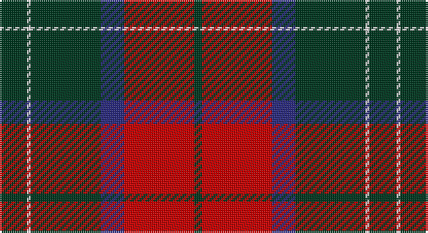

This page is one **sett** — a single exact thread-count. It belongs to the [tartan](/setts/dg7w1dg18db6r18dg2/)
(the same proportion at any scale), whose colour order is pattern [GRBGWG](/stripes/grbgwg/).

Sourced from register-of-tartans.  It is a [6 stripe tartan](/stripes/stripes6/).

Original link https://www.tartanregister.gov.uk/tartanDetails.aspx?ref=1183

## Also known as

This cloth is also recorded under:

- Finnlaggan

3 attestations — the source records this cloth was collapsed from (oldest owns this page)

<ul>
<li>01/01/1999 — Finlaggan (register-of-tartans, <a href="https://www.tartanregister.gov.uk/tartanDetails.aspx?ref=1183">record</a>)</li>
<li>1999 — Finlaggan (District) (tartans-authority, <a href="http://www.tartansauthority.com/tartan-ferret/display/2564/">record</a>)</li>
<li>undated — Finnlaggan (weddslist, <a href="http://www.weddslist.com/cgi-bin/tartans/pg.pl?source=sts">record</a>)</li>
</ul>

## Register references

External register numbers recorded for this tartan.

- Scottish Register of Tartans: [1183](https://www.tartanregister.gov.uk/tartanDetails.aspx?ref=1183)
- Scottish Tartans Authority (ITI): 2564
- Scottish Tartans World Register: 2564

## Thread count
DG/14 LN2 DG36 DB12 R36 DG/4

One full sett is **190 threads**.

## Palette

Palette: <strong>Tartan Register</strong>
<table><thead><tr><th>Colour</th><th>Threads</th><th>Shade</th><th>Base</th><th>OKLCh</th></tr></thead><tbody><tr><td>DG/</td><td style="text-align:right;font-variant-numeric:tabular-nums">14</td><td><code style="background-color:#003820;">#003820</code> <small style="color:#888">#003820</small></td><td>G <code style="background-color:#006100;">#006100</code></td><td><small style="color:#888">oklch(30.0% 0.070 158.3)</small></td></tr><tr><td>LN</td><td style="text-align:right;font-variant-numeric:tabular-nums">2</td><td><code style="background-color:#E0E0E0;">#E0E0E0</code> <small style="color:#888">#E0E0E0</small></td><td>W <code style="background-color:#F7F7F7;">#F7F7F7</code></td><td><small style="color:#888">oklch(90.7% 0.000 89.9)</small></td></tr><tr><td>DG</td><td style="text-align:right;font-variant-numeric:tabular-nums">36</td><td><code style="background-color:#003820;">#003820</code> <small style="color:#888">#003820</small></td><td>G <code style="background-color:#006100;">#006100</code></td><td><small style="color:#888">oklch(30.0% 0.070 158.3)</small></td></tr><tr><td>DB</td><td style="text-align:right;font-variant-numeric:tabular-nums">12</td><td><code style="background-color:#2C2C80;">#2C2C80</code> <small style="color:#888">#2C2C80</small></td><td>B <code style="background-color:#2A418A;">#2A418A</code></td><td><small style="color:#888">oklch(35.0% 0.138 276.6)</small></td></tr><tr><td>R</td><td style="text-align:right;font-variant-numeric:tabular-nums">36</td><td><code style="background-color:#C80000;">#C80000</code> <small style="color:#888">#C80000</small></td><td>R <code style="background-color:#CC0000;">#CC0000</code></td><td><small style="color:#888">oklch(52.3% 0.215 29.2)</small></td></tr><tr><td>DG/</td><td style="text-align:right;font-variant-numeric:tabular-nums">4</td><td><code style="background-color:#003820;">#003820</code> <small style="color:#888">#003820</small></td><td>G <code style="background-color:#006100;">#006100</code></td><td><small style="color:#888">oklch(30.0% 0.070 158.3)</small></td></tr></tbody></table>

# Sample pattern

## Nearest tartans

The nearest existing variants by ΔTartan distance, with this tartan at the top so the swatches line up against it.

ΔTartan

Tartan

Sett

—

<a href="/ttd/edit/#slug=dg7w1dg18db6r18dg2~x2">Finlaggan</a> <a class="nn-out" href="/variants/s6/dg7w1dg18db6r18dg2~x2/" title="open its dictionary page">↗</a>

0.78

<a href="/ttd/edit/#slug=dr2dg14lb3dr13ly1dr2~x4&amp;base=dg7w1dg18db6r18dg2~x2">Swedish Para Whisky Club (Corporate</a> <a class="nn-out" href="/variants/s6/dr2dg14lb3dr13ly1dr2~x4/" title="open its dictionary page">↗</a>

0.82

<a href="/ttd/edit/#slug=r6dg16r4db12r16b1r2~x2&amp;base=dg7w1dg18db6r18dg2~x2">MacQuarrie LO</a> <a class="nn-out" href="/variants/s7/r6dg16r4db12r16b1r2~x2/" title="open its dictionary page">↗</a>

0.91

<a href="/ttd/edit/#slug=ly2dg17g4r15dg1~x2&amp;base=dg7w1dg18db6r18dg2~x2">Christmas</a> <a class="nn-out" href="/variants/s5/ly2dg17g4r15dg1~x2/" title="open its dictionary page">↗</a>

0.97

<a href="/ttd/edit/#slug=lb2dr12g6dr1n6dr1~x4&amp;base=dg7w1dg18db6r18dg2~x2">Fraser Green</a> <a class="nn-out" href="/variants/s6/lb2dr12g6dr1n6dr1~x4/" title="open its dictionary page">↗</a>

1.03

<a href="/ttd/edit/#slug=r6dg16r4db12r16lb1r2~x2&amp;base=dg7w1dg18db6r18dg2~x2">MacQuarrie LO</a> <a class="nn-out" href="/variants/s7/r6dg16r4db12r16lb1r2~x2/" title="open its dictionary page">↗</a>

1.04

<a href="/ttd/edit/#slug=r1db6r1dg6r12lr1~x2&amp;base=dg7w1dg18db6r18dg2~x2">Fraser VS</a> <a class="nn-out" href="/variants/s6/r1db6r1dg6r12lr1~x2/" title="open its dictionary page">↗</a>

1.06

<a href="/ttd/edit/#slug=k2r16dg6r3dg8lr1~x2&amp;base=dg7w1dg18db6r18dg2~x2">MacAulay</a> <a class="nn-out" href="/variants/s6/k2r16dg6r3dg8lr1~x2/" title="open its dictionary page">↗</a>

1.06

<a href="/ttd/edit/#slug=k2r16dg6r3dg8lr1&amp;base=dg7w1dg18db6r18dg2~x2">MacAulay</a> <a class="nn-out" href="/variants/s6/k2r16dg6r3dg8lr1/" title="open its dictionary page">↗</a>

1.13

<a href="/ttd/edit/#slug=dg12g6dg6r15k1r1k2~x2&amp;base=dg7w1dg18db6r18dg2~x2">Cook (Name)</a> <a class="nn-out" href="/variants/s7/dg12g6dg6r15k1r1k2~x2/" title="open its dictionary page">↗</a>

1.14

<a href="/ttd/edit/#slug=dg28r4dp25w5r22dg27r4dp2~x2&amp;base=dg7w1dg18db6r18dg2~x2">New Glasgow (Canada)</a> <a class="nn-out" href="/variants/s8/dg28r4dp25w5r22dg27r4dp2~x2/" title="open its dictionary page">↗</a>

## Neighbour map

Every grey dot is one of 14360 variants placed by the first two principal components of the ΔTartan feature space (44% of its variance). Red is this tartan; blue dots are its nearest — click one to open its page.

<svg viewBox="0 0 640 380" role="img" style="max-width:100%;height:auto;border:1px solid #e0e0e0;border-radius:4px;display:block" xmlns="http://www.w3.org/2000/svg"><image href="/nn/cloud.v1.png" width="640" height="380"/><a href="/variants/s6/dr2dg14lb3dr13ly1dr2~x4/"><circle cx="312.2" cy="199.8" r="4" fill="#3465a4"><title>Swedish Para Whisky Club (Corporate</title></circle></a><a href="/variants/s7/r6dg16r4db12r16b1r2~x2/"><circle cx="289.1" cy="201.4" r="4" fill="#3465a4"><title>MacQuarrie LO</title></circle></a><a href="/variants/s5/ly2dg17g4r15dg1~x2/"><circle cx="301.4" cy="200.9" r="4" fill="#3465a4"><title>Christmas</title></circle></a><a href="/variants/s6/lb2dr12g6dr1n6dr1~x4/"><circle cx="287.9" cy="212.9" r="4" fill="#3465a4"><title>Fraser Green</title></circle></a><a href="/variants/s7/r6dg16r4db12r16lb1r2~x2/"><circle cx="267.5" cy="187.0" r="4" fill="#3465a4"><title>MacQuarrie LO</title></circle></a><a href="/variants/s6/r1db6r1dg6r12lr1~x2/"><circle cx="298.2" cy="197.8" r="4" fill="#3465a4"><title>Fraser VS</title></circle></a><a href="/variants/s6/k2r16dg6r3dg8lr1~x2/"><circle cx="342.2" cy="198.2" r="4" fill="#3465a4"><title>MacAulay</title></circle></a><a href="/variants/s6/k2r16dg6r3dg8lr1/"><circle cx="342.2" cy="198.2" r="4" fill="#3465a4"><title>MacAulay</title></circle></a><a href="/variants/s7/dg12g6dg6r15k1r1k2~x2/"><circle cx="252.7" cy="191.8" r="4" fill="#3465a4"><title>Cook (Name)</title></circle></a><a href="/variants/s8/dg28r4dp25w5r22dg27r4dp2~x2/"><circle cx="249.0" cy="189.5" r="4" fill="#3465a4"><title>New Glasgow (Canada)</title></circle></a><circle cx="316.9" cy="197.8" r="5" fill="#c00000"/></svg>

ID: /variants/s6/dg7w1dg18db6r18dg2~x2/
