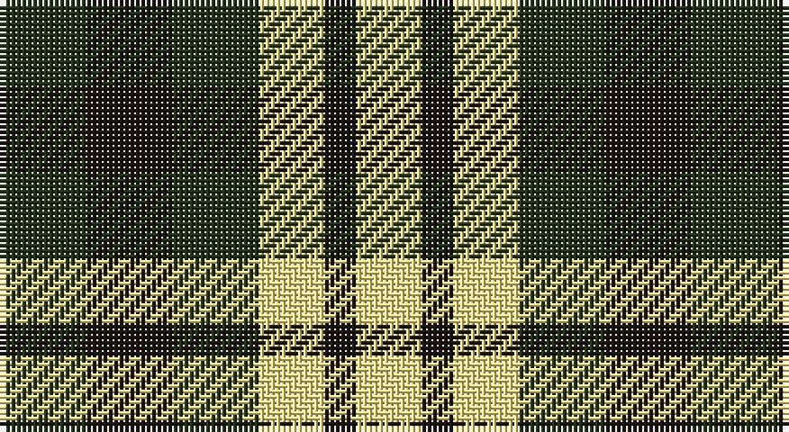

This page is one **sett** — a single exact thread-count. It belongs to the [tartan](/setts/dg8k8dg8ly6k3ly6/)
(the same proportion at any scale), whose colour order is pattern [GKGYKY](/stripes/gkgyky/).

Sourced from register-of-tartans.  It is a [6 stripe tartan](/stripes/stripes6/).

Original link https://www.tartanregister.gov.uk/tartanDetails.aspx?ref=10845

2 attestations — the source records this cloth was collapsed from (oldest owns this page)

<ul>
<li>31/10/2012 — Hage-West (Personal) (register-of-tartans, <a href="https://www.tartanregister.gov.uk/tartanDetails.aspx?ref=10845">record</a>)</li>
<li>2013 — Hage-West (Personal) (tartans-authority, <a href="http://www.tartansauthority.com/tartan-ferret/display/10845/">record</a>)</li>
</ul>

## Register references

External register numbers recorded for this tartan.

- Scottish Register of Tartans: [10845](https://www.tartanregister.gov.uk/tartanDetails?ref=10845)
- Scottish Tartans Authority (ITI): 10845

## Thread count
K/16 Ka16 K16 LY12 Ka6 LY/12

One full sett is **128 threads**.

## Palette

Palette: <strong>Tartan Register</strong> <small style="color:#888">(2 of 3 colours)</small>
<table><thead><tr><th>Colour</th><th>Threads</th><th>Shade</th><th>Base</th><th>OKLCh</th></tr></thead><tbody><tr><td>K/</td><td style="text-align:right;font-variant-numeric:tabular-nums">16</td><td><code style="background-color:#23321B;">#23321B</code> <small style="color:#888">#23321B</small></td><td>G <code style="background-color:#006100;">#006100</code></td><td><small style="color:#888">oklch(29.7% 0.045 135.3)</small></td></tr><tr><td>Ka</td><td style="text-align:right;font-variant-numeric:tabular-nums">16</td><td><code style="background-color:#1C1714;">#1C1714</code> <small style="color:#888">#1C1714</small></td><td>K <code style="background-color:#000000;">#000000</code></td><td><small style="color:#888">oklch(20.9% 0.010 52.9)</small></td></tr><tr><td>K</td><td style="text-align:right;font-variant-numeric:tabular-nums">16</td><td><code style="background-color:#23321B;">#23321B</code> <small style="color:#888">#23321B</small></td><td>G <code style="background-color:#006100;">#006100</code></td><td><small style="color:#888">oklch(29.7% 0.045 135.3)</small></td></tr><tr><td>LY</td><td style="text-align:right;font-variant-numeric:tabular-nums">12</td><td><code style="background-color:#F8E38C;">#F8E38C</code> <small style="color:#888">#F8E38C</small></td><td>Y <code style="background-color:#F2BF00;">#F2BF00</code></td><td><small style="color:#888">oklch(91.4% 0.110 96.2)</small></td></tr><tr><td>Ka</td><td style="text-align:right;font-variant-numeric:tabular-nums">6</td><td><code style="background-color:#1C1714;">#1C1714</code> <small style="color:#888">#1C1714</small></td><td>K <code style="background-color:#000000;">#000000</code></td><td><small style="color:#888">oklch(20.9% 0.010 52.9)</small></td></tr><tr><td>LY/</td><td style="text-align:right;font-variant-numeric:tabular-nums">12</td><td><code style="background-color:#F8E38C;">#F8E38C</code> <small style="color:#888">#F8E38C</small></td><td>Y <code style="background-color:#F2BF00;">#F2BF00</code></td><td><small style="color:#888">oklch(91.4% 0.110 96.2)</small></td></tr></tbody></table>

# Sample pattern

## Nearest tartans

The nearest existing variants by ΔTartan distance, with this tartan at the top so the swatches line up against it.

ΔTartan

Tartan

Sett

—

<a href="/ttd/edit/#slug=dg8k8dg8ly6k3ly6~x2">Hage-West (Personal)</a> <a class="nn-out" href="/variants/s6/dg8k8dg8ly6k3ly6~x2/" title="open its dictionary page">↗</a>

1.36

<a href="/ttd/edit/#slug=k13dy28lo13dy28k18w18k13~x2&amp;base=dg8k8dg8ly6k3ly6~x2">Boxer Beauty</a> <a class="nn-out" href="/variants/s7/k13dy28lo13dy28k18w18k13~x2/" title="open its dictionary page">↗</a>

1.57

<a href="/ttd/edit/#slug=k12w12k12w12g13w8dr6g4dr5&amp;base=dg8k8dg8ly6k3ly6~x2">Burns Heritage Check</a> <a class="nn-out" href="/variants/s9/k12w12k12w12g13w8dr6g4dr5/" title="open its dictionary page">↗</a>

1.59

<a href="/ttd/edit/#slug=p3k3p3g6ly2~x2&amp;base=dg8k8dg8ly6k3ly6~x2">Austin / Wilson's No 173</a> <a class="nn-out" href="/variants/s5/p3k3p3g6ly2~x2/" title="open its dictionary page">↗</a>

1.63

<a href="/ttd/edit/#slug=lb2k2g2lb1k1~x20&amp;base=dg8k8dg8ly6k3ly6~x2">Shepherd, Derek (Wandering)</a> <a class="nn-out" href="/variants/s5/lb2k2g2lb1k1~x20/" title="open its dictionary page">↗</a>

1.65

<a href="/ttd/edit/#slug=k5g8lo5g3lo5~x4&amp;base=dg8k8dg8ly6k3ly6~x2">Angle Dress (Fashion)</a> <a class="nn-out" href="/variants/s5/k5g8lo5g3lo5~x4/" title="open its dictionary page">↗</a>

1.72

<a href="/ttd/edit/#slug=w2k2w2k2w2k2w1o1g1o1~x4&amp;base=dg8k8dg8ly6k3ly6~x2">Robert, Burns check</a> <a class="nn-out" href="/variants/s10/w2k2w2k2w2k2w1o1g1o1~x4/" title="open its dictionary page">↗</a>

1.75

<a href="/ttd/edit/#slug=w2k2w2k2w2k2w1dy1g1dy1~x2&amp;base=dg8k8dg8ly6k3ly6~x2">Burns Check Trade Tartan</a> <a class="nn-out" href="/variants/s10/w2k2w2k2w2k2w1dy1g1dy1~x2/" title="open its dictionary page">↗</a>

1.83

<a href="/ttd/edit/#slug=g3dp3w1dp3g3r1~x4&amp;base=dg8k8dg8ly6k3ly6~x2">Wilson's No.113</a> <a class="nn-out" href="/variants/s6/g3dp3w1dp3g3r1~x4/" title="open its dictionary page">↗</a>

1.85

<a href="/ttd/edit/#slug=ly15r7k12ly12k12o12r7~x2&amp;base=dg8k8dg8ly6k3ly6~x2">Duffus, Lord</a> <a class="nn-out" href="/variants/s7/ly15r7k12ly12k12o12r7~x2/" title="open its dictionary page">↗</a>

1.85

<a href="/ttd/edit/#slug=r10db6k8g10r6g3r6~x2&amp;base=dg8k8dg8ly6k3ly6~x2">MacDuff</a> <a class="nn-out" href="/variants/s7/r10db6k8g10r6g3r6~x2/" title="open its dictionary page">↗</a>

## Neighbour map

Every grey dot is one of 14360 variants placed by the first two principal components of the ΔTartan feature space (44% of its variance). Red is this tartan; blue dots are its nearest — click one to open its page.

<svg viewBox="0 0 640 380" role="img" style="max-width:100%;height:auto;border:1px solid #e0e0e0;border-radius:4px;display:block" xmlns="http://www.w3.org/2000/svg"><image href="/nn/cloud.v1.png" width="640" height="380"/><a href="/variants/s7/k13dy28lo13dy28k18w18k13~x2/"><circle cx="83.4" cy="299.3" r="4" fill="#3465a4"><title>Boxer Beauty</title></circle></a><a href="/variants/s9/k12w12k12w12g13w8dr6g4dr5/"><circle cx="41.9" cy="261.5" r="4" fill="#3465a4"><title>Burns Heritage Check</title></circle></a><a href="/variants/s5/p3k3p3g6ly2~x2/"><circle cx="71.1" cy="290.4" r="4" fill="#3465a4"><title>Austin / Wilson's No 173</title></circle></a><a href="/variants/s5/lb2k2g2lb1k1~x20/"><circle cx="81.4" cy="344.4" r="4" fill="#3465a4"><title>Shepherd, Derek (Wandering)</title></circle></a><a href="/variants/s5/k5g8lo5g3lo5~x4/"><circle cx="149.2" cy="342.9" r="4" fill="#3465a4"><title>Angle Dress (Fashion)</title></circle></a><a href="/variants/s10/w2k2w2k2w2k2w1o1g1o1~x4/"><circle cx="56.2" cy="282.7" r="4" fill="#3465a4"><title>Robert, Burns check</title></circle></a><a href="/variants/s10/w2k2w2k2w2k2w1dy1g1dy1~x2/"><circle cx="60.6" cy="282.5" r="4" fill="#3465a4"><title>Burns Check Trade Tartan</title></circle></a><a href="/variants/s6/g3dp3w1dp3g3r1~x4/"><circle cx="148.6" cy="298.4" r="4" fill="#3465a4"><title>Wilson's No.113</title></circle></a><a href="/variants/s7/ly15r7k12ly12k12o12r7~x2/"><circle cx="14.2" cy="299.0" r="4" fill="#3465a4"><title>Duffus, Lord</title></circle></a><a href="/variants/s7/r10db6k8g10r6g3r6~x2/"><circle cx="115.2" cy="284.7" r="4" fill="#3465a4"><title>MacDuff</title></circle></a><circle cx="90.4" cy="321.6" r="5" fill="#c00000"/></svg>

ID: /variants/s6/dg8k8dg8ly6k3ly6~x2/
