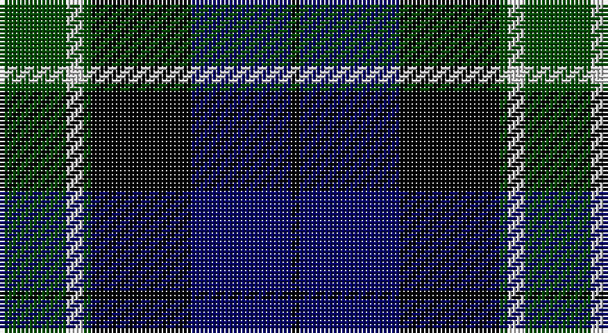

This page is one **sett** — a single exact thread-count. It belongs to the [tartan](/setts/dg8lb2dg1k12db12k1/)
(the same proportion at any scale), whose colour order is pattern [GWGKBK](/stripes/gwgkbk/).

Part of the [Graham of Menteith](/tartans/graham-of-menteith/) tartan — the named design grouping this sett with its other cloths.

Sourced from weddslist.  It is a [6 stripe tartan](/stripes/stripes6/).

Original link http://www.weddslist.com/cgi-bin/tartans/pg.pl?source=rb

## Also known as

This cloth is also recorded under:

- Graham of Menteith,

## Thread count
G/16 N4 G2 K24 DB24 K/2

One full sett is **126 threads**.

## Palette

Palette: <strong>Tartan Register</strong> <small style="color:#888">(3 of 4 colours)</small>
<table><thead><tr><th>Colour</th><th>Threads</th><th>Shade</th><th>Base</th><th>OKLCh</th></tr></thead><tbody><tr><td>G/</td><td style="text-align:right;font-variant-numeric:tabular-nums">16</td><td><code style="background-color:#004C00;">#004C00</code> <small style="color:#888">#004C00</small></td><td>G <code style="background-color:#006100;">#006100</code></td><td><small style="color:#888">oklch(36.1% 0.123 142.5)</small></td></tr><tr><td>N</td><td style="text-align:right;font-variant-numeric:tabular-nums">4</td><td><code style="background-color:#D0D0D0;">#D0D0D0</code> <small style="color:#888">#D0D0D0</small></td><td>W <code style="background-color:#F7F7F7;">#F7F7F7</code></td><td><small style="color:#888">oklch(85.8% 0.000 89.9)</small></td></tr><tr><td>G</td><td style="text-align:right;font-variant-numeric:tabular-nums">2</td><td><code style="background-color:#004C00;">#004C00</code> <small style="color:#888">#004C00</small></td><td>G <code style="background-color:#006100;">#006100</code></td><td><small style="color:#888">oklch(36.1% 0.123 142.5)</small></td></tr><tr><td>K</td><td style="text-align:right;font-variant-numeric:tabular-nums">24</td><td><code style="background-color:#000000;">#000000</code> <small style="color:#888">#000000</small></td><td>K <code style="background-color:#000000;">#000000</code></td><td><small style="color:#888">oklch(0.0% 0.000 0.0)</small></td></tr><tr><td>DB</td><td style="text-align:right;font-variant-numeric:tabular-nums">24</td><td><code style="background-color:#000064;">#000064</code> <small style="color:#888">#000064</small></td><td>B <code style="background-color:#2A418A;">#2A418A</code></td><td><small style="color:#888">oklch(22.7% 0.158 264.1)</small></td></tr><tr><td>K/</td><td style="text-align:right;font-variant-numeric:tabular-nums">2</td><td><code style="background-color:#000000;">#000000</code> <small style="color:#888">#000000</small></td><td>K <code style="background-color:#000000;">#000000</code></td><td><small style="color:#888">oklch(0.0% 0.000 0.0)</small></td></tr></tbody></table>

# Sample pattern

## Compared to the master

This cloth is one sett of its design; the master sett (the exemplar the design is anchored on) is below for comparison.

<figure style="margin:0"><figcaption style="color:#888;font-size:smaller">this sett</figcaption></figure>
<figure style="margin:0"><figcaption style="color:#888;font-size:smaller"><a href="/setts/g8b1g1k6db6k1/">master sett →</a></figcaption></figure>

## Nearest tartans

The nearest existing variants by ΔTartan distance, with this tartan at the top so the swatches line up against it.

ΔTartan

Tartan

Sett

—

<a href="/ttd/edit/#slug=dg8lb2dg1k12db12k1~x2">Graham of Menteith</a> <a class="nn-out" href="/variants/s6/dg8lb2dg1k12db12k1~x2/" title="open its dictionary page">↗</a>

0.72

<a href="/ttd/edit/#slug=dg2db12dg1k12dg12r2&amp;base=dg8lb2dg1k12db12k1~x2">Gunn</a> <a class="nn-out" href="/variants/s6/dg2db12dg1k12dg12r2/" title="open its dictionary page">↗</a>

0.98

<a href="/ttd/edit/#slug=k2dg12k12r1db12lb2&amp;base=dg8lb2dg1k12db12k1~x2">Mitchell</a> <a class="nn-out" href="/variants/s6/k2dg12k12r1db12lb2/" title="open its dictionary page">↗</a>

1.02

<a href="/ttd/edit/#slug=dg21lb2dg4k17dp14k3&amp;base=dg8lb2dg1k12db12k1~x2">Graham W</a> <a class="nn-out" href="/variants/s6/dg21lb2dg4k17dp14k3/" title="open its dictionary page">↗</a>

1.04

<a href="/ttd/edit/#slug=k5lb2dg18k17dp16k3&amp;base=dg8lb2dg1k12db12k1~x2">Melville</a> <a class="nn-out" href="/variants/s6/k5lb2dg18k17dp16k3/" title="open its dictionary page">↗</a>

1.04

<a href="/ttd/edit/#slug=k2dg12k12r1db12lr2~x2&amp;base=dg8lb2dg1k12db12k1~x2">Mitchell</a> <a class="nn-out" href="/variants/s6/k2dg12k12r1db12lr2~x2/" title="open its dictionary page">↗</a>

1.04

<a href="/ttd/edit/#slug=k2dg12k12r1db12lr2&amp;base=dg8lb2dg1k12db12k1~x2">Mitchell</a> <a class="nn-out" href="/variants/s6/k2dg12k12r1db12lr2/" title="open its dictionary page">↗</a>

1.06

<a href="/ttd/edit/#slug=t1db11k11g11k2t1~x2&amp;base=dg8lb2dg1k12db12k1~x2">Unnamed, No 59</a> <a class="nn-out" href="/variants/s6/t1db11k11g11k2t1~x2/" title="open its dictionary page">↗</a>

1.08

<a href="/ttd/edit/#slug=k1r1k18g12db18g1db1~x2&amp;base=dg8lb2dg1k12db12k1~x2">Meoni (Personal)</a> <a class="nn-out" href="/variants/s7/k1r1k18g12db18g1db1~x2/" title="open its dictionary page">↗</a>

1.08

<a href="/ttd/edit/#slug=db48k6db10k46ly4k22g43&amp;base=dg8lb2dg1k12db12k1~x2">Mowat</a> <a class="nn-out" href="/variants/s7/db48k6db10k46ly4k22g43/" title="open its dictionary page">↗</a>

1.11

<a href="/ttd/edit/#slug=dg2db12dg1k12dg12r2~x2&amp;base=dg8lb2dg1k12db12k1~x2">Gunn</a> <a class="nn-out" href="/variants/s6/dg2db12dg1k12dg12r2~x2/" title="open its dictionary page">↗</a>

## Neighbour map

Every grey dot is one of 14360 variants placed by the first two principal components of the ΔTartan feature space (44% of its variance). Red is this tartan; blue dots are its nearest — click one to open its page.

<svg viewBox="0 0 640 380" role="img" style="max-width:100%;height:auto;border:1px solid #e0e0e0;border-radius:4px;display:block" xmlns="http://www.w3.org/2000/svg"><image href="/nn/cloud.v1.png" width="640" height="380"/><a href="/variants/s6/dg2db12dg1k12dg12r2/"><circle cx="203.8" cy="229.6" r="4" fill="#3465a4"><title>Gunn</title></circle></a><a href="/variants/s6/k2dg12k12r1db12lb2/"><circle cx="158.7" cy="206.7" r="4" fill="#3465a4"><title>Mitchell</title></circle></a><a href="/variants/s6/dg21lb2dg4k17dp14k3/"><circle cx="200.6" cy="223.5" r="4" fill="#3465a4"><title>Graham W</title></circle></a><a href="/variants/s6/k5lb2dg18k17dp16k3/"><circle cx="187.4" cy="232.9" r="4" fill="#3465a4"><title>Melville</title></circle></a><a href="/variants/s6/k2dg12k12r1db12lr2~x2/"><circle cx="170.5" cy="212.5" r="4" fill="#3465a4"><title>Mitchell</title></circle></a><a href="/variants/s6/k2dg12k12r1db12lr2/"><circle cx="170.5" cy="212.5" r="4" fill="#3465a4"><title>Mitchell</title></circle></a><a href="/variants/s6/t1db11k11g11k2t1~x2/"><circle cx="167.5" cy="213.6" r="4" fill="#3465a4"><title>Unnamed, No 59</title></circle></a><a href="/variants/s7/k1r1k18g12db18g1db1~x2/"><circle cx="232.0" cy="178.8" r="4" fill="#3465a4"><title>Meoni (Personal)</title></circle></a><a href="/variants/s7/db48k6db10k46ly4k22g43/"><circle cx="192.6" cy="211.6" r="4" fill="#3465a4"><title>Mowat</title></circle></a><a href="/variants/s6/dg2db12dg1k12dg12r2~x2/"><circle cx="218.2" cy="236.7" r="4" fill="#3465a4"><title>Gunn</title></circle></a><circle cx="190.7" cy="218.2" r="5" fill="#c00000"/></svg>

ID: /variants/s6/dg8lb2dg1k12db12k1~x2/
