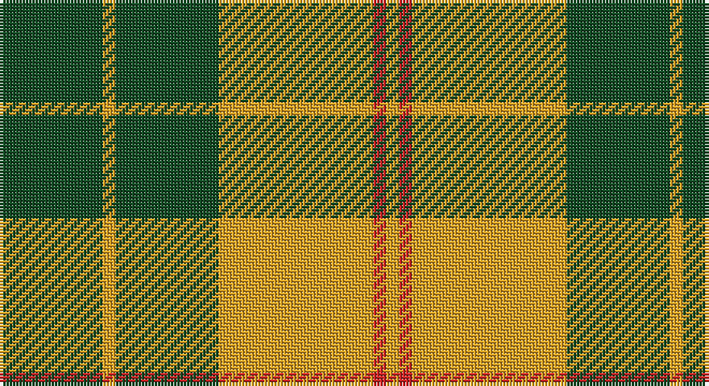

This page is one **sett** — a single exact thread-count. It belongs to the [tartan](/setts/dg8lo1dg8lo12r1lo1/)
(the same proportion at any scale), whose colour order is pattern [GYGYRY](/stripes/gygyry/).

Part of the [Forget](/tartans/forget/) tartan — the named design grouping this sett with its other cloths.

Sourced from register-of-tartans.  It is a [6 stripe tartan](/stripes/stripes6/).

Original link https://www.tartanregister.gov.uk/tartanDetails.aspx?ref=10694

## Provenance

Earliest known date: 11 September 2012 The gold and red colours in the tartan are the Forget family colours, with green to recall the importance of the forest for the family.

## Also known as

This cloth is also recorded under:

- Forget Family

2 attestations — the source records this cloth was collapsed from (oldest owns this page)

<ul>
<li>14/07/2012 — Forget Family (Yonne) (register-of-tartans, <a href="https://www.tartanregister.gov.uk/tartanDetails.aspx?ref=10694">record</a>)</li>
<li>undated — Forget Family (Yonne) Name Tartan (house-of-tartan, <a href="http://www.house-of-tartan.scotland.net/house/TartanViewjs.asp?colr=Def&tnam=10694">record</a>)</li>
</ul>

## Register references

External register numbers recorded for this tartan.

- Scottish Register of Tartans: [10694](https://www.tartanregister.gov.uk/tartanDetails.aspx?ref=10694)

## Thread count
G/32 Y4 G32 Y48 R4 Y/4

One full sett is **212 threads**.

## Palette

Palette: <strong>Tartan Register</strong> <small style="color:#888">(1 of 3 colours)</small>
<table><thead><tr><th>Colour</th><th>Threads</th><th>Shade</th><th>Base</th><th>OKLCh</th></tr></thead><tbody><tr><td>G/</td><td style="text-align:right;font-variant-numeric:tabular-nums">32</td><td><code style="background-color:#124B24;">#124B24</code> <small style="color:#888">#124B24</small></td><td>G <code style="background-color:#006100;">#006100</code></td><td><small style="color:#888">oklch(36.6% 0.088 149.9)</small></td></tr><tr><td>Y</td><td style="text-align:right;font-variant-numeric:tabular-nums">4</td><td><code style="background-color:#E0A126;">#E0A126</code> <small style="color:#888">#E0A126</small></td><td>Y <code style="background-color:#F2BF00;">#F2BF00</code></td><td><small style="color:#888">oklch(75.1% 0.146 78.3)</small></td></tr><tr><td>G</td><td style="text-align:right;font-variant-numeric:tabular-nums">32</td><td><code style="background-color:#124B24;">#124B24</code> <small style="color:#888">#124B24</small></td><td>G <code style="background-color:#006100;">#006100</code></td><td><small style="color:#888">oklch(36.6% 0.088 149.9)</small></td></tr><tr><td>Y</td><td style="text-align:right;font-variant-numeric:tabular-nums">48</td><td><code style="background-color:#E0A126;">#E0A126</code> <small style="color:#888">#E0A126</small></td><td>Y <code style="background-color:#F2BF00;">#F2BF00</code></td><td><small style="color:#888">oklch(75.1% 0.146 78.3)</small></td></tr><tr><td>R</td><td style="text-align:right;font-variant-numeric:tabular-nums">4</td><td><code style="background-color:#CA2625;">#CA2625</code> <small style="color:#888">#CA2625</small></td><td>R <code style="background-color:#CC0000;">#CC0000</code></td><td><small style="color:#888">oklch(54.4% 0.199 27.2)</small></td></tr><tr><td>Y/</td><td style="text-align:right;font-variant-numeric:tabular-nums">4</td><td><code style="background-color:#E0A126;">#E0A126</code> <small style="color:#888">#E0A126</small></td><td>Y <code style="background-color:#F2BF00;">#F2BF00</code></td><td><small style="color:#888">oklch(75.1% 0.146 78.3)</small></td></tr></tbody></table>

# Sample pattern

## Nearest tartans

The nearest existing variants by ΔTartan distance, with this tartan at the top so the swatches line up against it.

ΔTartan

Tartan

Sett

—

<a href="/ttd/edit/#slug=dg8lo1dg8lo12r1lo1~x4">Forget Family (Yonne)</a> <a class="nn-out" href="/variants/s6/dg8lo1dg8lo12r1lo1~x4/" title="open its dictionary page">↗</a>

1.01

<a href="/ttd/edit/#slug=dg11lo1dg1lo6k1lo1~x4&amp;base=dg8lo1dg8lo12r1lo1~x4">Big Spruce Brewing</a> <a class="nn-out" href="/variants/s6/dg11lo1dg1lo6k1lo1~x4/" title="open its dictionary page">↗</a>

1.24

<a href="/ttd/edit/#slug=g9r2g9r14k1w2~x4&amp;base=dg8lo1dg8lo12r1lo1~x4">MacGregor of Balquidder - 1831 (Clan</a> <a class="nn-out" href="/variants/s6/g9r2g9r14k1w2~x4/" title="open its dictionary page">↗</a>

1.36

<a href="/ttd/edit/#slug=dg11ly1dg1ly6k1ly1~x8&amp;base=dg8lo1dg8lo12r1lo1~x4">Big Spruce Brewing</a> <a class="nn-out" href="/variants/s6/dg11ly1dg1ly6k1ly1~x8/" title="open its dictionary page">↗</a>

1.38

<a href="/ttd/edit/#slug=g1lb4dy12lb3dy6lb12g1lb1~x4&amp;base=dg8lo1dg8lo12r1lo1~x4">O'Neill Pipe Band 1970 (Corporate)</a> <a class="nn-out" href="/variants/s8/g1lb4dy12lb3dy6lb12g1lb1~x4/" title="open its dictionary page">↗</a>

1.42

<a href="/ttd/edit/#slug=g68r24g8lo18g3lo18~x2&amp;base=dg8lo1dg8lo12r1lo1~x4">MacMillan/Isetan</a> <a class="nn-out" href="/variants/s6/g68r24g8lo18g3lo18~x2/" title="open its dictionary page">↗</a>

1.43

<a href="/ttd/edit/#slug=k4ly32k16r3k16ly4~x2&amp;base=dg8lo1dg8lo12r1lo1~x4">Unnamed C21st - Fashion</a> <a class="nn-out" href="/variants/s6/k4ly32k16r3k16ly4~x2/" title="open its dictionary page">↗</a>

1.44

<a href="/ttd/edit/#slug=g5w2r27g27r5w2~x2&amp;base=dg8lo1dg8lo12r1lo1~x4">MacDonald of Glenaladale (symmetrical)</a> <a class="nn-out" href="/variants/s6/g5w2r27g27r5w2~x2/" title="open its dictionary page">↗</a>

1.45

<a href="/ttd/edit/#slug=k1r5g10r5g1~x4&amp;base=dg8lo1dg8lo12r1lo1~x4">Murray, Lord George (Hose)</a> <a class="nn-out" href="/variants/s5/k1r5g10r5g1~x4/" title="open its dictionary page">↗</a>

1.46

<a href="/ttd/edit/#slug=ly1r3g7r3g7r3ly1~x4&amp;base=dg8lo1dg8lo12r1lo1~x4">Unidentified 24</a> <a class="nn-out" href="/variants/s7/ly1r3g7r3g7r3ly1~x4/" title="open its dictionary page">↗</a>

1.50

<a href="/ttd/edit/#slug=g20k2r3k2r6g20r29g3r10~x2&amp;base=dg8lo1dg8lo12r1lo1~x4">Livingston</a> <a class="nn-out" href="/variants/s9/g20k2r3k2r6g20r29g3r10~x2/" title="open its dictionary page">↗</a>

## Neighbour map

Every grey dot is one of 14360 variants placed by the first two principal components of the ΔTartan feature space (44% of its variance). Red is this tartan; blue dots are its nearest — click one to open its page.

<svg viewBox="0 0 640 380" role="img" style="max-width:100%;height:auto;border:1px solid #e0e0e0;border-radius:4px;display:block" xmlns="http://www.w3.org/2000/svg"><image href="/nn/cloud.v1.png" width="640" height="380"/><a href="/variants/s6/dg11lo1dg1lo6k1lo1~x4/"><circle cx="350.7" cy="201.7" r="4" fill="#3465a4"><title>Big Spruce Brewing</title></circle></a><a href="/variants/s6/g9r2g9r14k1w2~x4/"><circle cx="288.3" cy="194.9" r="4" fill="#3465a4"><title>MacGregor of Balquidder - 1831 (Clan</title></circle></a><a href="/variants/s6/dg11ly1dg1ly6k1ly1~x8/"><circle cx="329.2" cy="192.7" r="4" fill="#3465a4"><title>Big Spruce Brewing</title></circle></a><a href="/variants/s8/g1lb4dy12lb3dy6lb12g1lb1~x4/"><circle cx="303.3" cy="192.0" r="4" fill="#3465a4"><title>O'Neill Pipe Band 1970 (Corporate)</title></circle></a><a href="/variants/s6/g68r24g8lo18g3lo18~x2/"><circle cx="367.0" cy="192.8" r="4" fill="#3465a4"><title>MacMillan/Isetan</title></circle></a><a href="/variants/s6/k4ly32k16r3k16ly4~x2/"><circle cx="266.6" cy="199.1" r="4" fill="#3465a4"><title>Unnamed C21st - Fashion</title></circle></a><a href="/variants/s6/g5w2r27g27r5w2~x2/"><circle cx="334.3" cy="199.7" r="4" fill="#3465a4"><title>MacDonald of Glenaladale (symmetrical)</title></circle></a><a href="/variants/s5/k1r5g10r5g1~x4/"><circle cx="323.1" cy="240.3" r="4" fill="#3465a4"><title>Murray, Lord George (Hose)</title></circle></a><a href="/variants/s7/ly1r3g7r3g7r3ly1~x4/"><circle cx="307.3" cy="251.0" r="4" fill="#3465a4"><title>Unidentified 24</title></circle></a><a href="/variants/s9/g20k2r3k2r6g20r29g3r10~x2/"><circle cx="334.8" cy="186.7" r="4" fill="#3465a4"><title>Livingston</title></circle></a><circle cx="320.5" cy="212.1" r="5" fill="#c00000"/></svg>

ID: /variants/s6/dg8lo1dg8lo12r1lo1~x4/
