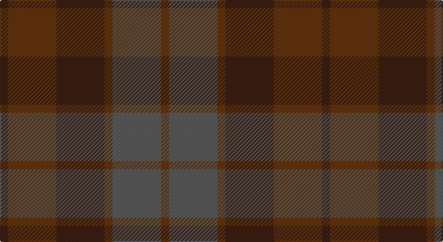

This page is one **sett** — a single exact thread-count. It belongs to the [tartan](/setts/do1dy6do6dy1n6dy1/)
(the same proportion at any scale), whose colour order is pattern [BGBGBG](/stripes/bgbgbg/).

Sourced from tartans-authority.  It is a [6 stripe tartan](/stripes/stripes6/).

Original link http://www.tartansauthority.com/tartan-ferret/display/3737/

2 attestations — the source records this cloth was collapsed from (oldest owns this page)

<ul>
<li>1972 — Brown Heather (Fashion) (tartans-authority, <a href="http://www.tartansauthority.com/tartan-ferret/display/3737/">record</a>)</li>
<li>undated — Brown Heather (register-of-tartans, <a href="https://www.tartanregister.gov.uk/tartanDetails.aspx?ref=5332">record</a>)</li>
</ul>

## Register references

External register numbers recorded for this tartan.

- Scottish Register of Tartans: [5332](https://www.tartanregister.gov.uk/tartanDetails.aspx?ref=5332)
- Scottish Tartans Authority (ITI): 3737

## Thread count
K/8 T48 K48 T8 N48 T/8

One full sett is **320 threads**.

## Palette

Palette: <strong>custom</strong>
<table><thead><tr><th>Colour</th><th>Threads</th><th>Shade</th><th>Base</th><th>OKLCh</th></tr></thead><tbody><tr><td>K/</td><td style="text-align:right;font-variant-numeric:tabular-nums">8</td><td><code style="background-color:#3C2010;">#3C2010</code> <small style="color:#888">#3C2010</small></td><td>B <code style="background-color:#2A418A;">#2A418A</code></td><td><small style="color:#888">oklch(27.7% 0.051 49.3)</small></td></tr><tr><td>T</td><td style="text-align:right;font-variant-numeric:tabular-nums">48</td><td><code style="background-color:#64340C;">#64340C</code> <small style="color:#888">#64340C</small></td><td>G <code style="background-color:#006100;">#006100</code></td><td><small style="color:#888">oklch(38.0% 0.085 55.0)</small></td></tr><tr><td>K</td><td style="text-align:right;font-variant-numeric:tabular-nums">48</td><td><code style="background-color:#3C2010;">#3C2010</code> <small style="color:#888">#3C2010</small></td><td>B <code style="background-color:#2A418A;">#2A418A</code></td><td><small style="color:#888">oklch(27.7% 0.051 49.3)</small></td></tr><tr><td>T</td><td style="text-align:right;font-variant-numeric:tabular-nums">8</td><td><code style="background-color:#64340C;">#64340C</code> <small style="color:#888">#64340C</small></td><td>G <code style="background-color:#006100;">#006100</code></td><td><small style="color:#888">oklch(38.0% 0.085 55.0)</small></td></tr><tr><td>N</td><td style="text-align:right;font-variant-numeric:tabular-nums">48</td><td><code style="background-color:#5C5C5C;">#5C5C5C</code> <small style="color:#888">#5C5C5C</small></td><td>B <code style="background-color:#2A418A;">#2A418A</code></td><td><small style="color:#888">oklch(47.5% 0.000 89.9)</small></td></tr><tr><td>T/</td><td style="text-align:right;font-variant-numeric:tabular-nums">8</td><td><code style="background-color:#64340C;">#64340C</code> <small style="color:#888">#64340C</small></td><td>G <code style="background-color:#006100;">#006100</code></td><td><small style="color:#888">oklch(38.0% 0.085 55.0)</small></td></tr></tbody></table>

# Sample pattern

## Nearest tartans

The nearest existing variants by ΔTartan distance, with this tartan at the top so the swatches line up against it.

ΔTartan

Tartan

Sett

—

<a href="/ttd/edit/#slug=do1dy6do6dy1n6dy1~x8">Brown Heather (Fashion)</a> <a class="nn-out" href="/variants/s6/do1dy6do6dy1n6dy1~x8/" title="open its dictionary page">↗</a>

0.85

<a href="/ttd/edit/#slug=dr9do4dr4do4dr24dy19do19dy4~x2&amp;base=do1dy6do6dy1n6dy1~x8">Chindecella Ruadh (Kemete Heil)</a> <a class="nn-out" href="/variants/s8/dr9do4dr4do4dr24dy19do19dy4~x2/" title="open its dictionary page">↗</a>

1.58

<a href="/ttd/edit/#slug=do7k2do12k10dg12k3~x2&amp;base=do1dy6do6dy1n6dy1~x8">Brown Watch (single) (Fashion)</a> <a class="nn-out" href="/variants/s6/do7k2do12k10dg12k3~x2/" title="open its dictionary page">↗</a>

1.63

<a href="/ttd/edit/#slug=dy6dg6y1dg6dy5dt6dy1~x4&amp;base=do1dy6do6dy1n6dy1~x8">Gleneagles (Corporate)</a> <a class="nn-out" href="/variants/s7/dy6dg6y1dg6dy5dt6dy1~x4/" title="open its dictionary page">↗</a>

1.78

<a href="/ttd/edit/#slug=dy31do3dy3do3dy3do22y26r4~x2&amp;base=do1dy6do6dy1n6dy1~x8">Devarr (Fashion)</a> <a class="nn-out" href="/variants/s8/dy31do3dy3do3dy3do22y26r4~x2/" title="open its dictionary page">↗</a>

1.80

<a href="/variants/s5/n7oi1ni6oi8o1~x8/">Callum (Buchan)</a>

1.85

<a href="/ttd/edit/#slug=n1o6n6oi6n1oi1~x4&amp;base=do1dy6do6dy1n6dy1~x8">Glen Burns (WCWM-2)</a> <a class="nn-out" href="/variants/s6/n1o6n6oi6n1oi1~x4/" title="open its dictionary page">↗</a>

2.01

<a href="/ttd/edit/#slug=db5y15o4y4o24y4o4db5&amp;base=do1dy6do6dy1n6dy1~x8">Daks, (Muted Skye)</a> <a class="nn-out" href="/variants/s8/db5y15o4y4o24y4o4db5/" title="open its dictionary page">↗</a>

2.12

<a href="/ttd/edit/#slug=dg11n4dg6dy11n1k1dy4~x4&amp;base=do1dy6do6dy1n6dy1~x8">Calais (Fashion)</a> <a class="nn-out" href="/variants/s7/dg11n4dg6dy11n1k1dy4~x4/" title="open its dictionary page">↗</a>

2.16

<a href="/ttd/edit/#slug=db4k4db16k14dg14m3dg3~x2&amp;base=do1dy6do6dy1n6dy1~x8">Inneryne (Personal)</a> <a class="nn-out" href="/variants/s7/db4k4db16k14dg14m3dg3~x2/" title="open its dictionary page">↗</a>

2.19

<a href="/ttd/edit/#slug=dg7db1dg1k4dp4k1~x4&amp;base=do1dy6do6dy1n6dy1~x8">MacArthur of Milton Hunting</a> <a class="nn-out" href="/variants/s6/dg7db1dg1k4dp4k1~x4/" title="open its dictionary page">↗</a>

## Neighbour map

Every grey dot is one of 14360 variants placed by the first two principal components of the ΔTartan feature space (44% of its variance). Red is this tartan; blue dots are its nearest — click one to open its page.

<svg viewBox="0 0 640 380" role="img" style="max-width:100%;height:auto;border:1px solid #e0e0e0;border-radius:4px;display:block" xmlns="http://www.w3.org/2000/svg"><image href="/nn/cloud.v1.png" width="640" height="380"/><a href="/variants/s8/dr9do4dr4do4dr24dy19do19dy4~x2/"><circle cx="389.2" cy="335.3" r="4" fill="#3465a4"><title>Chindecella Ruadh (Kemete Heil)</title></circle></a><a href="/variants/s6/do7k2do12k10dg12k3~x2/"><circle cx="377.9" cy="366.0" r="4" fill="#3465a4"><title>Brown Watch (single) (Fashion)</title></circle></a><a href="/variants/s7/dy6dg6y1dg6dy5dt6dy1~x4/"><circle cx="329.9" cy="356.0" r="4" fill="#3465a4"><title>Gleneagles (Corporate)</title></circle></a><a href="/variants/s8/dy31do3dy3do3dy3do22y26r4~x2/"><circle cx="364.6" cy="266.2" r="4" fill="#3465a4"><title>Devarr (Fashion)</title></circle></a><a href="/variants/s5/n7oi1ni6oi8o1~x8/"><circle cx="375.7" cy="338.5" r="4" fill="#3465a4"><title>Callum (Buchan)</title></circle></a><a href="/variants/s6/n1o6n6oi6n1oi1~x4/"><circle cx="351.2" cy="326.9" r="4" fill="#3465a4"><title>Glen Burns (WCWM-2)</title></circle></a><a href="/variants/s8/db5y15o4y4o24y4o4db5/"><circle cx="415.1" cy="309.6" r="4" fill="#3465a4"><title>Daks, (Muted Skye)</title></circle></a><a href="/variants/s7/dg11n4dg6dy11n1k1dy4~x4/"><circle cx="370.0" cy="292.8" r="4" fill="#3465a4"><title>Calais (Fashion)</title></circle></a><a href="/variants/s7/db4k4db16k14dg14m3dg3~x2/"><circle cx="293.2" cy="331.8" r="4" fill="#3465a4"><title>Inneryne (Personal)</title></circle></a><a href="/variants/s6/dg7db1dg1k4dp4k1~x4/"><circle cx="345.8" cy="314.7" r="4" fill="#3465a4"><title>MacArthur of Milton Hunting</title></circle></a><circle cx="365.8" cy="341.2" r="5" fill="#c00000"/></svg>

ID: /variants/s6/do1dy6do6dy1n6dy1~x8/
