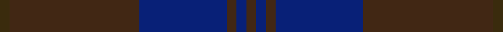

This is one **variant** — a specific cloth: this exact thread count and colourway, with its own
provenance below. It is one weaving of the [sett](/tartans/k/ke/keeper-of-the-quaich/) (the scale-free proportion — the
same cloth at any scale or shade), whose colour order is pattern [BBBBBG](/stripes/bbbbbg/).

Part of the [Keeper of the Quaich](/tartans/k/ke/keeper-of-the-quaich/) tartan — the named design grouping this sett with its other cloths.

Sourced from house-of-tartan.  It is a [6 stripe tartan](/stripes/stripes6/).

Original link [http://www.house-of-tartan.scotland.net/house/TartanViewjs.asp?colr=Def&tnam=1731](http://www.house-of-tartan.scotland.net/house/TartanViewjs.asp?colr=Def&tnam=1731)

## Provenance

Earliest known date: 1988 Restricted. Sample in STS collection.

Dataset <small>— provenance for this record, inherited from the source manifest</small>

<dl class="dataset-prov">
<dt>source</dt><dd><a href="/sources/house-of-tartan/">House of Tartan</a></dd>
<dt>data captured from</dt><dd><a href="https://github.com/thetartan/tartan-database/blob/master/data/house-of-tartan/data.csv">https://github.com/thetartan/tartan-database/blob/master/data/house-of-tartan/data.csv</a></dd>
<dt>data date</dt><dd>1988 <small>(this record)</small></dd>
<dt>licence</dt><dd><a href="https://creativecommons.org/licenses/by-nc-nd/4.0/">CC BY-NC-ND 4.0</a></dd>
</dl>

Capture chain <small>— the hands this data passed through, oldest first; each capture carries its own licence</small>

<ol class="capture-chain">
<li><a href="http://www.house-of-tartan.scotland.net/">House of Tartan</a> <small>the weaver/retailer's database — the site is now offline; the URL is kept as the ultimate source's identity</small></li>
<li><a href="https://github.com/thetartan/tartan-database">thetartan/tartan-database</a> <small>2016-2017</small> · <a href="https://creativecommons.org/licenses/by-nc-nd/4.0/">CC BY-NC-ND 4.0</a> <small>Levko Kravets's frozen compilation — the capture we vendored, and where its CC licence text came from</small></li>
<li>this dictionary <small>captured 2026-06-10 · commit 5bf86c7566</small> <small>each re-capture is a git commit to data/sources</small></li>
</ol>

## Thread count
DY/3 DO40 DB27 DO3 DB3 DO/3

One full sett is **152 threads**.

## Palette
<table><thead><tr><th>Colour</th><th>Shade</th><th>OKLCh</th></tr></thead><tbody><tr><td>DB</td><td><code style="background-color:#082077;">#082077</code> <small style="color:#888">#082077</small></td><td><small style="color:#888">oklch(30.0% 0.149 265.1)</small></td></tr><tr><td>DO</td><td><code style="background-color:#412714;">#412714</code> <small style="color:#888">#412714</small></td><td><small style="color:#888">oklch(30.1% 0.050 55.7)</small></td></tr><tr><td>DY</td><td><code style="background-color:#3A2B0D;">#3A2B0D</code> <small style="color:#888">#3A2B0D</small></td><td><small style="color:#888">oklch(30.0% 0.049 82.0)</small></td></tr></tbody></table>

# Sample pattern

## Nearest tartan variants

The nearest existing variants by ΔTartan distance, with this cloth at the top so the swatches line up against it.

ΔTartan

Threads

Variant

Sett

—

152

<a href="/variants/s6/do3db3do3db27do40dy3/">Keeper of the Quaich Corporate Tartan</a>

<a href="/ttd/edit/#slug=do14db14do14db40do3db2~x2&amp;base=do3db3do3db27do40dy3" title="compare in the TTD">1.95</a>

316

<a href="/variants/s6/do14db14do14db40do3db2~x2/">Atlin</a>

<a href="/ttd/edit/#slug=dp26dr6dg16dp8dg3dr2~x2&amp;base=do3db3do3db27do40dy3" title="compare in the TTD">2.86</a>

188

<a href="/variants/s6/dp26dr6dg16dp8dg3dr2~x2/">Perthshire Tourist Board (Corporate)</a>

<a href="/ttd/edit/#slug=dg2db26dg2db2dg9dr2dg9db2~x2&amp;base=do3db3do3db27do40dy3" title="compare in the TTD">3.04</a>

208

<a href="/variants/s8/dg2db26dg2db2dg9dr2dg9db2~x2/">Land's End, Blue (Fashion)</a>

<a href="/ttd/edit/#slug=dr2dg8db27dg11do2~x2&amp;base=do3db3do3db27do40dy3" title="compare in the TTD">3.52</a>

192

<a href="/variants/s5/dr2dg8db27dg11do2~x2/">Hector, James (Corporate)</a>

<a href="/ttd/edit/#slug=dr12dg4dr8db3dg3db3dg8db12dr38dy2~x2&amp;base=do3db3do3db27do40dy3" title="compare in the TTD">3.89</a>

344

<a href="/variants/s10/dr12dg4dr8db3dg3db3dg8db12dr38dy2~x2/">Wanstall</a>

<a href="/ttd/edit/#slug=dy11db1dy3dbi1db9r1~x4~db2911276-dbi3514276&amp;base=do3db3do3db27do40dy3" title="compare in the TTD">3.98</a>

160

<a href="/variants/s6/dy11db1dy3dbi1db9r1~x4~db2911276-dbi3514276/">Dege of Saville Row Corporate Tartan</a>

## Neighbour map

Every grey dot is one of 13662 variants placed by the first two principal components of the ΔTartan feature space (42% of its variance). Red is this tartan; blue dots are its nearest — click one to open its page. The map is a flat projection of a many-dimensional space — [how to read it](/posts/neighbourhood-maps/).

<svg viewBox="0 0 640 380" role="img" style="max-width:100%;height:auto;border:1px solid #e0e0e0;border-radius:4px;display:block" xmlns="http://www.w3.org/2000/svg"><image href="/nn/cloud.v1.png" width="640" height="380"/><a href="/variants/s6/do14db14do14db40do3db2~x2/"><circle cx="626.0" cy="298.6" r="4" fill="#3465a4"><title>Atlin</title></circle></a><a href="/variants/s6/dp26dr6dg16dp8dg3dr2~x2/"><circle cx="549.4" cy="293.8" r="4" fill="#3465a4"><title>Perthshire Tourist Board (Corporate)</title></circle></a><a href="/variants/s8/dg2db26dg2db2dg9dr2dg9db2~x2/"><circle cx="550.7" cy="257.2" r="4" fill="#3465a4"><title>Land's End, Blue (Fashion)</title></circle></a><a href="/variants/s5/dr2dg8db27dg11do2~x2/"><circle cx="518.5" cy="279.1" r="4" fill="#3465a4"><title>Hector, James (Corporate)</title></circle></a><a href="/variants/s10/dr12dg4dr8db3dg3db3dg8db12dr38dy2~x2/"><circle cx="562.9" cy="219.6" r="4" fill="#3465a4"><title>Wanstall</title></circle></a><a href="/variants/s6/dy11db1dy3dbi1db9r1~x4~db2911276-dbi3514276/"><circle cx="489.9" cy="257.9" r="4" fill="#3465a4"><title>Dege of Saville Row Corporate Tartan</title></circle></a><circle cx="588.8" cy="271.6" r="5" fill="#c00000"/><text x="320" y="376" text-anchor="middle" font-size="11" fill="#999">ground</text><text x="11" y="190" text-anchor="middle" font-size="11" fill="#999" transform="rotate(-90 11 190)">complexity</text></svg>

ID: /variants/s6/do3db3do3db27do40dy3/
