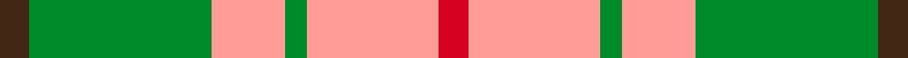

This is one **variant** — a specific cloth: this exact thread count and colourway, with its own
provenance below. It is one weaving of the [sett](/setts/do4g25lr10g3lr18r4/) (the scale-free proportion — the
same cloth at any scale or shade), whose colour order is pattern [BGYGYR](/stripes/bgygyr/).

Sourced from tartans-authority.  It is a [6 stripe tartan](/stripes/stripes6/).

Original link [https://www.tartanregister.gov.uk/tartanDetails.aspx?ref=8578](https://www.tartanregister.gov.uk/tartanDetails.aspx?ref=8578)

Dataset <small>— provenance for this record, inherited from the source manifest</small>

<dl class="dataset-prov">
<dt>source</dt><dd><a href="/sources/tartans-authority/">Scottish Tartans Authority</a></dd>
<dt>data captured from</dt><dd><a href="https://github.com/thetartan/tartan-database/blob/master/data/tartans-authority/data.csv">https://github.com/thetartan/tartan-database/blob/master/data/tartans-authority/data.csv</a></dd>
<dt>data date</dt><dd>pre 2004 <small>(this record)</small></dd>
<dt>licence</dt><dd><a href="https://creativecommons.org/licenses/by-nc-nd/4.0/">CC BY-NC-ND 4.0</a></dd>
</dl>

Capture chain <small>— the hands this data passed through, oldest first; each capture carries its own licence</small>

<ol class="capture-chain">
<li><a href="https://www.tartansauthority.com/">Scottish Tartans Authority</a> <small>the heritage body's archive — its tartan-ferret record browser is retired (links repaired to the SRT, above)</small></li>
<li><a href="https://github.com/thetartan/tartan-database">thetartan/tartan-database</a> <small>2016-2017</small> · <a href="https://creativecommons.org/licenses/by-nc-nd/4.0/">CC BY-NC-ND 4.0</a> <small>Levko Kravets's frozen compilation — the capture we vendored, and where its CC licence text came from</small></li>
<li>this dictionary <small>captured 2026-06-10 · commit 5bf86c7566</small> <small>each re-capture is a git commit to data/sources</small></li>
</ol>

## Register references

External register numbers recorded for this tartan.

- Scottish Tartans Authority (ITI): 8578

## Thread count
DO/8 G50 LR20 G6 LR36 R/8

One full sett is **240 threads**.

## Palette
<table><thead><tr><th>Colour</th><th>Shade</th><th>OKLCh</th></tr></thead><tbody><tr><td>DO</td><td><code style="background-color:#412714;">#412714</code> <small style="color:#888">#412714</small></td><td><small style="color:#888">oklch(30.1% 0.050 55.7)</small></td></tr><tr><td>G</td><td><code style="background-color:#008B2A;">#008B2A</code> <small style="color:#888">#008B2A</small></td><td><small style="color:#888">oklch(55.4% 0.170 145.9)</small></td></tr><tr><td>LR</td><td><code style="background-color:#FF9C97;">#FF9C97</code> <small style="color:#888">#FF9C97</small></td><td><small style="color:#888">oklch(79.3% 0.119 23.2)</small></td></tr><tr><td>R</td><td><code style="background-color:#D60020;">#D60020</code> <small style="color:#888">#D60020</small></td><td><small style="color:#888">oklch(55.2% 0.224 25.5)</small></td></tr></tbody></table>

# Sample pattern

## Nearest tartan variants

The nearest existing variants by ΔTartan distance, with this cloth at the top so the swatches line up against it.

ΔTartan

Threads

Variant

Sett

—

240

<a href="/variants/s6/do4g25lr10g3lr18r4~x2/">Unidentfied (Ligioner Highland Games</a>

<a href="/ttd/edit/#slug=dy4lb11dy14ly30r4~x2&amp;base=do4g25lr10g3lr18r4~x2" title="compare in the TTD">2.31</a>

236

<a href="/variants/s5/dy4lb11dy14ly30r4~x2/">Trinity Bicycles</a>

<a href="/ttd/edit/#slug=db1r12g6y1g6db1~x4&amp;base=do4g25lr10g3lr18r4~x2" title="compare in the TTD">2.74</a>

208

<a href="/variants/s6/db1r12g6y1g6db1~x4/">Cetoloni (Personal)</a>

<a href="/ttd/edit/#slug=g30ly3db8r25~x2&amp;base=do4g25lr10g3lr18r4~x2" title="compare in the TTD">2.74</a>

154

<a href="/variants/s4/g30ly3db8r25~x2/">Dohmen (Personal)</a>

<a href="/ttd/edit/#slug=r2dr1r10dr2g10w1g2~x2&amp;base=do4g25lr10g3lr18r4~x2" title="compare in the TTD">2.77</a>

104

<a href="/variants/s7/r2dr1r10dr2g10w1g2~x2/">Lennox District Tartan</a>

<a href="/ttd/edit/#slug=r2dr1r10dr2g10lr1g2~x4&amp;base=do4g25lr10g3lr18r4~x2" title="compare in the TTD">2.85</a>

208

<a href="/variants/s7/r2dr1r10dr2g10lr1g2~x4/">Lennox</a>

<a href="/ttd/edit/#slug=g30y3db8r25~x2&amp;base=do4g25lr10g3lr18r4~x2" title="compare in the TTD">2.87</a>

154

<a href="/variants/s4/g30y3db8r25~x2/">Dohmen Family (Zuid-Nederland)</a>

<a href="/ttd/edit/#slug=ri2r1ri10r2g10w1g2~x2~ri2008029-r1506028&amp;base=do4g25lr10g3lr18r4~x2" title="compare in the TTD">2.88</a>

104

<a href="/variants/s7/ri2r1ri10r2g10w1g2~x2~ri2008029-r1506028/">Lennox</a>

<a href="/ttd/edit/#slug=r2g17r8db8y2~x4&amp;base=do4g25lr10g3lr18r4~x2" title="compare in the TTD">3.06</a>

280

<a href="/variants/s5/r2g17r8db8y2~x4/">British Hills</a>

<a href="/ttd/edit/#slug=g1r8g8ri1g8r8w1~x2~r1906028-ri2109032&amp;base=do4g25lr10g3lr18r4~x2" title="compare in the TTD">3.11</a>

136

<a href="/variants/s7/g1r8g8ri1g8r8w1~x2~r1906028-ri2109032/">MacKinnon Hunting</a>

<a href="/ttd/edit/#slug=r8b1g4b1g1lb2~x2&amp;base=do4g25lr10g3lr18r4~x2" title="compare in the TTD">3.13</a>

48

<a href="/variants/s6/r8b1g4b1g1lb2~x2/">Moray of Abercairney</a>

## Neighbour map

Every grey dot is one of 13621 variants placed by the first two principal components of the ΔTartan feature space (42% of its variance). Red is this tartan; blue dots are its nearest — click one to open its page.

<svg viewBox="0 0 640 380" role="img" style="max-width:100%;height:auto;border:1px solid #e0e0e0;border-radius:4px;display:block" xmlns="http://www.w3.org/2000/svg"><image href="/nn/cloud.v1.png" width="640" height="380"/><a href="/variants/s5/dy4lb11dy14ly30r4~x2/"><circle cx="233.2" cy="236.1" r="4" fill="#3465a4"><title>Trinity Bicycles</title></circle></a><a href="/variants/s6/db1r12g6y1g6db1~x4/"><circle cx="300.1" cy="208.6" r="4" fill="#3465a4"><title>Cetoloni (Personal)</title></circle></a><a href="/variants/s4/g30ly3db8r25~x2/"><circle cx="265.9" cy="247.8" r="4" fill="#3465a4"><title>Dohmen (Personal)</title></circle></a><a href="/variants/s7/r2dr1r10dr2g10w1g2~x2/"><circle cx="275.2" cy="202.2" r="4" fill="#3465a4"><title>Lennox District Tartan</title></circle></a><a href="/variants/s7/r2dr1r10dr2g10lr1g2~x4/"><circle cx="285.3" cy="204.8" r="4" fill="#3465a4"><title>Lennox</title></circle></a><a href="/variants/s4/g30y3db8r25~x2/"><circle cx="273.1" cy="249.8" r="4" fill="#3465a4"><title>Dohmen Family (Zuid-Nederland)</title></circle></a><a href="/variants/s7/ri2r1ri10r2g10w1g2~x2~ri2008029-r1506028/"><circle cx="283.1" cy="203.5" r="4" fill="#3465a4"><title>Lennox</title></circle></a><a href="/variants/s5/r2g17r8db8y2~x4/"><circle cx="248.6" cy="240.7" r="4" fill="#3465a4"><title>British Hills</title></circle></a><a href="/variants/s7/g1r8g8ri1g8r8w1~x2~r1906028-ri2109032/"><circle cx="315.3" cy="243.7" r="4" fill="#3465a4"><title>MacKinnon Hunting</title></circle></a><a href="/variants/s6/r8b1g4b1g1lb2~x2/"><circle cx="277.0" cy="222.7" r="4" fill="#3465a4"><title>Moray of Abercairney</title></circle></a><circle cx="267.4" cy="235.9" r="5" fill="#c00000"/><text x="320" y="376" text-anchor="middle" font-size="11" fill="#999">ground</text><text x="11" y="190" text-anchor="middle" font-size="11" fill="#999" transform="rotate(-90 11 190)">complexity</text></svg>

ID: /variants/s6/do4g25lr10g3lr18r4~x2/
