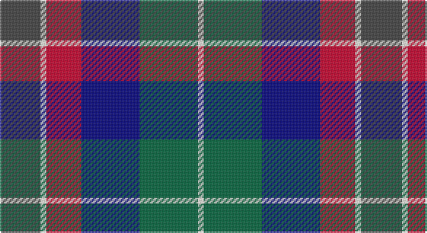

This page is one **sett** — a single exact thread-count. It belongs to the [tartan](/setts/do7w1r6db10g10w1/)
(the same proportion at any scale), whose colour order is pattern [BWRBGW](/stripes/bwrbgw/).

Sourced from register-of-tartans.  It is a [6 stripe tartan](/stripes/stripes6/).

Original link https://www.tartanregister.gov.uk/tartanDetails.aspx?ref=10765

## Also known as

This cloth is also recorded under:

- McEachern, Andrew

## Register references

External register numbers recorded for this tartan.

- Scottish Register of Tartans: [10765](https://www.tartanregister.gov.uk/tartanDetails.aspx?ref=10765)

## Thread count
N/28 W4 R24 DB40 G40 W/4

One full sett is **248 threads**.

## Palette

Palette: <strong>Tartan Register</strong> <small style="color:#888">(2 of 5 colours)</small>
<table><thead><tr><th>Colour</th><th>Threads</th><th>Shade</th><th>Base</th><th>OKLCh</th></tr></thead><tbody><tr><td>N/</td><td style="text-align:right;font-variant-numeric:tabular-nums">28</td><td><code style="background-color:#404040;">#404040</code> <small style="color:#888">#404040</small></td><td>B <code style="background-color:#2A418A;">#2A418A</code></td><td><small style="color:#888">oklch(37.1% 0.000 89.9)</small></td></tr><tr><td>W</td><td style="text-align:right;font-variant-numeric:tabular-nums">4</td><td><code style="background-color:#FFFFF0;">#FFFFF0</code> <small style="color:#888">#FFFFF0</small></td><td>W <code style="background-color:#F7F7F7;">#F7F7F7</code></td><td><small style="color:#888">oklch(99.6% 0.020 106.8)</small></td></tr><tr><td>R</td><td style="text-align:right;font-variant-numeric:tabular-nums">24</td><td><code style="background-color:#C8002C;">#C8002C</code> <small style="color:#888">#C8002C</small></td><td>R <code style="background-color:#CC0000;">#CC0000</code></td><td><small style="color:#888">oklch(52.6% 0.212 22.0)</small></td></tr><tr><td>DB</td><td style="text-align:right;font-variant-numeric:tabular-nums">40</td><td><code style="background-color:#000080;">#000080</code> <small style="color:#888">#000080</small></td><td>B <code style="background-color:#2A418A;">#2A418A</code></td><td><small style="color:#888">oklch(27.1% 0.188 264.1)</small></td></tr><tr><td>G</td><td style="text-align:right;font-variant-numeric:tabular-nums">40</td><td><code style="background-color:#00643C;">#00643C</code> <small style="color:#888">#00643C</small></td><td>G <code style="background-color:#006100;">#006100</code></td><td><small style="color:#888">oklch(44.3% 0.104 157.7)</small></td></tr><tr><td>W/</td><td style="text-align:right;font-variant-numeric:tabular-nums">4</td><td><code style="background-color:#FFFFF0;">#FFFFF0</code> <small style="color:#888">#FFFFF0</small></td><td>W <code style="background-color:#F7F7F7;">#F7F7F7</code></td><td><small style="color:#888">oklch(99.6% 0.020 106.8)</small></td></tr></tbody></table>

# Sample pattern

## Nearest tartans

The nearest existing variants by ΔTartan distance, with this tartan at the top so the swatches line up against it.

ΔTartan

Tartan

Sett

—

<a href="/ttd/edit/#slug=do7w1r6db10g10w1~x4">McEachern, Andrew</a> <a class="nn-out" href="/variants/s6/do7w1r6db10g10w1~x4/" title="open its dictionary page">↗</a>

0.80

<a href="/ttd/edit/#slug=db6g27db3k19dp27w3~x2&amp;base=do7w1r6db10g10w1~x4">Gold Brothers</a> <a class="nn-out" href="/variants/s6/db6g27db3k19dp27w3~x2/" title="open its dictionary page">↗</a>

0.95

<a href="/ttd/edit/#slug=y10k1db13k3lb9lo3~x2&amp;base=do7w1r6db10g10w1~x4">Inverary</a> <a class="nn-out" href="/variants/s6/y10k1db13k3lb9lo3~x2/" title="open its dictionary page">↗</a>

1.03

<a href="/ttd/edit/#slug=dp10db10g10w1ly1~x6&amp;base=do7w1r6db10g10w1~x4">Edelstein (Personal)</a> <a class="nn-out" href="/variants/s5/dp10db10g10w1ly1~x6/" title="open its dictionary page">↗</a>

1.05

<a href="/ttd/edit/#slug=lo15db2lr8dbi21w2db21dbi6w7~x2&amp;base=do7w1r6db10g10w1~x4">Monaghan County Crest (Fashion)</a> <a class="nn-out" href="/variants/s8/lo15db2lr8dbi21w2db21dbi6w7~x2/" title="open its dictionary page">↗</a>

1.05

<a href="/ttd/edit/#slug=r5g19w3k19db19k3db2~x2&amp;base=do7w1r6db10g10w1~x4">Fruin Colquhoun (Commemorative?)</a> <a class="nn-out" href="/variants/s7/r5g19w3k19db19k3db2~x2/" title="open its dictionary page">↗</a>

1.05

<a href="/variants/s5/dp20k5ki19g19ly2~x2/">Martin Hunting</a>

1.06

<a href="/ttd/edit/#slug=ly5db24k8dbi18ly6dy3&amp;base=do7w1r6db10g10w1~x4">Cala Homes (Corporate)</a> <a class="nn-out" href="/variants/s6/ly5db24k8dbi18ly6dy3/" title="open its dictionary page">↗</a>

1.07

<a href="/ttd/edit/#slug=r2o8db2t4k4t1~x6&amp;base=do7w1r6db10g10w1~x4">Thom(p)son's, Fancy</a> <a class="nn-out" href="/variants/s6/r2o8db2t4k4t1~x6/" title="open its dictionary page">↗</a>

1.11

<a href="/ttd/edit/#slug=m3k17n11m2o20w2~x2&amp;base=do7w1r6db10g10w1~x4">Commonwealth Games Council (Corp.)</a> <a class="nn-out" href="/variants/s6/m3k17n11m2o20w2~x2/" title="open its dictionary page">↗</a>

1.13

<a href="/ttd/edit/#slug=k4b21dy10y4k20r6b3~x2&amp;base=do7w1r6db10g10w1~x4">Swankie (Personal)</a> <a class="nn-out" href="/variants/s7/k4b21dy10y4k20r6b3~x2/" title="open its dictionary page">↗</a>

## Neighbour map

Every grey dot is one of 14360 variants placed by the first two principal components of the ΔTartan feature space (44% of its variance). Red is this tartan; blue dots are its nearest — click one to open its page.

<svg viewBox="0 0 640 380" role="img" style="max-width:100%;height:auto;border:1px solid #e0e0e0;border-radius:4px;display:block" xmlns="http://www.w3.org/2000/svg"><image href="/nn/cloud.v1.png" width="640" height="380"/><a href="/variants/s6/db6g27db3k19dp27w3~x2/"><circle cx="140.8" cy="208.0" r="4" fill="#3465a4"><title>Gold Brothers</title></circle></a><a href="/variants/s6/y10k1db13k3lb9lo3~x2/"><circle cx="117.1" cy="185.8" r="4" fill="#3465a4"><title>Inverary</title></circle></a><a href="/variants/s5/dp10db10g10w1ly1~x6/"><circle cx="162.0" cy="221.8" r="4" fill="#3465a4"><title>Edelstein (Personal)</title></circle></a><a href="/variants/s8/lo15db2lr8dbi21w2db21dbi6w7~x2/"><circle cx="109.7" cy="179.6" r="4" fill="#3465a4"><title>Monaghan County Crest (Fashion)</title></circle></a><a href="/variants/s7/r5g19w3k19db19k3db2~x2/"><circle cx="148.1" cy="204.2" r="4" fill="#3465a4"><title>Fruin Colquhoun (Commemorative?)</title></circle></a><a href="/variants/s5/dp20k5ki19g19ly2~x2/"><circle cx="137.9" cy="229.9" r="4" fill="#3465a4"><title>Martin Hunting</title></circle></a><a href="/variants/s6/ly5db24k8dbi18ly6dy3/"><circle cx="142.7" cy="212.9" r="4" fill="#3465a4"><title>Cala Homes (Corporate)</title></circle></a><a href="/variants/s6/r2o8db2t4k4t1~x6/"><circle cx="135.0" cy="212.1" r="4" fill="#3465a4"><title>Thom(p)son's, Fancy</title></circle></a><a href="/variants/s6/m3k17n11m2o20w2~x2/"><circle cx="159.8" cy="192.2" r="4" fill="#3465a4"><title>Commonwealth Games Council (Corp.)</title></circle></a><a href="/variants/s7/k4b21dy10y4k20r6b3~x2/"><circle cx="147.2" cy="214.6" r="4" fill="#3465a4"><title>Swankie (Personal)</title></circle></a><circle cx="104.5" cy="211.2" r="5" fill="#c00000"/></svg>

ID: /variants/s6/do7w1r6db10g10w1~x4/
