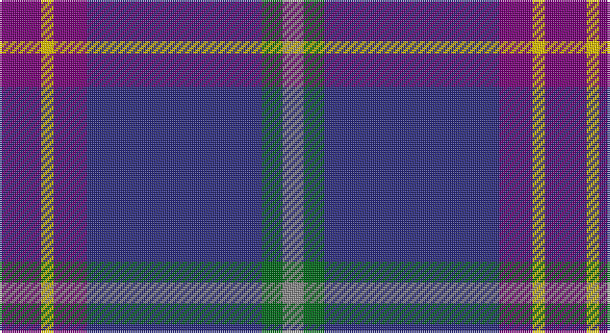

This page is one **sett** — a single exact thread-count. It belongs to the [tartan](/setts/dp10ly3dp8db42g5o5/)
(the same proportion at any scale), whose colour order is pattern [BYBBGR](/stripes/bybbgr/).

Sourced from tartans-authority.  It is a [6 stripe tartan](/stripes/stripes6/).

Original link http://www.tartansauthority.com/tartan-ferret/display/8045/

## Register references

External register numbers recorded for this tartan.

- Scottish Register of Tartans: [8045](https://www.tartanregister.gov.uk/tartanDetails?ref=8045)
- Scottish Tartans Authority (ITI): 8045

## Thread count
P/20 Y6 P16 DB84 G10 N/10

One full sett is **262 threads**.

## Palette

Palette: <strong>Tartan Register</strong>
<table><thead><tr><th>Colour</th><th>Threads</th><th>Shade</th><th>Base</th><th>OKLCh</th></tr></thead><tbody><tr><td>P/</td><td style="text-align:right;font-variant-numeric:tabular-nums">20</td><td><code style="background-color:#780078;">#780078</code> <small style="color:#888">#780078</small></td><td>B <code style="background-color:#2A418A;">#2A418A</code></td><td><small style="color:#888">oklch(40.2% 0.185 328.4)</small></td></tr><tr><td>Y</td><td style="text-align:right;font-variant-numeric:tabular-nums">6</td><td><code style="background-color:#E8C000;">#E8C000</code> <small style="color:#888">#E8C000</small></td><td>Y <code style="background-color:#F2BF00;">#F2BF00</code></td><td><small style="color:#888">oklch(81.9% 0.168 93.7)</small></td></tr><tr><td>P</td><td style="text-align:right;font-variant-numeric:tabular-nums">16</td><td><code style="background-color:#780078;">#780078</code> <small style="color:#888">#780078</small></td><td>B <code style="background-color:#2A418A;">#2A418A</code></td><td><small style="color:#888">oklch(40.2% 0.185 328.4)</small></td></tr><tr><td>DB</td><td style="text-align:right;font-variant-numeric:tabular-nums">84</td><td><code style="background-color:#2C2C80;">#2C2C80</code> <small style="color:#888">#2C2C80</small></td><td>B <code style="background-color:#2A418A;">#2A418A</code></td><td><small style="color:#888">oklch(35.0% 0.138 276.6)</small></td></tr><tr><td>G</td><td style="text-align:right;font-variant-numeric:tabular-nums">10</td><td><code style="background-color:#006818;">#006818</code> <small style="color:#888">#006818</small></td><td>G <code style="background-color:#006100;">#006100</code></td><td><small style="color:#888">oklch(45.0% 0.142 145.0)</small></td></tr><tr><td>N/</td><td style="text-align:right;font-variant-numeric:tabular-nums">10</td><td><code style="background-color:#888888;">#888888</code> <small style="color:#888">#888888</small></td><td>R <code style="background-color:#CC0000;">#CC0000</code></td><td><small style="color:#888">oklch(62.7% 0.000 89.9)</small></td></tr></tbody></table>

# Sample pattern

## Nearest tartans

The nearest existing variants by ΔTartan distance, with this tartan at the top so the swatches line up against it.

ΔTartan

Tartan

Sett

—

<a href="/ttd/edit/#slug=dp10ly3dp8db42g5o5~x2">Cheadle (Personal)</a> <a class="nn-out" href="/variants/s6/dp10ly3dp8db42g5o5~x2/" title="open its dictionary page">↗</a>

1.10

<a href="/ttd/edit/#slug=w2r3dbi12db3dbi3db28r3db3ly2~x2&amp;base=dp10ly3dp8db42g5o5~x2">Royal Scottish Corporation</a> <a class="nn-out" href="/variants/s9/w2r3dbi12db3dbi3db28r3db3ly2~x2/" title="open its dictionary page">↗</a>

1.41

<a href="/ttd/edit/#slug=db6dp3db56k24g6r6g6&amp;base=dp10ly3dp8db42g5o5~x2">Wcwm 9275-1395</a> <a class="nn-out" href="/variants/s7/db6dp3db56k24g6r6g6/" title="open its dictionary page">↗</a>

1.49

<a href="/ttd/edit/#slug=r16db2o6r3k4t2db40t6~x2&amp;base=dp10ly3dp8db42g5o5~x2">St. Leonards (Corporate)</a> <a class="nn-out" href="/variants/s8/r16db2o6r3k4t2db40t6~x2/" title="open its dictionary page">↗</a>

1.51

<a href="/ttd/edit/#slug=db8r2db33dt15g12lo2g2r2~x2&amp;base=dp10ly3dp8db42g5o5~x2">Moray Council</a> <a class="nn-out" href="/variants/s8/db8r2db33dt15g12lo2g2r2~x2/" title="open its dictionary page">↗</a>

1.52

<a href="/ttd/edit/#slug=r30db5r3db33g8k3db8w2~x2&amp;base=dp10ly3dp8db42g5o5~x2">St. Margaret Youth Group (Corporate)</a> <a class="nn-out" href="/variants/s8/r30db5r3db33g8k3db8w2~x2/" title="open its dictionary page">↗</a>

1.53

<a href="/ttd/edit/#slug=r1db2n1dt3n19db3ly1db2ly1~x4&amp;base=dp10ly3dp8db42g5o5~x2">Pagus Wasia District Tartan</a> <a class="nn-out" href="/variants/s9/r1db2n1dt3n19db3ly1db2ly1~x4/" title="open its dictionary page">↗</a>

1.53

<a href="/ttd/edit/#slug=db20k4g5dp14w1db2~x2&amp;base=dp10ly3dp8db42g5o5~x2">Riley's Theme (Fashion)</a> <a class="nn-out" href="/variants/s6/db20k4g5dp14w1db2~x2/" title="open its dictionary page">↗</a>

1.58

<a href="/ttd/edit/#slug=dp2lp1dp10db1y10k1y2~x4&amp;base=dp10ly3dp8db42g5o5~x2">Lennox Primary School</a> <a class="nn-out" href="/variants/s7/dp2lp1dp10db1y10k1y2~x4/" title="open its dictionary page">↗</a>

1.58

<a href="/ttd/edit/#slug=m4k3t18r3dp34w3~x2&amp;base=dp10ly3dp8db42g5o5~x2">Margach, William (Dumbarton)</a> <a class="nn-out" href="/variants/s6/m4k3t18r3dp34w3~x2/" title="open its dictionary page">↗</a>

1.61

<a href="/ttd/edit/#slug=t5db30k25t5db30dp2t5~x2&amp;base=dp10ly3dp8db42g5o5~x2">Van Loo (Personal)</a> <a class="nn-out" href="/variants/s7/t5db30k25t5db30dp2t5~x2/" title="open its dictionary page">↗</a>

## Neighbour map

Every grey dot is one of 14360 variants placed by the first two principal components of the ΔTartan feature space (44% of its variance). Red is this tartan; blue dots are its nearest — click one to open its page.

<svg viewBox="0 0 640 380" role="img" style="max-width:100%;height:auto;border:1px solid #e0e0e0;border-radius:4px;display:block" xmlns="http://www.w3.org/2000/svg"><image href="/nn/cloud.v1.png" width="640" height="380"/><a href="/variants/s9/w2r3dbi12db3dbi3db28r3db3ly2~x2/"><circle cx="341.2" cy="156.7" r="4" fill="#3465a4"><title>Royal Scottish Corporation</title></circle></a><a href="/variants/s7/db6dp3db56k24g6r6g6/"><circle cx="358.2" cy="171.5" r="4" fill="#3465a4"><title>Wcwm 9275-1395</title></circle></a><a href="/variants/s8/r16db2o6r3k4t2db40t6~x2/"><circle cx="318.2" cy="137.0" r="4" fill="#3465a4"><title>St. Leonards (Corporate)</title></circle></a><a href="/variants/s8/db8r2db33dt15g12lo2g2r2~x2/"><circle cx="326.8" cy="181.4" r="4" fill="#3465a4"><title>Moray Council</title></circle></a><a href="/variants/s8/r30db5r3db33g8k3db8w2~x2/"><circle cx="321.4" cy="171.0" r="4" fill="#3465a4"><title>St. Margaret Youth Group (Corporate)</title></circle></a><a href="/variants/s9/r1db2n1dt3n19db3ly1db2ly1~x4/"><circle cx="397.6" cy="146.0" r="4" fill="#3465a4"><title>Pagus Wasia District Tartan</title></circle></a><a href="/variants/s6/db20k4g5dp14w1db2~x2/"><circle cx="311.3" cy="197.8" r="4" fill="#3465a4"><title>Riley's Theme (Fashion)</title></circle></a><a href="/variants/s7/dp2lp1dp10db1y10k1y2~x4/"><circle cx="278.0" cy="182.8" r="4" fill="#3465a4"><title>Lennox Primary School</title></circle></a><a href="/variants/s6/m4k3t18r3dp34w3~x2/"><circle cx="293.9" cy="176.2" r="4" fill="#3465a4"><title>Margach, William (Dumbarton)</title></circle></a><a href="/variants/s7/t5db30k25t5db30dp2t5~x2/"><circle cx="369.8" cy="225.8" r="4" fill="#3465a4"><title>Van Loo (Personal)</title></circle></a><circle cx="356.2" cy="186.5" r="5" fill="#c00000"/></svg>

ID: /variants/s6/dp10ly3dp8db42g5o5~x2/
