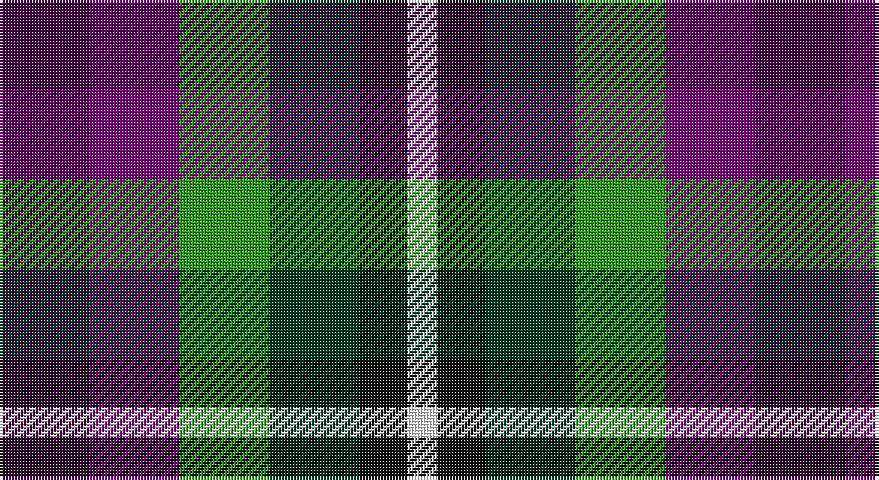

This page is one **sett** — a single exact thread-count. It belongs to the [tartan](/setts/dp15dpi15g15dg15k8w5/)
(the same proportion at any scale), whose colour order is pattern [BBGGKW](/stripes/bbggkw/).

Sourced from tartans-authority.  It is a [6 stripe tartan](/stripes/stripes6/).

Original link http://www.tartansauthority.com/tartan-ferret/display/10872/

## Register references

External register numbers recorded for this tartan.

- Scottish Register of Tartans: [10872](https://www.tartanregister.gov.uk/tartanDetails?ref=10872)
- Scottish Tartans Authority (ITI): 10872

## Thread count
DP/30 P30 G30 DG30 K16 W/10

One full sett is **252 threads**.

## Palette

Palette: <strong>Tartan Register</strong>
<table><thead><tr><th>Colour</th><th>Threads</th><th>Shade</th><th>Base</th><th>OKLCh</th></tr></thead><tbody><tr><td>DP/</td><td style="text-align:right;font-variant-numeric:tabular-nums">30</td><td><code style="background-color:#440044;">#440044</code> <small style="color:#888">#440044</small></td><td>B <code style="background-color:#2A418A;">#2A418A</code></td><td><small style="color:#888">oklch(27.1% 0.125 328.4)</small></td></tr><tr><td>P</td><td style="text-align:right;font-variant-numeric:tabular-nums">30</td><td><code style="background-color:#780078;">#780078</code> <small style="color:#888">#780078</small></td><td>B <code style="background-color:#2A418A;">#2A418A</code></td><td><small style="color:#888">oklch(40.2% 0.185 328.4)</small></td></tr><tr><td>G</td><td style="text-align:right;font-variant-numeric:tabular-nums">30</td><td><code style="background-color:#289C18;">#289C18</code> <small style="color:#888">#289C18</small></td><td>G <code style="background-color:#006100;">#006100</code></td><td><small style="color:#888">oklch(60.6% 0.191 141.6)</small></td></tr><tr><td>DG</td><td style="text-align:right;font-variant-numeric:tabular-nums">30</td><td><code style="background-color:#003820;">#003820</code> <small style="color:#888">#003820</small></td><td>G <code style="background-color:#006100;">#006100</code></td><td><small style="color:#888">oklch(30.0% 0.070 158.3)</small></td></tr><tr><td>K</td><td style="text-align:right;font-variant-numeric:tabular-nums">16</td><td><code style="background-color:#101010;">#101010</code> <small style="color:#888">#101010</small></td><td>K <code style="background-color:#000000;">#000000</code></td><td><small style="color:#888">oklch(17.3% 0.000 89.9)</small></td></tr><tr><td>W/</td><td style="text-align:right;font-variant-numeric:tabular-nums">10</td><td><code style="background-color:#FCFCFC;">#FCFCFC</code> <small style="color:#888">#FCFCFC</small></td><td>W <code style="background-color:#F7F7F7;">#F7F7F7</code></td><td><small style="color:#888">oklch(99.1% 0.000 89.9)</small></td></tr></tbody></table>

# Sample pattern

## Nearest tartans

The nearest existing variants by ΔTartan distance, with this tartan at the top so the swatches line up against it.

ΔTartan

Tartan

Sett

—

<a href="/ttd/edit/#slug=dp15dpi15g15dg15k8w5~x2">Williams, Edmund (Personal)</a> <a class="nn-out" href="/variants/s6/dp15dpi15g15dg15k8w5~x2/" title="open its dictionary page">↗</a>

1.00

<a href="/ttd/edit/#slug=db15dp15g15dg15k8w5~x2&amp;base=dp15dpi15g15dg15k8w5~x2">Williams, Edmund (Personal)</a> <a class="nn-out" href="/variants/s6/db15dp15g15dg15k8w5~x2/" title="open its dictionary page">↗</a>

1.26

<a href="/ttd/edit/#slug=lb3lbi2db3r3k3ly1~x8&amp;base=dp15dpi15g15dg15k8w5~x2">Becker (Name)</a> <a class="nn-out" href="/variants/s6/lb3lbi2db3r3k3ly1~x8/" title="open its dictionary page">↗</a>

1.65

<a href="/ttd/edit/#slug=k1o3lr3oi3db3oi3g3k1~x4&amp;base=dp15dpi15g15dg15k8w5~x2">Stewarton (Fashion)</a> <a class="nn-out" href="/variants/s8/k1o3lr3oi3db3oi3g3k1~x4/" title="open its dictionary page">↗</a>

1.69

<a href="/ttd/edit/#slug=o5db4ly1db4k4dr4w1~x4&amp;base=dp15dpi15g15dg15k8w5~x2">Devon Companion District Tartan</a> <a class="nn-out" href="/variants/s7/o5db4ly1db4k4dr4w1~x4/" title="open its dictionary page">↗</a>

1.71

<a href="/ttd/edit/#slug=o5db4ly1db4k4dy4w1~x4&amp;base=dp15dpi15g15dg15k8w5~x2">Devon Companion</a> <a class="nn-out" href="/variants/s7/o5db4ly1db4k4dy4w1~x4/" title="open its dictionary page">↗</a>

1.72

<a href="/ttd/edit/#slug=k4n4lo1n4r4db4w1~x8&amp;base=dp15dpi15g15dg15k8w5~x2">Blackdown Hills Corporate Tartan</a> <a class="nn-out" href="/variants/s7/k4n4lo1n4r4db4w1~x8/" title="open its dictionary page">↗</a>

1.72

<a href="/ttd/edit/#slug=r10lr36k24r30lo8k16w18db16lo9&amp;base=dp15dpi15g15dg15k8w5~x2">Tipperary County Crest (Fashion)</a> <a class="nn-out" href="/variants/s9/r10lr36k24r30lo8k16w18db16lo9/" title="open its dictionary page">↗</a>

1.75

<a href="/ttd/edit/#slug=dg4ri5ly4db4dy2k4r4~x10&amp;base=dp15dpi15g15dg15k8w5~x2">Krifa-Jean (Personal)</a> <a class="nn-out" href="/variants/s7/dg4ri5ly4db4dy2k4r4~x10/" title="open its dictionary page">↗</a>

1.77

<a href="/ttd/edit/#slug=lr4k4dt4k4g4w1g4w1dt3r4dt3r4w1~x4&amp;base=dp15dpi15g15dg15k8w5~x2">Stanners (Personal)</a> <a class="nn-out" href="/variants/s13/lr4k4dt4k4g4w1g4w1dt3r4dt3r4w1~x4/" title="open its dictionary page">↗</a>

1.81

<a href="/ttd/edit/#slug=y5db4ly1db4k4o4w1~x4&amp;base=dp15dpi15g15dg15k8w5~x2">Devon, Companion</a> <a class="nn-out" href="/variants/s7/y5db4ly1db4k4o4w1~x4/" title="open its dictionary page">↗</a>

## Neighbour map

Every grey dot is one of 14360 variants placed by the first two principal components of the ΔTartan feature space (44% of its variance). Red is this tartan; blue dots are its nearest — click one to open its page.

<svg viewBox="0 0 640 380" role="img" style="max-width:100%;height:auto;border:1px solid #e0e0e0;border-radius:4px;display:block" xmlns="http://www.w3.org/2000/svg"><image href="/nn/cloud.v1.png" width="640" height="380"/><a href="/variants/s6/db15dp15g15dg15k8w5~x2/"><circle cx="14.0" cy="279.6" r="4" fill="#3465a4"><title>Williams, Edmund (Personal)</title></circle></a><a href="/variants/s6/lb3lbi2db3r3k3ly1~x8/"><circle cx="14.0" cy="256.4" r="4" fill="#3465a4"><title>Becker (Name)</title></circle></a><a href="/variants/s8/k1o3lr3oi3db3oi3g3k1~x4/"><circle cx="14.0" cy="264.6" r="4" fill="#3465a4"><title>Stewarton (Fashion)</title></circle></a><a href="/variants/s7/o5db4ly1db4k4dr4w1~x4/"><circle cx="55.2" cy="233.3" r="4" fill="#3465a4"><title>Devon Companion District Tartan</title></circle></a><a href="/variants/s7/o5db4ly1db4k4dy4w1~x4/"><circle cx="52.9" cy="231.6" r="4" fill="#3465a4"><title>Devon Companion</title></circle></a><a href="/variants/s7/k4n4lo1n4r4db4w1~x8/"><circle cx="59.0" cy="246.4" r="4" fill="#3465a4"><title>Blackdown Hills Corporate Tartan</title></circle></a><a href="/variants/s9/r10lr36k24r30lo8k16w18db16lo9/"><circle cx="14.0" cy="202.2" r="4" fill="#3465a4"><title>Tipperary County Crest (Fashion)</title></circle></a><a href="/variants/s7/dg4ri5ly4db4dy2k4r4~x10/"><circle cx="14.0" cy="257.6" r="4" fill="#3465a4"><title>Krifa-Jean (Personal)</title></circle></a><a href="/variants/s13/lr4k4dt4k4g4w1g4w1dt3r4dt3r4w1~x4/"><circle cx="14.0" cy="217.1" r="4" fill="#3465a4"><title>Stanners (Personal)</title></circle></a><a href="/variants/s7/y5db4ly1db4k4o4w1~x4/"><circle cx="37.8" cy="228.3" r="4" fill="#3465a4"><title>Devon, Companion</title></circle></a><circle cx="14.0" cy="267.6" r="5" fill="#c00000"/></svg>

ID: /variants/s6/dp15dpi15g15dg15k8w5~x2/
