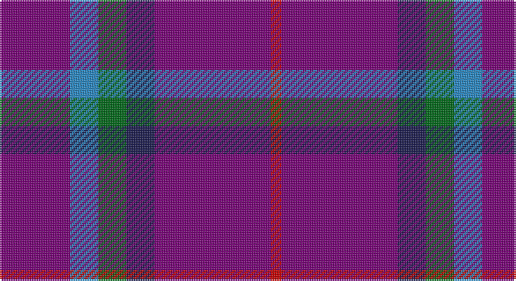

This page is one **sett** — a single exact thread-count. It belongs to the [tartan](/setts/dp20t8g8db8dp33r3/)
(the same proportion at any scale), whose colour order is pattern [BBGBBR](/stripes/bbgbbr/).

Sourced from tartans-authority.  It is a [6 stripe tartan](/stripes/stripes6/).

Original link http://www.tartansauthority.com/tartan-ferret/display/10215/

## Register references

External register numbers recorded for this tartan.

- Scottish Register of Tartans: [10215](https://www.tartanregister.gov.uk/tartanDetails?ref=10215)
- Scottish Tartans Authority (ITI): 10215

## Thread count
P/40 B16 G16 DB16 P66 R/6

One full sett is **274 threads**.

## Palette

Palette: <strong>Tartan Register</strong>
<table><thead><tr><th>Colour</th><th>Threads</th><th>Shade</th><th>Base</th><th>OKLCh</th></tr></thead><tbody><tr><td>P/</td><td style="text-align:right;font-variant-numeric:tabular-nums">40</td><td><code style="background-color:#780078;">#780078</code> <small style="color:#888">#780078</small></td><td>B <code style="background-color:#2A418A;">#2A418A</code></td><td><small style="color:#888">oklch(40.2% 0.185 328.4)</small></td></tr><tr><td>B</td><td style="text-align:right;font-variant-numeric:tabular-nums">16</td><td><code style="background-color:#2888C4;">#2888C4</code> <small style="color:#888">#2888C4</small></td><td>B <code style="background-color:#2A418A;">#2A418A</code></td><td><small style="color:#888">oklch(60.1% 0.125 241.5)</small></td></tr><tr><td>G</td><td style="text-align:right;font-variant-numeric:tabular-nums">16</td><td><code style="background-color:#006818;">#006818</code> <small style="color:#888">#006818</small></td><td>G <code style="background-color:#006100;">#006100</code></td><td><small style="color:#888">oklch(45.0% 0.142 145.0)</small></td></tr><tr><td>DB</td><td style="text-align:right;font-variant-numeric:tabular-nums">16</td><td><code style="background-color:#1C1C50;">#1C1C50</code> <small style="color:#888">#1C1C50</small></td><td>B <code style="background-color:#2A418A;">#2A418A</code></td><td><small style="color:#888">oklch(26.2% 0.093 277.9)</small></td></tr><tr><td>P</td><td style="text-align:right;font-variant-numeric:tabular-nums">66</td><td><code style="background-color:#780078;">#780078</code> <small style="color:#888">#780078</small></td><td>B <code style="background-color:#2A418A;">#2A418A</code></td><td><small style="color:#888">oklch(40.2% 0.185 328.4)</small></td></tr><tr><td>R/</td><td style="text-align:right;font-variant-numeric:tabular-nums">6</td><td><code style="background-color:#C80000;">#C80000</code> <small style="color:#888">#C80000</small></td><td>R <code style="background-color:#CC0000;">#CC0000</code></td><td><small style="color:#888">oklch(52.3% 0.215 29.2)</small></td></tr></tbody></table>

# Sample pattern

## Nearest tartans

The nearest existing variants by ΔTartan distance, with this tartan at the top so the swatches line up against it.

ΔTartan

Tartan

Sett

—

<a href="/ttd/edit/#slug=dp20t8g8db8dp33r3~x2">McIntosh, Stuart (Personal)</a> <a class="nn-out" href="/variants/s6/dp20t8g8db8dp33r3~x2/" title="open its dictionary page">↗</a>

1.32

<a href="/ttd/edit/#slug=db2t11dp19db1dp19dpi4lo2~x2&amp;base=dp20t8g8db8dp33r3~x2">Brigid Mhairi (Personal)</a> <a class="nn-out" href="/variants/s7/db2t11dp19db1dp19dpi4lo2~x2/" title="open its dictionary page">↗</a>

1.74

<a href="/ttd/edit/#slug=dp30m5dp5b4dp4g12~x2&amp;base=dp20t8g8db8dp33r3~x2">International Festival of Authors (C</a> <a class="nn-out" href="/variants/s6/dp30m5dp5b4dp4g12~x2/" title="open its dictionary page">↗</a>

1.85

<a href="/ttd/edit/#slug=db40w7db60k10r25ly4&amp;base=dp20t8g8db8dp33r3~x2">Stradling (Name)</a> <a class="nn-out" href="/variants/s6/db40w7db60k10r25ly4/" title="open its dictionary page">↗</a>

1.90

<a href="/ttd/edit/#slug=db30dp9g6dp9r4db17w5~x2&amp;base=dp20t8g8db8dp33r3~x2">Woodcock (2014)</a> <a class="nn-out" href="/variants/s7/db30dp9g6dp9r4db17w5~x2/" title="open its dictionary page">↗</a>

1.97

<a href="/ttd/edit/#slug=dp10ly3dp8db42g5o5~x2&amp;base=dp20t8g8db8dp33r3~x2">Cheadle (Personal)</a> <a class="nn-out" href="/variants/s6/dp10ly3dp8db42g5o5~x2/" title="open its dictionary page">↗</a>

1.99

<a href="/ttd/edit/#slug=dp46dpi15k12p8g8dp8~x2&amp;base=dp20t8g8db8dp33r3~x2">Haut Name Tartan</a> <a class="nn-out" href="/variants/s6/dp46dpi15k12p8g8dp8~x2/" title="open its dictionary page">↗</a>

2.11

<a href="/ttd/edit/#slug=w1db8r3db2r1db2r3db8lo1~x4&amp;base=dp20t8g8db8dp33r3~x2">Louisville Fire &amp; Rescue P&amp;D</a> <a class="nn-out" href="/variants/s9/w1db8r3db2r1db2r3db8lo1~x4/" title="open its dictionary page">↗</a>

2.11

<a href="/ttd/edit/#slug=r10db4r6db30k10db5w2~x2&amp;base=dp20t8g8db8dp33r3~x2">Heritage of Wales (Fashion)</a> <a class="nn-out" href="/variants/s7/r10db4r6db30k10db5w2~x2/" title="open its dictionary page">↗</a>

2.13

<a href="/ttd/edit/#slug=db9k4lb1k4db9r1~x4&amp;base=dp20t8g8db8dp33r3~x2">Scottish Nuclear</a> <a class="nn-out" href="/variants/s6/db9k4lb1k4db9r1~x4/" title="open its dictionary page">↗</a>

2.13

<a href="/ttd/edit/#slug=db6dp12lg3dp12b6db2b26dp16lb2dp6~x2&amp;base=dp20t8g8db8dp33r3~x2">Serenade (Fashion)</a> <a class="nn-out" href="/variants/s10/db6dp12lg3dp12b6db2b26dp16lb2dp6~x2/" title="open its dictionary page">↗</a>

## Neighbour map

Every grey dot is one of 14360 variants placed by the first two principal components of the ΔTartan feature space (44% of its variance). Red is this tartan; blue dots are its nearest — click one to open its page.

<svg viewBox="0 0 640 380" role="img" style="max-width:100%;height:auto;border:1px solid #e0e0e0;border-radius:4px;display:block" xmlns="http://www.w3.org/2000/svg"><image href="/nn/cloud.v1.png" width="640" height="380"/><a href="/variants/s7/db2t11dp19db1dp19dpi4lo2~x2/"><circle cx="397.3" cy="178.3" r="4" fill="#3465a4"><title>Brigid Mhairi (Personal)</title></circle></a><a href="/variants/s6/dp30m5dp5b4dp4g12~x2/"><circle cx="363.9" cy="210.5" r="4" fill="#3465a4"><title>International Festival of Authors (C</title></circle></a><a href="/variants/s6/db40w7db60k10r25ly4/"><circle cx="385.1" cy="194.4" r="4" fill="#3465a4"><title>Stradling (Name)</title></circle></a><a href="/variants/s7/db30dp9g6dp9r4db17w5~x2/"><circle cx="281.7" cy="214.4" r="4" fill="#3465a4"><title>Woodcock (2014)</title></circle></a><a href="/variants/s6/dp10ly3dp8db42g5o5~x2/"><circle cx="356.2" cy="186.5" r="4" fill="#3465a4"><title>Cheadle (Personal)</title></circle></a><a href="/variants/s6/dp46dpi15k12p8g8dp8~x2/"><circle cx="294.7" cy="237.2" r="4" fill="#3465a4"><title>Haut Name Tartan</title></circle></a><a href="/variants/s9/w1db8r3db2r1db2r3db8lo1~x4/"><circle cx="381.4" cy="208.2" r="4" fill="#3465a4"><title>Louisville Fire &amp; Rescue P&amp;D</title></circle></a><a href="/variants/s7/r10db4r6db30k10db5w2~x2/"><circle cx="339.5" cy="188.0" r="4" fill="#3465a4"><title>Heritage of Wales (Fashion)</title></circle></a><a href="/variants/s6/db9k4lb1k4db9r1~x4/"><circle cx="382.0" cy="258.2" r="4" fill="#3465a4"><title>Scottish Nuclear</title></circle></a><a href="/variants/s10/db6dp12lg3dp12b6db2b26dp16lb2dp6~x2/"><circle cx="296.8" cy="188.1" r="4" fill="#3465a4"><title>Serenade (Fashion)</title></circle></a><circle cx="386.5" cy="216.4" r="5" fill="#c00000"/></svg>

ID: /variants/s6/dp20t8g8db8dp33r3~x2/
