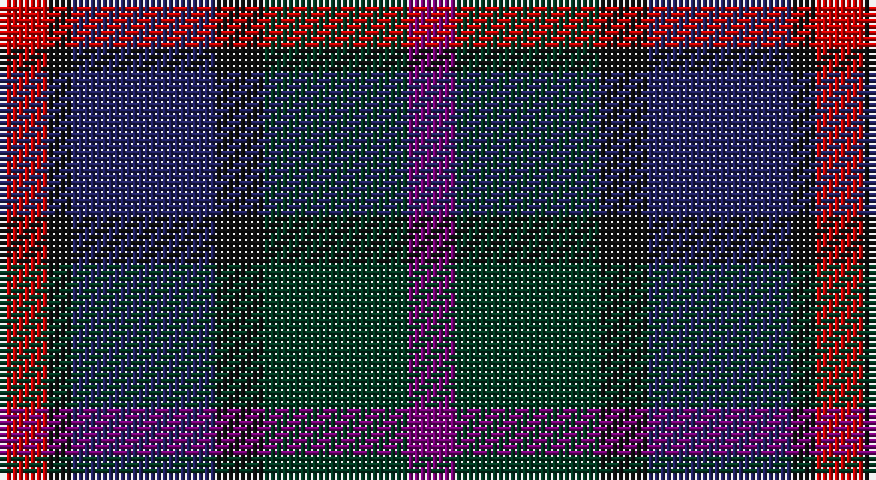

This page is one **sett** — a single exact thread-count. It belongs to the [tartan](/setts/dp2dg6k2db6k1r2/)
(the same proportion at any scale), whose colour order is pattern [BGKBKR](/stripes/bgkbkr/).

Sourced from register-of-tartans.  It is a [6 stripe tartan](/stripes/stripes6/).

Original link https://www.tartanregister.gov.uk/tartanDetails.aspx?ref=2312

2 attestations — the source records this cloth was collapsed from (oldest owns this page)

<ul>
<li>01/01/1993 — MacCaughan or MacEachain (Personal) (register-of-tartans, <a href="https://www.tartanregister.gov.uk/tartanDetails.aspx?ref=2312">record</a>)</li>
<li>1993 — MacCaughan (Personal) (tartans-authority, <a href="http://www.tartansauthority.com/tartan-ferret/display/169/">record</a>)</li>
</ul>

## Register references

External register numbers recorded for this tartan.

- Scottish Register of Tartans: [2312](https://www.tartanregister.gov.uk/tartanDetails.aspx?ref=2312)
- Scottish Tartans Authority (ITI): 169
- Scottish Tartans World Register: 169

## Thread count
R/8 K4 DB24 K8 DG24 P/8

One full sett is **136 threads**.

## Palette

Palette: <strong>Tartan Register</strong>
<table><thead><tr><th>Colour</th><th>Threads</th><th>Shade</th><th>Base</th><th>OKLCh</th></tr></thead><tbody><tr><td>R/</td><td style="text-align:right;font-variant-numeric:tabular-nums">8</td><td><code style="background-color:#C80000;">#C80000</code> <small style="color:#888">#C80000</small></td><td>R <code style="background-color:#CC0000;">#CC0000</code></td><td><small style="color:#888">oklch(52.3% 0.215 29.2)</small></td></tr><tr><td>K</td><td style="text-align:right;font-variant-numeric:tabular-nums">4</td><td><code style="background-color:#101010;">#101010</code> <small style="color:#888">#101010</small></td><td>K <code style="background-color:#000000;">#000000</code></td><td><small style="color:#888">oklch(17.3% 0.000 89.9)</small></td></tr><tr><td>DB</td><td style="text-align:right;font-variant-numeric:tabular-nums">24</td><td><code style="background-color:#202060;">#202060</code> <small style="color:#888">#202060</small></td><td>B <code style="background-color:#2A418A;">#2A418A</code></td><td><small style="color:#888">oklch(28.9% 0.111 276.9)</small></td></tr><tr><td>K</td><td style="text-align:right;font-variant-numeric:tabular-nums">8</td><td><code style="background-color:#101010;">#101010</code> <small style="color:#888">#101010</small></td><td>K <code style="background-color:#000000;">#000000</code></td><td><small style="color:#888">oklch(17.3% 0.000 89.9)</small></td></tr><tr><td>DG</td><td style="text-align:right;font-variant-numeric:tabular-nums">24</td><td><code style="background-color:#003820;">#003820</code> <small style="color:#888">#003820</small></td><td>G <code style="background-color:#006100;">#006100</code></td><td><small style="color:#888">oklch(30.0% 0.070 158.3)</small></td></tr><tr><td>P/</td><td style="text-align:right;font-variant-numeric:tabular-nums">8</td><td><code style="background-color:#780078;">#780078</code> <small style="color:#888">#780078</small></td><td>B <code style="background-color:#2A418A;">#2A418A</code></td><td><small style="color:#888">oklch(40.2% 0.185 328.4)</small></td></tr></tbody></table>

# Sample pattern

## Nearest tartans

The nearest existing variants by ΔTartan distance, with this tartan at the top so the swatches line up against it.

ΔTartan

Tartan

Sett

—

<a href="/ttd/edit/#slug=dp2dg6k2db6k1r2~x4">MacCaughan or MacEachain (Personal)</a> <a class="nn-out" href="/variants/s6/dp2dg6k2db6k1r2~x4/" title="open its dictionary page">↗</a>

0.99

<a href="/ttd/edit/#slug=r5db8k5db24k24yi24y5~x2&amp;base=dp2dg6k2db6k1r2~x4">Heritage (Corporate)</a> <a class="nn-out" href="/variants/s7/r5db8k5db24k24yi24y5~x2/" title="open its dictionary page">↗</a>

1.18

<a href="/ttd/edit/#slug=m4k29dr30dt29m4~x2&amp;base=dp2dg6k2db6k1r2~x4">Glen Shee #3 (Fashion)</a> <a class="nn-out" href="/variants/s5/m4k29dr30dt29m4~x2/" title="open its dictionary page">↗</a>

1.23

<a href="/ttd/edit/#slug=t25dg25k6dp10r6~x2&amp;base=dp2dg6k2db6k1r2~x4">Breon (Jersey Shore, Pennsylvania) (Personal)</a> <a class="nn-out" href="/variants/s5/t25dg25k6dp10r6~x2/" title="open its dictionary page">↗</a>

1.29

<a href="/ttd/edit/#slug=db5k3db18dg6k6dg6dy12r5dy12r3~x2&amp;base=dp2dg6k2db6k1r2~x4">Longford, County</a> <a class="nn-out" href="/variants/s10/db5k3db18dg6k6dg6dy12r5dy12r3~x2/" title="open its dictionary page">↗</a>

1.29

<a href="/ttd/edit/#slug=k2dg10y2k9dp8dg2~x2&amp;base=dp2dg6k2db6k1r2~x4">Lennie</a> <a class="nn-out" href="/variants/s6/k2dg10y2k9dp8dg2~x2/" title="open its dictionary page">↗</a>

1.37

<a href="/ttd/edit/#slug=dg3dt22dr10o5dg21r6dt3~x2&amp;base=dp2dg6k2db6k1r2~x4">Swankie</a> <a class="nn-out" href="/variants/s7/dg3dt22dr10o5dg21r6dt3~x2/" title="open its dictionary page">↗</a>

1.43

<a href="/ttd/edit/#slug=dt20b3dt4r3dt3k10g21k4r20~x2&amp;base=dp2dg6k2db6k1r2~x4">Holland &amp; Sherry (Corporate)</a> <a class="nn-out" href="/variants/s9/dt20b3dt4r3dt3k10g21k4r20~x2/" title="open its dictionary page">↗</a>

1.43

<a href="/ttd/edit/#slug=db10r7db31k25dg23k8db7r8ly5~x2&amp;base=dp2dg6k2db6k1r2~x4">MacAllum of Berwick (Clan?)</a> <a class="nn-out" href="/variants/s9/db10r7db31k25dg23k8db7r8ly5~x2/" title="open its dictionary page">↗</a>

1.43

<a href="/ttd/edit/#slug=r4g11k11g2n11y3~x4&amp;base=dp2dg6k2db6k1r2~x4">Casely</a> <a class="nn-out" href="/variants/s6/r4g11k11g2n11y3~x4/" title="open its dictionary page">↗</a>

1.44

<a href="/ttd/edit/#slug=db11g15k2n5dbi3n11~x2&amp;base=dp2dg6k2db6k1r2~x4">Saorsa (Corporate)</a> <a class="nn-out" href="/variants/s6/db11g15k2n5dbi3n11~x2/" title="open its dictionary page">↗</a>

## Neighbour map

Every grey dot is one of 14360 variants placed by the first two principal components of the ΔTartan feature space (44% of its variance). Red is this tartan; blue dots are its nearest — click one to open its page.

<svg viewBox="0 0 640 380" role="img" style="max-width:100%;height:auto;border:1px solid #e0e0e0;border-radius:4px;display:block" xmlns="http://www.w3.org/2000/svg"><image href="/nn/cloud.v1.png" width="640" height="380"/><a href="/variants/s7/r5db8k5db24k24yi24y5~x2/"><circle cx="154.6" cy="256.1" r="4" fill="#3465a4"><title>Heritage (Corporate)</title></circle></a><a href="/variants/s5/m4k29dr30dt29m4~x2/"><circle cx="222.8" cy="288.1" r="4" fill="#3465a4"><title>Glen Shee #3 (Fashion)</title></circle></a><a href="/variants/s5/t25dg25k6dp10r6~x2/"><circle cx="163.9" cy="282.9" r="4" fill="#3465a4"><title>Breon (Jersey Shore, Pennsylvania) (Personal)</title></circle></a><a href="/variants/s10/db5k3db18dg6k6dg6dy12r5dy12r3~x2/"><circle cx="155.0" cy="248.0" r="4" fill="#3465a4"><title>Longford, County</title></circle></a><a href="/variants/s6/k2dg10y2k9dp8dg2~x2/"><circle cx="201.0" cy="282.3" r="4" fill="#3465a4"><title>Lennie</title></circle></a><a href="/variants/s7/dg3dt22dr10o5dg21r6dt3~x2/"><circle cx="217.5" cy="249.3" r="4" fill="#3465a4"><title>Swankie</title></circle></a><a href="/variants/s9/dt20b3dt4r3dt3k10g21k4r20~x2/"><circle cx="157.4" cy="218.7" r="4" fill="#3465a4"><title>Holland &amp; Sherry (Corporate)</title></circle></a><a href="/variants/s9/db10r7db31k25dg23k8db7r8ly5~x2/"><circle cx="165.1" cy="231.2" r="4" fill="#3465a4"><title>MacAllum of Berwick (Clan?)</title></circle></a><a href="/variants/s6/r4g11k11g2n11y3~x4/"><circle cx="133.1" cy="264.8" r="4" fill="#3465a4"><title>Casely</title></circle></a><a href="/variants/s6/db11g15k2n5dbi3n11~x2/"><circle cx="186.2" cy="262.8" r="4" fill="#3465a4"><title>Saorsa (Corporate)</title></circle></a><circle cx="165.7" cy="265.0" r="5" fill="#c00000"/></svg>

ID: /variants/s6/dp2dg6k2db6k1r2~x4/
