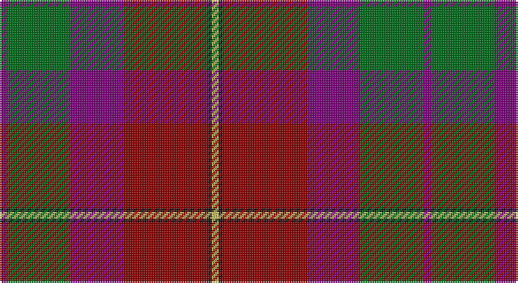

This page is one **sett** — a single exact thread-count. It belongs to the [tartan](/setts/dp2g18dp15r24k1ly2/)
(the same proportion at any scale), whose colour order is pattern [BGBRKY](/stripes/bgbrky/).

Sourced from tartans-authority.  It is a [6 stripe tartan](/stripes/stripes6/).

Original link http://www.tartansauthority.com/tartan-ferret/display/8541/

## Also known as

This cloth is also recorded under:

- Miller, Reverend Ian (Personal

## Register references

External register numbers recorded for this tartan.

- Scottish Register of Tartans: [8541](https://www.tartanregister.gov.uk/tartanDetails?ref=8541)
- Scottish Tartans Authority (ITI): 8541

## Thread count
P/4 G36 P30 DR48 K2 LG/4

One full sett is **240 threads**.

## Palette

Palette: <strong>Tartan Register</strong>
<table><thead><tr><th>Colour</th><th>Threads</th><th>Shade</th><th>Base</th><th>OKLCh</th></tr></thead><tbody><tr><td>P/</td><td style="text-align:right;font-variant-numeric:tabular-nums">4</td><td><code style="background-color:#780078;">#780078</code> <small style="color:#888">#780078</small></td><td>B <code style="background-color:#2A418A;">#2A418A</code></td><td><small style="color:#888">oklch(40.2% 0.185 328.4)</small></td></tr><tr><td>G</td><td style="text-align:right;font-variant-numeric:tabular-nums">36</td><td><code style="background-color:#006818;">#006818</code> <small style="color:#888">#006818</small></td><td>G <code style="background-color:#006100;">#006100</code></td><td><small style="color:#888">oklch(45.0% 0.142 145.0)</small></td></tr><tr><td>P</td><td style="text-align:right;font-variant-numeric:tabular-nums">30</td><td><code style="background-color:#780078;">#780078</code> <small style="color:#888">#780078</small></td><td>B <code style="background-color:#2A418A;">#2A418A</code></td><td><small style="color:#888">oklch(40.2% 0.185 328.4)</small></td></tr><tr><td>DR</td><td style="text-align:right;font-variant-numeric:tabular-nums">48</td><td><code style="background-color:#880000;">#880000</code> <small style="color:#888">#880000</small></td><td>R <code style="background-color:#CC0000;">#CC0000</code></td><td><small style="color:#888">oklch(39.4% 0.162 29.2)</small></td></tr><tr><td>K</td><td style="text-align:right;font-variant-numeric:tabular-nums">2</td><td><code style="background-color:#101010;">#101010</code> <small style="color:#888">#101010</small></td><td>K <code style="background-color:#000000;">#000000</code></td><td><small style="color:#888">oklch(17.3% 0.000 89.9)</small></td></tr><tr><td>LG/</td><td style="text-align:right;font-variant-numeric:tabular-nums">4</td><td><code style="background-color:#C4BC68;">#C4BC68</code> <small style="color:#888">#C4BC68</small></td><td>Y <code style="background-color:#F2BF00;">#F2BF00</code></td><td><small style="color:#888">oklch(78.4% 0.107 103.7)</small></td></tr></tbody></table>

# Sample pattern

## Nearest tartans

The nearest existing variants by ΔTartan distance, with this tartan at the top so the swatches line up against it.

ΔTartan

Tartan

Sett

—

<a href="/ttd/edit/#slug=dp2g18dp15r24k1ly2~x2">Miller, Reverend Ian (Personal</a> <a class="nn-out" href="/variants/s6/dp2g18dp15r24k1ly2~x2/" title="open its dictionary page">↗</a>

0.99

<a href="/ttd/edit/#slug=k8lo2n30r30lb3~x2&amp;base=dp2g18dp15r24k1ly2~x2">Douglas Ancient Red</a> <a class="nn-out" href="/variants/s5/k8lo2n30r30lb3~x2/" title="open its dictionary page">↗</a>

1.07

<a href="/ttd/edit/#slug=dr18o9y9r1t1~x4&amp;base=dp2g18dp15r24k1ly2~x2">Jardine</a> <a class="nn-out" href="/variants/s5/dr18o9y9r1t1~x4/" title="open its dictionary page">↗</a>

1.26

<a href="/ttd/edit/#slug=n47r8k22r7lb3r24n9r10lo3~x2&amp;base=dp2g18dp15r24k1ly2~x2">Ulster Ancestry (Fashion)</a> <a class="nn-out" href="/variants/s9/n47r8k22r7lb3r24n9r10lo3~x2/" title="open its dictionary page">↗</a>

1.27

<a href="/ttd/edit/#slug=t5k1r30dp15r8g30r8dp2&amp;base=dp2g18dp15r24k1ly2~x2">Shaw of Tordarroch Clan Tartan</a> <a class="nn-out" href="/variants/s8/t5k1r30dp15r8g30r8dp2/" title="open its dictionary page">↗</a>

1.31

<a href="/ttd/edit/#slug=k6t1r18db6dg18k2~x2&amp;base=dp2g18dp15r24k1ly2~x2">Eachaidh (Personal)</a> <a class="nn-out" href="/variants/s6/k6t1r18db6dg18k2~x2/" title="open its dictionary page">↗</a>

1.33

<a href="/ttd/edit/#slug=lo1dg14r1y14r28db14lo1~x2&amp;base=dp2g18dp15r24k1ly2~x2">Abernethy (Colerain, USA)</a> <a class="nn-out" href="/variants/s7/lo1dg14r1y14r28db14lo1~x2/" title="open its dictionary page">↗</a>

1.34

<a href="/ttd/edit/#slug=t5k1r30dp15r8g30r8dp2~x2&amp;base=dp2g18dp15r24k1ly2~x2">Shaw Red of Tordarroch Dress (Clan 2</a> <a class="nn-out" href="/variants/s8/t5k1r30dp15r8g30r8dp2~x2/" title="open its dictionary page">↗</a>

1.40

<a href="/ttd/edit/#slug=b5k1r30n15r8dg30r8n2~x2&amp;base=dp2g18dp15r24k1ly2~x2">Shaw</a> <a class="nn-out" href="/variants/s8/b5k1r30n15r8dg30r8n2~x2/" title="open its dictionary page">↗</a>

1.40

<a href="/ttd/edit/#slug=b5k1r30n15r8dg30r8n2&amp;base=dp2g18dp15r24k1ly2~x2">Shaw</a> <a class="nn-out" href="/variants/s8/b5k1r30n15r8dg30r8n2/" title="open its dictionary page">↗</a>

1.40

<a href="/ttd/edit/#slug=dg30dt2n7r14n7r7w1dt14~x2&amp;base=dp2g18dp15r24k1ly2~x2">Harding (Name)</a> <a class="nn-out" href="/variants/s8/dg30dt2n7r14n7r7w1dt14~x2/" title="open its dictionary page">↗</a>

## Neighbour map

Every grey dot is one of 14360 variants placed by the first two principal components of the ΔTartan feature space (44% of its variance). Red is this tartan; blue dots are its nearest — click one to open its page.

<svg viewBox="0 0 640 380" role="img" style="max-width:100%;height:auto;border:1px solid #e0e0e0;border-radius:4px;display:block" xmlns="http://www.w3.org/2000/svg"><image href="/nn/cloud.v1.png" width="640" height="380"/><a href="/variants/s5/k8lo2n30r30lb3~x2/"><circle cx="283.4" cy="200.9" r="4" fill="#3465a4"><title>Douglas Ancient Red</title></circle></a><a href="/variants/s5/dr18o9y9r1t1~x4/"><circle cx="286.6" cy="192.7" r="4" fill="#3465a4"><title>Jardine</title></circle></a><a href="/variants/s9/n47r8k22r7lb3r24n9r10lo3~x2/"><circle cx="253.2" cy="156.3" r="4" fill="#3465a4"><title>Ulster Ancestry (Fashion)</title></circle></a><a href="/variants/s8/t5k1r30dp15r8g30r8dp2/"><circle cx="293.5" cy="138.1" r="4" fill="#3465a4"><title>Shaw of Tordarroch Clan Tartan</title></circle></a><a href="/variants/s6/k6t1r18db6dg18k2~x2/"><circle cx="237.2" cy="198.6" r="4" fill="#3465a4"><title>Eachaidh (Personal)</title></circle></a><a href="/variants/s7/lo1dg14r1y14r28db14lo1~x2/"><circle cx="220.6" cy="134.2" r="4" fill="#3465a4"><title>Abernethy (Colerain, USA)</title></circle></a><a href="/variants/s8/t5k1r30dp15r8g30r8dp2~x2/"><circle cx="285.2" cy="136.0" r="4" fill="#3465a4"><title>Shaw Red of Tordarroch Dress (Clan 2</title></circle></a><a href="/variants/s8/b5k1r30n15r8dg30r8n2~x2/"><circle cx="327.4" cy="162.3" r="4" fill="#3465a4"><title>Shaw</title></circle></a><a href="/variants/s8/b5k1r30n15r8dg30r8n2/"><circle cx="327.4" cy="162.3" r="4" fill="#3465a4"><title>Shaw</title></circle></a><a href="/variants/s8/dg30dt2n7r14n7r7w1dt14~x2/"><circle cx="244.6" cy="162.5" r="4" fill="#3465a4"><title>Harding (Name)</title></circle></a><circle cx="264.2" cy="169.2" r="5" fill="#c00000"/></svg>

ID: /variants/s6/dp2g18dp15r24k1ly2~x2/
