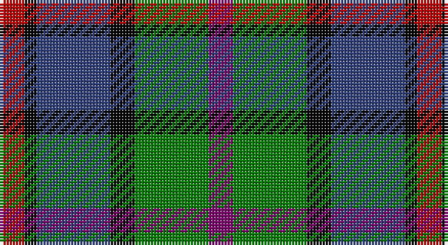

This page is one **sett** — a single exact thread-count. It belongs to the [tartan](/setts/dp2g6k2db6k1r2/)
(the same proportion at any scale), whose colour order is pattern [BGKBKR](/stripes/bgkbkr/).

Sourced from weddslist.  It is a [6 stripe tartan](/stripes/stripes6/).

Original link http://www.weddslist.com/cgi-bin/tartans/pg.pl?source=sts

## Thread count
R/8 K4 B24 K8 G24 P/8

One full sett is **136 threads**.

## Palette

Palette: <strong>Ingles Buchan</strong> <small style="color:#888">(1 of 5 colours)</small>
<table><thead><tr><th>Colour</th><th>Threads</th><th>Shade</th><th>Base</th><th>OKLCh</th></tr></thead><tbody><tr><td>R/</td><td style="text-align:right;font-variant-numeric:tabular-nums">8</td><td><code style="background-color:#C00000;">#C00000</code> <small style="color:#888">#C00000</small></td><td>R <code style="background-color:#CC0000;">#CC0000</code></td><td><small style="color:#888">oklch(50.7% 0.208 29.2)</small></td></tr><tr><td>K</td><td style="text-align:right;font-variant-numeric:tabular-nums">4</td><td><code style="background-color:#000000;">#000000</code> <small style="color:#888">#000000</small></td><td>K <code style="background-color:#000000;">#000000</code></td><td><small style="color:#888">oklch(0.0% 0.000 0.0)</small></td></tr><tr><td>B</td><td style="text-align:right;font-variant-numeric:tabular-nums">24</td><td><code style="background-color:#304080;">#304080</code> <small style="color:#888">#304080</small></td><td>B <code style="background-color:#2A418A;">#2A418A</code></td><td><small style="color:#888">oklch(39.4% 0.109 270.2)</small></td></tr><tr><td>K</td><td style="text-align:right;font-variant-numeric:tabular-nums">8</td><td><code style="background-color:#000000;">#000000</code> <small style="color:#888">#000000</small></td><td>K <code style="background-color:#000000;">#000000</code></td><td><small style="color:#888">oklch(0.0% 0.000 0.0)</small></td></tr><tr><td>G</td><td style="text-align:right;font-variant-numeric:tabular-nums">24</td><td><code style="background-color:#008000;">#008000</code> <small style="color:#888">#008000</small></td><td>G <code style="background-color:#006100;">#006100</code></td><td><small style="color:#888">oklch(52.0% 0.177 142.5)</small></td></tr><tr><td>P/</td><td style="text-align:right;font-variant-numeric:tabular-nums">8</td><td><code style="background-color:#800070;">#800070</code> <small style="color:#888">#800070</small></td><td>B <code style="background-color:#2A418A;">#2A418A</code></td><td><small style="color:#888">oklch(41.1% 0.183 335.2)</small></td></tr></tbody></table>

# Sample pattern

## Nearest tartans

The nearest existing variants by ΔTartan distance, with this tartan at the top so the swatches line up against it.

ΔTartan

Tartan

Sett

—

<a href="/ttd/edit/#slug=dp2g6k2db6k1r2~x4">MacCaughan, or MacEachain</a> <a class="nn-out" href="/variants/s6/dp2g6k2db6k1r2~x4/" title="open its dictionary page">↗</a>

0.45

<a href="/ttd/edit/#slug=k6b2db12g8r5k2g3~x4&amp;base=dp2g6k2db6k1r2~x4">Cooke</a> <a class="nn-out" href="/variants/s7/k6b2db12g8r5k2g3~x4/" title="open its dictionary page">↗</a>

0.74

<a href="/ttd/edit/#slug=r1dy6db2lb4k4lb1~x6&amp;base=dp2g6k2db6k1r2~x4">Thompson's Fancy (Fashion)</a> <a class="nn-out" href="/variants/s6/r1dy6db2lb4k4lb1~x6/" title="open its dictionary page">↗</a>

0.78

<a href="/ttd/edit/#slug=dp11t2k10g10ly3~x2&amp;base=dp2g6k2db6k1r2~x4">Nobiliary Fraternity</a> <a class="nn-out" href="/variants/s5/dp11t2k10g10ly3~x2/" title="open its dictionary page">↗</a>

0.79

<a href="/ttd/edit/#slug=lr4g17k17db17r3db3~x2&amp;base=dp2g6k2db6k1r2~x4">Royal Highland</a> <a class="nn-out" href="/variants/s6/lr4g17k17db17r3db3~x2/" title="open its dictionary page">↗</a>

0.79

<a href="/ttd/edit/#slug=r4g11k11g2db11y3~x4&amp;base=dp2g6k2db6k1r2~x4">Casely</a> <a class="nn-out" href="/variants/s6/r4g11k11g2db11y3~x4/" title="open its dictionary page">↗</a>

0.82

<a href="/ttd/edit/#slug=dp11y2k10g10lo2~x2&amp;base=dp2g6k2db6k1r2~x4">Selkirk (Name)</a> <a class="nn-out" href="/variants/s5/dp11y2k10g10lo2~x2/" title="open its dictionary page">↗</a>

0.85

<a href="/ttd/edit/#slug=g15dg18db23w4r8~x2&amp;base=dp2g6k2db6k1r2~x4">Friebe (2014)</a> <a class="nn-out" href="/variants/s5/g15dg18db23w4r8~x2/" title="open its dictionary page">↗</a>

0.87

<a href="/ttd/edit/#slug=db27g5ly8k20ly3g15r3~x2&amp;base=dp2g6k2db6k1r2~x4">Nelson Mandela (Personal)</a> <a class="nn-out" href="/variants/s7/db27g5ly8k20ly3g15r3~x2/" title="open its dictionary page">↗</a>

0.89

<a href="/ttd/edit/#slug=k2ly1dg6k6db6w1~x4&amp;base=dp2g6k2db6k1r2~x4">Dyce #3</a> <a class="nn-out" href="/variants/s6/k2ly1dg6k6db6w1~x4/" title="open its dictionary page">↗</a>

0.89

<a href="/ttd/edit/#slug=k3g8k8r2db8w2~x2&amp;base=dp2g6k2db6k1r2~x4">Mitchell Family Tartan</a> <a class="nn-out" href="/variants/s6/k3g8k8r2db8w2~x2/" title="open its dictionary page">↗</a>

## Neighbour map

Every grey dot is one of 14360 variants placed by the first two principal components of the ΔTartan feature space (44% of its variance). Red is this tartan; blue dots are its nearest — click one to open its page.

<svg viewBox="0 0 640 380" role="img" style="max-width:100%;height:auto;border:1px solid #e0e0e0;border-radius:4px;display:block" xmlns="http://www.w3.org/2000/svg"><image href="/nn/cloud.v1.png" width="640" height="380"/><a href="/variants/s7/k6b2db12g8r5k2g3~x4/"><circle cx="81.6" cy="220.6" r="4" fill="#3465a4"><title>Cooke</title></circle></a><a href="/variants/s6/r1dy6db2lb4k4lb1~x6/"><circle cx="87.4" cy="220.3" r="4" fill="#3465a4"><title>Thompson's Fancy (Fashion)</title></circle></a><a href="/variants/s5/dp11t2k10g10ly3~x2/"><circle cx="87.8" cy="247.3" r="4" fill="#3465a4"><title>Nobiliary Fraternity</title></circle></a><a href="/variants/s6/lr4g17k17db17r3db3~x2/"><circle cx="93.3" cy="225.4" r="4" fill="#3465a4"><title>Royal Highland</title></circle></a><a href="/variants/s6/r4g11k11g2db11y3~x4/"><circle cx="73.4" cy="237.6" r="4" fill="#3465a4"><title>Casely</title></circle></a><a href="/variants/s5/dp11y2k10g10lo2~x2/"><circle cx="111.6" cy="248.1" r="4" fill="#3465a4"><title>Selkirk (Name)</title></circle></a><a href="/variants/s5/g15dg18db23w4r8~x2/"><circle cx="91.0" cy="251.4" r="4" fill="#3465a4"><title>Friebe (2014)</title></circle></a><a href="/variants/s7/db27g5ly8k20ly3g15r3~x2/"><circle cx="121.3" cy="197.1" r="4" fill="#3465a4"><title>Nelson Mandela (Personal)</title></circle></a><a href="/variants/s6/k2ly1dg6k6db6w1~x4/"><circle cx="135.4" cy="240.4" r="4" fill="#3465a4"><title>Dyce #3</title></circle></a><a href="/variants/s6/k3g8k8r2db8w2~x2/"><circle cx="94.7" cy="257.5" r="4" fill="#3465a4"><title>Mitchell Family Tartan</title></circle></a><circle cx="94.1" cy="227.1" r="5" fill="#c00000"/></svg>

ID: /variants/s6/dp2g6k2db6k1r2~x4/
