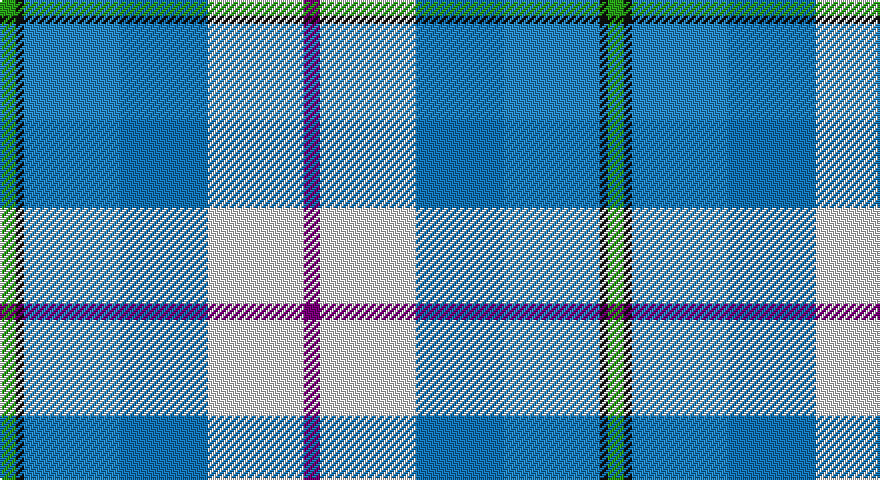

This page is one **sett** — a single exact thread-count. It belongs to the [tartan](/setts/dp2w12b11t12k1g2/)
(the same proportion at any scale), whose colour order is pattern [BWBBKG](/stripes/bwbbkg/).

Sourced from tartans-authority.  It is a [6 stripe tartan](/stripes/stripes6/).

Original link http://www.tartansauthority.com/tartan-ferret/display/7623/

2 attestations — the source records this cloth was collapsed from (oldest owns this page)

<ul>
<li>pre 2008 — Isle of Barra (District) (tartans-authority, <a href="http://www.tartansauthority.com/tartan-ferret/display/7623/">record</a>)</li>
<li>undated — Isle of Barra (register-of-tartans, <a href="https://www.tartanregister.gov.uk/tartanDetails.aspx?ref=5642">record</a>)</li>
</ul>

## Register references

External register numbers recorded for this tartan.

- Scottish Register of Tartans: [5642](https://www.tartanregister.gov.uk/tartanDetails.aspx?ref=5642)
- Scottish Tartans Authority (ITI): 7623

## Thread count
G/8 K4 Ba48 B44 LN48 P/8

One full sett is **304 threads**.

## Palette

Palette: <strong>Tartan Register</strong>
<table><thead><tr><th>Colour</th><th>Threads</th><th>Shade</th><th>Base</th><th>OKLCh</th></tr></thead><tbody><tr><td>G/</td><td style="text-align:right;font-variant-numeric:tabular-nums">8</td><td><code style="background-color:#289C18;">#289C18</code> <small style="color:#888">#289C18</small></td><td>G <code style="background-color:#006100;">#006100</code></td><td><small style="color:#888">oklch(60.6% 0.191 141.6)</small></td></tr><tr><td>K</td><td style="text-align:right;font-variant-numeric:tabular-nums">4</td><td><code style="background-color:#101010;">#101010</code> <small style="color:#888">#101010</small></td><td>K <code style="background-color:#000000;">#000000</code></td><td><small style="color:#888">oklch(17.3% 0.000 89.9)</small></td></tr><tr><td>Ba</td><td style="text-align:right;font-variant-numeric:tabular-nums">48</td><td><code style="background-color:#2888C4;">#2888C4</code> <small style="color:#888">#2888C4</small></td><td>B <code style="background-color:#2A418A;">#2A418A</code></td><td><small style="color:#888">oklch(60.1% 0.125 241.5)</small></td></tr><tr><td>B</td><td style="text-align:right;font-variant-numeric:tabular-nums">44</td><td><code style="background-color:#1474B4;">#1474B4</code> <small style="color:#888">#1474B4</small></td><td>B <code style="background-color:#2A418A;">#2A418A</code></td><td><small style="color:#888">oklch(54.0% 0.129 245.1)</small></td></tr><tr><td>LN</td><td style="text-align:right;font-variant-numeric:tabular-nums">48</td><td><code style="background-color:#E0E0E0;">#E0E0E0</code> <small style="color:#888">#E0E0E0</small></td><td>W <code style="background-color:#F7F7F7;">#F7F7F7</code></td><td><small style="color:#888">oklch(90.7% 0.000 89.9)</small></td></tr><tr><td>P/</td><td style="text-align:right;font-variant-numeric:tabular-nums">8</td><td><code style="background-color:#780078;">#780078</code> <small style="color:#888">#780078</small></td><td>B <code style="background-color:#2A418A;">#2A418A</code></td><td><small style="color:#888">oklch(40.2% 0.185 328.4)</small></td></tr></tbody></table>

# Sample pattern

## Nearest tartans

The nearest existing variants by ΔTartan distance, with this tartan at the top so the swatches line up against it.

ΔTartan

Tartan

Sett

—

<a href="/ttd/edit/#slug=dp2w12b11t12k1g2~x4">Isle of Barra (District)</a> <a class="nn-out" href="/variants/s6/dp2w12b11t12k1g2~x4/" title="open its dictionary page">↗</a>

1.24

<a href="/ttd/edit/#slug=r3db20t20lg2lr4lb17w3~x2&amp;base=dp2w12b11t12k1g2~x4">Silversea (Corporate)</a> <a class="nn-out" href="/variants/s7/r3db20t20lg2lr4lb17w3~x2/" title="open its dictionary page">↗</a>

1.53

<a href="/ttd/edit/#slug=db1lb12p6w1ly3db14b18w1~x2&amp;base=dp2w12b11t12k1g2~x4">Ancient Gathering</a> <a class="nn-out" href="/variants/s8/db1lb12p6w1ly3db14b18w1~x2/" title="open its dictionary page">↗</a>

1.53

<a href="/ttd/edit/#slug=w20db14b14w4dt2t2b7~x2&amp;base=dp2w12b11t12k1g2~x4">Earl of St. Andrews Dress (Dance)</a> <a class="nn-out" href="/variants/s7/w20db14b14w4dt2t2b7~x2/" title="open its dictionary page">↗</a>

1.64

<a href="/ttd/edit/#slug=w15lg98dt72b25dt8ly15&amp;base=dp2w12b11t12k1g2~x4">Afternoon Tea / Mint Tea</a> <a class="nn-out" href="/variants/s6/w15lg98dt72b25dt8ly15/" title="open its dictionary page">↗</a>

1.66

<a href="/ttd/edit/#slug=w3lb2p4lb14n2t14lo2~x4&amp;base=dp2w12b11t12k1g2~x4">Seaside (Fashion)</a> <a class="nn-out" href="/variants/s7/w3lb2p4lb14n2t14lo2~x4/" title="open its dictionary page">↗</a>

1.67

<a href="/ttd/edit/#slug=w28t19db19w4dbi2lp2db7~x2&amp;base=dp2w12b11t12k1g2~x4">St Andrews, Earl of, dress</a> <a class="nn-out" href="/variants/s7/w28t19db19w4dbi2lp2db7~x2/" title="open its dictionary page">↗</a>

1.68

<a href="/ttd/edit/#slug=m5g2m2g26k9lr9lb13w5~x2&amp;base=dp2w12b11t12k1g2~x4">Alexander of Menstry Hunting</a> <a class="nn-out" href="/variants/s8/m5g2m2g26k9lr9lb13w5~x2/" title="open its dictionary page">↗</a>

1.70

<a href="/ttd/edit/#slug=dt2g2dt11o2w8t12ly2t2~x2&amp;base=dp2w12b11t12k1g2~x4">Elora (District)</a> <a class="nn-out" href="/variants/s8/dt2g2dt11o2w8t12ly2t2~x2/" title="open its dictionary page">↗</a>

1.70

<a href="/ttd/edit/#slug=g4w28db14ly2t17g4~x2&amp;base=dp2w12b11t12k1g2~x4">Allanton Dress (Fashion)</a> <a class="nn-out" href="/variants/s6/g4w28db14ly2t17g4~x2/" title="open its dictionary page">↗</a>

1.72

<a href="/ttd/edit/#slug=ly4b22g4o24dp6o4w3~x2&amp;base=dp2w12b11t12k1g2~x4">Deeside Plaid (Taobh Dhi) (District)</a> <a class="nn-out" href="/variants/s7/ly4b22g4o24dp6o4w3~x2/" title="open its dictionary page">↗</a>

## Neighbour map

Every grey dot is one of 14360 variants placed by the first two principal components of the ΔTartan feature space (44% of its variance). Red is this tartan; blue dots are its nearest — click one to open its page.

<svg viewBox="0 0 640 380" role="img" style="max-width:100%;height:auto;border:1px solid #e0e0e0;border-radius:4px;display:block" xmlns="http://www.w3.org/2000/svg"><image href="/nn/cloud.v1.png" width="640" height="380"/><a href="/variants/s7/r3db20t20lg2lr4lb17w3~x2/"><circle cx="72.0" cy="147.3" r="4" fill="#3465a4"><title>Silversea (Corporate)</title></circle></a><a href="/variants/s8/db1lb12p6w1ly3db14b18w1~x2/"><circle cx="125.1" cy="131.2" r="4" fill="#3465a4"><title>Ancient Gathering</title></circle></a><a href="/variants/s7/w20db14b14w4dt2t2b7~x2/"><circle cx="143.4" cy="182.4" r="4" fill="#3465a4"><title>Earl of St. Andrews Dress (Dance)</title></circle></a><a href="/variants/s6/w15lg98dt72b25dt8ly15/"><circle cx="192.8" cy="182.3" r="4" fill="#3465a4"><title>Afternoon Tea / Mint Tea</title></circle></a><a href="/variants/s7/w3lb2p4lb14n2t14lo2~x4/"><circle cx="166.2" cy="181.8" r="4" fill="#3465a4"><title>Seaside (Fashion)</title></circle></a><a href="/variants/s7/w28t19db19w4dbi2lp2db7~x2/"><circle cx="173.4" cy="158.9" r="4" fill="#3465a4"><title>St Andrews, Earl of, dress</title></circle></a><a href="/variants/s8/m5g2m2g26k9lr9lb13w5~x2/"><circle cx="131.8" cy="146.5" r="4" fill="#3465a4"><title>Alexander of Menstry Hunting</title></circle></a><a href="/variants/s8/dt2g2dt11o2w8t12ly2t2~x2/"><circle cx="82.0" cy="171.1" r="4" fill="#3465a4"><title>Elora (District)</title></circle></a><a href="/variants/s6/g4w28db14ly2t17g4~x2/"><circle cx="161.8" cy="164.8" r="4" fill="#3465a4"><title>Allanton Dress (Fashion)</title></circle></a><a href="/variants/s7/ly4b22g4o24dp6o4w3~x2/"><circle cx="178.9" cy="176.7" r="4" fill="#3465a4"><title>Deeside Plaid (Taobh Dhi) (District)</title></circle></a><circle cx="114.7" cy="175.0" r="5" fill="#c00000"/></svg>

ID: /variants/s6/dp2w12b11t12k1g2~x4/
