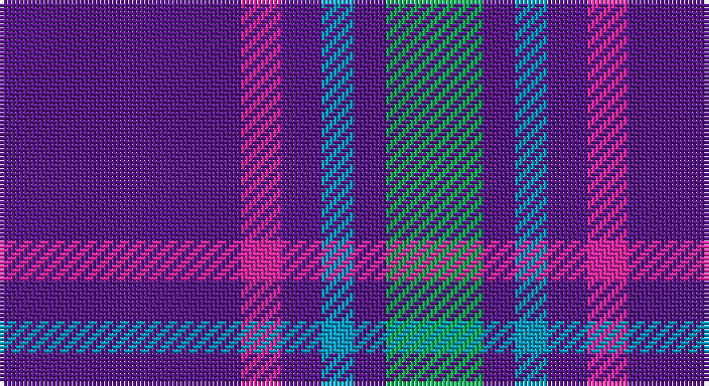

This page is one **sett** — a single exact thread-count. It belongs to the [tartan](/setts/dp30m5dp5t4dp4g12/)
(the same proportion at any scale), whose colour order is pattern [BRBBBG](/stripes/brbbbg/).

Sourced from register-of-tartans.  It is a [6 stripe tartan](/stripes/stripes6/).

Original link https://www.tartanregister.gov.uk/tartanDetails.aspx?ref=10057

## Register references

External register numbers recorded for this tartan.

- Scottish Register of Tartans: [10057](https://www.tartanregister.gov.uk/tartanDetails.aspx?ref=10057)

## Thread count
P/60 LR10 P10 Ba8 P8 B/24

One full sett is **156 threads**.

## Palette

Palette: <strong>custom</strong>
<table><thead><tr><th>Colour</th><th>Threads</th><th>Shade</th><th>Base</th><th>OKLCh</th></tr></thead><tbody><tr><td>P/</td><td style="text-align:right;font-variant-numeric:tabular-nums">60</td><td><code style="background-color:#59178A;">#59178A</code> <small style="color:#888">#59178A</small></td><td>B <code style="background-color:#2A418A;">#2A418A</code></td><td><small style="color:#888">oklch(38.0% 0.174 305.0)</small></td></tr><tr><td>LR</td><td style="text-align:right;font-variant-numeric:tabular-nums">10</td><td><code style="background-color:#E026A3;">#E026A3</code> <small style="color:#888">#E026A3</small></td><td>R <code style="background-color:#CC0000;">#CC0000</code></td><td><small style="color:#888">oklch(61.6% 0.241 345.8)</small></td></tr><tr><td>P</td><td style="text-align:right;font-variant-numeric:tabular-nums">10</td><td><code style="background-color:#59178A;">#59178A</code> <small style="color:#888">#59178A</small></td><td>B <code style="background-color:#2A418A;">#2A418A</code></td><td><small style="color:#888">oklch(38.0% 0.174 305.0)</small></td></tr><tr><td>Ba</td><td style="text-align:right;font-variant-numeric:tabular-nums">8</td><td><code style="background-color:#009EC7;">#009EC7</code> <small style="color:#888">#009EC7</small></td><td>B <code style="background-color:#2A418A;">#2A418A</code></td><td><small style="color:#888">oklch(65.0% 0.123 224.7)</small></td></tr><tr><td>P</td><td style="text-align:right;font-variant-numeric:tabular-nums">8</td><td><code style="background-color:#59178A;">#59178A</code> <small style="color:#888">#59178A</small></td><td>B <code style="background-color:#2A418A;">#2A418A</code></td><td><small style="color:#888">oklch(38.0% 0.174 305.0)</small></td></tr><tr><td>B/</td><td style="text-align:right;font-variant-numeric:tabular-nums">24</td><td><code style="background-color:#00B052;">#00B052</code> <small style="color:#888">#00B052</small></td><td>G <code style="background-color:#006100;">#006100</code></td><td><small style="color:#888">oklch(66.2% 0.181 150.2)</small></td></tr></tbody></table>

# Sample pattern

## Nearest tartans

The nearest existing variants by ΔTartan distance, with this tartan at the top so the swatches line up against it.

ΔTartan

Tartan

Sett

—

<a href="/ttd/edit/#slug=dp30m5dp5t4dp4g12~x2">International Festival of Authors</a> <a class="nn-out" href="/variants/s6/dp30m5dp5t4dp4g12~x2/" title="open its dictionary page">↗</a>

1.02

<a href="/ttd/edit/#slug=db8r1w1r1k1~x8&amp;base=dp30m5dp5t4dp4g12~x2">Laing of Archiestown</a> <a class="nn-out" href="/variants/s5/db8r1w1r1k1~x8/" title="open its dictionary page">↗</a>

1.06

<a href="/ttd/edit/#slug=dp30m5dp5b4dp4g12~x2&amp;base=dp30m5dp5t4dp4g12~x2">International Festival of Authors (C</a> <a class="nn-out" href="/variants/s6/dp30m5dp5b4dp4g12~x2/" title="open its dictionary page">↗</a>

1.17

<a href="/variants/s6/b30ly5b4r12~x4/">UEFA (Glasgow)</a>

1.30

<a href="/ttd/edit/#slug=db20b2w5r2db10b5db20b2w5r5~x2&amp;base=dp30m5dp5t4dp4g12~x2">Mortell (Personal)</a> <a class="nn-out" href="/variants/s10/db20b2w5r2db10b5db20b2w5r5~x2/" title="open its dictionary page">↗</a>

1.32

<a href="/ttd/edit/#slug=w1db8r3db2r1db2r3db8lo1~x4&amp;base=dp30m5dp5t4dp4g12~x2">Louisville Fire &amp; Rescue P&amp;D</a> <a class="nn-out" href="/variants/s9/w1db8r3db2r1db2r3db8lo1~x4/" title="open its dictionary page">↗</a>

1.34

<a href="/variants/s6/db60ly6db11r25~x2/">South Australian Pipes &amp; Drums (Corp</a>

1.38

<a href="/ttd/edit/#slug=b30ly5b4r12~x4&amp;base=dp30m5dp5t4dp4g12~x2">UEFA (Corporate)</a> <a class="nn-out" href="/variants/s4/b30ly5b4r12~x4/" title="open its dictionary page">↗</a>

1.44

<a href="/ttd/edit/#slug=db19r2w2r2k2~x4&amp;base=dp30m5dp5t4dp4g12~x2">Laing of Archiestown</a> <a class="nn-out" href="/variants/s5/db19r2w2r2k2~x4/" title="open its dictionary page">↗</a>

1.54

<a href="/ttd/edit/#slug=w2db15r3g3r3db1~x8&amp;base=dp30m5dp5t4dp4g12~x2">Lothian Buses (Corporate?)</a> <a class="nn-out" href="/variants/s6/w2db15r3g3r3db1~x8/" title="open its dictionary page">↗</a>

1.56

<a href="/ttd/edit/#slug=db30dp9g6dp9r4db17w5~x2&amp;base=dp30m5dp5t4dp4g12~x2">Woodcock (2014)</a> <a class="nn-out" href="/variants/s7/db30dp9g6dp9r4db17w5~x2/" title="open its dictionary page">↗</a>

## Neighbour map

Every grey dot is one of 14360 variants placed by the first two principal components of the ΔTartan feature space (44% of its variance). Red is this tartan; blue dots are its nearest — click one to open its page.

<svg viewBox="0 0 640 380" role="img" style="max-width:100%;height:auto;border:1px solid #e0e0e0;border-radius:4px;display:block" xmlns="http://www.w3.org/2000/svg"><image href="/nn/cloud.v1.png" width="640" height="380"/><a href="/variants/s5/db8r1w1r1k1~x8/"><circle cx="369.2" cy="199.8" r="4" fill="#3465a4"><title>Laing of Archiestown</title></circle></a><a href="/variants/s6/dp30m5dp5b4dp4g12~x2/"><circle cx="363.9" cy="210.5" r="4" fill="#3465a4"><title>International Festival of Authors (C</title></circle></a><a href="/variants/s6/b30ly5b4r12~x4/"><circle cx="346.0" cy="218.8" r="4" fill="#3465a4"><title>UEFA (Glasgow)</title></circle></a><a href="/variants/s10/db20b2w5r2db10b5db20b2w5r5~x2/"><circle cx="337.0" cy="187.4" r="4" fill="#3465a4"><title>Mortell (Personal)</title></circle></a><a href="/variants/s9/w1db8r3db2r1db2r3db8lo1~x4/"><circle cx="381.4" cy="208.2" r="4" fill="#3465a4"><title>Louisville Fire &amp; Rescue P&amp;D</title></circle></a><a href="/variants/s6/db60ly6db11r25~x2/"><circle cx="409.5" cy="215.7" r="4" fill="#3465a4"><title>South Australian Pipes &amp; Drums (Corp</title></circle></a><a href="/variants/s4/b30ly5b4r12~x4/"><circle cx="381.0" cy="251.8" r="4" fill="#3465a4"><title>UEFA (Corporate)</title></circle></a><a href="/variants/s5/db19r2w2r2k2~x4/"><circle cx="413.9" cy="194.3" r="4" fill="#3465a4"><title>Laing of Archiestown</title></circle></a><a href="/variants/s6/w2db15r3g3r3db1~x8/"><circle cx="341.2" cy="177.4" r="4" fill="#3465a4"><title>Lothian Buses (Corporate?)</title></circle></a><a href="/variants/s7/db30dp9g6dp9r4db17w5~x2/"><circle cx="281.7" cy="214.4" r="4" fill="#3465a4"><title>Woodcock (2014)</title></circle></a><circle cx="348.3" cy="211.4" r="5" fill="#c00000"/></svg>

ID: /variants/s6/dp30m5dp5t4dp4g12~x2/
