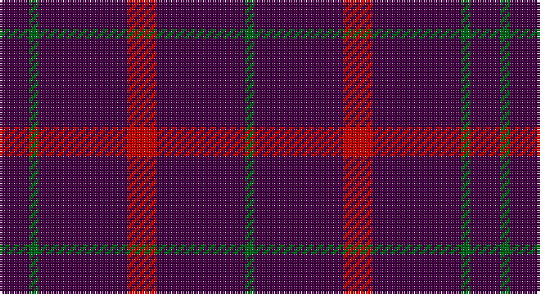

This page is one **sett** — a single exact thread-count. It belongs to the [tartan](/setts/dp3g1dp9r3/)
(the same proportion at any scale), whose colour order is pattern [BGBRBG](/stripes/bgbrbg/).

Part of the [Highland Spring](/tartans/highland-spring/) tartan — the named design grouping this sett with its other cloths.

Sourced from register-of-tartans.  It is a [6 stripe tartan](/stripes/stripes6/).

Original link https://www.tartanregister.gov.uk/tartanDetails.aspx?ref=1720

## Also known as

This cloth is also recorded under:

- Highland Spring Corporate Prom

## Register references

External register numbers recorded for this tartan.

- Scottish Register of Tartans: [1720](https://www.tartanregister.gov.uk/tartanDetails.aspx?ref=1720)
- Scottish Tartans Authority (ITI): 130
- Scottish Tartans World Register: 130

## Thread count
DP/12 G4 DP36 R12 DP36 G/4

One full sett is **192 threads**.

## Palette

Palette: <strong>Tartan Register</strong>
<table><thead><tr><th>Colour</th><th>Threads</th><th>Shade</th><th>Base</th><th>OKLCh</th></tr></thead><tbody><tr><td>DP/</td><td style="text-align:right;font-variant-numeric:tabular-nums">12</td><td><code style="background-color:#440044;">#440044</code> <small style="color:#888">#440044</small></td><td>B <code style="background-color:#2A418A;">#2A418A</code></td><td><small style="color:#888">oklch(27.1% 0.125 328.4)</small></td></tr><tr><td>G</td><td style="text-align:right;font-variant-numeric:tabular-nums">4</td><td><code style="background-color:#006818;">#006818</code> <small style="color:#888">#006818</small></td><td>G <code style="background-color:#006100;">#006100</code></td><td><small style="color:#888">oklch(45.0% 0.142 145.0)</small></td></tr><tr><td>DP</td><td style="text-align:right;font-variant-numeric:tabular-nums">36</td><td><code style="background-color:#440044;">#440044</code> <small style="color:#888">#440044</small></td><td>B <code style="background-color:#2A418A;">#2A418A</code></td><td><small style="color:#888">oklch(27.1% 0.125 328.4)</small></td></tr><tr><td>R</td><td style="text-align:right;font-variant-numeric:tabular-nums">12</td><td><code style="background-color:#C80000;">#C80000</code> <small style="color:#888">#C80000</small></td><td>R <code style="background-color:#CC0000;">#CC0000</code></td><td><small style="color:#888">oklch(52.3% 0.215 29.2)</small></td></tr><tr><td>DP</td><td style="text-align:right;font-variant-numeric:tabular-nums">36</td><td><code style="background-color:#440044;">#440044</code> <small style="color:#888">#440044</small></td><td>B <code style="background-color:#2A418A;">#2A418A</code></td><td><small style="color:#888">oklch(27.1% 0.125 328.4)</small></td></tr><tr><td>G/</td><td style="text-align:right;font-variant-numeric:tabular-nums">4</td><td><code style="background-color:#006818;">#006818</code> <small style="color:#888">#006818</small></td><td>G <code style="background-color:#006100;">#006100</code></td><td><small style="color:#888">oklch(45.0% 0.142 145.0)</small></td></tr></tbody></table>

# Sample pattern

## Nearest tartans

The nearest existing variants by ΔTartan distance, with this tartan at the top so the swatches line up against it.

ΔTartan

Tartan

Sett

—

<a href="/ttd/edit/#slug=dp3g1dp9r3~x4">Highland Spring (1988)</a> <a class="nn-out" href="/variants/s6/dp3g1dp9r3~x4/" title="open its dictionary page">↗</a>

1.26

<a href="/ttd/edit/#slug=dp3g1dp9r3~x4">Highland Spring (1988) (Corporate)</a> <a class="nn-out" href="/variants/s4/dp3g1dp9r3~x4/" title="open its dictionary page">↗</a>

1.88

<a href="/ttd/edit/#slug=dp5g2dp19r5~x2&amp;base=dp3g1dp9r3~x4">Highland Spring Corporate Tartan</a> <a class="nn-out" href="/variants/s4/dp5g2dp19r5~x2/" title="open its dictionary page">↗</a>

1.97

<a href="/ttd/edit/#slug=r5p19g3p5~x2&amp;base=dp3g1dp9r3~x4">Highland Spring</a> <a class="nn-out" href="/variants/s4/r5p19g3p5~x2/" title="open its dictionary page">↗</a>

2.08

<a href="/ttd/edit/#slug=r1db9lo2db9lo1~x4&amp;base=dp3g1dp9r3~x4">Brooks Brothers Tattersall Blue</a> <a class="nn-out" href="/variants/s5/r1db9lo2db9lo1~x4/" title="open its dictionary page">↗</a>

2.17

<a href="/ttd/edit/#slug=k10dp5k30dp5k10dp9~x4&amp;base=dp3g1dp9r3~x4">Leonard Hunting</a> <a class="nn-out" href="/variants/s6/k10dp5k30dp5k10dp9~x4/" title="open its dictionary page">↗</a>

2.27

<a href="/ttd/edit/#slug=r12dp3r7dp52dg4dp4~x2&amp;base=dp3g1dp9r3~x4">Lynch Variant</a> <a class="nn-out" href="/variants/s6/r12dp3r7dp52dg4dp4~x2/" title="open its dictionary page">↗</a>

2.32

<a href="/ttd/edit/#slug=db1r9db2r9lo1~x4&amp;base=dp3g1dp9r3~x4">Brooks Brothers Tattersall Red</a> <a class="nn-out" href="/variants/s5/db1r9db2r9lo1~x4/" title="open its dictionary page">↗</a>

2.32

<a href="/ttd/edit/#slug=k30dp5k10dp9~x4&amp;base=dp3g1dp9r3~x4">Leonard Hunting (Name)</a> <a class="nn-out" href="/variants/s4/k30dp5k10dp9~x4/" title="open its dictionary page">↗</a>

2.34

<a href="/ttd/edit/#slug=db10r1db10r2db10r1g2~x2&amp;base=dp3g1dp9r3~x4">Hebridean, (Old..)</a> <a class="nn-out" href="/variants/s7/db10r1db10r2db10r1g2~x2/" title="open its dictionary page">↗</a>

2.43

<a href="/ttd/edit/#slug=m18k3m2~x4&amp;base=dp3g1dp9r3~x4">Buie</a> <a class="nn-out" href="/variants/s3/m18k3m2~x4/" title="open its dictionary page">↗</a>

## Neighbour map

Every grey dot is one of 14360 variants placed by the first two principal components of the ΔTartan feature space (44% of its variance). Red is this tartan; blue dots are its nearest — click one to open its page.

<svg viewBox="0 0 640 380" role="img" style="max-width:100%;height:auto;border:1px solid #e0e0e0;border-radius:4px;display:block" xmlns="http://www.w3.org/2000/svg"><image href="/nn/cloud.v1.png" width="640" height="380"/><a href="/variants/s4/dp3g1dp9r3~x4/"><circle cx="501.3" cy="276.3" r="4" fill="#3465a4"><title>Highland Spring (1988) (Corporate)</title></circle></a><a href="/variants/s4/dp5g2dp19r5~x2/"><circle cx="560.6" cy="272.3" r="4" fill="#3465a4"><title>Highland Spring Corporate Tartan</title></circle></a><a href="/variants/s4/r5p19g3p5~x2/"><circle cx="500.4" cy="279.9" r="4" fill="#3465a4"><title>Highland Spring</title></circle></a><a href="/variants/s5/r1db9lo2db9lo1~x4/"><circle cx="543.1" cy="269.9" r="4" fill="#3465a4"><title>Brooks Brothers Tattersall Blue</title></circle></a><a href="/variants/s6/k10dp5k30dp5k10dp9~x4/"><circle cx="511.3" cy="319.8" r="4" fill="#3465a4"><title>Leonard Hunting</title></circle></a><a href="/variants/s6/r12dp3r7dp52dg4dp4~x2/"><circle cx="528.9" cy="190.8" r="4" fill="#3465a4"><title>Lynch Variant</title></circle></a><a href="/variants/s5/db1r9db2r9lo1~x4/"><circle cx="605.6" cy="274.2" r="4" fill="#3465a4"><title>Brooks Brothers Tattersall Red</title></circle></a><a href="/variants/s4/k30dp5k10dp9~x4/"><circle cx="530.3" cy="340.9" r="4" fill="#3465a4"><title>Leonard Hunting (Name)</title></circle></a><a href="/variants/s7/db10r1db10r2db10r1g2~x2/"><circle cx="577.9" cy="267.6" r="4" fill="#3465a4"><title>Hebridean, (Old..)</title></circle></a><a href="/variants/s3/m18k3m2~x4/"><circle cx="626.0" cy="281.8" r="4" fill="#3465a4"><title>Buie</title></circle></a><circle cx="550.9" cy="265.9" r="5" fill="#c00000"/></svg>

ID: /variants/s6/dp3g1dp9r3~x4/
