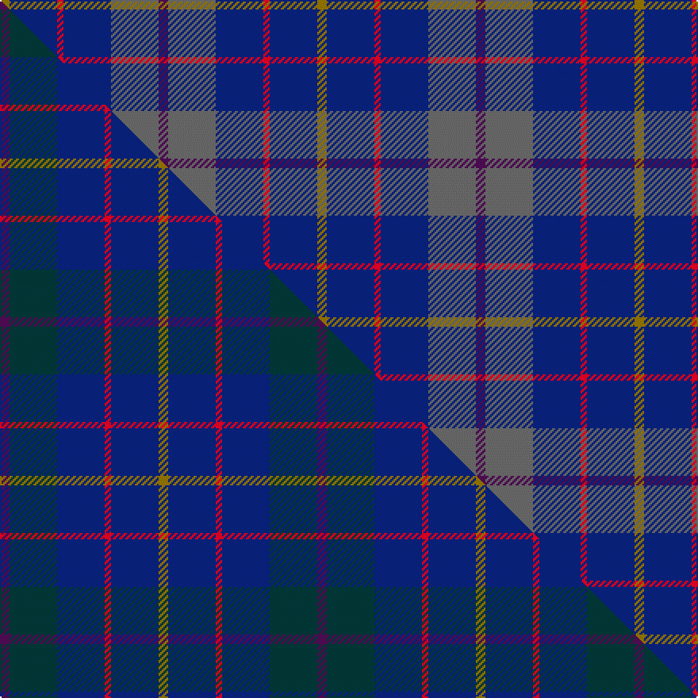

This page is one **sett** — a single exact thread-count. It belongs to the [tartan](/setts/dp3n15db15r2db15y3/)
(the same proportion at any scale), whose colour order is pattern [BBBRBG](/stripes/bbbrbg/).

Part of the [H.M.S. DUNCAN](/tartans/h-m-s-duncan/) tartan — the named design grouping this sett with its other cloths.

Sourced from tartans-authority.  It is a [6 stripe tartan](/stripes/stripes6/).

Original link http://www.tartansauthority.com/tartan-ferret/display/10268/

## Register references

External register numbers recorded for this tartan.

- Scottish Register of Tartans: [10268](https://www.tartanregister.gov.uk/tartanDetails?ref=10268)
- Scottish Tartans Authority (ITI): 10268

## Thread count
Y/6 DB30 R4 DB30 N30 DP/6

One full sett is **200 threads**.

## Palette
<table><thead><tr><th>Colour</th><th>Shade</th><th>OKLCh</th></tr></thead><tbody><tr><td>DB</td><td><code style="background-color:#082077;">#082077</code> <small style="color:#888">#082077</small></td><td><small style="color:#888">oklch(30.0% 0.149 265.1)</small></td></tr><tr><td>N</td><td><code style="background-color:#636363;">#636363</code> <small style="color:#888">#636363</small></td><td><small style="color:#888">oklch(50.0% 0.000 89.9)</small></td></tr><tr><td>DP</td><td><code style="background-color:#4B0B4F;">#4B0B4F</code> <small style="color:#888">#4B0B4F</small></td><td><small style="color:#888">oklch(30.1% 0.125 325.4)</small></td></tr><tr><td>R</td><td><code style="background-color:#D60020;">#D60020</code> <small style="color:#888">#D60020</small></td><td><small style="color:#888">oklch(55.2% 0.224 25.5)</small></td></tr><tr><td>Y</td><td><code style="background-color:#8B6E00;">#8B6E00</code> <small style="color:#888">#8B6E00</small></td><td><small style="color:#888">oklch(55.1% 0.113 90.4)</small></td></tr></tbody></table>

# Sample pattern

## Compared to the master

This cloth is one sett of its design; the master sett (the exemplar the design is anchored on) is below for comparison.

Its **ΔTartan distance** from the master is **1.63** — the same measure the nearest-tartans table ranks by (0 is identical; a re-scale of the same cloth is near 0, a recolour or a different proportion further).

<figure class="master-compare" style="margin:0">

this sett
master sett ★

<figcaption style="color:#888;font-size:smaller">One weave of this sett against the <a href="/setts/dp3dt15db15r2db15y3/">master sett ★</a>, split on the diagonal: a shared proportion runs seamlessly across it with only the shades shifting; a different proportion breaks on it.</figcaption>
</figure>

## Nearest tartan variants

The nearest existing variants by ΔTartan distance, with this cloth at the top so the swatches line up against it.

ΔTartan

Threads

Variant

Sett

—

200

<a href="/variants/s6/dp3n15db15r2db15y3~x2/">HMS Duncan (Military)</a>

<a href="/ttd/edit/#slug=dp3o15db15r2db15y3~x2~o2500000&amp;base=dp3n15db15r2db15y3~x2" title="compare in the TTD">0.00</a>

200

<a href="/variants/s6/dp3o15db15r2db15y3~x2~o2500000/">HMS Duncan Regimental Tartan</a>

<a href="/ttd/edit/#slug=db4r1db18n18lb1~x4&amp;base=dp3n15db15r2db15y3~x2" title="compare in the TTD">1.36</a>

316

<a href="/variants/s5/db4r1db18n18lb1~x4/">Ardee (Corporate)</a>

<a href="/ttd/edit/#slug=dp3dt15db15r2db15y3~x2&amp;base=dp3n15db15r2db15y3~x2" title="compare in the TTD">1.40</a>

200

<a href="/variants/s6/dp3dt15db15r2db15y3~x2/">H.M.S. DUNCAN</a>

<a href="/ttd/edit/#slug=dy34db27r3db27dy34w3~x2&amp;base=dp3n15db15r2db15y3~x2" title="compare in the TTD">2.04</a>

438

<a href="/variants/s6/dy34db27r3db27dy34w3~x2/">London Regiment</a>

<a href="/ttd/edit/#slug=db22n5dp9g14db10lo2~x2&amp;base=dp3n15db15r2db15y3~x2" title="compare in the TTD">2.18</a>

200

<a href="/variants/s6/db22n5dp9g14db10lo2~x2/">Belfrage (Name)</a>

<a href="/ttd/edit/#slug=db30y3dy11y3n33r6~x2&amp;base=dp3n15db15r2db15y3~x2" title="compare in the TTD">2.38</a>

272

<a href="/variants/s6/db30y3dy11y3n33r6~x2/">Balfour</a>

<a href="/ttd/edit/#slug=r2db13dr3db3dr16lb2~x4&amp;base=dp3n15db15r2db15y3~x2" title="compare in the TTD">2.53</a>

296

<a href="/variants/s6/r2db13dr3db3dr16lb2~x4/">MacArthur-Fox Dress Personal Tartan</a>

<a href="/ttd/edit/#slug=dp10y3dp8db42g5n5~x2&amp;base=dp3n15db15r2db15y3~x2" title="compare in the TTD">2.55</a>

262

<a href="/variants/s6/dp10y3dp8db42g5n5~x2/">Cheadle (Personal)</a>

<a href="/ttd/edit/#slug=dp30db30n4db4n4db5r6~x2&amp;base=dp3n15db15r2db15y3~x2" title="compare in the TTD">2.60</a>

260

<a href="/variants/s7/dp30db30n4db4n4db5r6~x2/">Komissarov, Dmitry (Personal)</a>

<a href="/ttd/edit/#slug=db30dp9g6dp9r4db17w5~x2&amp;base=dp3n15db15r2db15y3~x2" title="compare in the TTD">2.61</a>

250

<a href="/variants/s7/db30dp9g6dp9r4db17w5~x2/">Woodcock (2014)</a>

## Neighbour map

Every grey dot is one of 13620 variants placed by the first two principal components of the ΔTartan feature space (42% of its variance). Red is this tartan; blue dots are its nearest — click one to open its page.

<svg viewBox="0 0 640 380" role="img" style="max-width:100%;height:auto;border:1px solid #e0e0e0;border-radius:4px;display:block" xmlns="http://www.w3.org/2000/svg"><image href="/nn/cloud.v1.png" width="640" height="380"/><a href="/variants/s6/dp3o15db15r2db15y3~x2~o2500000/"><circle cx="302.1" cy="232.7" r="4" fill="#3465a4"><title>HMS Duncan Regimental Tartan</title></circle></a><a href="/variants/s5/db4r1db18n18lb1~x4/"><circle cx="415.9" cy="217.1" r="4" fill="#3465a4"><title>Ardee (Corporate)</title></circle></a><a href="/variants/s6/dp3dt15db15r2db15y3~x2/"><circle cx="397.0" cy="268.1" r="4" fill="#3465a4"><title>H.M.S. DUNCAN</title></circle></a><a href="/variants/s6/dy34db27r3db27dy34w3~x2/"><circle cx="378.0" cy="255.8" r="4" fill="#3465a4"><title>London Regiment</title></circle></a><a href="/variants/s6/db22n5dp9g14db10lo2~x2/"><circle cx="291.5" cy="245.0" r="4" fill="#3465a4"><title>Belfrage (Name)</title></circle></a><a href="/variants/s6/db30y3dy11y3n33r6~x2/"><circle cx="278.1" cy="223.4" r="4" fill="#3465a4"><title>Balfour</title></circle></a><a href="/variants/s6/r2db13dr3db3dr16lb2~x4/"><circle cx="335.0" cy="231.8" r="4" fill="#3465a4"><title>MacArthur-Fox Dress Personal Tartan</title></circle></a><a href="/variants/s6/dp10y3dp8db42g5n5~x2/"><circle cx="438.3" cy="214.0" r="4" fill="#3465a4"><title>Cheadle (Personal)</title></circle></a><a href="/variants/s7/dp30db30n4db4n4db5r6~x2/"><circle cx="380.6" cy="246.6" r="4" fill="#3465a4"><title>Komissarov, Dmitry (Personal)</title></circle></a><a href="/variants/s7/db30dp9g6dp9r4db17w5~x2/"><circle cx="291.9" cy="215.2" r="4" fill="#3465a4"><title>Woodcock (2014)</title></circle></a><circle cx="351.9" cy="250.0" r="5" fill="#c00000"/><text x="320" y="376" text-anchor="middle" font-size="11" fill="#999">ground</text><text x="11" y="190" text-anchor="middle" font-size="11" fill="#999" transform="rotate(-90 11 190)">complexity</text></svg>

ID: /variants/s6/dp3n15db15r2db15y3~x2/
