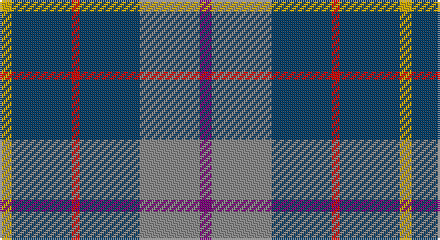

This page is one **sett** — a single exact thread-count. It belongs to the [tartan](/setts/dp3o15dt15r2dt15ly3/)
(the same proportion at any scale), whose colour order is pattern [BRBRBY](/stripes/brbrby/).

Sourced from tartans-authority.  It is a [6 stripe tartan](/stripes/stripes6/).

Original link http://www.tartansauthority.com/tartan-ferret/display/10268/

## Provenance

Earliest known date: 2010 Designed and manufactured at Johnstons of Elgin, the tartan was commissioned by the Royal Navy to commemorate the launch of the H.M.S. Duncan, the last type 45 destroyer to be build on the Clyde. The ship has been named after Admiral Duncan who was victorious at the Battle of Camperdown in October 1797. This date is also significant to Johnstons, who were founded in 1797 by Alexander Johnston at Newmill, Elgin. The tartan is based on the Duncan sett and incorporates navy blue, battleship grey, red and gold from the Duncan crest and purple from Scotland's national flower. Only to be worn with authorisation from H.M.S. Duncan. Right to weave reserved to Johnstons of Elgin or by authorisation.

## Also known as

This cloth is also recorded under:

- H.M.S. DUNCAN
- HMS Duncan Regimental

2 attestations — the source records this cloth was collapsed from (oldest owns this page)

<ul>
<li>19th Aug. 2010 — HMS Duncan (Military) (tartans-authority, <a href="http://www.tartansauthority.com/tartan-ferret/display/10268/">record</a>)</li>
<li>undated — HMS Duncan Regimental Tartan (house-of-tartan, <a href="http://www.house-of-tartan.scotland.net/house/TartanViewjs.asp?colr=Def&tnam=10268">record</a>)</li>
</ul>

## Register references

External register numbers recorded for this tartan.

- Scottish Register of Tartans: [10268](https://www.tartanregister.gov.uk/tartanDetails?ref=10268)
- Scottish Tartans Authority (ITI): 10268

## Thread count
Y/6 DB30 R4 DB30 N30 P/6

One full sett is **200 threads**.

## Palette

Palette: <strong>Tartan Register</strong> <small style="color:#888">(4 of 5 colours)</small>
<table><thead><tr><th>Colour</th><th>Threads</th><th>Shade</th><th>Base</th><th>OKLCh</th></tr></thead><tbody><tr><td>Y/</td><td style="text-align:right;font-variant-numeric:tabular-nums">6</td><td><code style="background-color:#CCA800;">#CCA800</code> <small style="color:#888">#CCA800</small></td><td>Y <code style="background-color:#F2BF00;">#F2BF00</code></td><td><small style="color:#888">oklch(74.2% 0.152 93.4)</small></td></tr><tr><td>DB</td><td style="text-align:right;font-variant-numeric:tabular-nums">30</td><td><code style="background-color:#003C64;">#003C64</code> <small style="color:#888">#003C64</small></td><td>B <code style="background-color:#2A418A;">#2A418A</code></td><td><small style="color:#888">oklch(34.5% 0.089 246.0)</small></td></tr><tr><td>R</td><td style="text-align:right;font-variant-numeric:tabular-nums">4</td><td><code style="background-color:#C80000;">#C80000</code> <small style="color:#888">#C80000</small></td><td>R <code style="background-color:#CC0000;">#CC0000</code></td><td><small style="color:#888">oklch(52.3% 0.215 29.2)</small></td></tr><tr><td>DB</td><td style="text-align:right;font-variant-numeric:tabular-nums">30</td><td><code style="background-color:#003C64;">#003C64</code> <small style="color:#888">#003C64</small></td><td>B <code style="background-color:#2A418A;">#2A418A</code></td><td><small style="color:#888">oklch(34.5% 0.089 246.0)</small></td></tr><tr><td>N</td><td style="text-align:right;font-variant-numeric:tabular-nums">30</td><td><code style="background-color:#888888;">#888888</code> <small style="color:#888">#888888</small></td><td>R <code style="background-color:#CC0000;">#CC0000</code></td><td><small style="color:#888">oklch(62.7% 0.000 89.9)</small></td></tr><tr><td>P/</td><td style="text-align:right;font-variant-numeric:tabular-nums">6</td><td><code style="background-color:#780078;">#780078</code> <small style="color:#888">#780078</small></td><td>B <code style="background-color:#2A418A;">#2A418A</code></td><td><small style="color:#888">oklch(40.2% 0.185 328.4)</small></td></tr></tbody></table>

# Sample pattern

## Nearest tartans

The nearest existing variants by ΔTartan distance, with this tartan at the top so the swatches line up against it.

ΔTartan

Tartan

Sett

—

<a href="/ttd/edit/#slug=dp3o15dt15r2dt15ly3~x2">HMS Duncan (Military)</a> <a class="nn-out" href="/variants/s6/dp3o15dt15r2dt15ly3~x2/" title="open its dictionary page">↗</a>

0.93

<a href="/ttd/edit/#slug=db11w2db11k4dg8r1~x2&amp;base=dp3o15dt15r2dt15ly3~x2">Dalmeny #2</a> <a class="nn-out" href="/variants/s6/db11w2db11k4dg8r1~x2/" title="open its dictionary page">↗</a>

1.12

<a href="/ttd/edit/#slug=db36r4db6g18db15k18w4~x2&amp;base=dp3o15dt15r2dt15ly3~x2">Grainger (Name)</a> <a class="nn-out" href="/variants/s7/db36r4db6g18db15k18w4~x2/" title="open its dictionary page">↗</a>

1.13

<a href="/ttd/edit/#slug=w1db6dy5k1db6ly1~x4&amp;base=dp3o15dt15r2dt15ly3~x2">Ancient Atlantic</a> <a class="nn-out" href="/variants/s6/w1db6dy5k1db6ly1~x4/" title="open its dictionary page">↗</a>

1.15

<a href="/ttd/edit/#slug=y8do2y13r4y12db22y5o3~x2&amp;base=dp3o15dt15r2dt15ly3~x2">Kildare, County (District)</a> <a class="nn-out" href="/variants/s8/y8do2y13r4y12db22y5o3~x2/" title="open its dictionary page">↗</a>

1.32

<a href="/ttd/edit/#slug=dg1r1db6ly1db6dg6r1db1~x2&amp;base=dp3o15dt15r2dt15ly3~x2">MacHardy</a> <a class="nn-out" href="/variants/s8/dg1r1db6ly1db6dg6r1db1~x2/" title="open its dictionary page">↗</a>

1.34

<a href="/ttd/edit/#slug=db6r3g26db26w4db26r5g5~x2&amp;base=dp3o15dt15r2dt15ly3~x2">MacHardy, Blue</a> <a class="nn-out" href="/variants/s8/db6r3g26db26w4db26r5g5~x2/" title="open its dictionary page">↗</a>

1.37

<a href="/ttd/edit/#slug=w4g28db18r4db18ly3~x2&amp;base=dp3o15dt15r2dt15ly3~x2">MacIntyre, Inglis</a> <a class="nn-out" href="/variants/s6/w4g28db18r4db18ly3~x2/" title="open its dictionary page">↗</a>

1.40

<a href="/ttd/edit/#slug=db2o10db1o1db10r1db10g10w2~x2&amp;base=dp3o15dt15r2dt15ly3~x2">American Soc.of Travel Agents (Corp)</a> <a class="nn-out" href="/variants/s9/db2o10db1o1db10r1db10g10w2~x2/" title="open its dictionary page">↗</a>

1.42

<a href="/ttd/edit/#slug=db1r1g6db6ly1db6r1g1~x2&amp;base=dp3o15dt15r2dt15ly3~x2">MacHardy</a> <a class="nn-out" href="/variants/s8/db1r1g6db6ly1db6r1g1~x2/" title="open its dictionary page">↗</a>

1.42

<a href="/ttd/edit/#slug=g6b1g7w1b7r1~x4&amp;base=dp3o15dt15r2dt15ly3~x2">Norris (1957)</a> <a class="nn-out" href="/variants/s6/g6b1g7w1b7r1~x4/" title="open its dictionary page">↗</a>

## Neighbour map

Every grey dot is one of 14360 variants placed by the first two principal components of the ΔTartan feature space (44% of its variance). Red is this tartan; blue dots are its nearest — click one to open its page.

<svg viewBox="0 0 640 380" role="img" style="max-width:100%;height:auto;border:1px solid #e0e0e0;border-radius:4px;display:block" xmlns="http://www.w3.org/2000/svg"><image href="/nn/cloud.v1.png" width="640" height="380"/><a href="/variants/s6/db11w2db11k4dg8r1~x2/"><circle cx="302.5" cy="230.6" r="4" fill="#3465a4"><title>Dalmeny #2</title></circle></a><a href="/variants/s7/db36r4db6g18db15k18w4~x2/"><circle cx="263.7" cy="214.6" r="4" fill="#3465a4"><title>Grainger (Name)</title></circle></a><a href="/variants/s6/w1db6dy5k1db6ly1~x4/"><circle cx="271.4" cy="230.4" r="4" fill="#3465a4"><title>Ancient Atlantic</title></circle></a><a href="/variants/s8/y8do2y13r4y12db22y5o3~x2/"><circle cx="302.3" cy="207.9" r="4" fill="#3465a4"><title>Kildare, County (District)</title></circle></a><a href="/variants/s8/dg1r1db6ly1db6dg6r1db1~x2/"><circle cx="309.7" cy="239.8" r="4" fill="#3465a4"><title>MacHardy</title></circle></a><a href="/variants/s8/db6r3g26db26w4db26r5g5~x2/"><circle cx="303.1" cy="215.9" r="4" fill="#3465a4"><title>MacHardy, Blue</title></circle></a><a href="/variants/s6/w4g28db18r4db18ly3~x2/"><circle cx="223.6" cy="207.3" r="4" fill="#3465a4"><title>MacIntyre, Inglis</title></circle></a><a href="/variants/s9/db2o10db1o1db10r1db10g10w2~x2/"><circle cx="231.9" cy="188.6" r="4" fill="#3465a4"><title>American Soc.of Travel Agents (Corp)</title></circle></a><a href="/variants/s8/db1r1g6db6ly1db6r1g1~x2/"><circle cx="291.2" cy="229.6" r="4" fill="#3465a4"><title>MacHardy</title></circle></a><a href="/variants/s6/g6b1g7w1b7r1~x4/"><circle cx="311.8" cy="250.5" r="4" fill="#3465a4"><title>Norris (1957)</title></circle></a><circle cx="278.9" cy="232.6" r="5" fill="#c00000"/></svg>

ID: /variants/s6/dp3o15dt15r2dt15ly3~x2/
