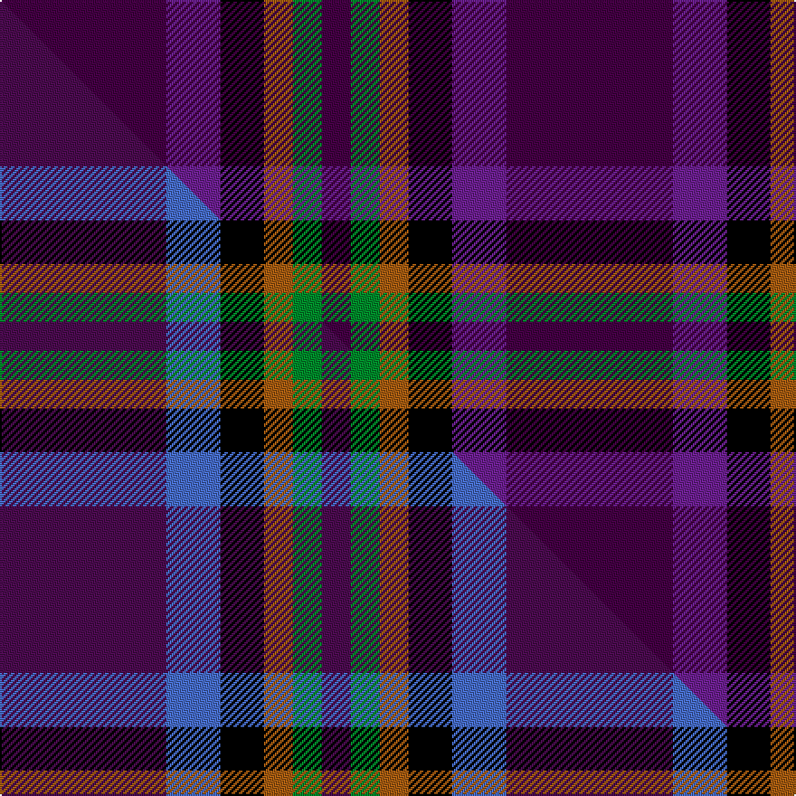

This is one **variant** — a specific cloth: this exact thread count and colourway, with its own
provenance below. It is one weaving of the [sett](/setts/dp46dpi15k12o8g8dp8/) (the scale-free proportion — the
same cloth at any scale or shade), whose colour order is pattern [BBKRGB](/stripes/bbkrgb/).

Part of the [Haut](/tartans/haut-2/) tartan — the named design grouping this sett with its other cloths.

Sourced from house-of-tartan.  It is a [6 stripe tartan](/stripes/stripes6/).

Original link [http://www.house-of-tartan.scotland.net/house/TartanViewjs.asp?colr=Def&tnam=10389](http://www.house-of-tartan.scotland.net/house/TartanViewjs.asp?colr=Def&tnam=10389)

## Provenance

Earliest known date: 1st March 2011 Designed for the Haut family living in Liff by Dundee to celebrate their German and Irish roots and the Scottish identity of their children.

Dataset <small>— provenance for this record, inherited from the source manifest</small>

<dl class="dataset-prov">
<dt>source</dt><dd><a href="/sources/house-of-tartan/">House of Tartan</a></dd>
<dt>data captured from</dt><dd><a href="https://github.com/thetartan/tartan-database/blob/master/data/house-of-tartan/data.csv">https://github.com/thetartan/tartan-database/blob/master/data/house-of-tartan/data.csv</a></dd>
<dt>data date</dt><dd>2017-01-10 <small>(dataset default)</small></dd>
<dt>licence</dt><dd><a href="https://creativecommons.org/licenses/by-nc-nd/4.0/">CC BY-NC-ND 4.0</a></dd>
</dl>

Capture chain <small>— the hands this data passed through, oldest first; each capture carries its own licence</small>

<ol class="capture-chain">
<li><a href="http://www.house-of-tartan.scotland.net/">House of Tartan</a> <small>the weaver/retailer's database — the site is now offline; the URL is kept as the ultimate source's identity</small></li>
<li><a href="https://github.com/thetartan/tartan-database">thetartan/tartan-database</a> <small>2016-2017</small> · <a href="https://creativecommons.org/licenses/by-nc-nd/4.0/">CC BY-NC-ND 4.0</a> <small>Levko Kravets's frozen compilation — the capture we vendored, and where its CC licence text came from</small></li>
<li>this dictionary <small>captured 2026-06-10 · commit 5bf86c7566</small> <small>each re-capture is a git commit to data/sources</small></li>
</ol>

## Thread count
DP/92 DPi30 K24 O16 G16 DP/16

One full sett is **280 threads**.

## Palette
<table><thead><tr><th>Colour</th><th>Shade</th><th>OKLCh</th></tr></thead><tbody><tr><td>DP</td><td><code style="background-color:#440044;">#440044</code> <small style="color:#888">#440044</small></td><td><small style="color:#888">oklch(27.1% 0.125 328.4)</small></td></tr><tr><td>G</td><td><code style="background-color:#008B2A;">#008B2A</code> <small style="color:#888">#008B2A</small></td><td><small style="color:#888">oklch(55.4% 0.170 145.9)</small></td></tr><tr><td>K</td><td><code style="background-color:#000000;">#000000</code> <small style="color:#888">#000000</small></td><td><small style="color:#888">oklch(0.0% 0.000 0.0)</small></td></tr><tr><td>O</td><td><code style="background-color:#A65C11;">#A65C11</code> <small style="color:#888">#A65C11</small></td><td><small style="color:#888">oklch(55.0% 0.125 58.3)</small></td></tr><tr><td>N</td><td><code style="background-color:#636363;">#636363</code> <small style="color:#888">#636363</small></td><td><small style="color:#888">oklch(50.0% 0.000 89.9)</small></td></tr><tr><td>DP</td><td><code style="background-color:#780078;">#780078</code> <small style="color:#888">#780078</small></td><td><small style="color:#888">oklch(40.2% 0.185 328.4)</small></td></tr><tr><td>DP</td><td><code style="background-color:#6C2090;">#6C2090</code> <small style="color:#888">#6C2090</small></td><td><small style="color:#888">oklch(41.9% 0.176 312.0)</small></td></tr></tbody></table>

# Sample pattern

## Compared to the master

This cloth is one sett of its design; the master sett (the exemplar the design is anchored on) is below for comparison.

Its **ΔTartan distance** from the master is **1.40** — the same measure the nearest-tartans table ranks by (0 is identical; a re-scale of the same cloth is near 0, a recolour or a different proportion further).

<figure class="master-compare" style="margin:0">

this sett
master sett ★

<figcaption style="color:#888;font-size:smaller">One weave of this sett against the <a href="/setts/dp46b15k12o8g8dp8/">master sett ★</a>, split on the diagonal: a shared proportion runs seamlessly across it with only the shades shifting; a different proportion breaks on it.</figcaption>
</figure>

## Nearest tartan variants

The nearest existing variants by ΔTartan distance, with this cloth at the top so the swatches line up against it.

ΔTartan

Threads

Variant

Sett

—

280

<a href="/variants/s6/dp46dpi15k12o8g8dp8~x2~dp1105325-dpi1707311/">Haut Name Tartan</a>

<a href="/ttd/edit/#slug=dp46b15k12o8g8dp8~x2&amp;base=dp46dpi15k12o8g8dp8~x2~dp1105325-dpi1707311" title="compare in the TTD">1.40</a>

280

<a href="/variants/s6/dp46b15k12o8g8dp8~x2/">Haut (Personal)</a>

<a href="/ttd/edit/#slug=dp5r3dp18g8k8dpi31k2dpi4~x2~dp1005325-dpi1505337&amp;base=dp46dpi15k12o8g8dp8~x2~dp1105325-dpi1707311" title="compare in the TTD">2.88</a>

298

<a href="/variants/s8/dp5r3dp18g8k8dpi31k2dpi4~x2~dp1005325-dpi1505337/">By Storm</a>

<a href="/ttd/edit/#slug=dp30m5dp5b4dp4g12~x2~m2609322-b2306275&amp;base=dp46dpi15k12o8g8dp8~x2~dp1105325-dpi1707311" title="compare in the TTD">2.97</a>

156

<a href="/variants/s6/dp30m5dp5b4dp4g12~x2~m2609322-b2306275/">International Festival of Authors (C</a>

<a href="/ttd/edit/#slug=k3r11db26dy11lo3~x2&amp;base=dp46dpi15k12o8g8dp8~x2~dp1105325-dpi1707311" title="compare in the TTD">3.09</a>

204

<a href="/variants/s5/k3r11db26dy11lo3~x2/">Novotel, The</a>

<a href="/ttd/edit/#slug=y1db6k1dy5db6w1~x4~db1406275-dy1603076&amp;base=dp46dpi15k12o8g8dp8~x2~dp1105325-dpi1707311" title="compare in the TTD">3.47</a>

152

<a href="/variants/s6/y1db6k1dy5db6w1~x4~db1406275-dy1603076/">Ancient Atlantic</a>

<a href="/ttd/edit/#slug=k4r5k4dp28k4g5k4~x2&amp;base=dp46dpi15k12o8g8dp8~x2~dp1105325-dpi1707311" title="compare in the TTD">3.50</a>

200

<a href="/variants/s7/k4r5k4dp28k4g5k4~x2/">Montgomrie/Montgomery of Eglinton</a>

<a href="/ttd/edit/#slug=dp18g24k3db6dp2db5dp18~x2&amp;base=dp46dpi15k12o8g8dp8~x2~dp1105325-dpi1707311" title="compare in the TTD">3.54</a>

232

<a href="/variants/s7/dp18g24k3db6dp2db5dp18~x2/">Saorsa</a>

<a href="/ttd/edit/#slug=dp12r8k64dp75r8&amp;base=dp46dpi15k12o8g8dp8~x2~dp1105325-dpi1707311" title="compare in the TTD">3.64</a>

314

<a href="/variants/s5/dp12r8k64dp75r8/">Laurel Cadre, The</a>

<a href="/ttd/edit/#slug=dp46k6g9lo9r4&amp;base=dp46dpi15k12o8g8dp8~x2~dp1105325-dpi1707311" title="compare in the TTD">3.72</a>

98

<a href="/variants/s5/dp46k6g9lo9r4/">Ayllu Thuban (Corporate)</a>

<a href="/ttd/edit/#slug=dp20lb8g8db8dp33r3~x2&amp;base=dp46dpi15k12o8g8dp8~x2~dp1105325-dpi1707311" title="compare in the TTD">3.84</a>

274

<a href="/variants/s6/dp20lb8g8db8dp33r3~x2/">McIntosh, Stuart (Personal)</a>

## Neighbour map

Every grey dot is one of 13621 variants placed by the first two principal components of the ΔTartan feature space (42% of its variance). Red is this tartan; blue dots are its nearest — click one to open its page.

<svg viewBox="0 0 640 380" role="img" style="max-width:100%;height:auto;border:1px solid #e0e0e0;border-radius:4px;display:block" xmlns="http://www.w3.org/2000/svg"><image href="/nn/cloud.v1.png" width="640" height="380"/><a href="/variants/s6/dp46b15k12o8g8dp8~x2/"><circle cx="245.6" cy="201.5" r="4" fill="#3465a4"><title>Haut (Personal)</title></circle></a><a href="/variants/s8/dp5r3dp18g8k8dpi31k2dpi4~x2~dp1005325-dpi1505337/"><circle cx="257.2" cy="159.2" r="4" fill="#3465a4"><title>By Storm</title></circle></a><a href="/variants/s6/dp30m5dp5b4dp4g12~x2~m2609322-b2306275/"><circle cx="378.8" cy="215.7" r="4" fill="#3465a4"><title>International Festival of Authors (C</title></circle></a><a href="/variants/s5/k3r11db26dy11lo3~x2/"><circle cx="212.5" cy="199.6" r="4" fill="#3465a4"><title>Novotel, The</title></circle></a><a href="/variants/s6/y1db6k1dy5db6w1~x4~db1406275-dy1603076/"><circle cx="282.8" cy="221.0" r="4" fill="#3465a4"><title>Ancient Atlantic</title></circle></a><a href="/variants/s7/k4r5k4dp28k4g5k4~x2/"><circle cx="254.1" cy="175.5" r="4" fill="#3465a4"><title>Montgomrie/Montgomery of Eglinton</title></circle></a><a href="/variants/s7/dp18g24k3db6dp2db5dp18~x2/"><circle cx="266.7" cy="199.7" r="4" fill="#3465a4"><title>Saorsa</title></circle></a><a href="/variants/s5/dp12r8k64dp75r8/"><circle cx="316.3" cy="211.1" r="4" fill="#3465a4"><title>Laurel Cadre, The</title></circle></a><a href="/variants/s5/dp46k6g9lo9r4/"><circle cx="308.0" cy="158.1" r="4" fill="#3465a4"><title>Ayllu Thuban (Corporate)</title></circle></a><a href="/variants/s6/dp20lb8g8db8dp33r3~x2/"><circle cx="362.0" cy="201.1" r="4" fill="#3465a4"><title>McIntosh, Stuart (Personal)</title></circle></a><circle cx="263.8" cy="204.8" r="5" fill="#c00000"/><text x="320" y="376" text-anchor="middle" font-size="11" fill="#999">ground</text><text x="11" y="190" text-anchor="middle" font-size="11" fill="#999" transform="rotate(-90 11 190)">complexity</text></svg>

ID: /variants/s6/dp46dpi15k12o8g8dp8~x2~dp1105325-dpi1707311/
