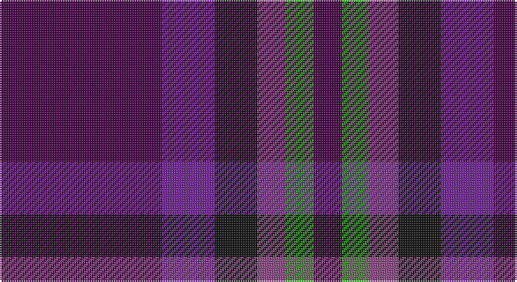

This page is one **sett** — a single exact thread-count. It belongs to the [tartan](/setts/dp46dpi15k12p8g8dp8/)
(the same proportion at any scale), whose colour order is pattern [BBKBGB](/stripes/bbkbgb/).

Part of the [Haut](/tartans/haut/) tartan — the named design grouping this sett with its other cloths.

Sourced from house-of-tartan.  It is a [6 stripe tartan](/stripes/stripes6/).

Original link http://www.house-of-tartan.scotland.net/house/TartanViewjs.asp?colr=Def&tnam=10389

## Provenance

Earliest known date: 1st March 2011 Designed for the Haut family living in Liff by Dundee to celebrate their German and Irish roots and the Scottish identity of their children.

## Also known as

This cloth is also recorded under:

- Haut Family

## Thread count
DP/92 Pa30 K24 LP16 G16 DP/16

One full sett is **280 threads**.

## Palette

Palette: <strong>Tartan Register</strong> <small style="color:#888">(4 of 7 colours)</small>
<table><thead><tr><th>Colour</th><th>Threads</th><th>Shade</th><th>Base</th><th>OKLCh</th></tr></thead><tbody><tr><td>DP/</td><td style="text-align:right;font-variant-numeric:tabular-nums">92</td><td><code style="background-color:#440044;">#440044</code> <small style="color:#888">#440044</small></td><td>B <code style="background-color:#2A418A;">#2A418A</code></td><td><small style="color:#888">oklch(27.1% 0.125 328.4)</small></td></tr><tr><td>Pa</td><td style="text-align:right;font-variant-numeric:tabular-nums">30</td><td><code style="background-color:#6C2090;">#6C2090</code> <small style="color:#888">#6C2090</small></td><td>B <code style="background-color:#2A418A;">#2A418A</code></td><td><small style="color:#888">oklch(41.9% 0.176 312.0)</small></td></tr><tr><td>K</td><td style="text-align:right;font-variant-numeric:tabular-nums">24</td><td><code style="background-color:#101010;">#101010</code> <small style="color:#888">#101010</small></td><td>K <code style="background-color:#000000;">#000000</code></td><td><small style="color:#888">oklch(17.3% 0.000 89.9)</small></td></tr><tr><td>LP</td><td style="text-align:right;font-variant-numeric:tabular-nums">16</td><td><code style="background-color:#884480;">#884480</code> <small style="color:#888">#884480</small></td><td>B <code style="background-color:#2A418A;">#2A418A</code></td><td><small style="color:#888">oklch(49.4% 0.122 331.8)</small></td></tr><tr><td>G</td><td style="text-align:right;font-variant-numeric:tabular-nums">16</td><td><code style="background-color:#289C18;">#289C18</code> <small style="color:#888">#289C18</small></td><td>G <code style="background-color:#006100;">#006100</code></td><td><small style="color:#888">oklch(60.6% 0.191 141.6)</small></td></tr><tr><td>DP/</td><td style="text-align:right;font-variant-numeric:tabular-nums">16</td><td><code style="background-color:#440044;">#440044</code> <small style="color:#888">#440044</small></td><td>B <code style="background-color:#2A418A;">#2A418A</code></td><td><small style="color:#888">oklch(27.1% 0.125 328.4)</small></td></tr></tbody></table>

# Sample pattern

## Compared to the master

This cloth is one sett of its design; the master sett (the exemplar the design is anchored on) is below for comparison.

<figure style="margin:0"><figcaption style="color:#888;font-size:smaller">this sett</figcaption></figure>
<figure style="margin:0"><figcaption style="color:#888;font-size:smaller"><a href="/setts/dt46dpi15k12n8g8dp8/">master sett →</a></figcaption></figure>

## Nearest tartans

The nearest existing variants by ΔTartan distance, with this tartan at the top so the swatches line up against it.

ΔTartan

Tartan

Sett

—

<a href="/ttd/edit/#slug=dp46dpi15k12p8g8dp8~x2">Haut Name Tartan</a> <a class="nn-out" href="/variants/s6/dp46dpi15k12p8g8dp8~x2/" title="open its dictionary page">↗</a>

1.33

<a href="/ttd/edit/#slug=dp46p15k12m8g8dp8~x2&amp;base=dp46dpi15k12p8g8dp8~x2">Haut (Personal)</a> <a class="nn-out" href="/variants/s6/dp46p15k12m8g8dp8~x2/" title="open its dictionary page">↗</a>

1.45

<a href="/ttd/edit/#slug=dp30db30y4db4y4db5r6~x2&amp;base=dp46dpi15k12p8g8dp8~x2">Komissarov, Dmitry (Personal)</a> <a class="nn-out" href="/variants/s7/dp30db30y4db4y4db5r6~x2/" title="open its dictionary page">↗</a>

1.51

<a href="/ttd/edit/#slug=k4r5k4dp28k4g5k4~x2&amp;base=dp46dpi15k12p8g8dp8~x2">Montgomrie/Montgomery of Eglinton</a> <a class="nn-out" href="/variants/s7/k4r5k4dp28k4g5k4~x2/" title="open its dictionary page">↗</a>

1.66

<a href="/ttd/edit/#slug=dp22lo10dp6lr18dp50db71k6&amp;base=dp46dpi15k12p8g8dp8~x2">Charleston Police Department</a> <a class="nn-out" href="/variants/s7/dp22lo10dp6lr18dp50db71k6/" title="open its dictionary page">↗</a>

1.84

<a href="/ttd/edit/#slug=db30dp9g6dp9r4db17w5~x2&amp;base=dp46dpi15k12p8g8dp8~x2">Woodcock (2014)</a> <a class="nn-out" href="/variants/s7/db30dp9g6dp9r4db17w5~x2/" title="open its dictionary page">↗</a>

1.87

<a href="/ttd/edit/#slug=r2db13ri3db3ri16t2~x4&amp;base=dp46dpi15k12p8g8dp8~x2">MacArthur-Fox, dress</a> <a class="nn-out" href="/variants/s6/r2db13ri3db3ri16t2~x4/" title="open its dictionary page">↗</a>

1.94

<a href="/ttd/edit/#slug=db6w3db21k16dp6k3dp6~x2&amp;base=dp46dpi15k12p8g8dp8~x2">Heritage of Scotland</a> <a class="nn-out" href="/variants/s7/db6w3db21k16dp6k3dp6~x2/" title="open its dictionary page">↗</a>

1.95

<a href="/ttd/edit/#slug=dp9db6w1dg4dp2~x4&amp;base=dp46dpi15k12p8g8dp8~x2">Cathro</a> <a class="nn-out" href="/variants/s5/dp9db6w1dg4dp2~x4/" title="open its dictionary page">↗</a>

1.95

<a href="/ttd/edit/#slug=r9k4r9k25o3dp18k4~x2&amp;base=dp46dpi15k12p8g8dp8~x2">Wounded Warriors Canada</a> <a class="nn-out" href="/variants/s7/r9k4r9k25o3dp18k4~x2/" title="open its dictionary page">↗</a>

1.95

<a href="/ttd/edit/#slug=k1r1k1db7k1g1k1~x8&amp;base=dp46dpi15k12p8g8dp8~x2">Eglinton</a> <a class="nn-out" href="/variants/s7/k1r1k1db7k1g1k1~x8/" title="open its dictionary page">↗</a>

## Neighbour map

Every grey dot is one of 14360 variants placed by the first two principal components of the ΔTartan feature space (44% of its variance). Red is this tartan; blue dots are its nearest — click one to open its page.

<svg viewBox="0 0 640 380" role="img" style="max-width:100%;height:auto;border:1px solid #e0e0e0;border-radius:4px;display:block" xmlns="http://www.w3.org/2000/svg"><image href="/nn/cloud.v1.png" width="640" height="380"/><a href="/variants/s6/dp46p15k12m8g8dp8~x2/"><circle cx="257.9" cy="216.4" r="4" fill="#3465a4"><title>Haut (Personal)</title></circle></a><a href="/variants/s7/dp30db30y4db4y4db5r6~x2/"><circle cx="292.1" cy="227.0" r="4" fill="#3465a4"><title>Komissarov, Dmitry (Personal)</title></circle></a><a href="/variants/s7/k4r5k4dp28k4g5k4~x2/"><circle cx="332.5" cy="228.3" r="4" fill="#3465a4"><title>Montgomrie/Montgomery of Eglinton</title></circle></a><a href="/variants/s7/dp22lo10dp6lr18dp50db71k6/"><circle cx="262.0" cy="200.9" r="4" fill="#3465a4"><title>Charleston Police Department</title></circle></a><a href="/variants/s7/db30dp9g6dp9r4db17w5~x2/"><circle cx="281.7" cy="214.4" r="4" fill="#3465a4"><title>Woodcock (2014)</title></circle></a><a href="/variants/s6/r2db13ri3db3ri16t2~x4/"><circle cx="347.6" cy="245.6" r="4" fill="#3465a4"><title>MacArthur-Fox, dress</title></circle></a><a href="/variants/s7/db6w3db21k16dp6k3dp6~x2/"><circle cx="226.1" cy="237.7" r="4" fill="#3465a4"><title>Heritage of Scotland</title></circle></a><a href="/variants/s5/dp9db6w1dg4dp2~x4/"><circle cx="288.0" cy="264.7" r="4" fill="#3465a4"><title>Cathro</title></circle></a><a href="/variants/s7/r9k4r9k25o3dp18k4~x2/"><circle cx="255.8" cy="227.3" r="4" fill="#3465a4"><title>Wounded Warriors Canada</title></circle></a><a href="/variants/s7/k1r1k1db7k1g1k1~x8/"><circle cx="333.9" cy="228.3" r="4" fill="#3465a4"><title>Eglinton</title></circle></a><circle cx="294.7" cy="237.2" r="5" fill="#c00000"/></svg>

ID: /variants/s6/dp46dpi15k12p8g8dp8~x2/
