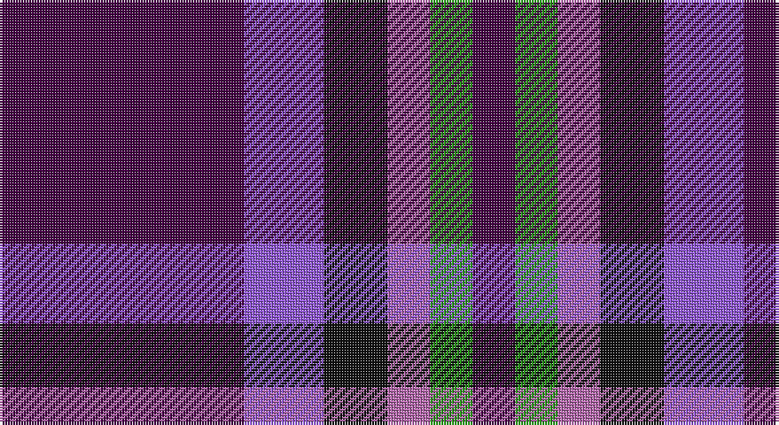

This page is one **sett** — a single exact thread-count. It belongs to the [tartan](/setts/dp46p15k12m8g8dp8/)
(the same proportion at any scale), whose colour order is pattern [BBKRGB](/stripes/bbkrgb/).

Sourced from tartans-authority.  It is a [6 stripe tartan](/stripes/stripes6/).

Original link http://www.tartansauthority.com/tartan-ferret/display/10389/

## Register references

External register numbers recorded for this tartan.

- Scottish Register of Tartans: [10389](https://www.tartanregister.gov.uk/tartanDetails?ref=10389)
- Scottish Tartans Authority (ITI): 10389

## Thread count
DP/92 P30 K24 Pa16 G16 DP/16

One full sett is **280 threads**.

## Palette

Palette: <strong>Tartan Register</strong> <small style="color:#888">(4 of 5 colours)</small>
<table><thead><tr><th>Colour</th><th>Threads</th><th>Shade</th><th>Base</th><th>OKLCh</th></tr></thead><tbody><tr><td>DP/</td><td style="text-align:right;font-variant-numeric:tabular-nums">92</td><td><code style="background-color:#440044;">#440044</code> <small style="color:#888">#440044</small></td><td>B <code style="background-color:#2A418A;">#2A418A</code></td><td><small style="color:#888">oklch(27.1% 0.125 328.4)</small></td></tr><tr><td>P</td><td style="text-align:right;font-variant-numeric:tabular-nums">30</td><td><code style="background-color:#9058D8;">#9058D8</code> <small style="color:#888">#9058D8</small></td><td>B <code style="background-color:#2A418A;">#2A418A</code></td><td><small style="color:#888">oklch(58.4% 0.190 300.8)</small></td></tr><tr><td>K</td><td style="text-align:right;font-variant-numeric:tabular-nums">24</td><td><code style="background-color:#101010;">#101010</code> <small style="color:#888">#101010</small></td><td>K <code style="background-color:#000000;">#000000</code></td><td><small style="color:#888">oklch(17.3% 0.000 89.9)</small></td></tr><tr><td>Pa</td><td style="text-align:right;font-variant-numeric:tabular-nums">16</td><td><code style="background-color:#B468AC;">#B468AC</code> <small style="color:#888">#B468AC</small></td><td>R <code style="background-color:#CC0000;">#CC0000</code></td><td><small style="color:#888">oklch(62.5% 0.131 330.9)</small></td></tr><tr><td>G</td><td style="text-align:right;font-variant-numeric:tabular-nums">16</td><td><code style="background-color:#289C18;">#289C18</code> <small style="color:#888">#289C18</small></td><td>G <code style="background-color:#006100;">#006100</code></td><td><small style="color:#888">oklch(60.6% 0.191 141.6)</small></td></tr><tr><td>DP/</td><td style="text-align:right;font-variant-numeric:tabular-nums">16</td><td><code style="background-color:#440044;">#440044</code> <small style="color:#888">#440044</small></td><td>B <code style="background-color:#2A418A;">#2A418A</code></td><td><small style="color:#888">oklch(27.1% 0.125 328.4)</small></td></tr></tbody></table>

# Sample pattern

## Nearest tartans

The nearest existing variants by ΔTartan distance, with this tartan at the top so the swatches line up against it.

ΔTartan

Tartan

Sett

—

<a href="/ttd/edit/#slug=dp46p15k12m8g8dp8~x2">Haut (Personal)</a> <a class="nn-out" href="/variants/s6/dp46p15k12m8g8dp8~x2/" title="open its dictionary page">↗</a>

1.10

<a href="/ttd/edit/#slug=db30dp9dg6dp9r4db17w5~x2&amp;base=dp46p15k12m8g8dp8~x2">Woodcock (2014)</a> <a class="nn-out" href="/variants/s7/db30dp9dg6dp9r4db17w5~x2/" title="open its dictionary page">↗</a>

1.29

<a href="/ttd/edit/#slug=db30dp9g6dp9r4db17w5~x2&amp;base=dp46p15k12m8g8dp8~x2">Woodcock (2014)</a> <a class="nn-out" href="/variants/s7/db30dp9g6dp9r4db17w5~x2/" title="open its dictionary page">↗</a>

1.33

<a href="/ttd/edit/#slug=dp46dpi15k12p8g8dp8~x2&amp;base=dp46p15k12m8g8dp8~x2">Haut Name Tartan</a> <a class="nn-out" href="/variants/s6/dp46dpi15k12p8g8dp8~x2/" title="open its dictionary page">↗</a>

1.33

<a href="/ttd/edit/#slug=k1r2t1db5lo1~x16&amp;base=dp46p15k12m8g8dp8~x2">Trinity College, Toronto Uni. (Corp</a> <a class="nn-out" href="/variants/s5/k1r2t1db5lo1~x16/" title="open its dictionary page">↗</a>

1.40

<a href="/ttd/edit/#slug=db9r1db2r1r4w1~x12&amp;base=dp46p15k12m8g8dp8~x2">McIntosh, Georgina (Personal)</a> <a class="nn-out" href="/variants/s6/db9r1db2r1r4w1~x12/" title="open its dictionary page">↗</a>

1.46

<a href="/ttd/edit/#slug=db31t4db6k19r20ly4~x2&amp;base=dp46p15k12m8g8dp8~x2">Fife (McGill)</a> <a class="nn-out" href="/variants/s6/db31t4db6k19r20ly4~x2/" title="open its dictionary page">↗</a>

1.50

<a href="/ttd/edit/#slug=g5dp2db5dp10ly2~x2&amp;base=dp46p15k12m8g8dp8~x2">Bryson (2000)</a> <a class="nn-out" href="/variants/s5/g5dp2db5dp10ly2~x2/" title="open its dictionary page">↗</a>

1.58

<a href="/ttd/edit/#slug=w1db6dy5k1db6ly1~x4&amp;base=dp46p15k12m8g8dp8~x2">Ancient Atlantic</a> <a class="nn-out" href="/variants/s6/w1db6dy5k1db6ly1~x4/" title="open its dictionary page">↗</a>

1.60

<a href="/ttd/edit/#slug=k4dg5k4dp28k4r5k4&amp;base=dp46p15k12m8g8dp8~x2">Montgomery</a> <a class="nn-out" href="/variants/s7/k4dg5k4dp28k4r5k4/" title="open its dictionary page">↗</a>

1.62

<a href="/ttd/edit/#slug=dbi36db15r25w5k6dbi35db15r7w5k6&amp;base=dp46p15k12m8g8dp8~x2">Le Mirage (Corporate?)</a> <a class="nn-out" href="/variants/s10/dbi36db15r25w5k6dbi35db15r7w5k6/" title="open its dictionary page">↗</a>

## Neighbour map

Every grey dot is one of 14360 variants placed by the first two principal components of the ΔTartan feature space (44% of its variance). Red is this tartan; blue dots are its nearest — click one to open its page.

<svg viewBox="0 0 640 380" role="img" style="max-width:100%;height:auto;border:1px solid #e0e0e0;border-radius:4px;display:block" xmlns="http://www.w3.org/2000/svg"><image href="/nn/cloud.v1.png" width="640" height="380"/><a href="/variants/s7/db30dp9dg6dp9r4db17w5~x2/"><circle cx="268.6" cy="209.1" r="4" fill="#3465a4"><title>Woodcock (2014)</title></circle></a><a href="/variants/s7/db30dp9g6dp9r4db17w5~x2/"><circle cx="281.7" cy="214.4" r="4" fill="#3465a4"><title>Woodcock (2014)</title></circle></a><a href="/variants/s6/dp46dpi15k12p8g8dp8~x2/"><circle cx="294.7" cy="237.2" r="4" fill="#3465a4"><title>Haut Name Tartan</title></circle></a><a href="/variants/s5/k1r2t1db5lo1~x16/"><circle cx="205.3" cy="230.3" r="4" fill="#3465a4"><title>Trinity College, Toronto Uni. (Corp</title></circle></a><a href="/variants/s6/db9r1db2r1r4w1~x12/"><circle cx="285.0" cy="202.3" r="4" fill="#3465a4"><title>McIntosh, Georgina (Personal)</title></circle></a><a href="/variants/s6/db31t4db6k19r20ly4~x2/"><circle cx="188.2" cy="210.2" r="4" fill="#3465a4"><title>Fife (McGill)</title></circle></a><a href="/variants/s5/g5dp2db5dp10ly2~x2/"><circle cx="217.9" cy="263.0" r="4" fill="#3465a4"><title>Bryson (2000)</title></circle></a><a href="/variants/s6/w1db6dy5k1db6ly1~x4/"><circle cx="271.4" cy="230.4" r="4" fill="#3465a4"><title>Ancient Atlantic</title></circle></a><a href="/variants/s7/k4dg5k4dp28k4r5k4/"><circle cx="268.2" cy="198.3" r="4" fill="#3465a4"><title>Montgomery</title></circle></a><a href="/variants/s10/dbi36db15r25w5k6dbi35db15r7w5k6/"><circle cx="185.0" cy="193.2" r="4" fill="#3465a4"><title>Le Mirage (Corporate?)</title></circle></a><circle cx="257.9" cy="216.4" r="5" fill="#c00000"/></svg>

ID: /variants/s6/dp46p15k12m8g8dp8~x2/
