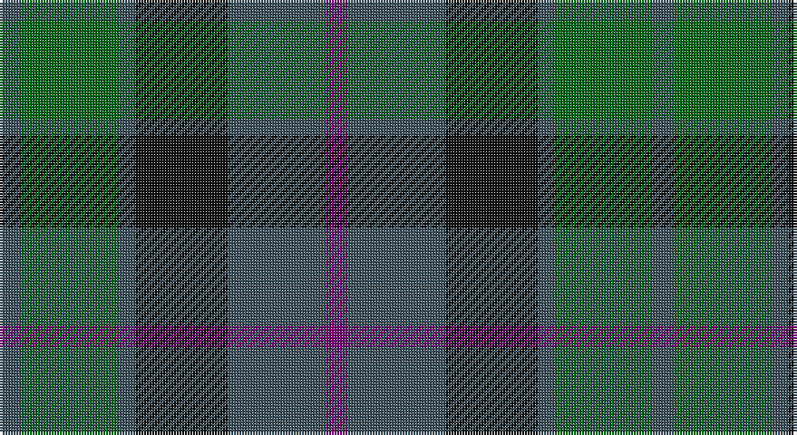

This page is one **sett** — a single exact thread-count. It belongs to the [tartan](/setts/dp4n18k17n3g18n4/)
(the same proportion at any scale), whose colour order is pattern [BBKBGB](/stripes/bbkbgb/).

Part of the [Scottish Airports](/tartans/scottish-airports/) tartan — the named design grouping this sett with its other cloths.

Sourced from tartans-authority.  It is a [6 stripe tartan](/stripes/stripes6/).

Original link http://www.tartansauthority.com/tartan-ferret/display/2510/

## Register references

External register numbers recorded for this tartan.

- Scottish Tartans Authority (ITI): 2510

## Thread count
N/8 G36 N6 K34 N36 P/8

One full sett is **240 threads**.

## Palette

Palette: <strong>Tartan Register</strong> <small style="color:#888">(3 of 4 colours)</small>
<table><thead><tr><th>Colour</th><th>Threads</th><th>Shade</th><th>Base</th><th>OKLCh</th></tr></thead><tbody><tr><td>N/</td><td style="text-align:right;font-variant-numeric:tabular-nums">8</td><td><code style="background-color:#3C505C;">#3C505C</code> <small style="color:#888">#3C505C</small></td><td>B <code style="background-color:#2A418A;">#2A418A</code></td><td><small style="color:#888">oklch(41.9% 0.032 234.9)</small></td></tr><tr><td>G</td><td style="text-align:right;font-variant-numeric:tabular-nums">36</td><td><code style="background-color:#006818;">#006818</code> <small style="color:#888">#006818</small></td><td>G <code style="background-color:#006100;">#006100</code></td><td><small style="color:#888">oklch(45.0% 0.142 145.0)</small></td></tr><tr><td>N</td><td style="text-align:right;font-variant-numeric:tabular-nums">6</td><td><code style="background-color:#3C505C;">#3C505C</code> <small style="color:#888">#3C505C</small></td><td>B <code style="background-color:#2A418A;">#2A418A</code></td><td><small style="color:#888">oklch(41.9% 0.032 234.9)</small></td></tr><tr><td>K</td><td style="text-align:right;font-variant-numeric:tabular-nums">34</td><td><code style="background-color:#101010;">#101010</code> <small style="color:#888">#101010</small></td><td>K <code style="background-color:#000000;">#000000</code></td><td><small style="color:#888">oklch(17.3% 0.000 89.9)</small></td></tr><tr><td>N</td><td style="text-align:right;font-variant-numeric:tabular-nums">36</td><td><code style="background-color:#3C505C;">#3C505C</code> <small style="color:#888">#3C505C</small></td><td>B <code style="background-color:#2A418A;">#2A418A</code></td><td><small style="color:#888">oklch(41.9% 0.032 234.9)</small></td></tr><tr><td>P/</td><td style="text-align:right;font-variant-numeric:tabular-nums">8</td><td><code style="background-color:#780078;">#780078</code> <small style="color:#888">#780078</small></td><td>B <code style="background-color:#2A418A;">#2A418A</code></td><td><small style="color:#888">oklch(40.2% 0.185 328.4)</small></td></tr></tbody></table>

# Sample pattern

## Nearest tartans

The nearest existing variants by ΔTartan distance, with this tartan at the top so the swatches line up against it.

ΔTartan

Tartan

Sett

—

<a href="/ttd/edit/#slug=dp4n18k17n3g18n4~x2">Scottish Airports (Corporate)</a> <a class="nn-out" href="/variants/s6/dp4n18k17n3g18n4~x2/" title="open its dictionary page">↗</a>

0.40

<a href="/ttd/edit/#slug=n4g18n3k17n18p4~x2&amp;base=dp4n18k17n3g18n4~x2">Scottish Airports</a> <a class="nn-out" href="/variants/s6/n4g18n3k17n18p4~x2/" title="open its dictionary page">↗</a>

0.79

<a href="/ttd/edit/#slug=db2k2db12k8dg11r2~x2&amp;base=dp4n18k17n3g18n4~x2">Murray #3</a> <a class="nn-out" href="/variants/s6/db2k2db12k8dg11r2~x2/" title="open its dictionary page">↗</a>

0.80

<a href="/ttd/edit/#slug=k3dg12k12r2db12k3~x2&amp;base=dp4n18k17n3g18n4~x2">Ferguson of Balquhidder #3</a> <a class="nn-out" href="/variants/s6/k3dg12k12r2db12k3~x2/" title="open its dictionary page">↗</a>

0.92

<a href="/ttd/edit/#slug=r1dy7g7db7g7db7r1~x8&amp;base=dp4n18k17n3g18n4~x2">Tennant (Yules)</a> <a class="nn-out" href="/variants/s7/r1dy7g7db7g7db7r1~x8/" title="open its dictionary page">↗</a>

1.02

<a href="/ttd/edit/#slug=dg1db5dg1k5dg6ly1~x2&amp;base=dp4n18k17n3g18n4~x2">MacKay (Bonner)</a> <a class="nn-out" href="/variants/s6/dg1db5dg1k5dg6ly1~x2/" title="open its dictionary page">↗</a>

1.04

<a href="/ttd/edit/#slug=k6dg6r1dg6k6db6k1~x2&amp;base=dp4n18k17n3g18n4~x2">MacCallum #2</a> <a class="nn-out" href="/variants/s7/k6dg6r1dg6k6db6k1~x2/" title="open its dictionary page">↗</a>

1.05

<a href="/ttd/edit/#slug=dt3g11dt3dr11dt18lo3~x2&amp;base=dp4n18k17n3g18n4~x2">Harbour Town Hilton Head, The</a> <a class="nn-out" href="/variants/s6/dt3g11dt3dr11dt18lo3~x2/" title="open its dictionary page">↗</a>

1.12

<a href="/ttd/edit/#slug=t4dy28dg6t12k12t3~x2&amp;base=dp4n18k17n3g18n4~x2">Thompson/Thomson/MacTavish Hunting</a> <a class="nn-out" href="/variants/s6/t4dy28dg6t12k12t3~x2/" title="open its dictionary page">↗</a>

1.14

<a href="/ttd/edit/#slug=g32dy7g7dy16db32ly3dy8~x2&amp;base=dp4n18k17n3g18n4~x2">Strange of Balcaskie (Clan)</a> <a class="nn-out" href="/variants/s7/g32dy7g7dy16db32ly3dy8~x2/" title="open its dictionary page">↗</a>

1.14

<a href="/ttd/edit/#slug=k3g14k14g2dt14g3~x2&amp;base=dp4n18k17n3g18n4~x2">MacKay Clan Tartan</a> <a class="nn-out" href="/variants/s6/k3g14k14g2dt14g3~x2/" title="open its dictionary page">↗</a>

## Neighbour map

Every grey dot is one of 14360 variants placed by the first two principal components of the ΔTartan feature space (44% of its variance). Red is this tartan; blue dots are its nearest — click one to open its page.

<svg viewBox="0 0 640 380" role="img" style="max-width:100%;height:auto;border:1px solid #e0e0e0;border-radius:4px;display:block" xmlns="http://www.w3.org/2000/svg"><image href="/nn/cloud.v1.png" width="640" height="380"/><a href="/variants/s6/n4g18n3k17n18p4~x2/"><circle cx="211.5" cy="276.1" r="4" fill="#3465a4"><title>Scottish Airports</title></circle></a><a href="/variants/s6/db2k2db12k8dg11r2~x2/"><circle cx="217.5" cy="273.5" r="4" fill="#3465a4"><title>Murray #3</title></circle></a><a href="/variants/s6/k3dg12k12r2db12k3~x2/"><circle cx="225.2" cy="281.2" r="4" fill="#3465a4"><title>Ferguson of Balquhidder #3</title></circle></a><a href="/variants/s7/r1dy7g7db7g7db7r1~x8/"><circle cx="208.4" cy="281.6" r="4" fill="#3465a4"><title>Tennant (Yules)</title></circle></a><a href="/variants/s6/dg1db5dg1k5dg6ly1~x2/"><circle cx="213.0" cy="266.7" r="4" fill="#3465a4"><title>MacKay (Bonner)</title></circle></a><a href="/variants/s7/k6dg6r1dg6k6db6k1~x2/"><circle cx="221.0" cy="297.6" r="4" fill="#3465a4"><title>MacCallum #2</title></circle></a><a href="/variants/s6/dt3g11dt3dr11dt18lo3~x2/"><circle cx="278.0" cy="278.7" r="4" fill="#3465a4"><title>Harbour Town Hilton Head, The</title></circle></a><a href="/variants/s6/t4dy28dg6t12k12t3~x2/"><circle cx="249.8" cy="242.4" r="4" fill="#3465a4"><title>Thompson/Thomson/MacTavish Hunting</title></circle></a><a href="/variants/s7/g32dy7g7dy16db32ly3dy8~x2/"><circle cx="243.8" cy="241.3" r="4" fill="#3465a4"><title>Strange of Balcaskie (Clan)</title></circle></a><a href="/variants/s6/k3g14k14g2dt14g3~x2/"><circle cx="250.8" cy="292.7" r="4" fill="#3465a4"><title>MacKay Clan Tartan</title></circle></a><circle cx="223.0" cy="281.8" r="5" fill="#c00000"/></svg>

ID: /variants/s6/dp4n18k17n3g18n4~x2/
