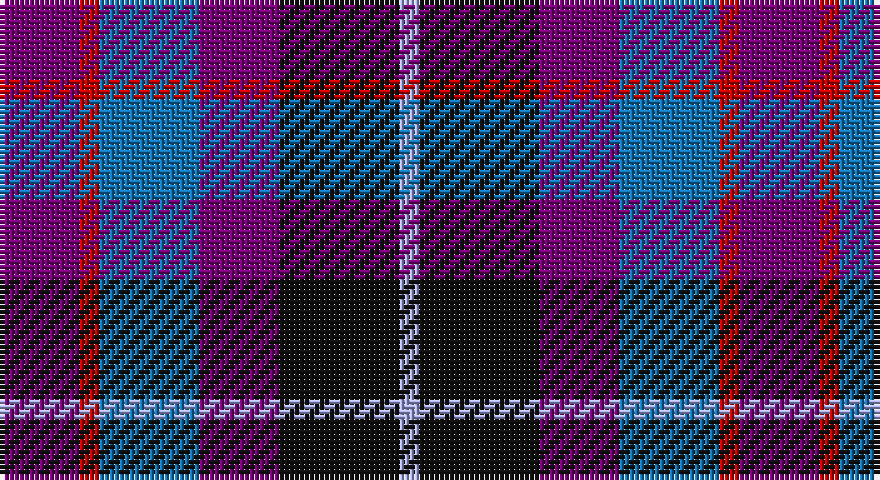

This page is one **sett** — a single exact thread-count. It belongs to the [tartan](/setts/dp4r1b5dp4k6lb1/)
(the same proportion at any scale), whose colour order is pattern [BRBBKW](/stripes/brbbkw/).

Sourced from tartans-authority.  It is a [6 stripe tartan](/stripes/stripes6/).

Original link http://www.tartansauthority.com/tartan-ferret/display/3665/

2 attestations — the source records this cloth was collapsed from (oldest owns this page)

<ul>
<li>pre 2002 — Benreay Medical Centre (Corporate) (tartans-authority, <a href="http://www.tartansauthority.com/tartan-ferret/display/3665/">record</a>)</li>
<li>undated — Benreay Medical Centre (register-of-tartans, <a href="https://www.tartanregister.gov.uk/tartanDetails.aspx?ref=5166">record</a>)</li>
</ul>

## Register references

External register numbers recorded for this tartan.

- Scottish Register of Tartans: [5166](https://www.tartanregister.gov.uk/tartanDetails.aspx?ref=5166)
- Scottish Tartans Authority (ITI): 3665

## Thread count
P/16 R4 B20 P16 K24 LP/4

One full sett is **148 threads**.

## Palette

Palette: <strong>Tartan Register</strong>
<table><thead><tr><th>Colour</th><th>Threads</th><th>Shade</th><th>Base</th><th>OKLCh</th></tr></thead><tbody><tr><td>P/</td><td style="text-align:right;font-variant-numeric:tabular-nums">16</td><td><code style="background-color:#780078;">#780078</code> <small style="color:#888">#780078</small></td><td>B <code style="background-color:#2A418A;">#2A418A</code></td><td><small style="color:#888">oklch(40.2% 0.185 328.4)</small></td></tr><tr><td>R</td><td style="text-align:right;font-variant-numeric:tabular-nums">4</td><td><code style="background-color:#C80000;">#C80000</code> <small style="color:#888">#C80000</small></td><td>R <code style="background-color:#CC0000;">#CC0000</code></td><td><small style="color:#888">oklch(52.3% 0.215 29.2)</small></td></tr><tr><td>B</td><td style="text-align:right;font-variant-numeric:tabular-nums">20</td><td><code style="background-color:#1474B4;">#1474B4</code> <small style="color:#888">#1474B4</small></td><td>B <code style="background-color:#2A418A;">#2A418A</code></td><td><small style="color:#888">oklch(54.0% 0.129 245.1)</small></td></tr><tr><td>P</td><td style="text-align:right;font-variant-numeric:tabular-nums">16</td><td><code style="background-color:#780078;">#780078</code> <small style="color:#888">#780078</small></td><td>B <code style="background-color:#2A418A;">#2A418A</code></td><td><small style="color:#888">oklch(40.2% 0.185 328.4)</small></td></tr><tr><td>K</td><td style="text-align:right;font-variant-numeric:tabular-nums">24</td><td><code style="background-color:#101010;">#101010</code> <small style="color:#888">#101010</small></td><td>K <code style="background-color:#000000;">#000000</code></td><td><small style="color:#888">oklch(17.3% 0.000 89.9)</small></td></tr><tr><td>LP/</td><td style="text-align:right;font-variant-numeric:tabular-nums">4</td><td><code style="background-color:#A8ACE8;">#A8ACE8</code> <small style="color:#888">#A8ACE8</small></td><td>W <code style="background-color:#F7F7F7;">#F7F7F7</code></td><td><small style="color:#888">oklch(76.3% 0.086 281.2)</small></td></tr></tbody></table>

# Sample pattern

## Nearest tartans

The nearest existing variants by ΔTartan distance, with this tartan at the top so the swatches line up against it.

ΔTartan

Tartan

Sett

—

<a href="/ttd/edit/#slug=dp4r1b5dp4k6lb1~x4">Benreay Medical Centre (Corporate)</a> <a class="nn-out" href="/variants/s6/dp4r1b5dp4k6lb1~x4/" title="open its dictionary page">↗</a>

1.11

<a href="/ttd/edit/#slug=dp2r1dp5k4db5lb1~x4&amp;base=dp4r1b5dp4k6lb1~x4">Kintore (Fashion)</a> <a class="nn-out" href="/variants/s6/dp2r1dp5k4db5lb1~x4/" title="open its dictionary page">↗</a>

1.27

<a href="/ttd/edit/#slug=db31t4db6k19r20ly4~x2&amp;base=dp4r1b5dp4k6lb1~x4">Fife (McGill)</a> <a class="nn-out" href="/variants/s6/db31t4db6k19r20ly4~x2/" title="open its dictionary page">↗</a>

1.27

<a href="/ttd/edit/#slug=dp30y7w6db30ly8~x2&amp;base=dp4r1b5dp4k6lb1~x4">Pownall (2015)</a> <a class="nn-out" href="/variants/s5/dp30y7w6db30ly8~x2/" title="open its dictionary page">↗</a>

1.28

<a href="/ttd/edit/#slug=r2dbi11r3dbi11t12db10w2~x2&amp;base=dp4r1b5dp4k6lb1~x4">Blue Family Tartan</a> <a class="nn-out" href="/variants/s7/r2dbi11r3dbi11t12db10w2~x2/" title="open its dictionary page">↗</a>

1.34

<a href="/ttd/edit/#slug=r7db20r4k18o20dp5~x2&amp;base=dp4r1b5dp4k6lb1~x4">Williamson (Personal)</a> <a class="nn-out" href="/variants/s6/r7db20r4k18o20dp5~x2/" title="open its dictionary page">↗</a>

1.35

<a href="/ttd/edit/#slug=r2db11r3db11t12dbi10w2~x2&amp;base=dp4r1b5dp4k6lb1~x4">Blue</a> <a class="nn-out" href="/variants/s7/r2db11r3db11t12dbi10w2~x2/" title="open its dictionary page">↗</a>

1.40

<a href="/ttd/edit/#slug=r9dt6db13dt21y18w4~x2&amp;base=dp4r1b5dp4k6lb1~x4">Fox-Eves Wedding</a> <a class="nn-out" href="/variants/s6/r9dt6db13dt21y18w4~x2/" title="open its dictionary page">↗</a>

1.41

<a href="/ttd/edit/#slug=dp30lo7w6db30ly8~x2&amp;base=dp4r1b5dp4k6lb1~x4">Pownall (2015)</a> <a class="nn-out" href="/variants/s5/dp30lo7w6db30ly8~x2/" title="open its dictionary page">↗</a>

1.49

<a href="/ttd/edit/#slug=w2k1dp10k6db12ly2~x2&amp;base=dp4r1b5dp4k6lb1~x4">Soroptimist International Corporate Tartan</a> <a class="nn-out" href="/variants/s6/w2k1dp10k6db12ly2~x2/" title="open its dictionary page">↗</a>

1.50

<a href="/ttd/edit/#slug=g5dp2db5dp10ly2~x2&amp;base=dp4r1b5dp4k6lb1~x4">Bryson (2000)</a> <a class="nn-out" href="/variants/s5/g5dp2db5dp10ly2~x2/" title="open its dictionary page">↗</a>

## Neighbour map

Every grey dot is one of 14360 variants placed by the first two principal components of the ΔTartan feature space (44% of its variance). Red is this tartan; blue dots are its nearest — click one to open its page.

<svg viewBox="0 0 640 380" role="img" style="max-width:100%;height:auto;border:1px solid #e0e0e0;border-radius:4px;display:block" xmlns="http://www.w3.org/2000/svg"><image href="/nn/cloud.v1.png" width="640" height="380"/><a href="/variants/s6/dp2r1dp5k4db5lb1~x4/"><circle cx="165.1" cy="258.1" r="4" fill="#3465a4"><title>Kintore (Fashion)</title></circle></a><a href="/variants/s6/db31t4db6k19r20ly4~x2/"><circle cx="188.2" cy="210.2" r="4" fill="#3465a4"><title>Fife (McGill)</title></circle></a><a href="/variants/s5/dp30y7w6db30ly8~x2/"><circle cx="136.0" cy="225.1" r="4" fill="#3465a4"><title>Pownall (2015)</title></circle></a><a href="/variants/s7/r2dbi11r3dbi11t12db10w2~x2/"><circle cx="168.3" cy="240.1" r="4" fill="#3465a4"><title>Blue Family Tartan</title></circle></a><a href="/variants/s6/r7db20r4k18o20dp5~x2/"><circle cx="79.4" cy="241.2" r="4" fill="#3465a4"><title>Williamson (Personal)</title></circle></a><a href="/variants/s7/r2db11r3db11t12dbi10w2~x2/"><circle cx="163.0" cy="239.1" r="4" fill="#3465a4"><title>Blue</title></circle></a><a href="/variants/s6/r9dt6db13dt21y18w4~x2/"><circle cx="123.0" cy="255.8" r="4" fill="#3465a4"><title>Fox-Eves Wedding</title></circle></a><a href="/variants/s5/dp30lo7w6db30ly8~x2/"><circle cx="134.3" cy="223.9" r="4" fill="#3465a4"><title>Pownall (2015)</title></circle></a><a href="/variants/s6/w2k1dp10k6db12ly2~x2/"><circle cx="169.9" cy="190.1" r="4" fill="#3465a4"><title>Soroptimist International Corporate Tartan</title></circle></a><a href="/variants/s5/g5dp2db5dp10ly2~x2/"><circle cx="217.9" cy="263.0" r="4" fill="#3465a4"><title>Bryson (2000)</title></circle></a><circle cx="142.3" cy="242.3" r="5" fill="#c00000"/></svg>

ID: /variants/s6/dp4r1b5dp4k6lb1~x4/
