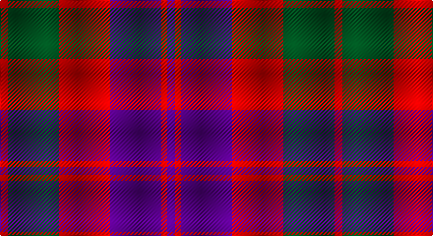

This page is one **sett** — a single exact thread-count. It belongs to the [tartan](/setts/dp4r3dp26r26dg26r4/)
(the same proportion at any scale), whose colour order is pattern [BRBRGR](/stripes/brbrgr/).

Part of the [Unidentified](/tartans/unidentified/) tartan — the named design grouping this sett with its other cloths.

Sourced from register-of-tartans.  It is a [6 stripe tartan](/stripes/stripes6/).

Original link https://www.tartanregister.gov.uk/tartanDetails.aspx?ref=4222

## Also known as

This cloth is also recorded under:

- Unidentified #10
- Unidentified #12
- Unidentified #14
- Unidentified #15
- Unidentified #16
- Unidentified #18
- Unidentified #2
- Unidentified #21
- Unidentified #22
- Unidentified #24
- Unidentified #25
- Unidentified #28
- Unidentified #29
- Unidentified #30
- Unidentified #31
- Unidentified #32
- Unidentified #36
- Unidentified #37
- Unidentified #38
- Unidentified #40
- Unidentified #43
- Unidentified #44
- Unidentified #45
- Unidentified #46
- Unidentified #47
- Unidentified #48
- Unidentified #49
- Unidentified #5
- Unidentified #50
- Unidentified #51
- Unidentified #52
- Unidentified #53
- Unidentified #54
- Unidentified #55
- Unidentified #56
- Unidentified #57
- Unidentified #58
- Unidentified #59
- Unidentified #60
- Unidentified #61
- Unidentified #62
- Unidentified #63
- Unidentified #64
- Unidentified #65
- Unidentified #66
- Unidentified #7
- Unidentified #8
- Unidentified #9
- Unidentified 16
- Unidentified Artifact
- Unidentified Plaid
- Unidentified Plaid #11
- Unidentified Plaid #13
- Unidentified Plaid #2
- Unidentified Plaid #3
- Unidentified Plaid #7
- Unidentified Plaid #8
- Unidentified Plaid #9
- Unidentified Portrait

## Register references

External register numbers recorded for this tartan.

- Scottish Register of Tartans: [4222](https://www.tartanregister.gov.uk/tartanDetails.aspx?ref=4222)
- Scottish Tartans World Register: 463

## Thread count
R/8 G52 R52 P52 R6 P/8

One full sett is **340 threads**.

## Palette

Palette: <strong>Tartan Register</strong>
<table><thead><tr><th>Colour</th><th>Threads</th><th>Shade</th><th>Base</th><th>OKLCh</th></tr></thead><tbody><tr><td>R/</td><td style="text-align:right;font-variant-numeric:tabular-nums">8</td><td><code style="background-color:#DC0000;">#DC0000</code> <small style="color:#888">#DC0000</small></td><td>R <code style="background-color:#CC0000;">#CC0000</code></td><td><small style="color:#888">oklch(56.2% 0.230 29.2)</small></td></tr><tr><td>G</td><td style="text-align:right;font-variant-numeric:tabular-nums">52</td><td><code style="background-color:#005020;">#005020</code> <small style="color:#888">#005020</small></td><td>G <code style="background-color:#006100;">#006100</code></td><td><small style="color:#888">oklch(37.7% 0.105 149.6)</small></td></tr><tr><td>R</td><td style="text-align:right;font-variant-numeric:tabular-nums">52</td><td><code style="background-color:#DC0000;">#DC0000</code> <small style="color:#888">#DC0000</small></td><td>R <code style="background-color:#CC0000;">#CC0000</code></td><td><small style="color:#888">oklch(56.2% 0.230 29.2)</small></td></tr><tr><td>P</td><td style="text-align:right;font-variant-numeric:tabular-nums">52</td><td><code style="background-color:#5A008C;">#5A008C</code> <small style="color:#888">#5A008C</small></td><td>B <code style="background-color:#2A418A;">#2A418A</code></td><td><small style="color:#888">oklch(37.0% 0.191 306.3)</small></td></tr><tr><td>R</td><td style="text-align:right;font-variant-numeric:tabular-nums">6</td><td><code style="background-color:#DC0000;">#DC0000</code> <small style="color:#888">#DC0000</small></td><td>R <code style="background-color:#CC0000;">#CC0000</code></td><td><small style="color:#888">oklch(56.2% 0.230 29.2)</small></td></tr><tr><td>P/</td><td style="text-align:right;font-variant-numeric:tabular-nums">8</td><td><code style="background-color:#5A008C;">#5A008C</code> <small style="color:#888">#5A008C</small></td><td>B <code style="background-color:#2A418A;">#2A418A</code></td><td><small style="color:#888">oklch(37.0% 0.191 306.3)</small></td></tr></tbody></table>

# Sample pattern

## Nearest tartans

The nearest existing variants by ΔTartan distance, with this tartan at the top so the swatches line up against it.

ΔTartan

Tartan

Sett

—

<a href="/ttd/edit/#slug=dp4r3dp26r26dg26r4~x2">Unidentified #21</a> <a class="nn-out" href="/variants/s6/dp4r3dp26r26dg26r4~x2/" title="open its dictionary page">↗</a>

0.77

<a href="/ttd/edit/#slug=r4g26r26p26r3p4~x2&amp;base=dp4r3dp26r26dg26r4~x2">Unidentified 16</a> <a class="nn-out" href="/variants/s6/r4g26r26p26r3p4~x2/" title="open its dictionary page">↗</a>

0.80

<a href="/ttd/edit/#slug=dp4r3dp26r26g26r4~x2&amp;base=dp4r3dp26r26dg26r4~x2">Unidentified Artifact Tartan</a> <a class="nn-out" href="/variants/s6/dp4r3dp26r26g26r4~x2/" title="open its dictionary page">↗</a>

0.82

<a href="/ttd/edit/#slug=db4r30k6db13k13db3~x2&amp;base=dp4r3dp26r26dg26r4~x2">Thompson/Thomson/MacTavish (Bonner)</a> <a class="nn-out" href="/variants/s6/db4r30k6db13k13db3~x2/" title="open its dictionary page">↗</a>

0.82

<a href="/ttd/edit/#slug=dg3dp3dg19dp18r19dp3~x2&amp;base=dp4r3dp26r26dg26r4~x2">MacNab (Macgregor - Hastie)</a> <a class="nn-out" href="/variants/s6/dg3dp3dg19dp18r19dp3~x2/" title="open its dictionary page">↗</a>

0.96

<a href="/ttd/edit/#slug=t4r28k6t12k12t3~x2&amp;base=dp4r3dp26r26dg26r4~x2">Thomson, Red (Name)</a> <a class="nn-out" href="/variants/s6/t4r28k6t12k12t3~x2/" title="open its dictionary page">↗</a>

0.97

<a href="/ttd/edit/#slug=p3r14g2p10r2g14p3~x2&amp;base=dp4r3dp26r26dg26r4~x2">Scottish Netball Association</a> <a class="nn-out" href="/variants/s7/p3r14g2p10r2g14p3~x2/" title="open its dictionary page">↗</a>

1.06

<a href="/ttd/edit/#slug=t2r12k2t6k6t1~x2&amp;base=dp4r3dp26r26dg26r4~x2">Thompson/Thomson/MacTavish #2</a> <a class="nn-out" href="/variants/s6/t2r12k2t6k6t1~x2/" title="open its dictionary page">↗</a>

1.09

<a href="/ttd/edit/#slug=dp3r19dp18g19dp3g3~x2&amp;base=dp4r3dp26r26dg26r4~x2">MacNab 1</a> <a class="nn-out" href="/variants/s6/dp3r19dp18g19dp3g3~x2/" title="open its dictionary page">↗</a>

1.17

<a href="/ttd/edit/#slug=db3r25db17r5g22r9db3~x2&amp;base=dp4r3dp26r26dg26r4~x2">MacFadyan (MacGregor Hastie)</a> <a class="nn-out" href="/variants/s7/db3r25db17r5g22r9db3~x2/" title="open its dictionary page">↗</a>

1.24

<a href="/ttd/edit/#slug=t2r12db2t6k6t1~x2&amp;base=dp4r3dp26r26dg26r4~x2">MacTavish Thomson Clan Tartan</a> <a class="nn-out" href="/variants/s6/t2r12db2t6k6t1~x2/" title="open its dictionary page">↗</a>

## Neighbour map

Every grey dot is one of 14360 variants placed by the first two principal components of the ΔTartan feature space (44% of its variance). Red is this tartan; blue dots are its nearest — click one to open its page.

<svg viewBox="0 0 640 380" role="img" style="max-width:100%;height:auto;border:1px solid #e0e0e0;border-radius:4px;display:block" xmlns="http://www.w3.org/2000/svg"><image href="/nn/cloud.v1.png" width="640" height="380"/><a href="/variants/s6/r4g26r26p26r3p4~x2/"><circle cx="239.6" cy="232.4" r="4" fill="#3465a4"><title>Unidentified 16</title></circle></a><a href="/variants/s6/dp4r3dp26r26g26r4~x2/"><circle cx="249.0" cy="237.0" r="4" fill="#3465a4"><title>Unidentified Artifact Tartan</title></circle></a><a href="/variants/s6/db4r30k6db13k13db3~x2/"><circle cx="255.2" cy="217.3" r="4" fill="#3465a4"><title>Thompson/Thomson/MacTavish (Bonner)</title></circle></a><a href="/variants/s6/dg3dp3dg19dp18r19dp3~x2/"><circle cx="225.8" cy="252.2" r="4" fill="#3465a4"><title>MacNab (Macgregor - Hastie)</title></circle></a><a href="/variants/s6/t4r28k6t12k12t3~x2/"><circle cx="242.5" cy="218.2" r="4" fill="#3465a4"><title>Thomson, Red (Name)</title></circle></a><a href="/variants/s7/p3r14g2p10r2g14p3~x2/"><circle cx="219.7" cy="241.4" r="4" fill="#3465a4"><title>Scottish Netball Association</title></circle></a><a href="/variants/s6/t2r12k2t6k6t1~x2/"><circle cx="239.3" cy="207.3" r="4" fill="#3465a4"><title>Thompson/Thomson/MacTavish #2</title></circle></a><a href="/variants/s6/dp3r19dp18g19dp3g3~x2/"><circle cx="210.1" cy="246.7" r="4" fill="#3465a4"><title>MacNab 1</title></circle></a><a href="/variants/s7/db3r25db17r5g22r9db3~x2/"><circle cx="265.4" cy="234.3" r="4" fill="#3465a4"><title>MacFadyan (MacGregor Hastie)</title></circle></a><a href="/variants/s6/t2r12db2t6k6t1~x2/"><circle cx="220.0" cy="195.5" r="4" fill="#3465a4"><title>MacTavish Thomson Clan Tartan</title></circle></a><circle cx="232.0" cy="230.5" r="5" fill="#c00000"/></svg>

ID: /variants/s6/dp4r3dp26r26dg26r4~x2/
