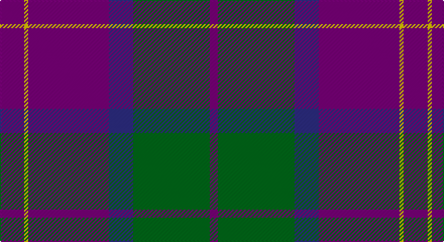

This page is one **sett** — a single exact thread-count. It belongs to the [tartan](/setts/dp6ly1dp20db6g19dp2/)
(the same proportion at any scale), whose colour order is pattern [BGBBYB](/stripes/bgbbyb/).

Sourced from tartans-authority.  It is a [6 stripe tartan](/stripes/stripes6/).

Original link http://www.tartansauthority.com/tartan-ferret/display/7683/

2 attestations — the source records this cloth was collapsed from (oldest owns this page)

<ul>
<li>pre 2008 — Discover Islay (District) (tartans-authority, <a href="http://www.tartansauthority.com/tartan-ferret/display/7683/">record</a>)</li>
<li>undated — Discover Islay (register-of-tartans, <a href="https://www.tartanregister.gov.uk/tartanDetails.aspx?ref=5685">record</a>)</li>
</ul>

## Register references

External register numbers recorded for this tartan.

- Scottish Register of Tartans: [5685](https://www.tartanregister.gov.uk/tartanDetails.aspx?ref=5685)
- Scottish Tartans Authority (ITI): 7683

## Thread count
P/24 Y4 P80 DB24 G76 P/8

One full sett is **400 threads**.

## Palette

Palette: <strong>Tartan Register</strong>
<table><thead><tr><th>Colour</th><th>Threads</th><th>Shade</th><th>Base</th><th>OKLCh</th></tr></thead><tbody><tr><td>P/</td><td style="text-align:right;font-variant-numeric:tabular-nums">24</td><td><code style="background-color:#780078;">#780078</code> <small style="color:#888">#780078</small></td><td>B <code style="background-color:#2A418A;">#2A418A</code></td><td><small style="color:#888">oklch(40.2% 0.185 328.4)</small></td></tr><tr><td>Y</td><td style="text-align:right;font-variant-numeric:tabular-nums">4</td><td><code style="background-color:#E8C000;">#E8C000</code> <small style="color:#888">#E8C000</small></td><td>Y <code style="background-color:#F2BF00;">#F2BF00</code></td><td><small style="color:#888">oklch(81.9% 0.168 93.7)</small></td></tr><tr><td>P</td><td style="text-align:right;font-variant-numeric:tabular-nums">80</td><td><code style="background-color:#780078;">#780078</code> <small style="color:#888">#780078</small></td><td>B <code style="background-color:#2A418A;">#2A418A</code></td><td><small style="color:#888">oklch(40.2% 0.185 328.4)</small></td></tr><tr><td>DB</td><td style="text-align:right;font-variant-numeric:tabular-nums">24</td><td><code style="background-color:#2C2C80;">#2C2C80</code> <small style="color:#888">#2C2C80</small></td><td>B <code style="background-color:#2A418A;">#2A418A</code></td><td><small style="color:#888">oklch(35.0% 0.138 276.6)</small></td></tr><tr><td>G</td><td style="text-align:right;font-variant-numeric:tabular-nums">76</td><td><code style="background-color:#006818;">#006818</code> <small style="color:#888">#006818</small></td><td>G <code style="background-color:#006100;">#006100</code></td><td><small style="color:#888">oklch(45.0% 0.142 145.0)</small></td></tr><tr><td>P/</td><td style="text-align:right;font-variant-numeric:tabular-nums">8</td><td><code style="background-color:#780078;">#780078</code> <small style="color:#888">#780078</small></td><td>B <code style="background-color:#2A418A;">#2A418A</code></td><td><small style="color:#888">oklch(40.2% 0.185 328.4)</small></td></tr></tbody></table>

# Sample pattern

## Nearest tartans

The nearest existing variants by ΔTartan distance, with this tartan at the top so the swatches line up against it.

ΔTartan

Tartan

Sett

—

<a href="/ttd/edit/#slug=dp6ly1dp20db6g19dp2~x4">Discover Islay (District)</a> <a class="nn-out" href="/variants/s6/dp6ly1dp20db6g19dp2~x4/" title="open its dictionary page">↗</a>

0.91

<a href="/ttd/edit/#slug=db4r11g11db22ly1g4~x2&amp;base=dp6ly1dp20db6g19dp2~x4">Harvey</a> <a class="nn-out" href="/variants/s6/db4r11g11db22ly1g4~x2/" title="open its dictionary page">↗</a>

1.07

<a href="/ttd/edit/#slug=db2ly1db18g7r7db1g1~x2&amp;base=dp6ly1dp20db6g19dp2~x4">Unnamed C20th - USA</a> <a class="nn-out" href="/variants/s7/db2ly1db18g7r7db1g1~x2/" title="open its dictionary page">↗</a>

1.14

<a href="/ttd/edit/#slug=r10db4r6db30k10db5w2~x2&amp;base=dp6ly1dp20db6g19dp2~x4">Heritage of Wales (Fashion)</a> <a class="nn-out" href="/variants/s7/r10db4r6db30k10db5w2~x2/" title="open its dictionary page">↗</a>

1.17

<a href="/ttd/edit/#slug=k1r7k1r7db16g1~x2&amp;base=dp6ly1dp20db6g19dp2~x4">Robinson, dress</a> <a class="nn-out" href="/variants/s6/k1r7k1r7db16g1~x2/" title="open its dictionary page">↗</a>

1.20

<a href="/ttd/edit/#slug=k1r7k1r7db16g1~x4&amp;base=dp6ly1dp20db6g19dp2~x4">Robinson Dress (Pendleton) #1</a> <a class="nn-out" href="/variants/s6/k1r7k1r7db16g1~x4/" title="open its dictionary page">↗</a>

1.23

<a href="/ttd/edit/#slug=ri28r1b18ly2g6b18~x2&amp;base=dp6ly1dp20db6g19dp2~x4">British Judo Association</a> <a class="nn-out" href="/variants/s6/ri28r1b18ly2g6b18~x2/" title="open its dictionary page">↗</a>

1.23

<a href="/ttd/edit/#slug=b18k2b4k6dp12lo1~x2&amp;base=dp6ly1dp20db6g19dp2~x4">Joker, The</a> <a class="nn-out" href="/variants/s6/b18k2b4k6dp12lo1~x2/" title="open its dictionary page">↗</a>

1.25

<a href="/ttd/edit/#slug=o11dbi1o3db1dbi9r1~x4&amp;base=dp6ly1dp20db6g19dp2~x4">Dege, of Saville Row</a> <a class="nn-out" href="/variants/s6/o11dbi1o3db1dbi9r1~x4/" title="open its dictionary page">↗</a>

1.26

<a href="/ttd/edit/#slug=dp30o20dg8ly3dg8o20dp30ly2~x2&amp;base=dp6ly1dp20db6g19dp2~x4">Wicks (Personal)</a> <a class="nn-out" href="/variants/s8/dp30o20dg8ly3dg8o20dp30ly2~x2/" title="open its dictionary page">↗</a>

1.28

<a href="/ttd/edit/#slug=ly3dg8o20dp30ly2~x2&amp;base=dp6ly1dp20db6g19dp2~x4">Wicks (Personal)</a> <a class="nn-out" href="/variants/s5/ly3dg8o20dp30ly2~x2/" title="open its dictionary page">↗</a>

## Neighbour map

Every grey dot is one of 14360 variants placed by the first two principal components of the ΔTartan feature space (44% of its variance). Red is this tartan; blue dots are its nearest — click one to open its page.

<svg viewBox="0 0 640 380" role="img" style="max-width:100%;height:auto;border:1px solid #e0e0e0;border-radius:4px;display:block" xmlns="http://www.w3.org/2000/svg"><image href="/nn/cloud.v1.png" width="640" height="380"/><a href="/variants/s6/db4r11g11db22ly1g4~x2/"><circle cx="298.1" cy="194.8" r="4" fill="#3465a4"><title>Harvey</title></circle></a><a href="/variants/s7/db2ly1db18g7r7db1g1~x2/"><circle cx="349.9" cy="173.6" r="4" fill="#3465a4"><title>Unnamed C20th - USA</title></circle></a><a href="/variants/s7/r10db4r6db30k10db5w2~x2/"><circle cx="339.5" cy="188.0" r="4" fill="#3465a4"><title>Heritage of Wales (Fashion)</title></circle></a><a href="/variants/s6/k1r7k1r7db16g1~x2/"><circle cx="324.1" cy="182.0" r="4" fill="#3465a4"><title>Robinson, dress</title></circle></a><a href="/variants/s6/k1r7k1r7db16g1~x4/"><circle cx="328.3" cy="182.9" r="4" fill="#3465a4"><title>Robinson Dress (Pendleton) #1</title></circle></a><a href="/variants/s6/ri28r1b18ly2g6b18~x2/"><circle cx="318.1" cy="172.9" r="4" fill="#3465a4"><title>British Judo Association</title></circle></a><a href="/variants/s6/b18k2b4k6dp12lo1~x2/"><circle cx="306.2" cy="200.1" r="4" fill="#3465a4"><title>Joker, The</title></circle></a><a href="/variants/s6/o11dbi1o3db1dbi9r1~x4/"><circle cx="328.7" cy="209.2" r="4" fill="#3465a4"><title>Dege, of Saville Row</title></circle></a><a href="/variants/s8/dp30o20dg8ly3dg8o20dp30ly2~x2/"><circle cx="282.0" cy="195.3" r="4" fill="#3465a4"><title>Wicks (Personal)</title></circle></a><a href="/variants/s5/ly3dg8o20dp30ly2~x2/"><circle cx="279.8" cy="195.4" r="4" fill="#3465a4"><title>Wicks (Personal)</title></circle></a><circle cx="336.7" cy="196.1" r="5" fill="#c00000"/></svg>

ID: /variants/s6/dp6ly1dp20db6g19dp2~x4/
