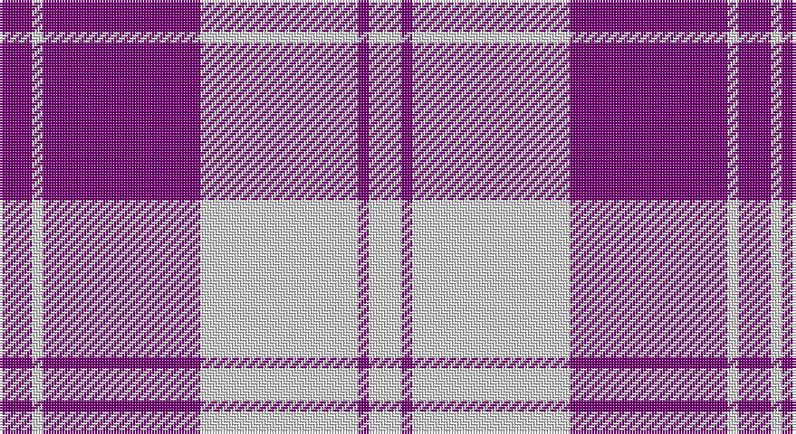

This page is one **sett** — a single exact thread-count. It belongs to the [tartan](/setts/dp6w2dp29w29dp2w6/)
(the same proportion at any scale), whose colour order is pattern [BWBWBW](/stripes/bwbwbw/).

Part of the [Erskine](/tartans/erskine/) tartan — the named design grouping this sett with its other cloths.

Sourced from house-of-tartan.  It is a [6 stripe tartan](/stripes/stripes6/).

Original link http://www.house-of-tartan.scotland.net/house/TartanViewjs.asp?colr=Def&tnam=6534

## Provenance

Earliest known date: 01/01/1980 A dancers' tartan now woven by D C Dalgliesh of Selkirk.

## Also known as

This cloth is also recorded under:

- Erskine Blue
- Erskine Green
- Erskine Hunting
- Erskine Purple
- Erskine Red Dress
- Erskine Royal Blue Dress
- Erskine,
- Erskine, Black & Red
- Erskine, Blue
- Erskine, Burgundy
- Erskine, Green
- Erskine, Grey
- Erskine, Purple
- Erskine, dress
- Erskine, hunting
- Royal Scots Fusiliers

## Thread count
P/12 LN4 P58 LN58 P4 LN/12

One full sett is **272 threads**.

## Palette

Palette: <strong>Tartan Register</strong>
<table><thead><tr><th>Colour</th><th>Threads</th><th>Shade</th><th>Base</th><th>OKLCh</th></tr></thead><tbody><tr><td>P/</td><td style="text-align:right;font-variant-numeric:tabular-nums">12</td><td><code style="background-color:#780078;">#780078</code> <small style="color:#888">#780078</small></td><td>B <code style="background-color:#2A418A;">#2A418A</code></td><td><small style="color:#888">oklch(40.2% 0.185 328.4)</small></td></tr><tr><td>LN</td><td style="text-align:right;font-variant-numeric:tabular-nums">4</td><td><code style="background-color:#E0E0E0;">#E0E0E0</code> <small style="color:#888">#E0E0E0</small></td><td>W <code style="background-color:#F7F7F7;">#F7F7F7</code></td><td><small style="color:#888">oklch(90.7% 0.000 89.9)</small></td></tr><tr><td>P</td><td style="text-align:right;font-variant-numeric:tabular-nums">58</td><td><code style="background-color:#780078;">#780078</code> <small style="color:#888">#780078</small></td><td>B <code style="background-color:#2A418A;">#2A418A</code></td><td><small style="color:#888">oklch(40.2% 0.185 328.4)</small></td></tr><tr><td>LN</td><td style="text-align:right;font-variant-numeric:tabular-nums">58</td><td><code style="background-color:#E0E0E0;">#E0E0E0</code> <small style="color:#888">#E0E0E0</small></td><td>W <code style="background-color:#F7F7F7;">#F7F7F7</code></td><td><small style="color:#888">oklch(90.7% 0.000 89.9)</small></td></tr><tr><td>P</td><td style="text-align:right;font-variant-numeric:tabular-nums">4</td><td><code style="background-color:#780078;">#780078</code> <small style="color:#888">#780078</small></td><td>B <code style="background-color:#2A418A;">#2A418A</code></td><td><small style="color:#888">oklch(40.2% 0.185 328.4)</small></td></tr><tr><td>LN/</td><td style="text-align:right;font-variant-numeric:tabular-nums">12</td><td><code style="background-color:#E0E0E0;">#E0E0E0</code> <small style="color:#888">#E0E0E0</small></td><td>W <code style="background-color:#F7F7F7;">#F7F7F7</code></td><td><small style="color:#888">oklch(90.7% 0.000 89.9)</small></td></tr></tbody></table>

# Sample pattern

## Compared to the master

This cloth is one sett of its design; the master sett (the exemplar the design is anchored on) is below for comparison.

<figure style="margin:0"><figcaption style="color:#888;font-size:smaller">this sett</figcaption></figure>
<figure style="margin:0"><figcaption style="color:#888;font-size:smaller"><a href="/setts/g6r1g24r28g1r4/">master sett →</a></figcaption></figure>

## Nearest tartans

The nearest existing variants by ΔTartan distance, with this tartan at the top so the swatches line up against it.

ΔTartan

Tartan

Sett

—

<a href="/ttd/edit/#slug=dp6w2dp29w29dp2w6~x2">Erskine Purple (Dance) Fashion Tartan</a> <a class="nn-out" href="/variants/s6/dp6w2dp29w29dp2w6~x2/" title="open its dictionary page">↗</a>

0.85

<a href="/ttd/edit/#slug=dp2w1dp9w9dp1w2~x6&amp;base=dp6w2dp29w29dp2w6~x2">Erskine Purple (Dance)</a> <a class="nn-out" href="/variants/s6/dp2w1dp9w9dp1w2~x6/" title="open its dictionary page">↗</a>

1.36

<a href="/ttd/edit/#slug=b6ly2b21ly2b6ly24b2ly6~x2&amp;base=dp6w2dp29w29dp2w6~x2">MacLachlan (Chief's Dress) Blue</a> <a class="nn-out" href="/variants/s8/b6ly2b21ly2b6ly24b2ly6~x2/" title="open its dictionary page">↗</a>

1.39

<a href="/ttd/edit/#slug=r5w2r25w25r2w5~x2&amp;base=dp6w2dp29w29dp2w6~x2">Erskine Dress Burgandy Clan Tartan</a> <a class="nn-out" href="/variants/s6/r5w2r25w25r2w5~x2/" title="open its dictionary page">↗</a>

1.45

<a href="/ttd/edit/#slug=r6w2r29w29r2w6~x2&amp;base=dp6w2dp29w29dp2w6~x2">Erskine, Burgundy (Dance)</a> <a class="nn-out" href="/variants/s6/r6w2r29w29r2w6~x2/" title="open its dictionary page">↗</a>

1.64

<a href="/ttd/edit/#slug=db6w2db29w29db2w6~x2&amp;base=dp6w2dp29w29dp2w6~x2">Erskine Blue (Dance)</a> <a class="nn-out" href="/variants/s6/db6w2db29w29db2w6~x2/" title="open its dictionary page">↗</a>

1.76

<a href="/ttd/edit/#slug=k2w28r13w2r13w2~x2&amp;base=dp6w2dp29w29dp2w6~x2">Buchanan #5</a> <a class="nn-out" href="/variants/s6/k2w28r13w2r13w2~x2/" title="open its dictionary page">↗</a>

1.77

<a href="/ttd/edit/#slug=m13w3m1k3w1~x6&amp;base=dp6w2dp29w29dp2w6~x2">Glen App</a> <a class="nn-out" href="/variants/s5/m13w3m1k3w1~x6/" title="open its dictionary page">↗</a>

1.90

<a href="/ttd/edit/#slug=w3db1w30db1p28w1p1w3~x2&amp;base=dp6w2dp29w29dp2w6~x2">Dunlop, dress</a> <a class="nn-out" href="/variants/s8/w3db1w30db1p28w1p1w3~x2/" title="open its dictionary page">↗</a>

1.90

<a href="/ttd/edit/#slug=db8w3db28w32k3w4~x2&amp;base=dp6w2dp29w29dp2w6~x2">Ailsa, Navy (Dance)</a> <a class="nn-out" href="/variants/s6/db8w3db28w32k3w4~x2/" title="open its dictionary page">↗</a>

1.93

<a href="/ttd/edit/#slug=w5db16w5db16w33r3~x2&amp;base=dp6w2dp29w29dp2w6~x2">Buchanan Dress Blue (Dance)</a> <a class="nn-out" href="/variants/s6/w5db16w5db16w33r3~x2/" title="open its dictionary page">↗</a>

## Neighbour map

Every grey dot is one of 14360 variants placed by the first two principal components of the ΔTartan feature space (44% of its variance). Red is this tartan; blue dots are its nearest — click one to open its page.

<svg viewBox="0 0 640 380" role="img" style="max-width:100%;height:auto;border:1px solid #e0e0e0;border-radius:4px;display:block" xmlns="http://www.w3.org/2000/svg"><image href="/nn/cloud.v1.png" width="640" height="380"/><a href="/variants/s6/dp2w1dp9w9dp1w2~x6/"><circle cx="308.5" cy="204.4" r="4" fill="#3465a4"><title>Erskine Purple (Dance)</title></circle></a><a href="/variants/s8/b6ly2b21ly2b6ly24b2ly6~x2/"><circle cx="325.2" cy="189.6" r="4" fill="#3465a4"><title>MacLachlan (Chief's Dress) Blue</title></circle></a><a href="/variants/s6/r5w2r25w25r2w5~x2/"><circle cx="340.0" cy="192.9" r="4" fill="#3465a4"><title>Erskine Dress Burgandy Clan Tartan</title></circle></a><a href="/variants/s6/r6w2r29w29r2w6~x2/"><circle cx="331.1" cy="179.4" r="4" fill="#3465a4"><title>Erskine, Burgundy (Dance)</title></circle></a><a href="/variants/s6/db6w2db29w29db2w6~x2/"><circle cx="319.0" cy="191.0" r="4" fill="#3465a4"><title>Erskine Blue (Dance)</title></circle></a><a href="/variants/s6/k2w28r13w2r13w2~x2/"><circle cx="321.5" cy="171.3" r="4" fill="#3465a4"><title>Buchanan #5</title></circle></a><a href="/variants/s5/m13w3m1k3w1~x6/"><circle cx="390.8" cy="185.7" r="4" fill="#3465a4"><title>Glen App</title></circle></a><a href="/variants/s8/w3db1w30db1p28w1p1w3~x2/"><circle cx="375.1" cy="107.8" r="4" fill="#3465a4"><title>Dunlop, dress</title></circle></a><a href="/variants/s6/db8w3db28w32k3w4~x2/"><circle cx="278.4" cy="190.9" r="4" fill="#3465a4"><title>Ailsa, Navy (Dance)</title></circle></a><a href="/variants/s6/w5db16w5db16w33r3~x2/"><circle cx="282.6" cy="195.7" r="4" fill="#3465a4"><title>Buchanan Dress Blue (Dance)</title></circle></a><circle cx="340.2" cy="187.5" r="5" fill="#c00000"/></svg>

ID: /variants/s6/dp6w2dp29w29dp2w6~x2/
