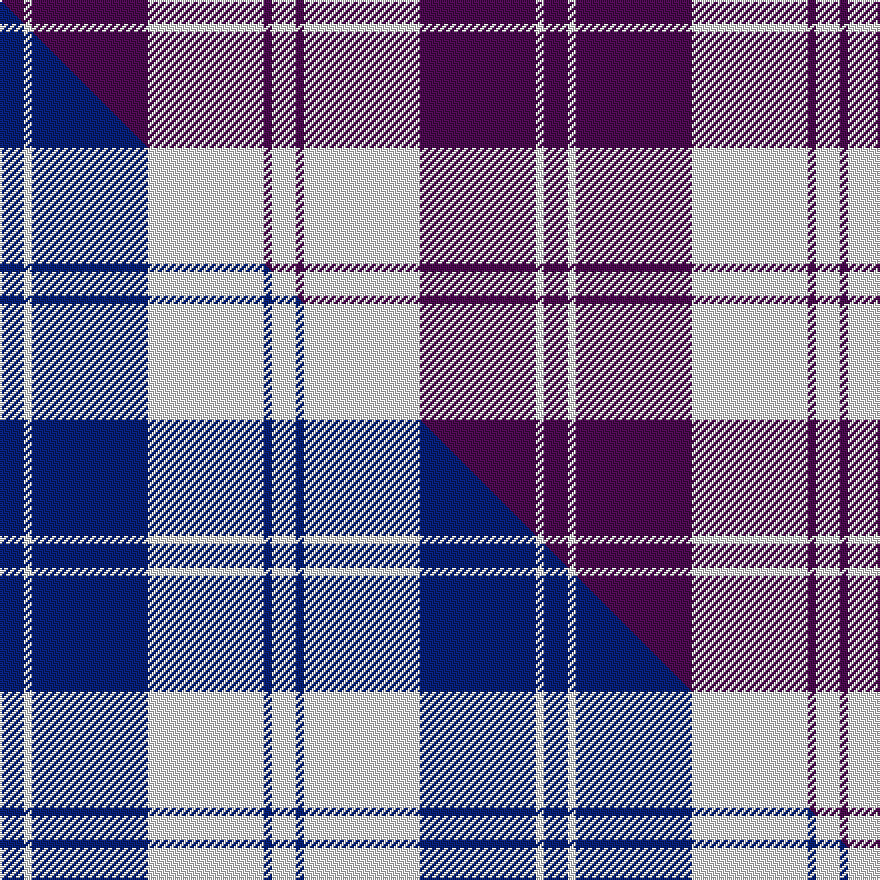

This page is one **sett** — a single exact thread-count. It belongs to the [tartan](/setts/dp6w2dp29w29dp2w6/)
(the same proportion at any scale), whose colour order is pattern [BWBWBW](/stripes/bwbwbw/).

Part of the [Erskine](/tartans/erskine-2/) tartan — the named design grouping this sett with its other cloths.

Sourced from house-of-tartan.  It is a [6 stripe tartan](/stripes/stripes6/).

Original link http://www.house-of-tartan.scotland.net/house/TartanViewjs.asp?colr=Def&tnam=6534

## Provenance

Earliest known date: 01/01/1980 A dancers' tartan now woven by D C Dalgliesh of Selkirk.

## Thread count
DP/12 W4 DP58 W58 DP4 W/12

One full sett is **272 threads**.

## Palette
<table><thead><tr><th>Colour</th><th>Shade</th><th>OKLCh</th></tr></thead><tbody><tr><td>W</td><td><code style="background-color:#F7F7F7;">#F7F7F7</code> <small style="color:#888">#F7F7F7</small></td><td><small style="color:#888">oklch(97.6% 0.000 89.9)</small></td></tr><tr><td>DP</td><td><code style="background-color:#4B0B4F;">#4B0B4F</code> <small style="color:#888">#4B0B4F</small></td><td><small style="color:#888">oklch(30.1% 0.125 325.4)</small></td></tr></tbody></table>

# Sample pattern

## Compared to the master

This cloth is one sett of its design; the master sett (the exemplar the design is anchored on) is below for comparison.

Its **ΔTartan distance** from the master is **3.11** — the same measure the nearest-tartans table ranks by (0 is identical; a re-scale of the same cloth is near 0, a recolour or a different proportion further).

<figure class="master-compare" style="margin:0">

this sett
master sett ★

<figcaption style="color:#888;font-size:smaller">One weave of this sett against the <a href="/setts/db6w2db29w29db2w6/">master sett ★</a>, split on the diagonal: a shared proportion runs seamlessly across it with only the shades shifting; a different proportion breaks on it.</figcaption>
</figure>

## Nearest tartan variants

The nearest existing variants by ΔTartan distance, with this cloth at the top so the swatches line up against it.

ΔTartan

Threads

Variant

Sett

—

272

<a href="/variants/s6/dp6w2dp29w29dp2w6~x2/">Erskine Purple (Dance) Fashion Tartan</a>

<a href="/ttd/edit/#slug=dp2w1dp9w9dp1w2~x6&amp;base=dp6w2dp29w29dp2w6~x2" title="compare in the TTD">0.40</a>

264

<a href="/variants/s6/dp2w1dp9w9dp1w2~x6/">Erskine Purple (Dance)</a>

<a href="/ttd/edit/#slug=w3db1w30db1dp28w1dp1w3~x2&amp;base=dp6w2dp29w29dp2w6~x2" title="compare in the TTD">2.43</a>

260

<a href="/variants/s8/w3db1w30db1dp28w1dp1w3~x2/">Dunlop Dress</a>

<a href="/ttd/edit/#slug=dr5w2dr25w25dr2w5~x2&amp;base=dp6w2dp29w29dp2w6~x2" title="compare in the TTD">2.76</a>

236

<a href="/variants/s6/dr5w2dr25w25dr2w5~x2/">Erskine Dress Burgandy Clan Tartan</a>

<a href="/ttd/edit/#slug=db6w2db29w29db2w6~x2&amp;base=dp6w2dp29w29dp2w6~x2" title="compare in the TTD">3.11</a>

272

<a href="/variants/s6/db6w2db29w29db2w6~x2/">Erskine Blue (Dance)</a>

<a href="/ttd/edit/#slug=dp42db2w2db2dp5lb12w32dp4~x2&amp;base=dp6w2dp29w29dp2w6~x2" title="compare in the TTD">3.23</a>

312

<a href="/variants/s8/dp42db2w2db2dp5lb12w32dp4~x2/">Longniddry Dress District Tartan</a>

<a href="/ttd/edit/#slug=dp42lb2w2lb2dp5t12w32dp4~x2~lb3103284-t2405244&amp;base=dp6w2dp29w29dp2w6~x2" title="compare in the TTD">3.24</a>

312

<a href="/variants/s8/dp42lb2w2lb2dp5t12w32dp4~x2~lb3103284-t2405244/">Longniddry Purple</a>

<a href="/ttd/edit/#slug=dp42db2w2db2dp5b12w32dp4~x2&amp;base=dp6w2dp29w29dp2w6~x2" title="compare in the TTD">3.28</a>

312

<a href="/variants/s8/dp42db2w2db2dp5b12w32dp4~x2/">Longniddry, dress</a>

<a href="/ttd/edit/#slug=dp42lb2w2lb2dp5t12w32dp4~x2~dp1607327-lb3103284-t2405244&amp;base=dp6w2dp29w29dp2w6~x2" title="compare in the TTD">3.29</a>

312

<a href="/variants/s8/dp42lb2w2lb2dp5t12w32dp4~x2~dp1607327-lb3103284-t2405244/">Longniddry Dress (Dance)</a>

<a href="/ttd/edit/#slug=w32dr12db12w2db3~x2&amp;base=dp6w2dp29w29dp2w6~x2" title="compare in the TTD">3.47</a>

174

<a href="/variants/s5/w32dr12db12w2db3~x2/">Fraser Arisaid Red (Dance)</a>

<a href="/ttd/edit/#slug=w4dp31w35lb4~x2&amp;base=dp6w2dp29w29dp2w6~x2" title="compare in the TTD">3.48</a>

280

<a href="/variants/s4/w4dp31w35lb4~x2/">Lewis, Magenta (Dance)</a>

## Neighbour map

Every grey dot is one of 13620 variants placed by the first two principal components of the ΔTartan feature space (42% of its variance). Red is this tartan; blue dots are its nearest — click one to open its page.

<svg viewBox="0 0 640 380" role="img" style="max-width:100%;height:auto;border:1px solid #e0e0e0;border-radius:4px;display:block" xmlns="http://www.w3.org/2000/svg"><image href="/nn/cloud.v1.png" width="640" height="380"/><a href="/variants/s6/dp2w1dp9w9dp1w2~x6/"><circle cx="362.0" cy="257.1" r="4" fill="#3465a4"><title>Erskine Purple (Dance)</title></circle></a><a href="/variants/s8/w3db1w30db1dp28w1dp1w3~x2/"><circle cx="400.4" cy="152.0" r="4" fill="#3465a4"><title>Dunlop Dress</title></circle></a><a href="/variants/s6/dr5w2dr25w25dr2w5~x2/"><circle cx="375.3" cy="240.1" r="4" fill="#3465a4"><title>Erskine Dress Burgandy Clan Tartan</title></circle></a><a href="/variants/s6/db6w2db29w29db2w6~x2/"><circle cx="375.9" cy="239.3" r="4" fill="#3465a4"><title>Erskine Blue (Dance)</title></circle></a><a href="/variants/s8/dp42db2w2db2dp5lb12w32dp4~x2/"><circle cx="321.4" cy="164.6" r="4" fill="#3465a4"><title>Longniddry Dress District Tartan</title></circle></a><a href="/variants/s8/dp42lb2w2lb2dp5t12w32dp4~x2~lb3103284-t2405244/"><circle cx="323.6" cy="166.4" r="4" fill="#3465a4"><title>Longniddry Purple</title></circle></a><a href="/variants/s8/dp42db2w2db2dp5b12w32dp4~x2/"><circle cx="322.9" cy="165.1" r="4" fill="#3465a4"><title>Longniddry, dress</title></circle></a><a href="/variants/s8/dp42lb2w2lb2dp5t12w32dp4~x2~dp1607327-lb3103284-t2405244/"><circle cx="335.7" cy="167.5" r="4" fill="#3465a4"><title>Longniddry Dress (Dance)</title></circle></a><a href="/variants/s5/w32dr12db12w2db3~x2/"><circle cx="342.6" cy="228.1" r="4" fill="#3465a4"><title>Fraser Arisaid Red (Dance)</title></circle></a><a href="/variants/s4/w4dp31w35lb4~x2/"><circle cx="341.7" cy="270.6" r="4" fill="#3465a4"><title>Lewis, Magenta (Dance)</title></circle></a><circle cx="381.3" cy="233.8" r="5" fill="#c00000"/><text x="320" y="376" text-anchor="middle" font-size="11" fill="#999">ground</text><text x="11" y="190" text-anchor="middle" font-size="11" fill="#999" transform="rotate(-90 11 190)">complexity</text></svg>

ID: /variants/s6/dp6w2dp29w29dp2w6~x2/
