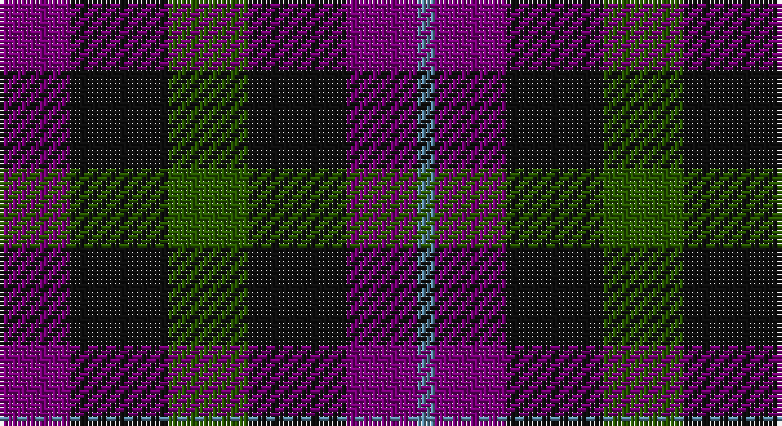

This page is one **sett** — a single exact thread-count. It belongs to the [tartan](/setts/dp8k11dg9k11dp8t2/)
(the same proportion at any scale), whose colour order is pattern [BBKGKB](/stripes/bbkgkb/).

Part of the [Wilson's No.228](/tartans/wilson-s-no-228/) tartan — the named design grouping this sett with its other cloths.

Sourced from register-of-tartans.  It is a [6 stripe tartan](/stripes/stripes6/).

Original link https://www.tartanregister.gov.uk/tartanDetails.aspx?ref=4756

## Also known as

This cloth is also recorded under:

- Wilson's No.228 #2

## Register references

External register numbers recorded for this tartan.

- Scottish Register of Tartans: [4756](https://www.tartanregister.gov.uk/tartanDetails.aspx?ref=4756)
- Scottish Tartans Authority (ITI): 1896
- Scottish Tartans World Register: 1896

## Thread count
P/16 K22 G18 K22 P16 B/4

One full sett is **176 threads**.

## Palette

Palette: <strong>Tartan Register</strong>
<table><thead><tr><th>Colour</th><th>Threads</th><th>Shade</th><th>Base</th><th>OKLCh</th></tr></thead><tbody><tr><td>P/</td><td style="text-align:right;font-variant-numeric:tabular-nums">16</td><td><code style="background-color:#780078;">#780078</code> <small style="color:#888">#780078</small></td><td>B <code style="background-color:#2A418A;">#2A418A</code></td><td><small style="color:#888">oklch(40.2% 0.185 328.4)</small></td></tr><tr><td>K</td><td style="text-align:right;font-variant-numeric:tabular-nums">22</td><td><code style="background-color:#101010;">#101010</code> <small style="color:#888">#101010</small></td><td>K <code style="background-color:#000000;">#000000</code></td><td><small style="color:#888">oklch(17.3% 0.000 89.9)</small></td></tr><tr><td>G</td><td style="text-align:right;font-variant-numeric:tabular-nums">18</td><td><code style="background-color:#285800;">#285800</code> <small style="color:#888">#285800</small></td><td>G <code style="background-color:#006100;">#006100</code></td><td><small style="color:#888">oklch(41.0% 0.122 135.8)</small></td></tr><tr><td>K</td><td style="text-align:right;font-variant-numeric:tabular-nums">22</td><td><code style="background-color:#101010;">#101010</code> <small style="color:#888">#101010</small></td><td>K <code style="background-color:#000000;">#000000</code></td><td><small style="color:#888">oklch(17.3% 0.000 89.9)</small></td></tr><tr><td>P</td><td style="text-align:right;font-variant-numeric:tabular-nums">16</td><td><code style="background-color:#780078;">#780078</code> <small style="color:#888">#780078</small></td><td>B <code style="background-color:#2A418A;">#2A418A</code></td><td><small style="color:#888">oklch(40.2% 0.185 328.4)</small></td></tr><tr><td>B/</td><td style="text-align:right;font-variant-numeric:tabular-nums">4</td><td><code style="background-color:#5C8CA8;">#5C8CA8</code> <small style="color:#888">#5C8CA8</small></td><td>B <code style="background-color:#2A418A;">#2A418A</code></td><td><small style="color:#888">oklch(61.7% 0.067 235.0)</small></td></tr></tbody></table>

# Sample pattern

## Nearest tartans

The nearest existing variants by ΔTartan distance, with this tartan at the top so the swatches line up against it.

ΔTartan

Tartan

Sett

—

<a href="/ttd/edit/#slug=dp8k11dg9k11dp8t2~x2">Wilson's No.228 #2</a> <a class="nn-out" href="/variants/s6/dp8k11dg9k11dp8t2~x2/" title="open its dictionary page">↗</a>

1.34

<a href="/ttd/edit/#slug=dp6k5dg5r1~x2&amp;base=dp8k11dg9k11dp8t2~x2">Unidentified No 60</a> <a class="nn-out" href="/variants/s4/dp6k5dg5r1~x2/" title="open its dictionary page">↗</a>

1.36

<a href="/ttd/edit/#slug=k11dg12k2dg12k12dp12w3~x2&amp;base=dp8k11dg9k11dp8t2~x2">Wilson's No 97</a> <a class="nn-out" href="/variants/s7/k11dg12k2dg12k12dp12w3~x2/" title="open its dictionary page">↗</a>

1.36

<a href="/ttd/edit/#slug=k6dg6ly1dg6k6dp6k1~x4&amp;base=dp8k11dg9k11dp8t2~x2">Abercrombie (Wilsons No 2/64)</a> <a class="nn-out" href="/variants/s7/k6dg6ly1dg6k6dp6k1~x4/" title="open its dictionary page">↗</a>

1.37

<a href="/variants/s8/dg6dp3ki3dp3ki3dp3dg6k2~x2/">Wilson's No.173</a>

1.41

<a href="/ttd/edit/#slug=dp8k11g9r2~x2&amp;base=dp8k11dg9k11dp8t2~x2">Norwich Collection No. 60</a> <a class="nn-out" href="/variants/s4/dp8k11g9r2~x2/" title="open its dictionary page">↗</a>

1.41

<a href="/ttd/edit/#slug=dp3k3dp3dg6r2~x2&amp;base=dp8k11dg9k11dp8t2~x2">Austin (Wilson's No 137)</a> <a class="nn-out" href="/variants/s5/dp3k3dp3dg6r2~x2/" title="open its dictionary page">↗</a>

1.50

<a href="/ttd/edit/#slug=dg14db8dg14r14k3r14~x2&amp;base=dp8k11dg9k11dp8t2~x2">Tulsa, City of</a> <a class="nn-out" href="/variants/s6/dg14db8dg14r14k3r14~x2/" title="open its dictionary page">↗</a>

1.54

<a href="/ttd/edit/#slug=g6dp3k3dp3k3dp3g6r2~x2&amp;base=dp8k11dg9k11dp8t2~x2">Wilson's No.137</a> <a class="nn-out" href="/variants/s8/g6dp3k3dp3k3dp3g6r2~x2/" title="open its dictionary page">↗</a>

1.58

<a href="/ttd/edit/#slug=dp9k11t2g9k3g9t2k11dp9k3~x2&amp;base=dp8k11dg9k11dp8t2~x2">Scott, Sir Walter</a> <a class="nn-out" href="/variants/s10/dp9k11t2g9k3g9t2k11dp9k3~x2/" title="open its dictionary page">↗</a>

1.60

<a href="/ttd/edit/#slug=g9k11dp8t2~x2&amp;base=dp8k11dg9k11dp8t2~x2">Wilson's No.228</a> <a class="nn-out" href="/variants/s4/g9k11dp8t2~x2/" title="open its dictionary page">↗</a>

## Neighbour map

Every grey dot is one of 14360 variants placed by the first two principal components of the ΔTartan feature space (44% of its variance). Red is this tartan; blue dots are its nearest — click one to open its page.

<svg viewBox="0 0 640 380" role="img" style="max-width:100%;height:auto;border:1px solid #e0e0e0;border-radius:4px;display:block" xmlns="http://www.w3.org/2000/svg"><image href="/nn/cloud.v1.png" width="640" height="380"/><a href="/variants/s4/dp6k5dg5r1~x2/"><circle cx="170.6" cy="302.8" r="4" fill="#3465a4"><title>Unidentified No 60</title></circle></a><a href="/variants/s7/k11dg12k2dg12k12dp12w3~x2/"><circle cx="165.1" cy="276.2" r="4" fill="#3465a4"><title>Wilson's No 97</title></circle></a><a href="/variants/s7/k6dg6ly1dg6k6dp6k1~x4/"><circle cx="192.8" cy="280.0" r="4" fill="#3465a4"><title>Abercrombie (Wilsons No 2/64)</title></circle></a><a href="/variants/s8/dg6dp3ki3dp3ki3dp3dg6k2~x2/"><circle cx="136.0" cy="301.9" r="4" fill="#3465a4"><title>Wilson's No.173</title></circle></a><a href="/variants/s4/dp8k11g9r2~x2/"><circle cx="157.2" cy="297.7" r="4" fill="#3465a4"><title>Norwich Collection No. 60</title></circle></a><a href="/variants/s5/dp3k3dp3dg6r2~x2/"><circle cx="122.6" cy="317.4" r="4" fill="#3465a4"><title>Austin (Wilson's No 137)</title></circle></a><a href="/variants/s6/dg14db8dg14r14k3r14~x2/"><circle cx="182.0" cy="291.5" r="4" fill="#3465a4"><title>Tulsa, City of</title></circle></a><a href="/variants/s8/g6dp3k3dp3k3dp3g6r2~x2/"><circle cx="131.8" cy="296.9" r="4" fill="#3465a4"><title>Wilson's No.137</title></circle></a><a href="/variants/s10/dp9k11t2g9k3g9t2k11dp9k3~x2/"><circle cx="166.9" cy="251.8" r="4" fill="#3465a4"><title>Scott, Sir Walter</title></circle></a><a href="/variants/s4/g9k11dp8t2~x2/"><circle cx="167.7" cy="310.5" r="4" fill="#3465a4"><title>Wilson's No.228</title></circle></a><circle cx="194.1" cy="299.9" r="5" fill="#c00000"/></svg>

ID: /variants/s6/dp8k11dg9k11dp8t2~x2/
