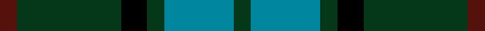

This is one **variant** — a specific cloth: this exact thread count and colourway, with its own
provenance below. It is one weaving of the [sett](/tartans/w/wc/wcwm-1045/) (the scale-free proportion — the
same cloth at any scale or shade), whose colour order is pattern [BGKGBG](/stripes/bgkgbg/).

Part of the [Wcwm 1045](/tartans/w/wc/wcwm-1045/) tartan — the named design grouping this sett with its other cloths.

Sourced from register-of-tartans.  It is a [6 stripe tartan](/stripes/stripes6/).

Original link [https://www.tartanregister.gov.uk/tartanDetails.aspx?ref=4507](https://www.tartanregister.gov.uk/tartanDetails.aspx?ref=4507)

Dataset <small>— provenance for this record, inherited from the source manifest</small>

<dl class="dataset-prov">
<dt>source</dt><dd><a href="/sources/register-of-tartans/">Scottish Register of Tartans</a></dd>
<dt>data captured from</dt><dd><a href="https://github.com/thetartan/tartan-database/blob/master/data/register-of-tartans/data.csv">https://github.com/thetartan/tartan-database/blob/master/data/register-of-tartans/data.csv</a></dd>
<dt>data date</dt><dd>2002 <small>(this record)</small></dd>
<dt>licence</dt><dd><a href="https://www.tartanregister.gov.uk/copyright">Crown copyright</a></dd>
</dl>

Capture chain <small>— the hands this data passed through, oldest first; each capture carries its own licence</small>

<ol class="capture-chain">
<li><a href="https://www.tartanregister.gov.uk/">Scottish Register of Tartans</a> · <a href="https://www.tartanregister.gov.uk/copyright">Crown copyright</a> <small>the living register — still published by National Records of Scotland</small></li>
<li><a href="https://github.com/thetartan/tartan-database">thetartan/tartan-database</a> <small>2016-2017</small> · <a href="https://creativecommons.org/licenses/by-nc-nd/4.0/">CC BY-NC-ND 4.0</a> <small>Levko Kravets's frozen compilation — the capture we vendored, and where its CC licence text came from</small></li>
<li>this dictionary <small>captured 2026-06-10 · commit 5bf86c7566</small> <small>each re-capture is a git commit to data/sources</small></li>
</ol>

## Register references

External register numbers recorded for this tartan.

- Scottish Register of Tartans: [4507](https://www.tartanregister.gov.uk/tartanDetails.aspx?ref=4507)
- Scottish Tartans Authority (ITI): 4334

## Thread count
DR/4 DG24 K6 DG4 T16 DG/4

One full sett is **108 threads**.

## Palette
<table><thead><tr><th>Colour</th><th>Shade</th><th>OKLCh</th></tr></thead><tbody><tr><td>T</td><td><code style="background-color:#00879F;">#00879F</code> <small style="color:#888">#00879F</small></td><td><small style="color:#888">oklch(57.4% 0.102 216.1)</small></td></tr><tr><td>DR</td><td><code style="background-color:#55120C;">#55120C</code> <small style="color:#888">#55120C</small></td><td><small style="color:#888">oklch(30.0% 0.099 29.3)</small></td></tr><tr><td>DG</td><td><code style="background-color:#053819;">#053819</code> <small style="color:#888">#053819</small></td><td><small style="color:#888">oklch(30.0% 0.075 151.3)</small></td></tr><tr><td>K</td><td><code style="background-color:#000000;">#000000</code> <small style="color:#888">#000000</small></td><td><small style="color:#888">oklch(0.0% 0.000 0.0)</small></td></tr></tbody></table>

# Sample pattern

## Nearest tartan variants

The nearest existing variants by ΔTartan distance, with this cloth at the top so the swatches line up against it.

ΔTartan

Threads

Variant

Sett

—

108

<a href="/variants/s6/dr2dg12k3dg2t8dg2~x2/">Wcwm 1045</a>

<a href="/ttd/edit/#slug=g3db8g3k4g15r2~x2&amp;base=dr2dg12k3dg2t8dg2~x2" title="compare in the TTD">0.51</a>

130

<a href="/variants/s6/g3db8g3k4g15r2~x2/">Lauder (Family)</a>

<a href="/ttd/edit/#slug=g2k1g12dr4g3db9lb2~x4&amp;base=dr2dg12k3dg2t8dg2~x2" title="compare in the TTD">0.88</a>

248

<a href="/variants/s7/g2k1g12dr4g3db9lb2~x4/">Lee (Personal)</a>

<a href="/ttd/edit/#slug=y1g6k5g1db5g1~x2&amp;base=dr2dg12k3dg2t8dg2~x2" title="compare in the TTD">0.90</a>

72

<a href="/variants/s6/y1g6k5g1db5g1~x2/">MacKay (Bonner)</a>

<a href="/ttd/edit/#slug=r5g20r5g20db24g6y4&amp;base=dr2dg12k3dg2t8dg2~x2" title="compare in the TTD">1.05</a>

159

<a href="/variants/s7/r5g20r5g20db24g6y4/">Cameron of Lochiel (Hunting) Clan/Family Tartan</a>

<a href="/ttd/edit/#slug=r3g10r3g14db16g3dy2~x2&amp;base=dr2dg12k3dg2t8dg2~x2" title="compare in the TTD">1.17</a>

194

<a href="/variants/s7/r3g10r3g14db16g3dy2~x2/">Cameron Hunting Clan Tartan</a>

<a href="/ttd/edit/#slug=r3g10r3g14db16g3y2~x2&amp;base=dr2dg12k3dg2t8dg2~x2" title="compare in the TTD">1.17</a>

194

<a href="/variants/s7/r3g10r3g14db16g3y2~x2/">Cameron of Lochiel (Hunting)</a>

<a href="/ttd/edit/#slug=r3g10r3g14db16g3y2&amp;base=dr2dg12k3dg2t8dg2~x2" title="compare in the TTD">1.17</a>

97

<a href="/variants/s7/r3g10r3g14db16g3y2/">Cameron Hunting</a>

<a href="/ttd/edit/#slug=r3dg10r3dg14db16dg3dy2~x2&amp;base=dr2dg12k3dg2t8dg2~x2" title="compare in the TTD">1.17</a>

194

<a href="/variants/s7/r3dg10r3dg14db16dg3dy2~x2/">Cameron of Locheil Htg (1952) (Clan)</a>

<a href="/ttd/edit/#slug=k4g21w3g21db21r4~x2&amp;base=dr2dg12k3dg2t8dg2~x2" title="compare in the TTD">1.76</a>

280

<a href="/variants/s6/k4g21w3g21db21r4~x2/">Duncan</a>

<a href="/ttd/edit/#slug=k4g21w3g21db21r4&amp;base=dr2dg12k3dg2t8dg2~x2" title="compare in the TTD">1.76</a>

140

<a href="/variants/s6/k4g21w3g21db21r4/">Duncan</a>

## Neighbour map

Every grey dot is one of 13656 variants placed by the first two principal components of the ΔTartan feature space (42% of its variance). Red is this tartan; blue dots are its nearest — click one to open its page. The map is a flat projection of a many-dimensional space — [how to read it](/posts/neighbourhood-maps/).

<svg viewBox="0 0 640 380" role="img" style="max-width:100%;height:auto;border:1px solid #e0e0e0;border-radius:4px;display:block" xmlns="http://www.w3.org/2000/svg"><image href="/nn/cloud.v1.png" width="640" height="380"/><a href="/variants/s6/g3db8g3k4g15r2~x2/"><circle cx="269.1" cy="215.1" r="4" fill="#3465a4"><title>Lauder (Family)</title></circle></a><a href="/variants/s7/g2k1g12dr4g3db9lb2~x4/"><circle cx="232.0" cy="181.7" r="4" fill="#3465a4"><title>Lee (Personal)</title></circle></a><a href="/variants/s6/y1g6k5g1db5g1~x2/"><circle cx="156.7" cy="231.0" r="4" fill="#3465a4"><title>MacKay (Bonner)</title></circle></a><a href="/variants/s7/r5g20r5g20db24g6y4/"><circle cx="273.6" cy="248.6" r="4" fill="#3465a4"><title>Cameron of Lochiel (Hunting) Clan/Family Tartan</title></circle></a><a href="/variants/s7/r3g10r3g14db16g3dy2~x2/"><circle cx="277.3" cy="229.7" r="4" fill="#3465a4"><title>Cameron Hunting Clan Tartan</title></circle></a><a href="/variants/s7/r3g10r3g14db16g3y2~x2/"><circle cx="279.0" cy="230.5" r="4" fill="#3465a4"><title>Cameron of Lochiel (Hunting)</title></circle></a><a href="/variants/s7/r3g10r3g14db16g3y2/"><circle cx="279.0" cy="230.5" r="4" fill="#3465a4"><title>Cameron Hunting</title></circle></a><a href="/variants/s7/r3dg10r3dg14db16dg3dy2~x2/"><circle cx="345.4" cy="248.1" r="4" fill="#3465a4"><title>Cameron of Locheil Htg (1952) (Clan)</title></circle></a><a href="/variants/s6/k4g21w3g21db21r4~x2/"><circle cx="226.6" cy="210.6" r="4" fill="#3465a4"><title>Duncan</title></circle></a><a href="/variants/s6/k4g21w3g21db21r4/"><circle cx="226.6" cy="210.6" r="4" fill="#3465a4"><title>Duncan</title></circle></a><circle cx="285.6" cy="235.7" r="5" fill="#c00000"/><text x="320" y="376" text-anchor="middle" font-size="11" fill="#999">ground</text><text x="11" y="190" text-anchor="middle" font-size="11" fill="#999" transform="rotate(-90 11 190)">complexity</text></svg>

ID: /variants/s6/dr2dg12k3dg2t8dg2~x2/
