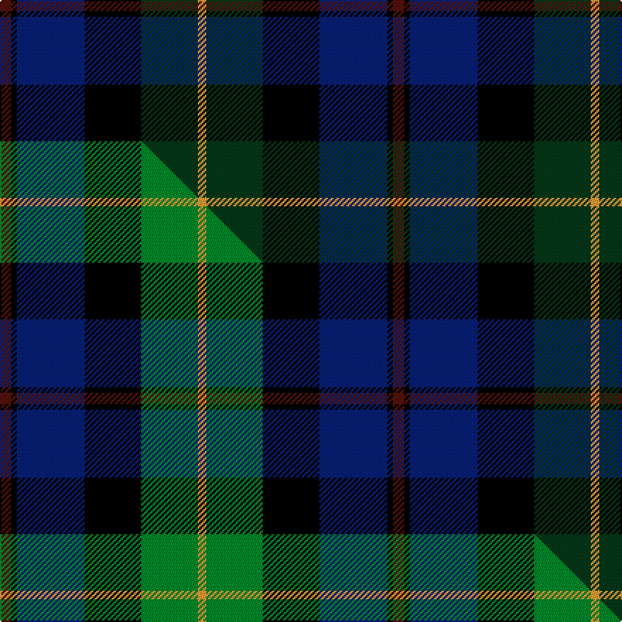

This page is one **sett** — a single exact thread-count. It belongs to the [tartan](/setts/dr4k2db24k20dg20lo3/)
(the same proportion at any scale), whose colour order is pattern [BKBKGY](/stripes/bkbkgy/).

Part of the [Loudoun's Highlanders](/tartans/loudoun-s-highlanders/) tartan — the named design grouping this sett with its other cloths.

Sourced from tartans-authority.  It is a [6 stripe tartan](/stripes/stripes6/).

Original link http://www.tartansauthority.com/tartan-ferret/display/5492/

## Register references

External register numbers recorded for this tartan.

- Scottish Tartans Authority (ITI): 5492

## Thread count
DR/8 K4 DB48 K40 DG40 LO/6

One full sett is **278 threads**.

## Palette
<table><thead><tr><th>Colour</th><th>Shade</th><th>OKLCh</th></tr></thead><tbody><tr><td>DB</td><td><code style="background-color:#082077;">#082077</code> <small style="color:#888">#082077</small></td><td><small style="color:#888">oklch(30.0% 0.149 265.1)</small></td></tr><tr><td>DR</td><td><code style="background-color:#55120C;">#55120C</code> <small style="color:#888">#55120C</small></td><td><small style="color:#888">oklch(30.0% 0.099 29.3)</small></td></tr><tr><td>LO</td><td><code style="background-color:#FF9C34;">#FF9C34</code> <small style="color:#888">#FF9C34</small></td><td><small style="color:#888">oklch(77.9% 0.161 61.8)</small></td></tr><tr><td>DG</td><td><code style="background-color:#053819;">#053819</code> <small style="color:#888">#053819</small></td><td><small style="color:#888">oklch(30.0% 0.075 151.3)</small></td></tr><tr><td>K</td><td><code style="background-color:#000000;">#000000</code> <small style="color:#888">#000000</small></td><td><small style="color:#888">oklch(0.0% 0.000 0.0)</small></td></tr></tbody></table>

# Sample pattern

## Compared to the master

This cloth is one sett of its design; the master sett (the exemplar the design is anchored on) is below for comparison.

Its **ΔTartan distance** from the master is **0.13** — the same measure the nearest-tartans table ranks by (0 is identical; a re-scale of the same cloth is near 0, a recolour or a different proportion further).

<figure class="master-compare" style="margin:0">

this sett
master sett ★

<figcaption style="color:#888;font-size:smaller">One weave of this sett against the <a href="/setts/dr4k2db24k20g20lo3/">master sett ★</a>, split on the diagonal: a shared proportion runs seamlessly across it with only the shades shifting; a different proportion breaks on it.</figcaption>
</figure>

## Nearest tartan variants

The nearest existing variants by ΔTartan distance, with this cloth at the top so the swatches line up against it.

ΔTartan

Threads

Variant

Sett

—

278

<a href="/variants/s6/dr4k2db24k20dg20lo3~x2/">Loudoun's Highlanders - 1747 #1 (Mil</a>

<a href="/ttd/edit/#slug=dr4k2db24k20g20lo3~x2&amp;base=dr4k2db24k20dg20lo3~x2" title="compare in the TTD">0.13</a>

278

<a href="/variants/s6/dr4k2db24k20g20lo3~x2/">Loudoun's Highlanders</a>

<a href="/ttd/edit/#slug=dp2dg6k2db6k1r2~x4&amp;base=dr4k2db24k20dg20lo3~x2" title="compare in the TTD">1.00</a>

136

<a href="/variants/s6/dp2dg6k2db6k1r2~x4/">MacCaughan or MacEachain (Personal)</a>

<a href="/ttd/edit/#slug=r2db16r1k10g12o2~x2&amp;base=dr4k2db24k20dg20lo3~x2" title="compare in the TTD">1.63</a>

164

<a href="/variants/s6/r2db16r1k10g12o2~x2/">MacWilliam</a>

<a href="/ttd/edit/#slug=r3k2g15k10db20k2y2~x2&amp;base=dr4k2db24k20dg20lo3~x2" title="compare in the TTD">1.74</a>

206

<a href="/variants/s7/r3k2g15k10db20k2y2~x2/">MacLeod, Macleod of Harris</a>

<a href="/ttd/edit/#slug=r3k2g15k10db20k2y2&amp;base=dr4k2db24k20dg20lo3~x2" title="compare in the TTD">1.74</a>

103

<a href="/variants/s7/r3k2g15k10db20k2y2/">MacLeod</a>

<a href="/ttd/edit/#slug=r4k2db16k17dg16k2y4~x2&amp;base=dr4k2db24k20dg20lo3~x2" title="compare in the TTD">1.75</a>

228

<a href="/variants/s7/r4k2db16k17dg16k2y4~x2/">Wilson's No.230</a>

<a href="/ttd/edit/#slug=k2g17k16dr2db17lr2~x2&amp;base=dr4k2db24k20dg20lo3~x2" title="compare in the TTD">1.78</a>

216

<a href="/variants/s6/k2g17k16dr2db17lr2~x2/">Mitchell (Clan)</a>

<a href="/ttd/edit/#slug=r1k1g7k5db10k1y1~x2&amp;base=dr4k2db24k20dg20lo3~x2" title="compare in the TTD">1.80</a>

100

<a href="/variants/s7/r1k1g7k5db10k1y1~x2/">MacLeod Small Clan Tartan</a>

<a href="/ttd/edit/#slug=k1dg8w1k8w1db8r1~x4&amp;base=dr4k2db24k20dg20lo3~x2" title="compare in the TTD">1.80</a>

216

<a href="/variants/s7/k1dg8w1k8w1db8r1~x4/">Caie (2013)</a>

<a href="/ttd/edit/#slug=r5db8k5db24k24dg24y5~x2&amp;base=dr4k2db24k20dg20lo3~x2" title="compare in the TTD">1.82</a>

360

<a href="/variants/s7/r5db8k5db24k24dg24y5~x2/">Heritage (Corporate)</a>

## Neighbour map

Every grey dot is one of 13620 variants placed by the first two principal components of the ΔTartan feature space (42% of its variance). Red is this tartan; blue dots are its nearest — click one to open its page.

<svg viewBox="0 0 640 380" role="img" style="max-width:100%;height:auto;border:1px solid #e0e0e0;border-radius:4px;display:block" xmlns="http://www.w3.org/2000/svg"><image href="/nn/cloud.v1.png" width="640" height="380"/><a href="/variants/s6/dr4k2db24k20g20lo3~x2/"><circle cx="129.1" cy="185.7" r="4" fill="#3465a4"><title>Loudoun's Highlanders</title></circle></a><a href="/variants/s6/dp2dg6k2db6k1r2~x4/"><circle cx="138.1" cy="236.0" r="4" fill="#3465a4"><title>MacCaughan or MacEachain (Personal)</title></circle></a><a href="/variants/s6/r2db16r1k10g12o2~x2/"><circle cx="153.5" cy="168.0" r="4" fill="#3465a4"><title>MacWilliam</title></circle></a><a href="/variants/s7/r3k2g15k10db20k2y2~x2/"><circle cx="142.2" cy="172.2" r="4" fill="#3465a4"><title>MacLeod, Macleod of Harris</title></circle></a><a href="/variants/s7/r3k2g15k10db20k2y2/"><circle cx="142.2" cy="172.2" r="4" fill="#3465a4"><title>MacLeod</title></circle></a><a href="/variants/s7/r4k2db16k17dg16k2y4~x2/"><circle cx="156.0" cy="182.4" r="4" fill="#3465a4"><title>Wilson's No.230</title></circle></a><a href="/variants/s6/k2g17k16dr2db17lr2~x2/"><circle cx="117.6" cy="194.6" r="4" fill="#3465a4"><title>Mitchell (Clan)</title></circle></a><a href="/variants/s7/r1k1g7k5db10k1y1~x2/"><circle cx="152.7" cy="170.1" r="4" fill="#3465a4"><title>MacLeod Small Clan Tartan</title></circle></a><a href="/variants/s7/k1dg8w1k8w1db8r1~x4/"><circle cx="116.3" cy="182.1" r="4" fill="#3465a4"><title>Caie (2013)</title></circle></a><a href="/variants/s7/r5db8k5db24k24dg24y5~x2/"><circle cx="130.1" cy="231.4" r="4" fill="#3465a4"><title>Heritage (Corporate)</title></circle></a><circle cx="171.3" cy="197.2" r="5" fill="#c00000"/><text x="320" y="376" text-anchor="middle" font-size="11" fill="#999">ground</text><text x="11" y="190" text-anchor="middle" font-size="11" fill="#999" transform="rotate(-90 11 190)">complexity</text></svg>

ID: /variants/s6/dr4k2db24k20dg20lo3~x2/
