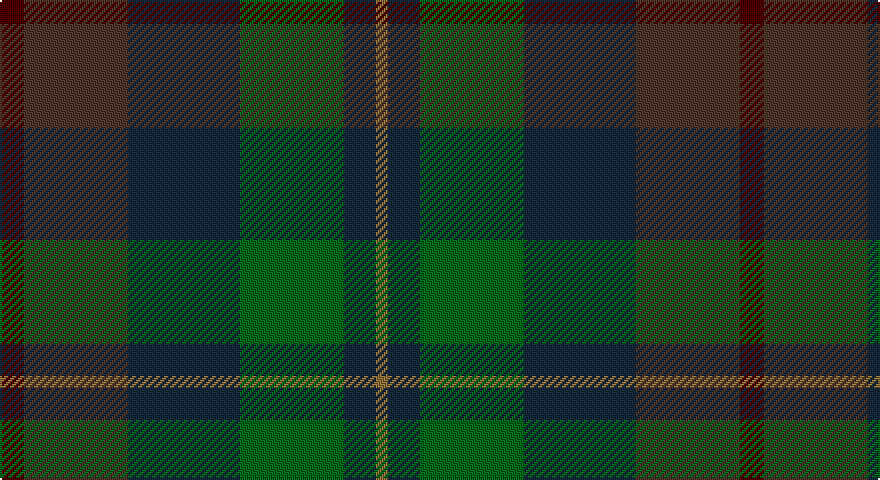

This page is one **sett** — a single exact thread-count. It belongs to the [tartan](/setts/dr6do26dt28g26dt8y3/)
(the same proportion at any scale), whose colour order is pattern [BBBGBG](/stripes/bbbgbg/).

Part of the [House of Bruar](/tartans/house-of-bruar/) tartan — the named design grouping this sett with its other cloths.

Sourced from tartans-authority.  It is a [6 stripe tartan](/stripes/stripes6/).

Original link http://www.tartansauthority.com/tartan-ferret/display/5219/

## Register references

External register numbers recorded for this tartan.

- Scottish Tartans Authority (ITI): 5219

## Thread count
DR/12 T52 DN56 G52 DN16 LT/6

One full sett is **370 threads**.

## Palette

Palette: <strong>Tartan Register</strong>
<table><thead><tr><th>Colour</th><th>Threads</th><th>Shade</th><th>Base</th><th>OKLCh</th></tr></thead><tbody><tr><td>DR/</td><td style="text-align:right;font-variant-numeric:tabular-nums">12</td><td><code style="background-color:#4C0000;">#4C0000</code> <small style="color:#888">#4C0000</small></td><td>B <code style="background-color:#2A418A;">#2A418A</code></td><td><small style="color:#888">oklch(26.2% 0.107 29.2)</small></td></tr><tr><td>T</td><td style="text-align:right;font-variant-numeric:tabular-nums">52</td><td><code style="background-color:#4C3428;">#4C3428</code> <small style="color:#888">#4C3428</small></td><td>B <code style="background-color:#2A418A;">#2A418A</code></td><td><small style="color:#888">oklch(34.9% 0.040 47.5)</small></td></tr><tr><td>DN</td><td style="text-align:right;font-variant-numeric:tabular-nums">56</td><td><code style="background-color:#14283C;">#14283C</code> <small style="color:#888">#14283C</small></td><td>B <code style="background-color:#2A418A;">#2A418A</code></td><td><small style="color:#888">oklch(27.1% 0.046 249.9)</small></td></tr><tr><td>G</td><td style="text-align:right;font-variant-numeric:tabular-nums">52</td><td><code style="background-color:#006818;">#006818</code> <small style="color:#888">#006818</small></td><td>G <code style="background-color:#006100;">#006100</code></td><td><small style="color:#888">oklch(45.0% 0.142 145.0)</small></td></tr><tr><td>DN</td><td style="text-align:right;font-variant-numeric:tabular-nums">16</td><td><code style="background-color:#14283C;">#14283C</code> <small style="color:#888">#14283C</small></td><td>B <code style="background-color:#2A418A;">#2A418A</code></td><td><small style="color:#888">oklch(27.1% 0.046 249.9)</small></td></tr><tr><td>LT/</td><td style="text-align:right;font-variant-numeric:tabular-nums">6</td><td><code style="background-color:#8C7038;">#8C7038</code> <small style="color:#888">#8C7038</small></td><td>G <code style="background-color:#006100;">#006100</code></td><td><small style="color:#888">oklch(56.0% 0.082 83.0)</small></td></tr></tbody></table>

# Sample pattern

## Compared to the master

This cloth is one sett of its design; the master sett (the exemplar the design is anchored on) is below for comparison.

<figure style="margin:0"><figcaption style="color:#888;font-size:smaller">this sett</figcaption></figure>
<figure style="margin:0"><figcaption style="color:#888;font-size:smaller"><a href="/setts/do26dt28g26dt8y3dt8g26dt28do26dr6/">master sett →</a></figcaption></figure>

## Nearest tartans

The nearest existing variants by ΔTartan distance, with this tartan at the top so the swatches line up against it.

ΔTartan

Tartan

Sett

—

<a href="/ttd/edit/#slug=dr6do26dt28g26dt8y3~x2">House of Bruar (Corporate)</a> <a class="nn-out" href="/variants/s6/dr6do26dt28g26dt8y3~x2/" title="open its dictionary page">↗</a>

1.20

<a href="/ttd/edit/#slug=do26dt28g26dt8y3dt8g26dt28do26dr6~x2&amp;base=dr6do26dt28g26dt8y3~x2">House of Bruar</a> <a class="nn-out" href="/variants/s10/do26dt28g26dt8y3dt8g26dt28do26dr6~x2/" title="open its dictionary page">↗</a>

1.24

<a href="/ttd/edit/#slug=n5t4n22k15y22o4y4~x2&amp;base=dr6do26dt28g26dt8y3~x2">Cairngorm #2</a> <a class="nn-out" href="/variants/s7/n5t4n22k15y22o4y4~x2/" title="open its dictionary page">↗</a>

1.31

<a href="/ttd/edit/#slug=dt10y3dt10r3k21dg20k15r3~x2&amp;base=dr6do26dt28g26dt8y3~x2">Williamson/Smart</a> <a class="nn-out" href="/variants/s8/dt10y3dt10r3k21dg20k15r3~x2/" title="open its dictionary page">↗</a>

1.33

<a href="/ttd/edit/#slug=dg3dt22dr10o5dg21r6dt3~x2&amp;base=dr6do26dt28g26dt8y3~x2">Swankie</a> <a class="nn-out" href="/variants/s7/dg3dt22dr10o5dg21r6dt3~x2/" title="open its dictionary page">↗</a>

1.42

<a href="/ttd/edit/#slug=dt14k5dp5k5dt14dg32r4~x2&amp;base=dr6do26dt28g26dt8y3~x2">Bennachie (Whisky)</a> <a class="nn-out" href="/variants/s7/dt14k5dp5k5dt14dg32r4~x2/" title="open its dictionary page">↗</a>

1.47

<a href="/ttd/edit/#slug=dt8db10dt22dg7g10dg22dp3~x2&amp;base=dr6do26dt28g26dt8y3~x2">Baron of Crawfordjohn (Personal)</a> <a class="nn-out" href="/variants/s7/dt8db10dt22dg7g10dg22dp3~x2/" title="open its dictionary page">↗</a>

1.58

<a href="/ttd/edit/#slug=dt1dy1dt7dy5y7lr1~x4&amp;base=dr6do26dt28g26dt8y3~x2">Dewar (WCWM)</a> <a class="nn-out" href="/variants/s6/dt1dy1dt7dy5y7lr1~x4/" title="open its dictionary page">↗</a>

1.62

<a href="/ttd/edit/#slug=r4n38k4n6k41dg62y4&amp;base=dr6do26dt28g26dt8y3~x2">Bennett, John Paul (Personal)</a> <a class="nn-out" href="/variants/s7/r4n38k4n6k41dg62y4/" title="open its dictionary page">↗</a>

1.62

<a href="/variants/s5/n8o3ni34k34dp3~x2/">Passion of Scotland, Pewter (Fashion</a>

1.62

<a href="/ttd/edit/#slug=g8n19dg29o16r4~x2&amp;base=dr6do26dt28g26dt8y3~x2">Styrian (Fashion)</a> <a class="nn-out" href="/variants/s5/g8n19dg29o16r4~x2/" title="open its dictionary page">↗</a>

## Neighbour map

Every grey dot is one of 14360 variants placed by the first two principal components of the ΔTartan feature space (44% of its variance). Red is this tartan; blue dots are its nearest — click one to open its page.

<svg viewBox="0 0 640 380" role="img" style="max-width:100%;height:auto;border:1px solid #e0e0e0;border-radius:4px;display:block" xmlns="http://www.w3.org/2000/svg"><image href="/nn/cloud.v1.png" width="640" height="380"/><a href="/variants/s10/do26dt28g26dt8y3dt8g26dt28do26dr6~x2/"><circle cx="249.7" cy="268.8" r="4" fill="#3465a4"><title>House of Bruar</title></circle></a><a href="/variants/s7/n5t4n22k15y22o4y4~x2/"><circle cx="218.8" cy="269.7" r="4" fill="#3465a4"><title>Cairngorm #2</title></circle></a><a href="/variants/s8/dt10y3dt10r3k21dg20k15r3~x2/"><circle cx="265.9" cy="278.7" r="4" fill="#3465a4"><title>Williamson/Smart</title></circle></a><a href="/variants/s7/dg3dt22dr10o5dg21r6dt3~x2/"><circle cx="217.5" cy="249.3" r="4" fill="#3465a4"><title>Swankie</title></circle></a><a href="/variants/s7/dt14k5dp5k5dt14dg32r4~x2/"><circle cx="252.8" cy="243.6" r="4" fill="#3465a4"><title>Bennachie (Whisky)</title></circle></a><a href="/variants/s7/dt8db10dt22dg7g10dg22dp3~x2/"><circle cx="242.7" cy="295.1" r="4" fill="#3465a4"><title>Baron of Crawfordjohn (Personal)</title></circle></a><a href="/variants/s6/dt1dy1dt7dy5y7lr1~x4/"><circle cx="256.3" cy="273.3" r="4" fill="#3465a4"><title>Dewar (WCWM)</title></circle></a><a href="/variants/s7/r4n38k4n6k41dg62y4/"><circle cx="291.6" cy="212.1" r="4" fill="#3465a4"><title>Bennett, John Paul (Personal)</title></circle></a><a href="/variants/s5/n8o3ni34k34dp3~x2/"><circle cx="314.1" cy="247.1" r="4" fill="#3465a4"><title>Passion of Scotland, Pewter (Fashion</title></circle></a><a href="/variants/s5/g8n19dg29o16r4~x2/"><circle cx="194.9" cy="274.2" r="4" fill="#3465a4"><title>Styrian (Fashion)</title></circle></a><circle cx="252.0" cy="273.6" r="5" fill="#c00000"/></svg>

ID: /variants/s6/dr6do26dt28g26dt8y3~x2/
