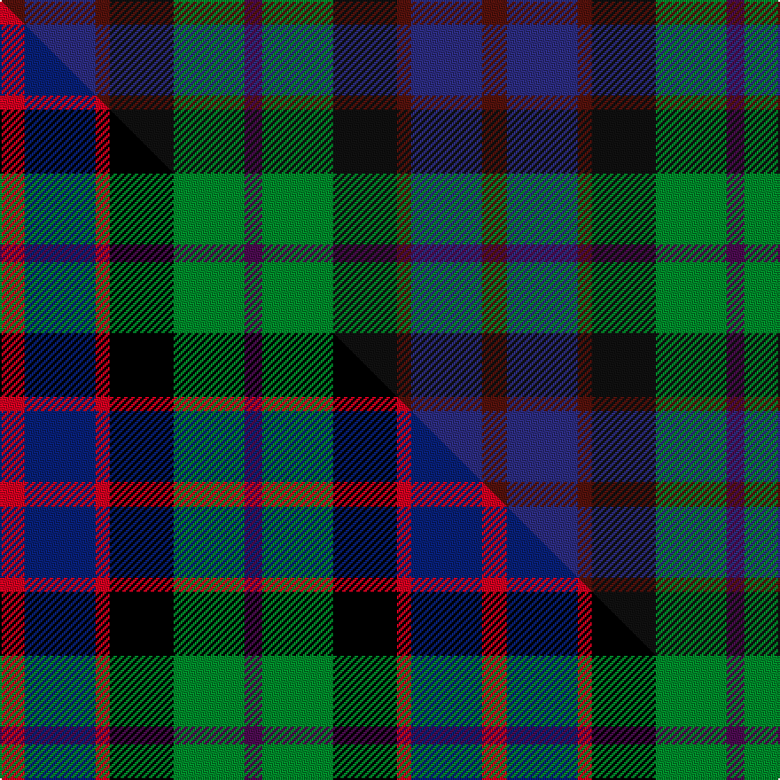

This is one **variant** — a specific cloth: this exact thread count and colourway, with its own
provenance below. It is one weaving of the [sett](/tartans/w/wi/williamson/) (the scale-free proportion — the
same cloth at any scale or shade), whose colour order is pattern [BBBKGB](/stripes/bbbkgb/).

Part of the [Williamson](/tartans/w/wi/williamson/) tartan — the named design grouping this sett with its other cloths.

Sourced from tartans-authority.  It is a [6 stripe tartan](/stripes/stripes6/).

Original link <code>http://www.tartansauthority.com/tartan-ferret/display/4077/</code> — retired · [Internet Archive copy](https://web.archive.org/web/*/http://www.tartansauthority.com/tartan-ferret/display/4077/*)

Dataset <small>— provenance for this record, inherited from the source manifest</small>

<dl class="dataset-prov">
<dt>source</dt><dd><a href="/sources/tartans-authority/">Scottish Tartans Authority</a></dd>
<dt>data captured from</dt><dd><a href="https://github.com/thetartan/tartan-database/blob/master/data/tartans-authority/data.csv">https://github.com/thetartan/tartan-database/blob/master/data/tartans-authority/data.csv</a></dd>
<dt>data date</dt><dd>Mid 1970s <small>(this record)</small></dd>
<dt>licence</dt><dd><a href="https://creativecommons.org/licenses/by-nc-nd/4.0/">CC BY-NC-ND 4.0</a></dd>
</dl>

Capture chain <small>— the hands this data passed through, oldest first; each capture carries its own licence</small>

<ol class="capture-chain">
<li><a href="https://www.tartansauthority.com/">Scottish Tartans Authority</a> <small>the heritage body’s archive — its tartan-ferret record browser is retired; dead record links are shown unlinked, with an Internet Archive copy (ITI numbers are not SRT references)</small></li>
<li><a href="https://github.com/thetartan/tartan-database">thetartan/tartan-database</a> <small>2016-2017</small> · <a href="https://creativecommons.org/licenses/by-nc-nd/4.0/">CC BY-NC-ND 4.0</a> <small>Levko Kravets's frozen compilation — the capture we vendored, and where its CC licence text came from</small></li>
<li>this dictionary <small>captured 2026-06-10 · commit 5bf86c7566</small> <small>each re-capture is a git commit to data/sources</small></li>
</ol>

## Register references

External register numbers recorded for this tartan.

- Scottish Tartans Authority (ITI): 4077

## Thread count
DR/14 DB40 DR8 K36 G40 DP/10

One full sett is **272 threads**.

## Palette
<table><thead><tr><th>Colour</th><th>Shade</th><th>OKLCh</th></tr></thead><tbody><tr><td>DB</td><td><code style="background-color:#2C2C80;">#2C2C80</code> <small style="color:#888">#2C2C80</small></td><td><small style="color:#888">oklch(35.0% 0.138 276.6)</small></td></tr><tr><td>K</td><td><code style="background-color:#101010;">#101010</code> <small style="color:#888">#101010</small></td><td><small style="color:#888">oklch(17.3% 0.000 89.9)</small></td></tr><tr><td>G</td><td><code style="background-color:#008B2A;">#008B2A</code> <small style="color:#888">#008B2A</small></td><td><small style="color:#888">oklch(55.4% 0.170 145.9)</small></td></tr><tr><td>DP</td><td><code style="background-color:#4B0B4F;">#4B0B4F</code> <small style="color:#888">#4B0B4F</small></td><td><small style="color:#888">oklch(30.1% 0.125 325.4)</small></td></tr><tr><td>DR</td><td><code style="background-color:#55120C;">#55120C</code> <small style="color:#888">#55120C</small></td><td><small style="color:#888">oklch(30.0% 0.099 29.3)</small></td></tr></tbody></table>

# Sample pattern

## Compared to the master

This cloth is one sett of its design; the master sett (the exemplar the design is anchored on) is below for comparison.

Its **ΔTartan distance** from the master is **0.16** — the same measure the nearest-tartans table ranks by (0 is identical; a re-scale of the same cloth is near 0, a recolour or a different proportion further).

<figure class="master-compare" style="margin:0">

this sett
master sett ★

<figcaption style="color:#888;font-size:smaller">One weave of this sett against the <a href="/setts/r7db20r4k18g20dp5/">master sett ★</a>, split on the diagonal: a shared proportion runs seamlessly across it with only the shades shifting; a different proportion breaks on it.</figcaption>
</figure>

## Nearest tartan variants

The nearest existing variants by ΔTartan distance, with this cloth at the top so the swatches line up against it.

ΔTartan

Threads

Variant

Sett

—

272

<a href="/variants/s6/dr7db20dr4k18g20dp5~x2~db1406275-k0700000/">Williamson (Personal)</a>

<a href="/ttd/edit/#slug=r7db20r4k18g20dp5~x2&amp;base=dr7db20dr4k18g20dp5~x2~db1406275-k0700000" title="compare in the TTD">0.16</a>

272

<a href="/variants/s6/r7db20r4k18g20dp5~x2/">Williamson (Personal)</a>

<a href="/ttd/edit/#slug=dr4db14k15dg14y4~x2&amp;base=dr7db20dr4k18g20dp5~x2~db1406275-k0700000" title="compare in the TTD">0.98</a>

188

<a href="/variants/s5/dr4db14k15dg14y4~x2/">Scots Heritage</a>

<a href="/ttd/edit/#slug=k1dg8r6db8k1~x4&amp;base=dr7db20dr4k18g20dp5~x2~db1406275-k0700000" title="compare in the TTD">1.11</a>

184

<a href="/variants/s5/k1dg8r6db8k1~x4/">Edinburgh Tattoo 50th (Commemorative</a>

<a href="/ttd/edit/#slug=r2b3n12k11dg11y2~x2~n2003284-dg1304144&amp;base=dr7db20dr4k18g20dp5~x2~db1406275-k0700000" title="compare in the TTD">1.15</a>

156

<a href="/variants/s6/r2b3n12k11dg11y2~x2~n2003284-dg1304144/">Huntly Gordon</a>

<a href="/ttd/edit/#slug=r4dg15k15db15lb4~x2&amp;base=dr7db20dr4k18g20dp5~x2~db1406275-k0700000" title="compare in the TTD">1.21</a>

196

<a href="/variants/s5/r4dg15k15db15lb4~x2/">Dalmeny #1</a>

<a href="/ttd/edit/#slug=n25g25k6dp10r6~x2~n2203265-dp1502305&amp;base=dr7db20dr4k18g20dp5~x2~db1406275-k0700000" title="compare in the TTD">1.28</a>

226

<a href="/variants/s5/n25g25k6dp10r6~x2~n2203265-dp1502305/">Breon (Jersey Shore, Pennsylvania) (Personal)</a>

<a href="/ttd/edit/#slug=db28r4k14r4dg33y4~x2&amp;base=dr7db20dr4k18g20dp5~x2~db1406275-k0700000" title="compare in the TTD">1.34</a>

284

<a href="/variants/s6/db28r4k14r4dg33y4~x2/">Royal College of Physicians of Edinburgh</a>

<a href="/ttd/edit/#slug=dp2dg6k2db6k1r2~x4&amp;base=dr7db20dr4k18g20dp5~x2~db1406275-k0700000" title="compare in the TTD">1.63</a>

136

<a href="/variants/s6/dp2dg6k2db6k1r2~x4/">MacCaughan or MacEachain (Personal)</a>

<a href="/ttd/edit/#slug=k4g16k14y3db16r4~x2&amp;base=dr7db20dr4k18g20dp5~x2~db1406275-k0700000" title="compare in the TTD">1.67</a>

212

<a href="/variants/s6/k4g16k14y3db16r4~x2/">Birse Family Tartan</a>

<a href="/ttd/edit/#slug=k4dg16k14ly3t16r4~x2&amp;base=dr7db20dr4k18g20dp5~x2~db1406275-k0700000" title="compare in the TTD">1.67</a>

212

<a href="/variants/s6/k4dg16k14ly3t16r4~x2/">Birse</a>

## Neighbour map

Every grey dot is one of 13656 variants placed by the first two principal components of the ΔTartan feature space (42% of its variance). Red is this tartan; blue dots are its nearest — click one to open its page. The map is a flat projection of a many-dimensional space — [how to read it](/posts/neighbourhood-maps/).

<svg viewBox="0 0 640 380" role="img" style="max-width:100%;height:auto;border:1px solid #e0e0e0;border-radius:4px;display:block" xmlns="http://www.w3.org/2000/svg"><image href="/nn/cloud.v1.png" width="640" height="380"/><a href="/variants/s6/r7db20r4k18g20dp5~x2/"><circle cx="51.7" cy="233.3" r="4" fill="#3465a4"><title>Williamson (Personal)</title></circle></a><a href="/variants/s5/dr4db14k15dg14y4~x2/"><circle cx="106.6" cy="279.7" r="4" fill="#3465a4"><title>Scots Heritage</title></circle></a><a href="/variants/s5/k1dg8r6db8k1~x4/"><circle cx="165.7" cy="231.2" r="4" fill="#3465a4"><title>Edinburgh Tattoo 50th (Commemorative</title></circle></a><a href="/variants/s6/r2b3n12k11dg11y2~x2~n2003284-dg1304144/"><circle cx="75.9" cy="210.7" r="4" fill="#3465a4"><title>Huntly Gordon</title></circle></a><a href="/variants/s5/r4dg15k15db15lb4~x2/"><circle cx="65.5" cy="264.3" r="4" fill="#3465a4"><title>Dalmeny #1</title></circle></a><a href="/variants/s5/n25g25k6dp10r6~x2~n2203265-dp1502305/"><circle cx="133.1" cy="261.9" r="4" fill="#3465a4"><title>Breon (Jersey Shore, Pennsylvania) (Personal)</title></circle></a><a href="/variants/s6/db28r4k14r4dg33y4~x2/"><circle cx="183.0" cy="203.3" r="4" fill="#3465a4"><title>Royal College of Physicians of Edinburgh</title></circle></a><a href="/variants/s6/dp2dg6k2db6k1r2~x4/"><circle cx="137.7" cy="235.8" r="4" fill="#3465a4"><title>MacCaughan or MacEachain (Personal)</title></circle></a><a href="/variants/s6/k4g16k14y3db16r4~x2/"><circle cx="78.4" cy="226.1" r="4" fill="#3465a4"><title>Birse Family Tartan</title></circle></a><a href="/variants/s6/k4dg16k14ly3t16r4~x2/"><circle cx="77.1" cy="225.9" r="4" fill="#3465a4"><title>Birse</title></circle></a><circle cx="110.4" cy="256.5" r="5" fill="#c00000"/><text x="320" y="376" text-anchor="middle" font-size="11" fill="#999">ground</text><text x="11" y="190" text-anchor="middle" font-size="11" fill="#999" transform="rotate(-90 11 190)">complexity</text></svg>

ID: /variants/s6/dr7db20dr4k18g20dp5~x2~db1406275-k0700000/
