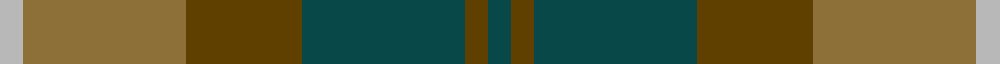
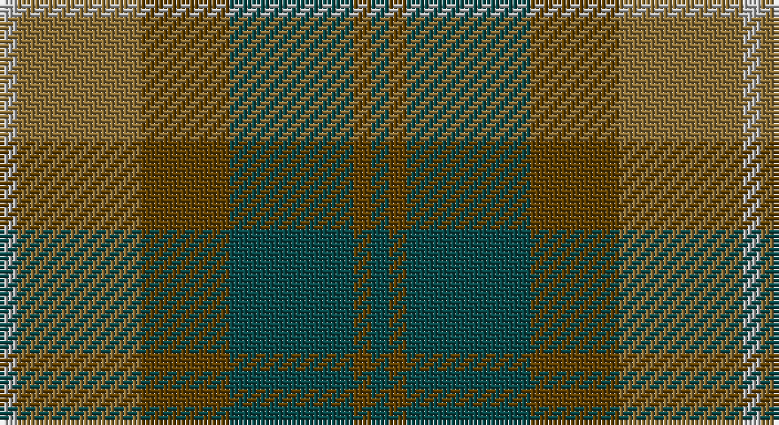

This page is one **sett** — a single exact thread-count. It belongs to the [tartan](/setts/dt1dy1dt7dy5y7lr1/)
(the same proportion at any scale), whose colour order is pattern [BGBGGY](/stripes/bgbggy/).

Part of the [Dewar](/tartans/dewar/) tartan — the named design grouping this sett with its other cloths.

Sourced from register-of-tartans.  It is a [6 stripe tartan](/stripes/stripes6/).

Original link https://www.tartanregister.gov.uk/tartanDetails.aspx?ref=925

## Also known as

This cloth is also recorded under:

- MacNab #2
- MacNab, Variant

2 attestations — the source records this cloth was collapsed from (oldest owns this page)

<ul>
<li>01/01/1979 — Dewar (WCWM) (register-of-tartans, <a href="https://www.tartanregister.gov.uk/tartanDetails.aspx?ref=925">record</a>)</li>
<li>pre 1979 — Dewar (Fashion) (tartans-authority, <a href="http://www.tartansauthority.com/tartan-ferret/display/4675/">record</a>)</li>
</ul>

## Register references

External register numbers recorded for this tartan.

- Scottish Register of Tartans: [925](https://www.tartanregister.gov.uk/tartanDetails.aspx?ref=925)
- Scottish Tartans Authority (ITI): 4675

## Thread count
N/4 LT28 T20 G28 T4 G/4

One full sett is **168 threads**.

## Palette

Palette: <strong>Tartan Register</strong> <small style="color:#888">(2 of 4 colours)</small>
<table><thead><tr><th>Colour</th><th>Threads</th><th>Shade</th><th>Base</th><th>OKLCh</th></tr></thead><tbody><tr><td>N/</td><td style="text-align:right;font-variant-numeric:tabular-nums">4</td><td><code style="background-color:#B8B8B8;">#B8B8B8</code> <small style="color:#888">#B8B8B8</small></td><td>Y <code style="background-color:#F2BF00;">#F2BF00</code></td><td><small style="color:#888">oklch(78.3% 0.000 89.9)</small></td></tr><tr><td>LT</td><td style="text-align:right;font-variant-numeric:tabular-nums">28</td><td><code style="background-color:#8C7038;">#8C7038</code> <small style="color:#888">#8C7038</small></td><td>G <code style="background-color:#006100;">#006100</code></td><td><small style="color:#888">oklch(56.0% 0.082 83.0)</small></td></tr><tr><td>T</td><td style="text-align:right;font-variant-numeric:tabular-nums">20</td><td><code style="background-color:#604000;">#604000</code> <small style="color:#888">#604000</small></td><td>G <code style="background-color:#006100;">#006100</code></td><td><small style="color:#888">oklch(39.8% 0.083 76.8)</small></td></tr><tr><td>G</td><td style="text-align:right;font-variant-numeric:tabular-nums">28</td><td><code style="background-color:#084848;">#084848</code> <small style="color:#888">#084848</small></td><td>B <code style="background-color:#2A418A;">#2A418A</code></td><td><small style="color:#888">oklch(36.5% 0.059 194.9)</small></td></tr><tr><td>T</td><td style="text-align:right;font-variant-numeric:tabular-nums">4</td><td><code style="background-color:#604000;">#604000</code> <small style="color:#888">#604000</small></td><td>G <code style="background-color:#006100;">#006100</code></td><td><small style="color:#888">oklch(39.8% 0.083 76.8)</small></td></tr><tr><td>G/</td><td style="text-align:right;font-variant-numeric:tabular-nums">4</td><td><code style="background-color:#084848;">#084848</code> <small style="color:#888">#084848</small></td><td>B <code style="background-color:#2A418A;">#2A418A</code></td><td><small style="color:#888">oklch(36.5% 0.059 194.9)</small></td></tr></tbody></table>

# Sample pattern

## Compared to the master

This cloth is one sett of its design; the master sett (the exemplar the design is anchored on) is below for comparison.

<figure style="margin:0"><figcaption style="color:#888;font-size:smaller">this sett</figcaption></figure>
<figure style="margin:0"><figcaption style="color:#888;font-size:smaller"><a href="/setts/dg1ri1dg7ri4r7ri1/">master sett →</a></figcaption></figure>

## Nearest tartans

The nearest existing variants by ΔTartan distance, with this tartan at the top so the swatches line up against it.

ΔTartan

Tartan

Sett

—

<a href="/ttd/edit/#slug=dt1dy1dt7dy5y7lr1~x4">Dewar (WCWM)</a> <a class="nn-out" href="/variants/s6/dt1dy1dt7dy5y7lr1~x4/" title="open its dictionary page">↗</a>

1.23

<a href="/ttd/edit/#slug=g4dy25g6t12g12t3~x2&amp;base=dt1dy1dt7dy5y7lr1~x4">Canadian Fancy</a> <a class="nn-out" href="/variants/s6/g4dy25g6t12g12t3~x2/" title="open its dictionary page">↗</a>

1.34

<a href="/ttd/edit/#slug=yi12dg2yi2dg2yi2dy8y8dy1~x2&amp;base=dt1dy1dt7dy5y7lr1~x4">Ancient Universal (Fashion?)</a> <a class="nn-out" href="/variants/s8/yi12dg2yi2dg2yi2dy8y8dy1~x2/" title="open its dictionary page">↗</a>

1.37

<a href="/ttd/edit/#slug=o7r3o9g15db19o14r4~x2&amp;base=dt1dy1dt7dy5y7lr1~x4">Dorward</a> <a class="nn-out" href="/variants/s7/o7r3o9g15db19o14r4~x2/" title="open its dictionary page">↗</a>

1.47

<a href="/ttd/edit/#slug=dy7r3dy9g15db19dy14r4~x2&amp;base=dt1dy1dt7dy5y7lr1~x4">Dorward/Dogwood</a> <a class="nn-out" href="/variants/s7/dy7r3dy9g15db19dy14r4~x2/" title="open its dictionary page">↗</a>

1.51

<a href="/ttd/edit/#slug=dg15r3n11b2~x2&amp;base=dt1dy1dt7dy5y7lr1~x4">MacNab WI 2</a> <a class="nn-out" href="/variants/s4/dg15r3n11b2~x2/" title="open its dictionary page">↗</a>

1.51

<a href="/ttd/edit/#slug=dg15r3n11b2&amp;base=dt1dy1dt7dy5y7lr1~x4">MacNab WI2</a> <a class="nn-out" href="/variants/s4/dg15r3n11b2/" title="open its dictionary page">↗</a>

1.52

<a href="/ttd/edit/#slug=dy46g23b23r4ly4~x2&amp;base=dt1dy1dt7dy5y7lr1~x4">McMoosie Htg (Fashion)</a> <a class="nn-out" href="/variants/s5/dy46g23b23r4ly4~x2/" title="open its dictionary page">↗</a>

1.52

<a href="/ttd/edit/#slug=n5t4n22k15y22o4y4~x2&amp;base=dt1dy1dt7dy5y7lr1~x4">Cairngorm #2</a> <a class="nn-out" href="/variants/s7/n5t4n22k15y22o4y4~x2/" title="open its dictionary page">↗</a>

1.52

<a href="/ttd/edit/#slug=dy4lg11dy14o30r4~x2&amp;base=dt1dy1dt7dy5y7lr1~x4">Trinity Bicycles</a> <a class="nn-out" href="/variants/s5/dy4lg11dy14o30r4~x2/" title="open its dictionary page">↗</a>

1.55

<a href="/ttd/edit/#slug=g32dy7g7dy16db32ly3dy8~x2&amp;base=dt1dy1dt7dy5y7lr1~x4">Strange of Balcaskie (Clan)</a> <a class="nn-out" href="/variants/s7/g32dy7g7dy16db32ly3dy8~x2/" title="open its dictionary page">↗</a>

## Neighbour map

Every grey dot is one of 14360 variants placed by the first two principal components of the ΔTartan feature space (44% of its variance). Red is this tartan; blue dots are its nearest — click one to open its page.

<svg viewBox="0 0 640 380" role="img" style="max-width:100%;height:auto;border:1px solid #e0e0e0;border-radius:4px;display:block" xmlns="http://www.w3.org/2000/svg"><image href="/nn/cloud.v1.png" width="640" height="380"/><a href="/variants/s6/g4dy25g6t12g12t3~x2/"><circle cx="302.4" cy="289.8" r="4" fill="#3465a4"><title>Canadian Fancy</title></circle></a><a href="/variants/s8/yi12dg2yi2dg2yi2dy8y8dy1~x2/"><circle cx="283.4" cy="227.7" r="4" fill="#3465a4"><title>Ancient Universal (Fashion?)</title></circle></a><a href="/variants/s7/o7r3o9g15db19o14r4~x2/"><circle cx="230.3" cy="279.1" r="4" fill="#3465a4"><title>Dorward</title></circle></a><a href="/variants/s7/dy7r3dy9g15db19dy14r4~x2/"><circle cx="229.6" cy="280.8" r="4" fill="#3465a4"><title>Dorward/Dogwood</title></circle></a><a href="/variants/s4/dg15r3n11b2~x2/"><circle cx="335.6" cy="300.6" r="4" fill="#3465a4"><title>MacNab WI 2</title></circle></a><a href="/variants/s4/dg15r3n11b2/"><circle cx="335.6" cy="300.6" r="4" fill="#3465a4"><title>MacNab WI2</title></circle></a><a href="/variants/s5/dy46g23b23r4ly4~x2/"><circle cx="283.4" cy="239.5" r="4" fill="#3465a4"><title>McMoosie Htg (Fashion)</title></circle></a><a href="/variants/s7/n5t4n22k15y22o4y4~x2/"><circle cx="218.8" cy="269.7" r="4" fill="#3465a4"><title>Cairngorm #2</title></circle></a><a href="/variants/s5/dy4lg11dy14o30r4~x2/"><circle cx="317.1" cy="270.9" r="4" fill="#3465a4"><title>Trinity Bicycles</title></circle></a><a href="/variants/s7/g32dy7g7dy16db32ly3dy8~x2/"><circle cx="243.8" cy="241.3" r="4" fill="#3465a4"><title>Strange of Balcaskie (Clan)</title></circle></a><circle cx="256.3" cy="273.3" r="5" fill="#c00000"/></svg>

ID: /variants/s6/dt1dy1dt7dy5y7lr1~x4/
