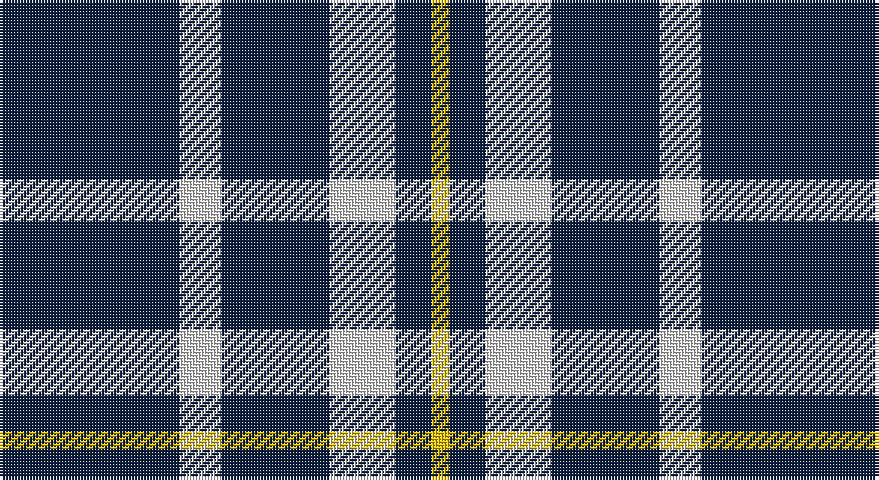

This page is one **sett** — a single exact thread-count. It belongs to the [tartan](/setts/dt30w7dt18w11dt6ly3/)
(the same proportion at any scale), whose colour order is pattern [BWBWBY](/stripes/bwbwby/).

Sourced from weddslist.  It is a [6 stripe tartan](/stripes/stripes6/).

Original link http://www.weddslist.com/cgi-bin/tartans/pg.pl?source=sts

## Thread count
DB/60 LN14 DB36 LN22 DB12 Y/6

One full sett is **234 threads**.

## Palette

Palette: <strong>Tartan Dictionary</strong> <small style="color:#888">(1 of 3 colours)</small>
<table><thead><tr><th>Colour</th><th>Threads</th><th>Shade</th><th>Base</th><th>OKLCh</th></tr></thead><tbody><tr><td>DB/</td><td style="text-align:right;font-variant-numeric:tabular-nums">60</td><td><code style="background-color:#102040;">#102040</code> <small style="color:#888">#102040</small></td><td>B <code style="background-color:#2A418A;">#2A418A</code></td><td><small style="color:#888">oklch(24.9% 0.065 262.6)</small></td></tr><tr><td>LN</td><td style="text-align:right;font-variant-numeric:tabular-nums">14</td><td><code style="background-color:#E0E0E0;">#E0E0E0</code> <small style="color:#888">#E0E0E0</small></td><td>W <code style="background-color:#F7F7F7;">#F7F7F7</code></td><td><small style="color:#888">oklch(90.7% 0.000 89.9)</small></td></tr><tr><td>DB</td><td style="text-align:right;font-variant-numeric:tabular-nums">36</td><td><code style="background-color:#102040;">#102040</code> <small style="color:#888">#102040</small></td><td>B <code style="background-color:#2A418A;">#2A418A</code></td><td><small style="color:#888">oklch(24.9% 0.065 262.6)</small></td></tr><tr><td>LN</td><td style="text-align:right;font-variant-numeric:tabular-nums">22</td><td><code style="background-color:#E0E0E0;">#E0E0E0</code> <small style="color:#888">#E0E0E0</small></td><td>W <code style="background-color:#F7F7F7;">#F7F7F7</code></td><td><small style="color:#888">oklch(90.7% 0.000 89.9)</small></td></tr><tr><td>DB</td><td style="text-align:right;font-variant-numeric:tabular-nums">12</td><td><code style="background-color:#102040;">#102040</code> <small style="color:#888">#102040</small></td><td>B <code style="background-color:#2A418A;">#2A418A</code></td><td><small style="color:#888">oklch(24.9% 0.065 262.6)</small></td></tr><tr><td>Y/</td><td style="text-align:right;font-variant-numeric:tabular-nums">6</td><td><code style="background-color:#F0C000;">#F0C000</code> <small style="color:#888">#F0C000</small></td><td>Y <code style="background-color:#F2BF00;">#F2BF00</code></td><td><small style="color:#888">oklch(82.7% 0.169 90.5)</small></td></tr></tbody></table>

# Sample pattern

## Nearest tartans

The nearest existing variants by ΔTartan distance, with this tartan at the top so the swatches line up against it.

ΔTartan

Tartan

Sett

—

<a href="/ttd/edit/#slug=dt30w7dt18w11dt6ly3~x2">Ochterlonie</a> <a class="nn-out" href="/variants/s6/dt30w7dt18w11dt6ly3~x2/" title="open its dictionary page">↗</a>

1.24

<a href="/ttd/edit/#slug=k21w2k5w9k13g2~x4&amp;base=dt30w7dt18w11dt6ly3~x2">New Zealand District Tartan</a> <a class="nn-out" href="/variants/s6/k21w2k5w9k13g2~x4/" title="open its dictionary page">↗</a>

1.26

<a href="/ttd/edit/#slug=lr3k3lr3k10r1~x6&amp;base=dt30w7dt18w11dt6ly3~x2">Burberry Blue</a> <a class="nn-out" href="/variants/s5/lr3k3lr3k10r1~x6/" title="open its dictionary page">↗</a>

1.40

<a href="/ttd/edit/#slug=db40w8db25w14db8ly4~x2&amp;base=dt30w7dt18w11dt6ly3~x2">Auchterlonie (Personal)</a> <a class="nn-out" href="/variants/s6/db40w8db25w14db8ly4~x2/" title="open its dictionary page">↗</a>

1.42

<a href="/ttd/edit/#slug=t50k4t12k23lo4k4~x2&amp;base=dt30w7dt18w11dt6ly3~x2">Sligo Irish County Tartan</a> <a class="nn-out" href="/variants/s6/t50k4t12k23lo4k4~x2/" title="open its dictionary page">↗</a>

1.57

<a href="/ttd/edit/#slug=db36lo5db8lb3db8lb10db3~x2&amp;base=dt30w7dt18w11dt6ly3~x2">Scottish Qualifications Auth. (Corp)</a> <a class="nn-out" href="/variants/s7/db36lo5db8lb3db8lb10db3~x2/" title="open its dictionary page">↗</a>

1.58

<a href="/ttd/edit/#slug=db35lr8db21lr13db6lo4~x2&amp;base=dt30w7dt18w11dt6ly3~x2">Ochterlonie</a> <a class="nn-out" href="/variants/s6/db35lr8db21lr13db6lo4~x2/" title="open its dictionary page">↗</a>

1.59

<a href="/ttd/edit/#slug=t12ly2t1k5t4k2~x4&amp;base=dt30w7dt18w11dt6ly3~x2">Rea</a> <a class="nn-out" href="/variants/s6/t12ly2t1k5t4k2~x4/" title="open its dictionary page">↗</a>

1.65

<a href="/ttd/edit/#slug=k46dy7k8w20~x2&amp;base=dt30w7dt18w11dt6ly3~x2">Lords of Skye (Fashion?)</a> <a class="nn-out" href="/variants/s4/k46dy7k8w20~x2/" title="open its dictionary page">↗</a>

1.66

<a href="/ttd/edit/#slug=k2lb5k1lb1k10r1k1~x4&amp;base=dt30w7dt18w11dt6ly3~x2">Lundy Reform</a> <a class="nn-out" href="/variants/s7/k2lb5k1lb1k10r1k1~x4/" title="open its dictionary page">↗</a>

1.68

<a href="/ttd/edit/#slug=k14r2k4lb3k12r8k1~x2&amp;base=dt30w7dt18w11dt6ly3~x2">Punky Princess (Fashion)</a> <a class="nn-out" href="/variants/s7/k14r2k4lb3k12r8k1~x2/" title="open its dictionary page">↗</a>

## Neighbour map

Every grey dot is one of 14360 variants placed by the first two principal components of the ΔTartan feature space (44% of its variance). Red is this tartan; blue dots are its nearest — click one to open its page.

<svg viewBox="0 0 640 380" role="img" style="max-width:100%;height:auto;border:1px solid #e0e0e0;border-radius:4px;display:block" xmlns="http://www.w3.org/2000/svg"><image href="/nn/cloud.v1.png" width="640" height="380"/><a href="/variants/s6/k21w2k5w9k13g2~x4/"><circle cx="414.8" cy="228.2" r="4" fill="#3465a4"><title>New Zealand District Tartan</title></circle></a><a href="/variants/s5/lr3k3lr3k10r1~x6/"><circle cx="351.1" cy="237.5" r="4" fill="#3465a4"><title>Burberry Blue</title></circle></a><a href="/variants/s6/db40w8db25w14db8ly4~x2/"><circle cx="396.7" cy="223.4" r="4" fill="#3465a4"><title>Auchterlonie (Personal)</title></circle></a><a href="/variants/s6/t50k4t12k23lo4k4~x2/"><circle cx="369.2" cy="198.3" r="4" fill="#3465a4"><title>Sligo Irish County Tartan</title></circle></a><a href="/variants/s7/db36lo5db8lb3db8lb10db3~x2/"><circle cx="453.2" cy="202.5" r="4" fill="#3465a4"><title>Scottish Qualifications Auth. (Corp)</title></circle></a><a href="/variants/s6/db35lr8db21lr13db6lo4~x2/"><circle cx="387.2" cy="240.0" r="4" fill="#3465a4"><title>Ochterlonie</title></circle></a><a href="/variants/s6/t12ly2t1k5t4k2~x4/"><circle cx="363.3" cy="219.2" r="4" fill="#3465a4"><title>Rea</title></circle></a><a href="/variants/s4/k46dy7k8w20~x2/"><circle cx="334.9" cy="250.9" r="4" fill="#3465a4"><title>Lords of Skye (Fashion?)</title></circle></a><a href="/variants/s7/k2lb5k1lb1k10r1k1~x4/"><circle cx="376.1" cy="196.2" r="4" fill="#3465a4"><title>Lundy Reform</title></circle></a><a href="/variants/s7/k14r2k4lb3k12r8k1~x2/"><circle cx="398.0" cy="211.4" r="4" fill="#3465a4"><title>Punky Princess (Fashion)</title></circle></a><circle cx="383.1" cy="229.4" r="5" fill="#c00000"/></svg>

ID: /variants/s6/dt30w7dt18w11dt6ly3~x2/
