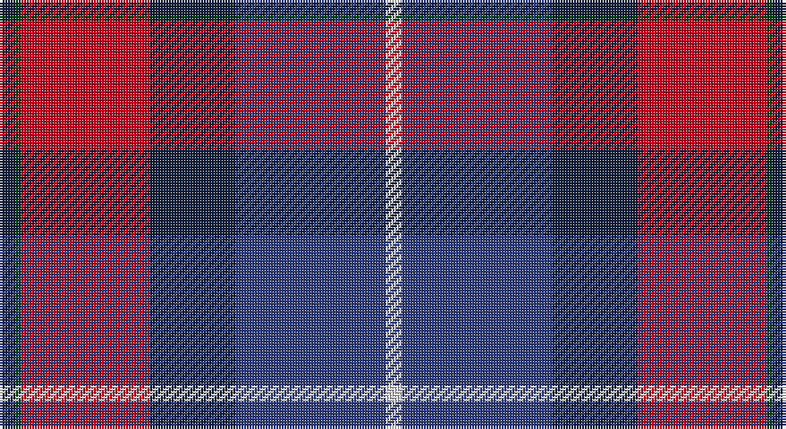

This page is one **sett** — a single exact thread-count. It belongs to the [tartan](/setts/dt3dg1r24dt16db28w3/)
(the same proportion at any scale), whose colour order is pattern [BGRBBW](/stripes/bgrbbw/).

Part of the [Diaspora](/tartans/diaspora/) tartan — the named design grouping this sett with its other cloths.

Sourced from weddslist.  It is a [6 stripe tartan](/stripes/stripes6/).

Original link http://www.weddslist.com/cgi-bin/tartans/pg.pl?source=sts

## Thread count
DB/6 DG2 R48 DB32 B56 LN/6

One full sett is **288 threads**.

## Palette

Palette: <strong>Tartan Dictionary</strong> <small style="color:#888">(1 of 5 colours)</small>
<table><thead><tr><th>Colour</th><th>Threads</th><th>Shade</th><th>Base</th><th>OKLCh</th></tr></thead><tbody><tr><td>DB/</td><td style="text-align:right;font-variant-numeric:tabular-nums">6</td><td><code style="background-color:#102040;">#102040</code> <small style="color:#888">#102040</small></td><td>B <code style="background-color:#2A418A;">#2A418A</code></td><td><small style="color:#888">oklch(24.9% 0.065 262.6)</small></td></tr><tr><td>DG</td><td style="text-align:right;font-variant-numeric:tabular-nums">2</td><td><code style="background-color:#004010;">#004010</code> <small style="color:#888">#004010</small></td><td>G <code style="background-color:#006100;">#006100</code></td><td><small style="color:#888">oklch(32.3% 0.098 146.3)</small></td></tr><tr><td>R</td><td style="text-align:right;font-variant-numeric:tabular-nums">48</td><td><code style="background-color:#C00020;">#C00020</code> <small style="color:#888">#C00020</small></td><td>R <code style="background-color:#CC0000;">#CC0000</code></td><td><small style="color:#888">oklch(50.9% 0.206 24.5)</small></td></tr><tr><td>DB</td><td style="text-align:right;font-variant-numeric:tabular-nums">32</td><td><code style="background-color:#102040;">#102040</code> <small style="color:#888">#102040</small></td><td>B <code style="background-color:#2A418A;">#2A418A</code></td><td><small style="color:#888">oklch(24.9% 0.065 262.6)</small></td></tr><tr><td>B</td><td style="text-align:right;font-variant-numeric:tabular-nums">56</td><td><code style="background-color:#304080;">#304080</code> <small style="color:#888">#304080</small></td><td>B <code style="background-color:#2A418A;">#2A418A</code></td><td><small style="color:#888">oklch(39.4% 0.109 270.2)</small></td></tr><tr><td>LN/</td><td style="text-align:right;font-variant-numeric:tabular-nums">6</td><td><code style="background-color:#E0E0E0;">#E0E0E0</code> <small style="color:#888">#E0E0E0</small></td><td>W <code style="background-color:#F7F7F7;">#F7F7F7</code></td><td><small style="color:#888">oklch(90.7% 0.000 89.9)</small></td></tr></tbody></table>

# Sample pattern

## Compared to the master

This cloth is one sett of its design; the master sett (the exemplar the design is anchored on) is below for comparison.

<figure style="margin:0"><figcaption style="color:#888;font-size:smaller">this sett</figcaption></figure>
<figure style="margin:0"><figcaption style="color:#888;font-size:smaller"><a href="/setts/db3dg1r22k12db28lb3/">master sett →</a></figcaption></figure>

## Nearest tartans

The nearest existing variants by ΔTartan distance, with this tartan at the top so the swatches line up against it.

ΔTartan

Tartan

Sett

—

<a href="/ttd/edit/#slug=dt3dg1r24dt16db28w3~x2">Diaspora</a> <a class="nn-out" href="/variants/s6/dt3dg1r24dt16db28w3~x2/" title="open its dictionary page">↗</a>

0.92

<a href="/ttd/edit/#slug=t4ly1r28db24k5t5k3~x4&amp;base=dt3dg1r24dt16db28w3~x2">McKnight #2 (Personal)</a> <a class="nn-out" href="/variants/s7/t4ly1r28db24k5t5k3~x4/" title="open its dictionary page">↗</a>

1.02

<a href="/ttd/edit/#slug=lb3db28k12r22dg1~x2&amp;base=dt3dg1r24dt16db28w3~x2">Diaspora (Fashion)</a> <a class="nn-out" href="/variants/s5/lb3db28k12r22dg1~x2/" title="open its dictionary page">↗</a>

1.10

<a href="/ttd/edit/#slug=db3dg1r22k12db28lb3~x2&amp;base=dt3dg1r24dt16db28w3~x2">Diaspora</a> <a class="nn-out" href="/variants/s6/db3dg1r22k12db28lb3~x2/" title="open its dictionary page">↗</a>

1.11

<a href="/ttd/edit/#slug=dbi4ly1r28db25k10dbi5k3~x2&amp;base=dt3dg1r24dt16db28w3~x2">McKnight (Personal)</a> <a class="nn-out" href="/variants/s7/dbi4ly1r28db25k10dbi5k3~x2/" title="open its dictionary page">↗</a>

1.22

<a href="/ttd/edit/#slug=dg3k24lo1r18db18w1~x2&amp;base=dt3dg1r24dt16db28w3~x2">Hegarty, Philip David (Personal)</a> <a class="nn-out" href="/variants/s6/dg3k24lo1r18db18w1~x2/" title="open its dictionary page">↗</a>

1.23

<a href="/ttd/edit/#slug=dp72k40dg23r4dg23k2w4~x2&amp;base=dt3dg1r24dt16db28w3~x2">Ferguson Unidentified</a> <a class="nn-out" href="/variants/s7/dp72k40dg23r4dg23k2w4~x2/" title="open its dictionary page">↗</a>

1.25

<a href="/ttd/edit/#slug=dg8db5k1db17r10db2r10o2~x2&amp;base=dt3dg1r24dt16db28w3~x2">Harrower, John Anthony (Personal)</a> <a class="nn-out" href="/variants/s8/dg8db5k1db17r10db2r10o2~x2/" title="open its dictionary page">↗</a>

1.29

<a href="/ttd/edit/#slug=w3dg18db22r19dg1r2~x2&amp;base=dt3dg1r24dt16db28w3~x2">Nibley (Personal)</a> <a class="nn-out" href="/variants/s6/w3dg18db22r19dg1r2~x2/" title="open its dictionary page">↗</a>

1.32

<a href="/ttd/edit/#slug=db4dg2r18ri10dg10db29b4~x2&amp;base=dt3dg1r24dt16db28w3~x2">Ross Dempster (Personal)</a> <a class="nn-out" href="/variants/s7/db4dg2r18ri10dg10db29b4~x2/" title="open its dictionary page">↗</a>

1.34

<a href="/ttd/edit/#slug=db26dg11r8k2r2w2r4w1r15~x2&amp;base=dt3dg1r24dt16db28w3~x2">Royal Scottish Assurance</a> <a class="nn-out" href="/variants/s9/db26dg11r8k2r2w2r4w1r15~x2/" title="open its dictionary page">↗</a>

## Neighbour map

Every grey dot is one of 14360 variants placed by the first two principal components of the ΔTartan feature space (44% of its variance). Red is this tartan; blue dots are its nearest — click one to open its page.

<svg viewBox="0 0 640 380" role="img" style="max-width:100%;height:auto;border:1px solid #e0e0e0;border-radius:4px;display:block" xmlns="http://www.w3.org/2000/svg"><image href="/nn/cloud.v1.png" width="640" height="380"/><a href="/variants/s7/t4ly1r28db24k5t5k3~x4/"><circle cx="248.7" cy="129.3" r="4" fill="#3465a4"><title>McKnight #2 (Personal)</title></circle></a><a href="/variants/s5/lb3db28k12r22dg1~x2/"><circle cx="264.2" cy="180.7" r="4" fill="#3465a4"><title>Diaspora (Fashion)</title></circle></a><a href="/variants/s6/db3dg1r22k12db28lb3~x2/"><circle cx="281.6" cy="166.3" r="4" fill="#3465a4"><title>Diaspora</title></circle></a><a href="/variants/s7/dbi4ly1r28db25k10dbi5k3~x2/"><circle cx="225.0" cy="136.1" r="4" fill="#3465a4"><title>McKnight (Personal)</title></circle></a><a href="/variants/s6/dg3k24lo1r18db18w1~x2/"><circle cx="211.8" cy="149.0" r="4" fill="#3465a4"><title>Hegarty, Philip David (Personal)</title></circle></a><a href="/variants/s7/dp72k40dg23r4dg23k2w4~x2/"><circle cx="281.1" cy="144.9" r="4" fill="#3465a4"><title>Ferguson Unidentified</title></circle></a><a href="/variants/s8/dg8db5k1db17r10db2r10o2~x2/"><circle cx="247.3" cy="175.7" r="4" fill="#3465a4"><title>Harrower, John Anthony (Personal)</title></circle></a><a href="/variants/s6/w3dg18db22r19dg1r2~x2/"><circle cx="224.2" cy="180.6" r="4" fill="#3465a4"><title>Nibley (Personal)</title></circle></a><a href="/variants/s7/db4dg2r18ri10dg10db29b4~x2/"><circle cx="224.6" cy="184.6" r="4" fill="#3465a4"><title>Ross Dempster (Personal)</title></circle></a><a href="/variants/s9/db26dg11r8k2r2w2r4w1r15~x2/"><circle cx="251.6" cy="126.3" r="4" fill="#3465a4"><title>Royal Scottish Assurance</title></circle></a><circle cx="242.9" cy="159.1" r="5" fill="#c00000"/></svg>

ID: /variants/s6/dt3dg1r24dt16db28w3~x2/
