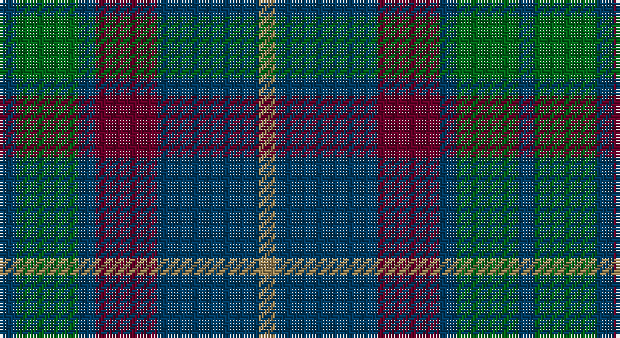

This page is one **sett** — a single exact thread-count. It belongs to the [tartan](/setts/dt3g11dt3dr11dt18lo3/)
(the same proportion at any scale), whose colour order is pattern [BGBBBY](/stripes/bgbbby/).

Sourced from register-of-tartans.  It is a [6 stripe tartan](/stripes/stripes6/).

Original link https://www.tartanregister.gov.uk/tartanDetails.aspx?ref=1592

## Also known as

This cloth is also recorded under:

- Harbour Town Hilton Head, The
- The Harbour Town, Hilton Head

2 attestations — the source records this cloth was collapsed from (oldest owns this page)

<ul>
<li>01/01/1994 — Harbour Town Hilton Head, The (register-of-tartans, <a href="https://www.tartanregister.gov.uk/tartanDetails.aspx?ref=1592">record</a>)</li>
<li>Jul. 1996 — Harbour Town (Corporate) (tartans-authority, <a href="http://www.tartansauthority.com/tartan-ferret/display/2335/">record</a>)</li>
</ul>

## Register references

External register numbers recorded for this tartan.

- Scottish Register of Tartans: [1592](https://www.tartanregister.gov.uk/tartanDetails.aspx?ref=1592)
- Scottish Tartans Authority (ITI): 2335
- Scottish Tartans World Register: 2335

## Thread count
DB/6 G22 DB6 DR22 DB36 LT/6

One full sett is **184 threads**.

## Palette

Palette: <strong>Tartan Register</strong>
<table><thead><tr><th>Colour</th><th>Threads</th><th>Shade</th><th>Base</th><th>OKLCh</th></tr></thead><tbody><tr><td>DB/</td><td style="text-align:right;font-variant-numeric:tabular-nums">6</td><td><code style="background-color:#003C64;">#003C64</code> <small style="color:#888">#003C64</small></td><td>B <code style="background-color:#2A418A;">#2A418A</code></td><td><small style="color:#888">oklch(34.5% 0.089 246.0)</small></td></tr><tr><td>G</td><td style="text-align:right;font-variant-numeric:tabular-nums">22</td><td><code style="background-color:#006818;">#006818</code> <small style="color:#888">#006818</small></td><td>G <code style="background-color:#006100;">#006100</code></td><td><small style="color:#888">oklch(45.0% 0.142 145.0)</small></td></tr><tr><td>DB</td><td style="text-align:right;font-variant-numeric:tabular-nums">6</td><td><code style="background-color:#003C64;">#003C64</code> <small style="color:#888">#003C64</small></td><td>B <code style="background-color:#2A418A;">#2A418A</code></td><td><small style="color:#888">oklch(34.5% 0.089 246.0)</small></td></tr><tr><td>DR</td><td style="text-align:right;font-variant-numeric:tabular-nums">22</td><td><code style="background-color:#680028;">#680028</code> <small style="color:#888">#680028</small></td><td>B <code style="background-color:#2A418A;">#2A418A</code></td><td><small style="color:#888">oklch(33.1% 0.133 8.3)</small></td></tr><tr><td>DB</td><td style="text-align:right;font-variant-numeric:tabular-nums">36</td><td><code style="background-color:#003C64;">#003C64</code> <small style="color:#888">#003C64</small></td><td>B <code style="background-color:#2A418A;">#2A418A</code></td><td><small style="color:#888">oklch(34.5% 0.089 246.0)</small></td></tr><tr><td>LT/</td><td style="text-align:right;font-variant-numeric:tabular-nums">6</td><td><code style="background-color:#A08858;">#A08858</code> <small style="color:#888">#A08858</small></td><td>Y <code style="background-color:#F2BF00;">#F2BF00</code></td><td><small style="color:#888">oklch(63.7% 0.071 84.0)</small></td></tr></tbody></table>

# Sample pattern

## Nearest tartans

The nearest existing variants by ΔTartan distance, with this tartan at the top so the swatches line up against it.

ΔTartan

Tartan

Sett

—

<a href="/ttd/edit/#slug=dt3g11dt3dr11dt18lo3~x2">Harbour Town Hilton Head, The</a> <a class="nn-out" href="/variants/s6/dt3g11dt3dr11dt18lo3~x2/" title="open its dictionary page">↗</a>

1.05

<a href="/ttd/edit/#slug=dp4n18k17n3g18n4~x2&amp;base=dt3g11dt3dr11dt18lo3~x2">Scottish Airports (Corporate)</a> <a class="nn-out" href="/variants/s6/dp4n18k17n3g18n4~x2/" title="open its dictionary page">↗</a>

1.06

<a href="/ttd/edit/#slug=dg14r3db9t2~x2&amp;base=dt3g11dt3dr11dt18lo3~x2">Unidentified #4</a> <a class="nn-out" href="/variants/s4/dg14r3db9t2~x2/" title="open its dictionary page">↗</a>

1.09

<a href="/ttd/edit/#slug=k3dg12k12r2db12k3~x2&amp;base=dt3g11dt3dr11dt18lo3~x2">Ferguson of Balquhidder #3</a> <a class="nn-out" href="/variants/s6/k3dg12k12r2db12k3~x2/" title="open its dictionary page">↗</a>

1.13

<a href="/ttd/edit/#slug=db2k2db12k8dg11r2~x2&amp;base=dt3g11dt3dr11dt18lo3~x2">Murray #3</a> <a class="nn-out" href="/variants/s6/db2k2db12k8dg11r2~x2/" title="open its dictionary page">↗</a>

1.14

<a href="/ttd/edit/#slug=n4g18n3k17n18p4~x2&amp;base=dt3g11dt3dr11dt18lo3~x2">Scottish Airports</a> <a class="nn-out" href="/variants/s6/n4g18n3k17n18p4~x2/" title="open its dictionary page">↗</a>

1.19

<a href="/ttd/edit/#slug=o1b7k4b1g7b1~x4&amp;base=dt3g11dt3dr11dt18lo3~x2">Flower of Scotland Commemorative Tartan</a> <a class="nn-out" href="/variants/s6/o1b7k4b1g7b1~x4/" title="open its dictionary page">↗</a>

1.19

<a href="/ttd/edit/#slug=o1b7k4b1g7b1~x2&amp;base=dt3g11dt3dr11dt18lo3~x2">Flower of Scotland MINI Tartan</a> <a class="nn-out" href="/variants/s6/o1b7k4b1g7b1~x2/" title="open its dictionary page">↗</a>

1.23

<a href="/ttd/edit/#slug=dt6r15dg41r15dt20dg41db6&amp;base=dt3g11dt3dr11dt18lo3~x2">Bean of Freeport (Personal)</a> <a class="nn-out" href="/variants/s7/dt6r15dg41r15dt20dg41db6/" title="open its dictionary page">↗</a>

1.24

<a href="/ttd/edit/#slug=t4dy28dg6t12k12t3~x2&amp;base=dt3g11dt3dr11dt18lo3~x2">Thompson/Thomson/MacTavish Hunting</a> <a class="nn-out" href="/variants/s6/t4dy28dg6t12k12t3~x2/" title="open its dictionary page">↗</a>

1.29

<a href="/ttd/edit/#slug=k2dg8db2k9dp7k2~x2&amp;base=dt3g11dt3dr11dt18lo3~x2">Campbell, Sir Walter Scott</a> <a class="nn-out" href="/variants/s6/k2dg8db2k9dp7k2~x2/" title="open its dictionary page">↗</a>

## Neighbour map

Every grey dot is one of 14360 variants placed by the first two principal components of the ΔTartan feature space (44% of its variance). Red is this tartan; blue dots are its nearest — click one to open its page.

<svg viewBox="0 0 640 380" role="img" style="max-width:100%;height:auto;border:1px solid #e0e0e0;border-radius:4px;display:block" xmlns="http://www.w3.org/2000/svg"><image href="/nn/cloud.v1.png" width="640" height="380"/><a href="/variants/s6/dp4n18k17n3g18n4~x2/"><circle cx="223.0" cy="281.8" r="4" fill="#3465a4"><title>Scottish Airports (Corporate)</title></circle></a><a href="/variants/s4/dg14r3db9t2~x2/"><circle cx="292.0" cy="285.5" r="4" fill="#3465a4"><title>Unidentified #4</title></circle></a><a href="/variants/s6/k3dg12k12r2db12k3~x2/"><circle cx="225.2" cy="281.2" r="4" fill="#3465a4"><title>Ferguson of Balquhidder #3</title></circle></a><a href="/variants/s6/db2k2db12k8dg11r2~x2/"><circle cx="217.5" cy="273.5" r="4" fill="#3465a4"><title>Murray #3</title></circle></a><a href="/variants/s6/n4g18n3k17n18p4~x2/"><circle cx="211.5" cy="276.1" r="4" fill="#3465a4"><title>Scottish Airports</title></circle></a><a href="/variants/s6/o1b7k4b1g7b1~x4/"><circle cx="238.7" cy="253.6" r="4" fill="#3465a4"><title>Flower of Scotland Commemorative Tartan</title></circle></a><a href="/variants/s6/o1b7k4b1g7b1~x2/"><circle cx="238.7" cy="253.6" r="4" fill="#3465a4"><title>Flower of Scotland MINI Tartan</title></circle></a><a href="/variants/s7/dt6r15dg41r15dt20dg41db6/"><circle cx="311.0" cy="263.3" r="4" fill="#3465a4"><title>Bean of Freeport (Personal)</title></circle></a><a href="/variants/s6/t4dy28dg6t12k12t3~x2/"><circle cx="249.8" cy="242.4" r="4" fill="#3465a4"><title>Thompson/Thomson/MacTavish Hunting</title></circle></a><a href="/variants/s6/k2dg8db2k9dp7k2~x2/"><circle cx="224.1" cy="294.6" r="4" fill="#3465a4"><title>Campbell, Sir Walter Scott</title></circle></a><circle cx="278.0" cy="278.7" r="5" fill="#c00000"/></svg>

ID: /variants/s6/dt3g11dt3dr11dt18lo3~x2/
