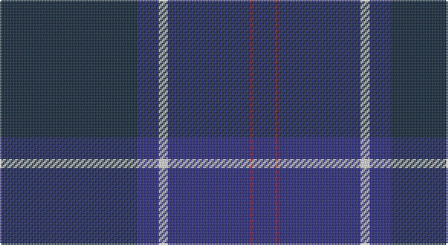

This page is one **sett** — a single exact thread-count. It belongs to the [tartan](/setts/dt45db7w3db27r1db7/)
(the same proportion at any scale), whose colour order is pattern [BBWBRB](/stripes/bbwbrb/).

Sourced from tartans-authority.  It is a [6 stripe tartan](/stripes/stripes6/).

Original link http://www.tartansauthority.com/tartan-ferret/display/80/

## Register references

External register numbers recorded for this tartan.

- Scottish Tartans Authority (ITI): 80

## Thread count
DN/90 DB14 LN6 DB54 R2 DB/14

One full sett is **256 threads**.

## Palette

Palette: <strong>Tartan Register</strong>
<table><thead><tr><th>Colour</th><th>Threads</th><th>Shade</th><th>Base</th><th>OKLCh</th></tr></thead><tbody><tr><td>DN/</td><td style="text-align:right;font-variant-numeric:tabular-nums">90</td><td><code style="background-color:#14283C;">#14283C</code> <small style="color:#888">#14283C</small></td><td>B <code style="background-color:#2A418A;">#2A418A</code></td><td><small style="color:#888">oklch(27.1% 0.046 249.9)</small></td></tr><tr><td>DB</td><td style="text-align:right;font-variant-numeric:tabular-nums">14</td><td><code style="background-color:#2C2C80;">#2C2C80</code> <small style="color:#888">#2C2C80</small></td><td>B <code style="background-color:#2A418A;">#2A418A</code></td><td><small style="color:#888">oklch(35.0% 0.138 276.6)</small></td></tr><tr><td>LN</td><td style="text-align:right;font-variant-numeric:tabular-nums">6</td><td><code style="background-color:#E0E0E0;">#E0E0E0</code> <small style="color:#888">#E0E0E0</small></td><td>W <code style="background-color:#F7F7F7;">#F7F7F7</code></td><td><small style="color:#888">oklch(90.7% 0.000 89.9)</small></td></tr><tr><td>DB</td><td style="text-align:right;font-variant-numeric:tabular-nums">54</td><td><code style="background-color:#2C2C80;">#2C2C80</code> <small style="color:#888">#2C2C80</small></td><td>B <code style="background-color:#2A418A;">#2A418A</code></td><td><small style="color:#888">oklch(35.0% 0.138 276.6)</small></td></tr><tr><td>R</td><td style="text-align:right;font-variant-numeric:tabular-nums">2</td><td><code style="background-color:#C80000;">#C80000</code> <small style="color:#888">#C80000</small></td><td>R <code style="background-color:#CC0000;">#CC0000</code></td><td><small style="color:#888">oklch(52.3% 0.215 29.2)</small></td></tr><tr><td>DB/</td><td style="text-align:right;font-variant-numeric:tabular-nums">14</td><td><code style="background-color:#2C2C80;">#2C2C80</code> <small style="color:#888">#2C2C80</small></td><td>B <code style="background-color:#2A418A;">#2A418A</code></td><td><small style="color:#888">oklch(35.0% 0.138 276.6)</small></td></tr></tbody></table>

# Sample pattern

## Nearest tartans

The nearest existing variants by ΔTartan distance, with this tartan at the top so the swatches line up against it.

ΔTartan

Tartan

Sett

—

<a href="/ttd/edit/#slug=dt45db7w3db27r1db7~x2">U.S. Navy/Edzell (Military)</a> <a class="nn-out" href="/variants/s6/dt45db7w3db27r1db7~x2/" title="open its dictionary page">↗</a>

1.44

<a href="/ttd/edit/#slug=g2db1dbi29db2g9db26ly2~x2&amp;base=dt45db7w3db27r1db7~x2">Scottish Canals (Corporate)</a> <a class="nn-out" href="/variants/s7/g2db1dbi29db2g9db26ly2~x2/" title="open its dictionary page">↗</a>

1.45

<a href="/ttd/edit/#slug=k1y3db3do28db36y1~x2&amp;base=dt45db7w3db27r1db7~x2">Potts (Personal)</a> <a class="nn-out" href="/variants/s6/k1y3db3do28db36y1~x2/" title="open its dictionary page">↗</a>

1.49

<a href="/ttd/edit/#slug=db56k4w1db6k20w2k20~x2&amp;base=dt45db7w3db27r1db7~x2">Dalziel Rugby Club (Corporate)</a> <a class="nn-out" href="/variants/s7/db56k4w1db6k20w2k20~x2/" title="open its dictionary page">↗</a>

1.55

<a href="/ttd/edit/#slug=y1db36do28db3y3ly1~x2&amp;base=dt45db7w3db27r1db7~x2">Potts (Personal)</a> <a class="nn-out" href="/variants/s6/y1db36do28db3y3ly1~x2/" title="open its dictionary page">↗</a>

1.60

<a href="/ttd/edit/#slug=db80k28dp9k3m5k12~x2&amp;base=dt45db7w3db27r1db7~x2">Earl Blue Marl</a> <a class="nn-out" href="/variants/s6/db80k28dp9k3m5k12~x2/" title="open its dictionary page">↗</a>

1.69

<a href="/ttd/edit/#slug=k4y1dp5y1k20db37y4db4~x2&amp;base=dt45db7w3db27r1db7~x2">Finnie (Personal)</a> <a class="nn-out" href="/variants/s8/k4y1dp5y1k20db37y4db4~x2/" title="open its dictionary page">↗</a>

1.72

<a href="/ttd/edit/#slug=dt104db16w8db66r3db16&amp;base=dt45db7w3db27r1db7~x2">US Navy Edzell</a> <a class="nn-out" href="/variants/s6/dt104db16w8db66r3db16/" title="open its dictionary page">↗</a>

1.76

<a href="/ttd/edit/#slug=db3k12db3k17db40k2db2w1~x2&amp;base=dt45db7w3db27r1db7~x2">Blue Spirit Fashion Tartan</a> <a class="nn-out" href="/variants/s8/db3k12db3k17db40k2db2w1~x2/" title="open its dictionary page">↗</a>

1.77

<a href="/ttd/edit/#slug=db19k4dr1k4dg9dr1~x4&amp;base=dt45db7w3db27r1db7~x2">Monarchs</a> <a class="nn-out" href="/variants/s6/db19k4dr1k4dg9dr1~x4/" title="open its dictionary page">↗</a>

1.83

<a href="/ttd/edit/#slug=dg2k1db29k2dg9k27lo2~x2&amp;base=dt45db7w3db27r1db7~x2">Caledonian Canals (Corporate)</a> <a class="nn-out" href="/variants/s7/dg2k1db29k2dg9k27lo2~x2/" title="open its dictionary page">↗</a>

## Neighbour map

Every grey dot is one of 14360 variants placed by the first two principal components of the ΔTartan feature space (44% of its variance). Red is this tartan; blue dots are its nearest — click one to open its page.

<svg viewBox="0 0 640 380" role="img" style="max-width:100%;height:auto;border:1px solid #e0e0e0;border-radius:4px;display:block" xmlns="http://www.w3.org/2000/svg"><image href="/nn/cloud.v1.png" width="640" height="380"/><a href="/variants/s7/g2db1dbi29db2g9db26ly2~x2/"><circle cx="359.3" cy="199.4" r="4" fill="#3465a4"><title>Scottish Canals (Corporate)</title></circle></a><a href="/variants/s6/k1y3db3do28db36y1~x2/"><circle cx="472.5" cy="197.6" r="4" fill="#3465a4"><title>Potts (Personal)</title></circle></a><a href="/variants/s7/db56k4w1db6k20w2k20~x2/"><circle cx="499.6" cy="195.5" r="4" fill="#3465a4"><title>Dalziel Rugby Club (Corporate)</title></circle></a><a href="/variants/s6/y1db36do28db3y3ly1~x2/"><circle cx="452.8" cy="187.0" r="4" fill="#3465a4"><title>Potts (Personal)</title></circle></a><a href="/variants/s6/db80k28dp9k3m5k12~x2/"><circle cx="453.0" cy="201.0" r="4" fill="#3465a4"><title>Earl Blue Marl</title></circle></a><a href="/variants/s8/k4y1dp5y1k20db37y4db4~x2/"><circle cx="466.6" cy="197.6" r="4" fill="#3465a4"><title>Finnie (Personal)</title></circle></a><a href="/variants/s6/dt104db16w8db66r3db16/"><circle cx="458.8" cy="229.0" r="4" fill="#3465a4"><title>US Navy Edzell</title></circle></a><a href="/variants/s8/db3k12db3k17db40k2db2w1~x2/"><circle cx="537.3" cy="205.8" r="4" fill="#3465a4"><title>Blue Spirit Fashion Tartan</title></circle></a><a href="/variants/s6/db19k4dr1k4dg9dr1~x4/"><circle cx="381.0" cy="233.2" r="4" fill="#3465a4"><title>Monarchs</title></circle></a><a href="/variants/s7/dg2k1db29k2dg9k27lo2~x2/"><circle cx="360.7" cy="202.1" r="4" fill="#3465a4"><title>Caledonian Canals (Corporate)</title></circle></a><circle cx="450.4" cy="200.6" r="5" fill="#c00000"/></svg>

ID: /variants/s6/dt45db7w3db27r1db7~x2/
