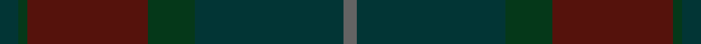

This is one **variant** — a specific cloth: this exact thread count and colourway, with its own
provenance below. It is one weaving of the [sett](/tartans/d/de/dempster-3/) (the scale-free proportion — the
same cloth at any scale or shade), whose colour order is pattern [BBGBGB](/stripes/bbgbgb/).

Part of the [Dempster](/tartans/d/de/dempster-3/) tartan — the named design grouping this sett with its other cloths.

Sourced from house-of-tartan.  It is a [6 stripe tartan](/stripes/stripes6/).

Original link [http://www.house-of-tartan.scotland.net/house/TartanViewjs.asp?colr=Def&tnam=2219](http://www.house-of-tartan.scotland.net/house/TartanViewjs.asp?colr=Def&tnam=2219)

## Provenance

Earliest known date: 2001 Designed by Claire Donaldson of the House of Edgar.

Dataset <small>— provenance for this record, inherited from the source manifest</small>

<dl class="dataset-prov">
<dt>source</dt><dd><a href="/sources/house-of-tartan/">House of Tartan</a></dd>
<dt>data captured from</dt><dd><a href="https://github.com/thetartan/tartan-database/blob/master/data/house-of-tartan/data.csv">https://github.com/thetartan/tartan-database/blob/master/data/house-of-tartan/data.csv</a></dd>
<dt>data date</dt><dd>2001 <small>(this record)</small></dd>
<dt>licence</dt><dd><a href="https://creativecommons.org/licenses/by-nc-nd/4.0/">CC BY-NC-ND 4.0</a></dd>
</dl>

Capture chain <small>— the hands this data passed through, oldest first; each capture carries its own licence</small>

<ol class="capture-chain">
<li><a href="http://www.house-of-tartan.scotland.net/">House of Tartan</a> <small>the weaver/retailer's database — the site is now offline; the URL is kept as the ultimate source's identity</small></li>
<li><a href="https://github.com/thetartan/tartan-database">thetartan/tartan-database</a> <small>2016-2017</small> · <a href="https://creativecommons.org/licenses/by-nc-nd/4.0/">CC BY-NC-ND 4.0</a> <small>Levko Kravets's frozen compilation — the capture we vendored, and where its CC licence text came from</small></li>
<li>this dictionary <small>captured 2026-06-10 · commit 5bf86c7566</small> <small>each re-capture is a git commit to data/sources</small></li>
</ol>

## Thread count
DT/8 DG4 DR52 DG20 DT64 N/6

One full sett is **294 threads**.

## Palette
<table><thead><tr><th>Colour</th><th>Shade</th><th>OKLCh</th></tr></thead><tbody><tr><td>DT</td><td><code style="background-color:#023535;">#023535</code> <small style="color:#888">#023535</small></td><td><small style="color:#888">oklch(29.8% 0.050 194.8)</small></td></tr><tr><td>DR</td><td><code style="background-color:#55120C;">#55120C</code> <small style="color:#888">#55120C</small></td><td><small style="color:#888">oklch(30.0% 0.099 29.3)</small></td></tr><tr><td>G</td><td><code style="background-color:#008B2A;">#008B2A</code> <small style="color:#888">#008B2A</small></td><td><small style="color:#888">oklch(55.4% 0.170 145.9)</small></td></tr><tr><td>DG</td><td><code style="background-color:#053819;">#053819</code> <small style="color:#888">#053819</small></td><td><small style="color:#888">oklch(30.0% 0.075 151.3)</small></td></tr><tr><td>N</td><td><code style="background-color:#636363;">#636363</code> <small style="color:#888">#636363</small></td><td><small style="color:#888">oklch(50.0% 0.000 89.9)</small></td></tr><tr><td>R</td><td><code style="background-color:#D60020;">#D60020</code> <small style="color:#888">#D60020</small></td><td><small style="color:#888">oklch(55.2% 0.224 25.5)</small></td></tr></tbody></table>

# Sample pattern

## Nearest tartan variants

The nearest existing variants by ΔTartan distance, with this cloth at the top so the swatches line up against it.

ΔTartan

Threads

Variant

Sett

—

294

<a href="/variants/s6/dt4dg2dr26dg10dt32n3~x2/">Dempster Family Tartan</a>

<a href="/ttd/edit/#slug=dp5db8dt13dg21db34dt55do3&amp;base=dt4dg2dr26dg10dt32n3~x2" title="compare in the TTD">3.78</a>

270

<a href="/variants/s7/dp5db8dt13dg21db34dt55do3/">Bouncing Blackie (Personal)</a>

<a href="/ttd/edit/#slug=dt4dr1dt4dr1dg14n1dg1~x4&amp;base=dt4dg2dr26dg10dt32n3~x2" title="compare in the TTD">3.81</a>

188

<a href="/variants/s7/dt4dr1dt4dr1dg14n1dg1~x4/">Pinehurst Resort</a>

<a href="/ttd/edit/#slug=db13dt13dg21db34dt55do3&amp;base=dt4dg2dr26dg10dt32n3~x2" title="compare in the TTD">3.81</a>

262

<a href="/variants/s6/db13dt13dg21db34dt55do3/">Bouncing Blackie (Personal)</a>

## Neighbour map

Every grey dot is one of 13662 variants placed by the first two principal components of the ΔTartan feature space (42% of its variance). Red is this tartan; blue dots are its nearest — click one to open its page. The map is a flat projection of a many-dimensional space — [how to read it](/posts/neighbourhood-maps/).

<svg viewBox="0 0 640 380" role="img" style="max-width:100%;height:auto;border:1px solid #e0e0e0;border-radius:4px;display:block" xmlns="http://www.w3.org/2000/svg"><image href="/nn/cloud.v1.png" width="640" height="380"/><a href="/variants/s7/dp5db8dt13dg21db34dt55do3/"><circle cx="554.5" cy="285.6" r="4" fill="#3465a4"><title>Bouncing Blackie (Personal)</title></circle></a><a href="/variants/s7/dt4dr1dt4dr1dg14n1dg1~x4/"><circle cx="626.0" cy="320.2" r="4" fill="#3465a4"><title>Pinehurst Resort</title></circle></a><a href="/variants/s6/db13dt13dg21db34dt55do3/"><circle cx="578.1" cy="320.2" r="4" fill="#3465a4"><title>Bouncing Blackie (Personal)</title></circle></a><circle cx="556.2" cy="298.0" r="5" fill="#c00000"/><text x="320" y="376" text-anchor="middle" font-size="11" fill="#999">ground</text><text x="11" y="190" text-anchor="middle" font-size="11" fill="#999" transform="rotate(-90 11 190)">complexity</text></svg>

ID: /variants/s6/dt4dg2dr26dg10dt32n3~x2/
