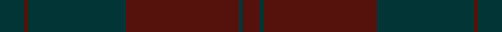

This page is one **sett** — a single exact thread-count. It belongs to the [tartan](/setts/dt6dr1dt24dr28dt1dr4/)
(the same proportion at any scale), whose colour order is pattern [BBBBBB](/stripes/bbbbbb/).

Sourced from register-of-tartans.  It is a [6 stripe tartan](/stripes/stripes6/).

Original link https://www.tartanregister.gov.uk/tartanDetails.aspx?ref=2843

2 attestations — the source records this cloth was collapsed from (oldest owns this page)

<ul>
<li>01/01/1993 — Mary Erskine School, The (register-of-tartans, <a href="https://www.tartanregister.gov.uk/tartanDetails.aspx?ref=2843">record</a>)  <em>Designed for the Mary Erskine School Edinburgh, 1993, using the school colours.</em></li>
<li>pre 2002 — Mary Erskin (School) (tartans-authority, <a href="http://www.tartansauthority.com/tartan-ferret/display/2185/">record</a>)  <em>Mary Erskin School, Edinburgh. This is the same as the 1750 sett known as MacGregor of Deeside and the same as #1185 - Erskine black and red.</em></li>
</ul>

## Register references

External register numbers recorded for this tartan.

- Scottish Register of Tartans: [2843](https://www.tartanregister.gov.uk/tartanDetails.aspx?ref=2843)
- Scottish Tartans Authority (ITI): 2185
- Scottish Tartans World Register: 2185

## Thread count
DT/12 DR2 DT48 DR56 DT2 DR/8

One full sett is **236 threads**.

## Palette
<table><thead><tr><th>Colour</th><th>Shade</th><th>OKLCh</th></tr></thead><tbody><tr><td>DN</td><td><code style="background-color:#023535;">#023535</code> <small style="color:#888">#023535</small></td><td><small style="color:#888">oklch(29.8% 0.050 194.8)</small></td></tr><tr><td>DR</td><td><code style="background-color:#55120C;">#55120C</code> <small style="color:#888">#55120C</small></td><td><small style="color:#888">oklch(30.0% 0.099 29.3)</small></td></tr></tbody></table>

# Sample pattern

## Nearest variants

The nearest existing variants by ΔTartan distance, with this cloth at the top so the swatches line up against it.

ΔTartan

Threads

Variant

Sett

—

236

<a href="/variants/s6/dt6dr1dt24dr28dt1dr4~x2/">Mary Erskine School, The</a>

<a href="/ttd/edit/#slug=dg28dr4dp27dr27dg28dr5dp2~x2&amp;base=dt6dr1dt24dr28dt1dr4~x2" title="compare in the TTD">2.76</a>

424

<a href="/variants/s7/dg28dr4dp27dr27dg28dr5dp2~x2/">Madder - 1819</a>

<a href="/ttd/edit/#slug=dp26dr6dg16dp8dg3dr2~x2&amp;base=dt6dr1dt24dr28dt1dr4~x2" title="compare in the TTD">2.96</a>

188

<a href="/variants/s6/dp26dr6dg16dp8dg3dr2~x2/">Perthshire Tourist Board (Corporate)</a>

<a href="/ttd/edit/#slug=dr100dg4dr8dg18dr3~x2&amp;base=dt6dr1dt24dr28dt1dr4~x2" title="compare in the TTD">3.00</a>

326

<a href="/variants/s5/dr100dg4dr8dg18dr3~x2/">KaDeWe</a>

<a href="/ttd/edit/#slug=dr6dg2b2dg17dr2~x4&amp;base=dt6dr1dt24dr28dt1dr4~x2" title="compare in the TTD">3.00</a>

200

<a href="/variants/s5/dr6dg2b2dg17dr2~x4/">Loton (Personal)</a>

## Neighbour map

Every grey dot is one of 13620 variants placed by the first two principal components of the ΔTartan feature space (42% of its variance). Red is this tartan; blue dots are its nearest — click one to open its page.

<svg viewBox="0 0 640 380" role="img" style="max-width:100%;height:auto;border:1px solid #e0e0e0;border-radius:4px;display:block" xmlns="http://www.w3.org/2000/svg"><image href="/nn/cloud.v1.png" width="640" height="380"/><a href="/variants/s7/dg28dr4dp27dr27dg28dr5dp2~x2/"><circle cx="497.3" cy="308.5" r="4" fill="#3465a4"><title>Madder - 1819</title></circle></a><a href="/variants/s6/dp26dr6dg16dp8dg3dr2~x2/"><circle cx="549.5" cy="293.4" r="4" fill="#3465a4"><title>Perthshire Tourist Board (Corporate)</title></circle></a><a href="/variants/s5/dr100dg4dr8dg18dr3~x2/"><circle cx="626.0" cy="237.8" r="4" fill="#3465a4"><title>KaDeWe</title></circle></a><a href="/variants/s5/dr6dg2b2dg17dr2~x4/"><circle cx="570.8" cy="293.5" r="4" fill="#3465a4"><title>Loton (Personal)</title></circle></a><circle cx="626.0" cy="302.6" r="5" fill="#c00000"/><text x="320" y="376" text-anchor="middle" font-size="11" fill="#999">ground</text><text x="11" y="190" text-anchor="middle" font-size="11" fill="#999" transform="rotate(-90 11 190)">complexity</text></svg>

ID: /variants/s6/dt6dr1dt24dr28dt1dr4~x2/
