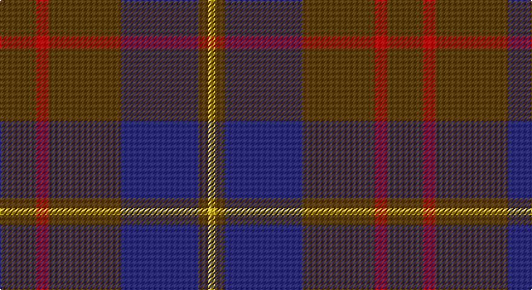

This page is one **sett** — a single exact thread-count. It belongs to the [tartan](/setts/dy15r5dy30db32dy4ly3/)
(the same proportion at any scale), whose colour order is pattern [GRGBGY](/stripes/grgbgy/).

Sourced from house-of-tartan.  It is a [6 stripe tartan](/stripes/stripes6/).

Original link http://www.house-of-tartan.scotland.net/house/TartanViewjs.asp?colr=Def&tnam=1745

## Provenance

Earliest known date: 1916 Nothing

## Thread count
T/30 R10 T60 DB64 T8 Y/6

One full sett is **320 threads**.

## Palette

Palette: <strong>Tartan Register</strong>
<table><thead><tr><th>Colour</th><th>Threads</th><th>Shade</th><th>Base</th><th>OKLCh</th></tr></thead><tbody><tr><td>T/</td><td style="text-align:right;font-variant-numeric:tabular-nums">30</td><td><code style="background-color:#604000;">#604000</code> <small style="color:#888">#604000</small></td><td>G <code style="background-color:#006100;">#006100</code></td><td><small style="color:#888">oklch(39.8% 0.083 76.8)</small></td></tr><tr><td>R</td><td style="text-align:right;font-variant-numeric:tabular-nums">10</td><td><code style="background-color:#C80000;">#C80000</code> <small style="color:#888">#C80000</small></td><td>R <code style="background-color:#CC0000;">#CC0000</code></td><td><small style="color:#888">oklch(52.3% 0.215 29.2)</small></td></tr><tr><td>T</td><td style="text-align:right;font-variant-numeric:tabular-nums">60</td><td><code style="background-color:#604000;">#604000</code> <small style="color:#888">#604000</small></td><td>G <code style="background-color:#006100;">#006100</code></td><td><small style="color:#888">oklch(39.8% 0.083 76.8)</small></td></tr><tr><td>DB</td><td style="text-align:right;font-variant-numeric:tabular-nums">64</td><td><code style="background-color:#2C2C80;">#2C2C80</code> <small style="color:#888">#2C2C80</small></td><td>B <code style="background-color:#2A418A;">#2A418A</code></td><td><small style="color:#888">oklch(35.0% 0.138 276.6)</small></td></tr><tr><td>T</td><td style="text-align:right;font-variant-numeric:tabular-nums">8</td><td><code style="background-color:#604000;">#604000</code> <small style="color:#888">#604000</small></td><td>G <code style="background-color:#006100;">#006100</code></td><td><small style="color:#888">oklch(39.8% 0.083 76.8)</small></td></tr><tr><td>Y/</td><td style="text-align:right;font-variant-numeric:tabular-nums">6</td><td><code style="background-color:#E8C000;">#E8C000</code> <small style="color:#888">#E8C000</small></td><td>Y <code style="background-color:#F2BF00;">#F2BF00</code></td><td><small style="color:#888">oklch(81.9% 0.168 93.7)</small></td></tr></tbody></table>

# Sample pattern

## Nearest tartans

The nearest existing variants by ΔTartan distance, with this tartan at the top so the swatches line up against it.

ΔTartan

Tartan

Sett

—

<a href="/ttd/edit/#slug=dy15r5dy30db32dy4ly3~x2">Cameron Hunting Brown Clan Tartan</a> <a class="nn-out" href="/variants/s6/dy15r5dy30db32dy4ly3~x2/" title="open its dictionary page">↗</a>

0.72

<a href="/ttd/edit/#slug=do15r5do30b32do4lo3~x2&amp;base=dy15r5dy30db32dy4ly3~x2">Cameron Hunting</a> <a class="nn-out" href="/variants/s6/do15r5do30b32do4lo3~x2/" title="open its dictionary page">↗</a>

0.93

<a href="/ttd/edit/#slug=dy34db27r3db27dy34w3~x2&amp;base=dy15r5dy30db32dy4ly3~x2">London Regiment</a> <a class="nn-out" href="/variants/s6/dy34db27r3db27dy34w3~x2/" title="open its dictionary page">↗</a>

1.07

<a href="/ttd/edit/#slug=db18ly2o6ly2o19r3~x2&amp;base=dy15r5dy30db32dy4ly3~x2">Balfour blue &amp; brown</a> <a class="nn-out" href="/variants/s6/db18ly2o6ly2o19r3~x2/" title="open its dictionary page">↗</a>

1.07

<a href="/ttd/edit/#slug=db18ly2dy6ly2dy19r3~x2&amp;base=dy15r5dy30db32dy4ly3~x2">Balfour #2</a> <a class="nn-out" href="/variants/s6/db18ly2dy6ly2dy19r3~x2/" title="open its dictionary page">↗</a>

1.07

<a href="/ttd/edit/#slug=db18ly2dy6ly2dy19r3~x4&amp;base=dy15r5dy30db32dy4ly3~x2">Balfour (Clan)</a> <a class="nn-out" href="/variants/s6/db18ly2dy6ly2dy19r3~x4/" title="open its dictionary page">↗</a>

1.11

<a href="/ttd/edit/#slug=dp26r6g16dp8g3r2~x2&amp;base=dy15r5dy30db32dy4ly3~x2">Perthshire Tourist Board (Corporate)</a> <a class="nn-out" href="/variants/s6/dp26r6g16dp8g3r2~x2/" title="open its dictionary page">↗</a>

1.16

<a href="/ttd/edit/#slug=y30ly3y3ly3y12do30k3do5~x2&amp;base=dy15r5dy30db32dy4ly3~x2">Dama Classic</a> <a class="nn-out" href="/variants/s8/y30ly3y3ly3y12do30k3do5~x2/" title="open its dictionary page">↗</a>

1.22

<a href="/ttd/edit/#slug=db6r15dg41r15db20dg41dbi6&amp;base=dy15r5dy30db32dy4ly3~x2">Bean Hunting Clan Tartan</a> <a class="nn-out" href="/variants/s7/db6r15dg41r15db20dg41dbi6/" title="open its dictionary page">↗</a>

1.22

<a href="/ttd/edit/#slug=r1db12y5db2y4lb1~x2&amp;base=dy15r5dy30db32dy4ly3~x2">Connaught Green</a> <a class="nn-out" href="/variants/s6/r1db12y5db2y4lb1~x2/" title="open its dictionary page">↗</a>

1.24

<a href="/ttd/edit/#slug=o15r5o30db32o4ly3~x2&amp;base=dy15r5dy30db32dy4ly3~x2">Cameron, hunting</a> <a class="nn-out" href="/variants/s6/o15r5o30db32o4ly3~x2/" title="open its dictionary page">↗</a>

## Neighbour map

Every grey dot is one of 14360 variants placed by the first two principal components of the ΔTartan feature space (44% of its variance). Red is this tartan; blue dots are its nearest — click one to open its page.

<svg viewBox="0 0 640 380" role="img" style="max-width:100%;height:auto;border:1px solid #e0e0e0;border-radius:4px;display:block" xmlns="http://www.w3.org/2000/svg"><image href="/nn/cloud.v1.png" width="640" height="380"/><a href="/variants/s6/do15r5do30b32do4lo3~x2/"><circle cx="348.5" cy="235.0" r="4" fill="#3465a4"><title>Cameron Hunting</title></circle></a><a href="/variants/s6/dy34db27r3db27dy34w3~x2/"><circle cx="343.2" cy="255.2" r="4" fill="#3465a4"><title>London Regiment</title></circle></a><a href="/variants/s6/db18ly2o6ly2o19r3~x2/"><circle cx="316.8" cy="227.3" r="4" fill="#3465a4"><title>Balfour blue &amp; brown</title></circle></a><a href="/variants/s6/db18ly2dy6ly2dy19r3~x2/"><circle cx="297.0" cy="219.3" r="4" fill="#3465a4"><title>Balfour #2</title></circle></a><a href="/variants/s6/db18ly2dy6ly2dy19r3~x4/"><circle cx="297.0" cy="219.3" r="4" fill="#3465a4"><title>Balfour (Clan)</title></circle></a><a href="/variants/s6/dp26r6g16dp8g3r2~x2/"><circle cx="378.4" cy="240.4" r="4" fill="#3465a4"><title>Perthshire Tourist Board (Corporate)</title></circle></a><a href="/variants/s8/y30ly3y3ly3y12do30k3do5~x2/"><circle cx="335.5" cy="212.8" r="4" fill="#3465a4"><title>Dama Classic</title></circle></a><a href="/variants/s7/db6r15dg41r15db20dg41dbi6/"><circle cx="306.2" cy="259.4" r="4" fill="#3465a4"><title>Bean Hunting Clan Tartan</title></circle></a><a href="/variants/s6/r1db12y5db2y4lb1~x2/"><circle cx="353.3" cy="220.4" r="4" fill="#3465a4"><title>Connaught Green</title></circle></a><a href="/variants/s6/o15r5o30db32o4ly3~x2/"><circle cx="378.5" cy="245.6" r="4" fill="#3465a4"><title>Cameron, hunting</title></circle></a><circle cx="355.4" cy="235.9" r="5" fill="#c00000"/></svg>

ID: /variants/s6/dy15r5dy30db32dy4ly3~x2/
