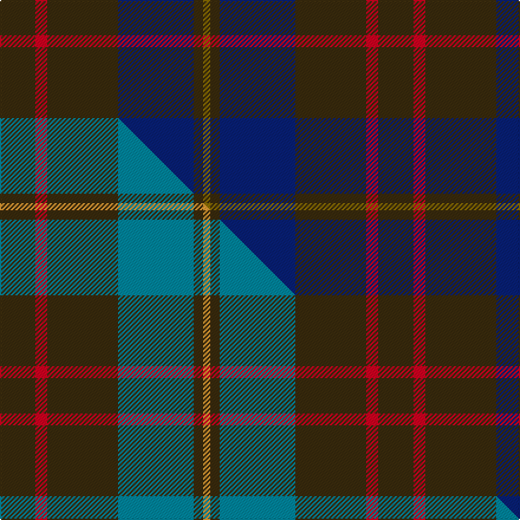

This page is one **sett** — a single exact thread-count. It belongs to the [tartan](/setts/dy15r5dy30db32dy4y3/)
(the same proportion at any scale), whose colour order is pattern [GGBGRG](/stripes/ggbgrg/).

Part of the [Cameron Hunting](/tartans/cameron-hunting-2/) tartan — the named design grouping this sett with its other cloths.

Sourced from house-of-tartan.  It is a [6 stripe tartan](/stripes/stripes6/).

Original link http://www.house-of-tartan.scotland.net/house/TartanViewjs.asp?colr=Def&tnam=1745

## Provenance

Earliest known date: 1916 Nothing

## Thread count
DY/30 R10 DY60 DB64 DY8 Y/6

One full sett is **320 threads**.

## Palette
<table><thead><tr><th>Colour</th><th>Shade</th><th>OKLCh</th></tr></thead><tbody><tr><td>DB</td><td><code style="background-color:#082077;">#082077</code> <small style="color:#888">#082077</small></td><td><small style="color:#888">oklch(30.0% 0.149 265.1)</small></td></tr><tr><td>R</td><td><code style="background-color:#D60020;">#D60020</code> <small style="color:#888">#D60020</small></td><td><small style="color:#888">oklch(55.2% 0.224 25.5)</small></td></tr><tr><td>DY</td><td><code style="background-color:#3A2B0D;">#3A2B0D</code> <small style="color:#888">#3A2B0D</small></td><td><small style="color:#888">oklch(30.0% 0.049 82.0)</small></td></tr><tr><td>Y</td><td><code style="background-color:#8B6E00;">#8B6E00</code> <small style="color:#888">#8B6E00</small></td><td><small style="color:#888">oklch(55.1% 0.113 90.4)</small></td></tr></tbody></table>

# Sample pattern

## Compared to the master

This cloth is one sett of its design; the master sett (the exemplar the design is anchored on) is below for comparison.

Its **ΔTartan distance** from the master is **0.42** — the same measure the nearest-tartans table ranks by (0 is identical; a re-scale of the same cloth is near 0, a recolour or a different proportion further).

<figure class="master-compare" style="margin:0">

this sett
master sett ★

<figcaption style="color:#888;font-size:smaller">One weave of this sett against the <a href="/setts/dy15r5dy30t32dy4lo3/">master sett ★</a>, split on the diagonal: a shared proportion runs seamlessly across it with only the shades shifting; a different proportion breaks on it.</figcaption>
</figure>

## Nearest tartan variants

The nearest existing variants by ΔTartan distance, with this cloth at the top so the swatches line up against it.

ΔTartan

Threads

Variant

Sett

—

320

<a href="/variants/s6/dy15r5dy30db32dy4y3~x2/">Cameron Hunting Brown Clan Tartan</a>

<a href="/ttd/edit/#slug=dy15r5dy30t32dy4lo3~x2&amp;base=dy15r5dy30db32dy4y3~x2" title="compare in the TTD">0.42</a>

320

<a href="/variants/s6/dy15r5dy30t32dy4lo3~x2/">Cameron Hunting</a>

<a href="/ttd/edit/#slug=db18y2dy6y2dy19r3~x2&amp;base=dy15r5dy30db32dy4y3~x2" title="compare in the TTD">1.71</a>

158

<a href="/variants/s6/db18y2dy6y2dy19r3~x2/">Balfour #2</a>

<a href="/ttd/edit/#slug=db18y2dy6y2dy19r3~x4&amp;base=dy15r5dy30db32dy4y3~x2" title="compare in the TTD">1.71</a>

316

<a href="/variants/s6/db18y2dy6y2dy19r3~x4/">Balfour (Clan)</a>

<a href="/ttd/edit/#slug=dy11dt1dy3db1dt9r1~x4~dt1204274-db1406275&amp;base=dy15r5dy30db32dy4y3~x2" title="compare in the TTD">1.82</a>

160

<a href="/variants/s6/dy11db1dy3dbi1db9r1~x4~db1204274-dbi1406275/">Dege of Saville Row</a>

<a href="/ttd/edit/#slug=lo3dy33db24dy2db2dy2~x2~db1406275&amp;base=dy15r5dy30db32dy4y3~x2" title="compare in the TTD">1.82</a>

254

<a href="/variants/s6/lo3dy33db24dy2db2dy2~x2~db1406275/">Keepers of the Quaich</a>

<a href="/ttd/edit/#slug=lo3dy33db24dy2db2dy2~x2&amp;base=dy15r5dy30db32dy4y3~x2" title="compare in the TTD">1.82</a>

254

<a href="/variants/s6/lo3dy33db24dy2db2dy2~x2/">Keepers of the Quaich (Corporate)</a>

<a href="/ttd/edit/#slug=do15r5do30db32do4lo3~x2&amp;base=dy15r5dy30db32dy4y3~x2" title="compare in the TTD">1.91</a>

320

<a href="/variants/s6/do15r5do30db32do4lo3~x2/">Cameron Hunting (Clan)</a>

<a href="/ttd/edit/#slug=db16dy2db16dy19r4~x3&amp;base=dy15r5dy30db32dy4y3~x2" title="compare in the TTD">1.91</a>

282

<a href="/variants/s5/db16dy2db16dy19r4~x3/">Unidentified #24</a>

<a href="/ttd/edit/#slug=r3dg10r3dg14db16dg3dy2~x2&amp;base=dy15r5dy30db32dy4y3~x2" title="compare in the TTD">2.33</a>

194

<a href="/variants/s7/r3dg10r3dg14db16dg3dy2~x2/">Cameron of Locheil Htg (1952) (Clan)</a>

<a href="/ttd/edit/#slug=dp29y4db4y4do4y4r4~x4&amp;base=dy15r5dy30db32dy4y3~x2" title="compare in the TTD">2.38</a>

292

<a href="/variants/s7/dp29y4db4y4do4y4r4~x4/">Marino</a>

## Neighbour map

Every grey dot is one of 13620 variants placed by the first two principal components of the ΔTartan feature space (42% of its variance). Red is this tartan; blue dots are its nearest — click one to open its page.

<svg viewBox="0 0 640 380" role="img" style="max-width:100%;height:auto;border:1px solid #e0e0e0;border-radius:4px;display:block" xmlns="http://www.w3.org/2000/svg"><image href="/nn/cloud.v1.png" width="640" height="380"/><a href="/variants/s6/dy15r5dy30t32dy4lo3~x2/"><circle cx="342.8" cy="223.3" r="4" fill="#3465a4"><title>Cameron Hunting</title></circle></a><a href="/variants/s6/db18y2dy6y2dy19r3~x2/"><circle cx="361.4" cy="237.4" r="4" fill="#3465a4"><title>Balfour #2</title></circle></a><a href="/variants/s6/db18y2dy6y2dy19r3~x4/"><circle cx="361.4" cy="237.4" r="4" fill="#3465a4"><title>Balfour (Clan)</title></circle></a><a href="/variants/s6/dy11db1dy3dbi1db9r1~x4~db1204274-dbi1406275/"><circle cx="490.1" cy="257.6" r="4" fill="#3465a4"><title>Dege of Saville Row</title></circle></a><a href="/variants/s6/lo3dy33db24dy2db2dy2~x2~db1406275/"><circle cx="488.8" cy="228.2" r="4" fill="#3465a4"><title>Keepers of the Quaich</title></circle></a><a href="/variants/s6/lo3dy33db24dy2db2dy2~x2/"><circle cx="478.8" cy="225.9" r="4" fill="#3465a4"><title>Keepers of the Quaich (Corporate)</title></circle></a><a href="/variants/s6/do15r5do30db32do4lo3~x2/"><circle cx="388.4" cy="235.6" r="4" fill="#3465a4"><title>Cameron Hunting (Clan)</title></circle></a><a href="/variants/s5/db16dy2db16dy19r4~x3/"><circle cx="419.1" cy="287.7" r="4" fill="#3465a4"><title>Unidentified #24</title></circle></a><a href="/variants/s7/r3dg10r3dg14db16dg3dy2~x2/"><circle cx="345.7" cy="248.2" r="4" fill="#3465a4"><title>Cameron of Locheil Htg (1952) (Clan)</title></circle></a><a href="/variants/s7/dp29y4db4y4do4y4r4~x4/"><circle cx="341.5" cy="195.1" r="4" fill="#3465a4"><title>Marino</title></circle></a><circle cx="409.1" cy="242.9" r="5" fill="#c00000"/><text x="320" y="376" text-anchor="middle" font-size="11" fill="#999">ground</text><text x="11" y="190" text-anchor="middle" font-size="11" fill="#999" transform="rotate(-90 11 190)">complexity</text></svg>

ID: /variants/s6/dy15r5dy30db32dy4y3~x2/
