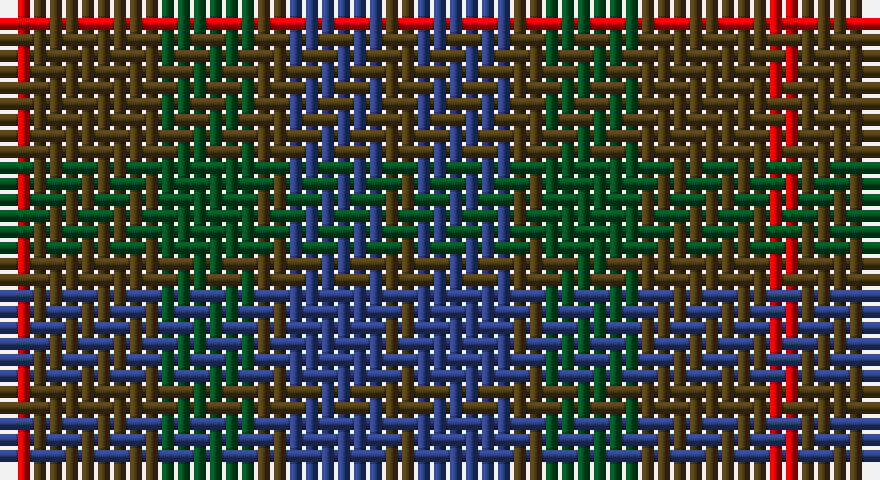

This page is one **sett** — a single exact thread-count. It belongs to the [tartan](/setts/dy1db3dy1dg3dy4r1/)
(the same proportion at any scale), whose colour order is pattern [GBGGGR](/stripes/gbgggr/).

Part of the [Fraser Hunting](/tartans/fraser-hunting/) tartan — the named design grouping this sett with its other cloths.

Sourced from register-of-tartans.  It is a [6 stripe tartan](/stripes/stripes6/).

Original link https://www.tartanregister.gov.uk/tartanDetails.aspx?ref=1259

## Also known as

This cloth is also recorded under:

- Fraser Htg
- Fraser Hunting #2
- Fraser hunting
- Fraser, hunting

## Register references

External register numbers recorded for this tartan.

- Scottish Register of Tartans: [1259](https://www.tartanregister.gov.uk/tartanDetails.aspx?ref=1259)
- Scottish Tartans World Register: 47

## Thread count
R/2 T8 G6 T2 B6 T/2

One full sett is **48 threads**.

## Palette

Palette: <strong>Tartan Register</strong>
<table><thead><tr><th>Colour</th><th>Threads</th><th>Shade</th><th>Base</th><th>OKLCh</th></tr></thead><tbody><tr><td>R/</td><td style="text-align:right;font-variant-numeric:tabular-nums">2</td><td><code style="background-color:#DC0000;">#DC0000</code> <small style="color:#888">#DC0000</small></td><td>R <code style="background-color:#CC0000;">#CC0000</code></td><td><small style="color:#888">oklch(56.2% 0.230 29.2)</small></td></tr><tr><td>T</td><td style="text-align:right;font-variant-numeric:tabular-nums">8</td><td><code style="background-color:#503C14;">#503C14</code> <small style="color:#888">#503C14</small></td><td>G <code style="background-color:#006100;">#006100</code></td><td><small style="color:#888">oklch(37.0% 0.062 81.8)</small></td></tr><tr><td>G</td><td style="text-align:right;font-variant-numeric:tabular-nums">6</td><td><code style="background-color:#005020;">#005020</code> <small style="color:#888">#005020</small></td><td>G <code style="background-color:#006100;">#006100</code></td><td><small style="color:#888">oklch(37.7% 0.105 149.6)</small></td></tr><tr><td>T</td><td style="text-align:right;font-variant-numeric:tabular-nums">2</td><td><code style="background-color:#503C14;">#503C14</code> <small style="color:#888">#503C14</small></td><td>G <code style="background-color:#006100;">#006100</code></td><td><small style="color:#888">oklch(37.0% 0.062 81.8)</small></td></tr><tr><td>B</td><td style="text-align:right;font-variant-numeric:tabular-nums">6</td><td><code style="background-color:#2C4084;">#2C4084</code> <small style="color:#888">#2C4084</small></td><td>B <code style="background-color:#2A418A;">#2A418A</code></td><td><small style="color:#888">oklch(39.4% 0.117 268.3)</small></td></tr><tr><td>T/</td><td style="text-align:right;font-variant-numeric:tabular-nums">2</td><td><code style="background-color:#503C14;">#503C14</code> <small style="color:#888">#503C14</small></td><td>G <code style="background-color:#006100;">#006100</code></td><td><small style="color:#888">oklch(37.0% 0.062 81.8)</small></td></tr></tbody></table>

# Sample pattern

## Compared to the master

This cloth is one sett of its design; the master sett (the exemplar the design is anchored on) is below for comparison.

<figure style="margin:0"><figcaption style="color:#888;font-size:smaller">this sett</figcaption></figure>
<figure style="margin:0"><figcaption style="color:#888;font-size:smaller"><a href="/setts/r3dy18g10dy2db10dy2db10dy2g10dy18w3/">master sett →</a></figcaption></figure>

## Nearest tartans

The nearest existing variants by ΔTartan distance, with this tartan at the top so the swatches line up against it.

ΔTartan

Tartan

Sett

—

<a href="/ttd/edit/#slug=dy1db3dy1dg3dy4r1~x2">Fraser Hunting #2</a> <a class="nn-out" href="/variants/s6/dy1db3dy1dg3dy4r1~x2/" title="open its dictionary page">↗</a>

1.33

<a href="/ttd/edit/#slug=r1o4g3o1db3o1~x2&amp;base=dy1db3dy1dg3dy4r1~x2">Fraser Hunting</a> <a class="nn-out" href="/variants/s6/r1o4g3o1db3o1~x2/" title="open its dictionary page">↗</a>

1.59

<a href="/ttd/edit/#slug=dg15r3n11b2~x2&amp;base=dy1db3dy1dg3dy4r1~x2">MacNab WI 2</a> <a class="nn-out" href="/variants/s4/dg15r3n11b2~x2/" title="open its dictionary page">↗</a>

1.59

<a href="/ttd/edit/#slug=dg15r3n11b2&amp;base=dy1db3dy1dg3dy4r1~x2">MacNab WI2</a> <a class="nn-out" href="/variants/s4/dg15r3n11b2/" title="open its dictionary page">↗</a>

1.61

<a href="/ttd/edit/#slug=g7dy6dt7dy1dt2~x6&amp;base=dy1db3dy1dg3dy4r1~x2">Bright of Garth (Personal)</a> <a class="nn-out" href="/variants/s5/g7dy6dt7dy1dt2~x6/" title="open its dictionary page">↗</a>

1.62

<a href="/ttd/edit/#slug=dy7r3dy9g15db19dy14r4~x2&amp;base=dy1db3dy1dg3dy4r1~x2">Dorward/Dogwood</a> <a class="nn-out" href="/variants/s7/dy7r3dy9g15db19dy14r4~x2/" title="open its dictionary page">↗</a>

1.65

<a href="/ttd/edit/#slug=dg2dp10dy15dg10dp2~x4&amp;base=dy1db3dy1dg3dy4r1~x2">Harmony 6</a> <a class="nn-out" href="/variants/s5/dg2dp10dy15dg10dp2~x4/" title="open its dictionary page">↗</a>

1.66

<a href="/ttd/edit/#slug=dt1dy1dt7dy5y7lr1~x4&amp;base=dy1db3dy1dg3dy4r1~x2">Dewar (WCWM)</a> <a class="nn-out" href="/variants/s6/dt1dy1dt7dy5y7lr1~x4/" title="open its dictionary page">↗</a>

1.66

<a href="/ttd/edit/#slug=o7r3o9g15db19o14r4~x2&amp;base=dy1db3dy1dg3dy4r1~x2">Dorward</a> <a class="nn-out" href="/variants/s7/o7r3o9g15db19o14r4~x2/" title="open its dictionary page">↗</a>

1.68

<a href="/ttd/edit/#slug=k1dy4dg1k1dg1k1dy1~x10&amp;base=dy1db3dy1dg3dy4r1~x2">McCanna NW Htg (Personal)</a> <a class="nn-out" href="/variants/s7/k1dy4dg1k1dg1k1dy1~x10/" title="open its dictionary page">↗</a>

1.71

<a href="/ttd/edit/#slug=n5t4n22k15y22o4y4~x2&amp;base=dy1db3dy1dg3dy4r1~x2">Cairngorm #2</a> <a class="nn-out" href="/variants/s7/n5t4n22k15y22o4y4~x2/" title="open its dictionary page">↗</a>

## Neighbour map

Every grey dot is one of 14360 variants placed by the first two principal components of the ΔTartan feature space (44% of its variance). Red is this tartan; blue dots are its nearest — click one to open its page.

<svg viewBox="0 0 640 380" role="img" style="max-width:100%;height:auto;border:1px solid #e0e0e0;border-radius:4px;display:block" xmlns="http://www.w3.org/2000/svg"><image href="/nn/cloud.v1.png" width="640" height="380"/><a href="/variants/s6/r1o4g3o1db3o1~x2/"><circle cx="242.5" cy="303.9" r="4" fill="#3465a4"><title>Fraser Hunting</title></circle></a><a href="/variants/s4/dg15r3n11b2~x2/"><circle cx="335.6" cy="300.6" r="4" fill="#3465a4"><title>MacNab WI 2</title></circle></a><a href="/variants/s4/dg15r3n11b2/"><circle cx="335.6" cy="300.6" r="4" fill="#3465a4"><title>MacNab WI2</title></circle></a><a href="/variants/s5/g7dy6dt7dy1dt2~x6/"><circle cx="292.6" cy="333.0" r="4" fill="#3465a4"><title>Bright of Garth (Personal)</title></circle></a><a href="/variants/s7/dy7r3dy9g15db19dy14r4~x2/"><circle cx="229.6" cy="280.8" r="4" fill="#3465a4"><title>Dorward/Dogwood</title></circle></a><a href="/variants/s5/dg2dp10dy15dg10dp2~x4/"><circle cx="304.8" cy="310.2" r="4" fill="#3465a4"><title>Harmony 6</title></circle></a><a href="/variants/s6/dt1dy1dt7dy5y7lr1~x4/"><circle cx="256.3" cy="273.3" r="4" fill="#3465a4"><title>Dewar (WCWM)</title></circle></a><a href="/variants/s7/o7r3o9g15db19o14r4~x2/"><circle cx="230.3" cy="279.1" r="4" fill="#3465a4"><title>Dorward</title></circle></a><a href="/variants/s7/k1dy4dg1k1dg1k1dy1~x10/"><circle cx="328.7" cy="313.7" r="4" fill="#3465a4"><title>McCanna NW Htg (Personal)</title></circle></a><a href="/variants/s7/n5t4n22k15y22o4y4~x2/"><circle cx="218.8" cy="269.7" r="4" fill="#3465a4"><title>Cairngorm #2</title></circle></a><circle cx="271.2" cy="324.6" r="5" fill="#c00000"/></svg>

ID: /variants/s6/dy1db3dy1dg3dy4r1~x2/
