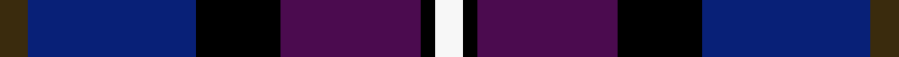

This page is one **sett** — a single exact thread-count. It belongs to the [tartan](/setts/dy2db12k6dp10k1w2/)
(the same proportion at any scale), whose colour order is pattern [GBKBKW](/stripes/gbkbkw/).

Sourced from house-of-tartan.  It is a [6 stripe tartan](/stripes/stripes6/).

Original link [http://www.house-of-tartan.scotland.net/house/TartanViewjs.asp?colr=Def&tnam=3097](http://www.house-of-tartan.scotland.net/house/TartanViewjs.asp?colr=Def&tnam=3097)

## Provenance

Earliest known date: 2002 Non-repeating sett. Launched at the Federation of Great Britain & Ireland Conference in 2002 during the Presidency of Lynn Dunning. The design and the colours have been chosen carefully to symbolise the purple heather of the mountains and hills of Scotland together with the blue and gold of Soroptimist International woven together with the white hand of Peace.

Dataset <small>— provenance for this record, inherited from the source manifest</small>

<dl class="dataset-prov">
<dt>source</dt><dd><a href="/sources/house-of-tartan/">House of Tartan</a></dd>
<dt>data captured from</dt><dd><a href="https://github.com/thetartan/tartan-database/blob/master/data/house-of-tartan/data.csv">https://github.com/thetartan/tartan-database/blob/master/data/house-of-tartan/data.csv</a></dd>
<dt>data date</dt><dd>2017-01-10 <small>(dataset default)</small></dd>
<dt>licence</dt><dd><a href="https://creativecommons.org/licenses/by-nc-nd/4.0/">CC BY-NC-ND 4.0</a></dd>
</dl>

Capture chain <small>— the hands this data passed through, oldest first; each capture carries its own licence</small>

<ol class="capture-chain">
<li><a href="http://www.house-of-tartan.scotland.net/">House of Tartan</a> <small>the weaver/retailer's database — the site is now offline; the URL is kept as the ultimate source's identity</small></li>
<li><a href="https://github.com/thetartan/tartan-database">thetartan/tartan-database</a> <small>2016-2017</small> · <a href="https://creativecommons.org/licenses/by-nc-nd/4.0/">CC BY-NC-ND 4.0</a> <small>Levko Kravets's frozen compilation — the capture we vendored, and where its CC licence text came from</small></li>
<li>this dictionary <small>captured 2026-06-10 · commit 5bf86c7566</small> <small>each re-capture is a git commit to data/sources</small></li>
</ol>

## Thread count
DY/4 DB24 K12 DP20 K2 W/4

One full sett is **124 threads**.

## Palette
<table><thead><tr><th>Colour</th><th>Shade</th><th>OKLCh</th></tr></thead><tbody><tr><td>DB</td><td><code style="background-color:#082077;">#082077</code> <small style="color:#888">#082077</small></td><td><small style="color:#888">oklch(30.0% 0.149 265.1)</small></td></tr><tr><td>K</td><td><code style="background-color:#000000;">#000000</code> <small style="color:#888">#000000</small></td><td><small style="color:#888">oklch(0.0% 0.000 0.0)</small></td></tr><tr><td>W</td><td><code style="background-color:#F7F7F7;">#F7F7F7</code> <small style="color:#888">#F7F7F7</small></td><td><small style="color:#888">oklch(97.6% 0.000 89.9)</small></td></tr><tr><td>DP</td><td><code style="background-color:#4B0B4F;">#4B0B4F</code> <small style="color:#888">#4B0B4F</small></td><td><small style="color:#888">oklch(30.1% 0.125 325.4)</small></td></tr><tr><td>DY</td><td><code style="background-color:#3A2B0D;">#3A2B0D</code> <small style="color:#888">#3A2B0D</small></td><td><small style="color:#888">oklch(30.0% 0.049 82.0)</small></td></tr></tbody></table>

# Sample pattern

## Nearest tartan variants

The nearest existing variants by ΔTartan distance, with this cloth at the top so the swatches line up against it.

ΔTartan

Threads

Variant

Sett

—

124

<a href="/variants/s6/dy2db12k6dp10k1w2~x2/">Soroptimist International Corporate Tartan</a>

<a href="/ttd/edit/#slug=n6k6n21k16db36y4&amp;base=dy2db12k6dp10k1w2~x2" title="compare in the TTD">1.75</a>

168

<a href="/variants/s6/n6k6n21k16db36y4/">Bareback (Corporate)</a>

<a href="/ttd/edit/#slug=n32w4n4k24dp29k4&amp;base=dy2db12k6dp10k1w2~x2" title="compare in the TTD">2.11</a>

158

<a href="/variants/s6/n32w4n4k24dp29k4/">Grammar School at Leeds (School)</a>

<a href="/ttd/edit/#slug=r4dp1r1dp12k6db16w1~x2&amp;base=dy2db12k6dp10k1w2~x2" title="compare in the TTD">2.14</a>

154

<a href="/variants/s7/r4dp1r1dp12k6db16w1~x2/">First (Corporate)</a>

<a href="/ttd/edit/#slug=r1n5k5db1k1db6y1~x8&amp;base=dy2db12k6dp10k1w2~x2" title="compare in the TTD">2.17</a>

304

<a href="/variants/s7/r1n5k5db1k1db6y1~x8/">Lopez-Gasparotto</a>

<a href="/ttd/edit/#slug=y6k2n11k7db24w6~x2&amp;base=dy2db12k6dp10k1w2~x2" title="compare in the TTD">2.20</a>

200

<a href="/variants/s6/y6k2n11k7db24w6~x2/">Clunie (Name)</a>

<a href="/ttd/edit/#slug=r4db24k12g14k4lb3~x2&amp;base=dy2db12k6dp10k1w2~x2" title="compare in the TTD">2.26</a>

230

<a href="/variants/s6/r4db24k12g14k4lb3~x2/">MacPhail Hunting #2</a>

<a href="/ttd/edit/#slug=y2k2db14dt4k5r2y5r1~x4~db1208266-dt1204274&amp;base=dy2db12k6dp10k1w2~x2" title="compare in the TTD">2.33</a>

268

<a href="/variants/s8/y2k2dbi14db4k5r2y5r1~x4~dbi1208266-db1204274/">Lovell (2014)</a>

<a href="/ttd/edit/#slug=w12db48k13n22k3y6&amp;base=dy2db12k6dp10k1w2~x2" title="compare in the TTD">2.39</a>

190

<a href="/variants/s6/w12db48k13n22k3y6/">Clunie (Personal)</a>

<a href="/ttd/edit/#slug=dp3db17n13dp2k20w2~x2&amp;base=dy2db12k6dp10k1w2~x2" title="compare in the TTD">2.42</a>

218

<a href="/variants/s6/dp3db17n13dp2k20w2~x2/">Commonwealth Games</a>

<a href="/ttd/edit/#slug=dr5b20k13db42k13b20y5~x2&amp;base=dy2db12k6dp10k1w2~x2" title="compare in the TTD">2.54</a>

452

<a href="/variants/s7/dr5b20k13db42k13b20y5~x2/">Newmill</a>

## Neighbour map

Every grey dot is one of 13621 variants placed by the first two principal components of the ΔTartan feature space (42% of its variance). Red is this tartan; blue dots are its nearest — click one to open its page.

<svg viewBox="0 0 640 380" role="img" style="max-width:100%;height:auto;border:1px solid #e0e0e0;border-radius:4px;display:block" xmlns="http://www.w3.org/2000/svg"><image href="/nn/cloud.v1.png" width="640" height="380"/><a href="/variants/s6/n6k6n21k16db36y4/"><circle cx="207.5" cy="217.2" r="4" fill="#3465a4"><title>Bareback (Corporate)</title></circle></a><a href="/variants/s6/n32w4n4k24dp29k4/"><circle cx="171.5" cy="210.6" r="4" fill="#3465a4"><title>Grammar School at Leeds (School)</title></circle></a><a href="/variants/s7/r4dp1r1dp12k6db16w1~x2/"><circle cx="213.8" cy="158.6" r="4" fill="#3465a4"><title>First (Corporate)</title></circle></a><a href="/variants/s7/r1n5k5db1k1db6y1~x8/"><circle cx="133.9" cy="208.7" r="4" fill="#3465a4"><title>Lopez-Gasparotto</title></circle></a><a href="/variants/s6/y6k2n11k7db24w6~x2/"><circle cx="154.3" cy="181.8" r="4" fill="#3465a4"><title>Clunie (Name)</title></circle></a><a href="/variants/s6/r4db24k12g14k4lb3~x2/"><circle cx="132.3" cy="199.0" r="4" fill="#3465a4"><title>MacPhail Hunting #2</title></circle></a><a href="/variants/s8/y2k2dbi14db4k5r2y5r1~x4~dbi1208266-db1204274/"><circle cx="164.0" cy="154.1" r="4" fill="#3465a4"><title>Lovell (2014)</title></circle></a><a href="/variants/s6/w12db48k13n22k3y6/"><circle cx="189.4" cy="160.9" r="4" fill="#3465a4"><title>Clunie (Personal)</title></circle></a><a href="/variants/s6/dp3db17n13dp2k20w2~x2/"><circle cx="146.5" cy="191.9" r="4" fill="#3465a4"><title>Commonwealth Games</title></circle></a><a href="/variants/s7/dr5b20k13db42k13b20y5~x2/"><circle cx="148.5" cy="205.4" r="4" fill="#3465a4"><title>Newmill</title></circle></a><circle cx="170.6" cy="189.0" r="5" fill="#c00000"/><text x="320" y="376" text-anchor="middle" font-size="11" fill="#999">ground</text><text x="11" y="190" text-anchor="middle" font-size="11" fill="#999" transform="rotate(-90 11 190)">complexity</text></svg>

ID: /variants/s6/dy2db12k6dp10k1w2~x2/
