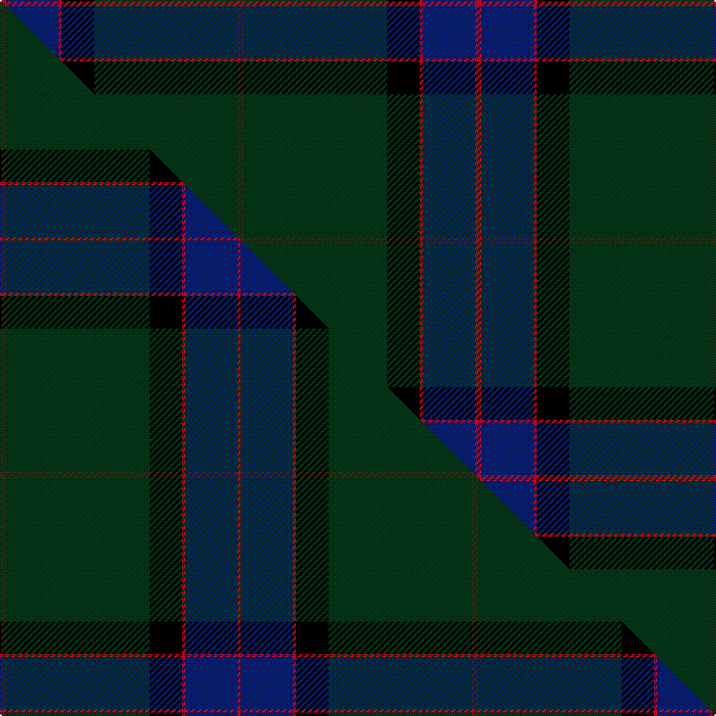

This page is one **sett** — a single exact thread-count. It belongs to the [tartan](/setts/dy2dg44k10r1db16r2/)
(the same proportion at any scale), whose colour order is pattern [GGKRBR](/stripes/ggkrbr/).

Part of the [MacWilliam Hunting](/tartans/macwilliam-hunting/) tartan — the named design grouping this sett with its other cloths.

Sourced from tartans-authority.  It is a [6 stripe tartan](/stripes/stripes6/).

Original link http://www.tartansauthority.com/tartan-ferret/display/1417/

## Register references

External register numbers recorded for this tartan.

- Scottish Tartans Authority (ITI): 1417

## Thread count
R/4 DB32 R2 K20 DG88 DY/4

One full sett is **292 threads**.

## Palette
<table><thead><tr><th>Colour</th><th>Shade</th><th>OKLCh</th></tr></thead><tbody><tr><td>DB</td><td><code style="background-color:#082077;">#082077</code> <small style="color:#888">#082077</small></td><td><small style="color:#888">oklch(30.0% 0.149 265.1)</small></td></tr><tr><td>DY</td><td><code style="background-color:#3A2B0D;">#3A2B0D</code> <small style="color:#888">#3A2B0D</small></td><td><small style="color:#888">oklch(30.0% 0.049 82.0)</small></td></tr><tr><td>K</td><td><code style="background-color:#000000;">#000000</code> <small style="color:#888">#000000</small></td><td><small style="color:#888">oklch(0.0% 0.000 0.0)</small></td></tr><tr><td>R</td><td><code style="background-color:#D60020;">#D60020</code> <small style="color:#888">#D60020</small></td><td><small style="color:#888">oklch(55.2% 0.224 25.5)</small></td></tr><tr><td>DG</td><td><code style="background-color:#053819;">#053819</code> <small style="color:#888">#053819</small></td><td><small style="color:#888">oklch(30.0% 0.075 151.3)</small></td></tr></tbody></table>

# Sample pattern

## Compared to the master

This cloth is one sett of its design; the master sett (the exemplar the design is anchored on) is below for comparison.

Its **ΔTartan distance** from the master is **0.27** — the same measure the nearest-tartans table ranks by (0 is identical; a re-scale of the same cloth is near 0, a recolour or a different proportion further).

<figure class="master-compare" style="margin:0">

this sett
master sett ★

<figcaption style="color:#888;font-size:smaller">One weave of this sett against the <a href="/setts/dy2dg44k10r1db16r1/">master sett ★</a>, split on the diagonal: a shared proportion runs seamlessly across it with only the shades shifting; a different proportion breaks on it.</figcaption>
</figure>

## Nearest tartan variants

The nearest existing variants by ΔTartan distance, with this cloth at the top so the swatches line up against it.

ΔTartan

Threads

Variant

Sett

—

292

<a href="/variants/s6/dy2dg44k10r1db16r2~x2/">MacWilliam Htg</a>

<a href="/ttd/edit/#slug=dy2dg44k10r1db16r1~x2&amp;base=dy2dg44k10r1db16r2~x2" title="compare in the TTD">0.03</a>

290

<a href="/variants/s6/dy2dg44k10r1db16r1~x2/">MacWilliam Hunting</a>

<a href="/ttd/edit/#slug=dg43k14db14dr2~x2&amp;base=dy2dg44k10r1db16r2~x2" title="compare in the TTD">1.15</a>

202

<a href="/variants/s4/dg43k14db14dr2~x2/">Feddinch Club, St Andrews Limited, The</a>

<a href="/ttd/edit/#slug=db1lb2k50dg50dy2r1~x2&amp;base=dy2dg44k10r1db16r2~x2" title="compare in the TTD">1.24</a>

420

<a href="/variants/s6/db1lb2k50dg50dy2r1~x2/">Josse (Bro Sant Malo), Gilbert (Personal)</a>

<a href="/ttd/edit/#slug=dg42y1k23dr7w1db4y3~x2&amp;base=dy2dg44k10r1db16r2~x2" title="compare in the TTD">1.72</a>

234

<a href="/variants/s7/dg42y1k23dr7w1db4y3~x2/">Henschke, Felix (Personal)</a>

<a href="/ttd/edit/#slug=db2k4kii36g1ki34db4w2~x2~kii0803152-ki0604259&amp;base=dy2dg44k10r1db16r2~x2" title="compare in the TTD">2.29</a>

324

<a href="/variants/s7/db2k4kii36g1ki34db4w2~x2~kii0803152-ki0604259/">Police College Tulliallan</a>

<a href="/ttd/edit/#slug=k8r2k13dy2dg48db6~x2&amp;base=dy2dg44k10r1db16r2~x2" title="compare in the TTD">2.48</a>

288

<a href="/variants/s6/k8r2k13dy2dg48db6~x2/">Green Swamp Youth Campers</a>

<a href="/ttd/edit/#slug=k8r2k13y2dg48db6~x2&amp;base=dy2dg44k10r1db16r2~x2" title="compare in the TTD">2.48</a>

288

<a href="/variants/s6/k8r2k13y2dg48db6~x2/">Green Swamp Youth Campers</a>

<a href="/ttd/edit/#slug=db19k4dr1k4dg9k1~x4&amp;base=dy2dg44k10r1db16r2~x2" title="compare in the TTD">2.57</a>

224

<a href="/variants/s6/db19k4dr1k4dg9k1~x4/">Monarchs Corporate Sport Tartan</a>

<a href="/ttd/edit/#slug=w3dr11db4dr6dg48o2dg3o2~x2&amp;base=dy2dg44k10r1db16r2~x2" title="compare in the TTD">2.60</a>

306

<a href="/variants/s8/w3dr11db4dr6dg48o2dg3o2~x2/">Hall, from Springbrook and Newtown (Personal)</a>

<a href="/ttd/edit/#slug=dp6ly2dp1dg25db16k2db4~x2&amp;base=dy2dg44k10r1db16r2~x2" title="compare in the TTD">2.80</a>

204

<a href="/variants/s7/dp6ly2dp1dg25db16k2db4~x2/">Lowry</a>

## Neighbour map

Every grey dot is one of 13620 variants placed by the first two principal components of the ΔTartan feature space (42% of its variance). Red is this tartan; blue dots are its nearest — click one to open its page.

<svg viewBox="0 0 640 380" role="img" style="max-width:100%;height:auto;border:1px solid #e0e0e0;border-radius:4px;display:block" xmlns="http://www.w3.org/2000/svg"><image href="/nn/cloud.v1.png" width="640" height="380"/><a href="/variants/s6/dy2dg44k10r1db16r1~x2/"><circle cx="419.3" cy="128.1" r="4" fill="#3465a4"><title>MacWilliam Hunting</title></circle></a><a href="/variants/s4/dg43k14db14dr2~x2/"><circle cx="404.0" cy="214.7" r="4" fill="#3465a4"><title>Feddinch Club, St Andrews Limited, The</title></circle></a><a href="/variants/s6/db1lb2k50dg50dy2r1~x2/"><circle cx="335.7" cy="92.0" r="4" fill="#3465a4"><title>Josse (Bro Sant Malo), Gilbert (Personal)</title></circle></a><a href="/variants/s7/dg42y1k23dr7w1db4y3~x2/"><circle cx="311.1" cy="96.3" r="4" fill="#3465a4"><title>Henschke, Felix (Personal)</title></circle></a><a href="/variants/s7/db2k4kii36g1ki34db4w2~x2~kii0803152-ki0604259/"><circle cx="321.7" cy="117.6" r="4" fill="#3465a4"><title>Police College Tulliallan</title></circle></a><a href="/variants/s6/k8r2k13dy2dg48db6~x2/"><circle cx="387.8" cy="140.5" r="4" fill="#3465a4"><title>Green Swamp Youth Campers</title></circle></a><a href="/variants/s6/k8r2k13y2dg48db6~x2/"><circle cx="376.5" cy="136.5" r="4" fill="#3465a4"><title>Green Swamp Youth Campers</title></circle></a><a href="/variants/s6/db19k4dr1k4dg9k1~x4/"><circle cx="318.4" cy="171.7" r="4" fill="#3465a4"><title>Monarchs Corporate Sport Tartan</title></circle></a><a href="/variants/s8/w3dr11db4dr6dg48o2dg3o2~x2/"><circle cx="447.6" cy="135.2" r="4" fill="#3465a4"><title>Hall, from Springbrook and Newtown (Personal)</title></circle></a><a href="/variants/s7/dp6ly2dp1dg25db16k2db4~x2/"><circle cx="326.9" cy="162.6" r="4" fill="#3465a4"><title>Lowry</title></circle></a><circle cx="404.4" cy="126.8" r="5" fill="#c00000"/><text x="320" y="376" text-anchor="middle" font-size="11" fill="#999">ground</text><text x="11" y="190" text-anchor="middle" font-size="11" fill="#999" transform="rotate(-90 11 190)">complexity</text></svg>

ID: /variants/s6/dy2dg44k10r1db16r2~x2/
